## DevSecOps
`DevSecOps` — безперервний процес безпеки в розробці та експлуатації.

Розглянемо DevSecOps з позиції інженера DevOps, який тільки-но зайшов в команду. Окремий департамент Info-Sec розробляє і диктує політики:
- обмеження на робочих комп'ютерах на встановлення ПЗ, 
- тікети й апруви на будь-який нестандартний порт або підключення нового сервера, 
- вимоги до регулярної зміни паролів, 
- фаєрволи, 
- різного роду DLP (data loss prevention),
- DPI (deep packet inspection), а іноді й TLS Inspection.

Але, про участь Info-Sec команди в процесі розробки навіть не йдеться.

**Наступний варіант** — проєкт або продукт без стратегій безпеки. На старті проєкту мало хто думає про безпеку. Зазвичай план розробки обмежується набором функцій, які потрібно реалізувати, вибором інфраструктури та найманням інженера, який розгорне інфраструктуру, налаштує Pipeline і "розуміння основ безпеки буде плюсом".

І тільки коли проєкт злетить, можливо, настане час включити в автоматизацію тестування крок на чистоту коду — `Code Security with Static Application Security Testing`. А коли прийде час аудиту безпеки, щоб відповідати вимогам
замовника, буде найнято на part-time security офіцера. І приведення інфраструктури та конфігурації застосунку до стандартів безпеки ляже на плечі інженера DevOps. 

Ще один підводний камінь — занадто пізно залучається команда безпеки до процесу розробки. Зміни в процесі розробки, коді продукту та інфраструктурі на пізніх етапах можуть бути дорогими , а іноді зовсім неможливими.

**Третій варіант**, `Security-ready`, коли у команди і компанії є розуміння і
готовність до змін в умовах сучасних викликів безпеки. Від DevOps очікують пропозиції щодо стратегії безпеки всього flow та стеку інструментів. У цьому випадку вам, навіть без досвіду в безпеці, потрібно знати з чого почати. 

Розберемо на цьому прикладі ключові поняття, інструменти та ваші наступні кроки в розвитку DevSecOps. 

[GitHub The complete guide to developer-first application security](.img/GitHubAdvanced_SecurityEbook.pdf) (Повний посібник з безпеки застосунків для розробників) — основні поняття традиційних і сучасних моделей безпеки процесу розробки.

Для середньої організації безпека додатків складається з невеликого набору інструментів тестування, інтегрованих із циклом розробки. Загальні сучасні концепції можуть включати: 
- статичне тестування безпеки (SAST), 
- динамічне тестування (DAST), 
- пасивне й активне інтегроване тестування (IAST), 
- захист застосунків під час виконання (RASP).

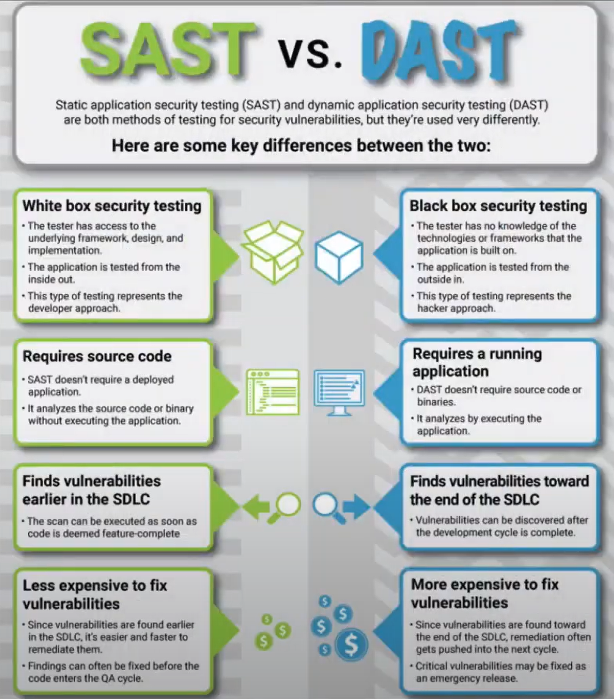 

`Pen-tests` або тест на проникнення та bug bounties — пошук прогалин безпеки за винагороду, наприклад, "Зламай Дію за мільйон". Але суть у тому, що залежно від зрілості процесів у компанії, перевірка безпеки — це як останній крок перед виходом у продакшен, так і тести впродовж усього циклу розробки. Це краще ніж нічого.

У практиках DevOps компонент Sec відображає концепцію безпеки під час взаємодії dev-команд і експлуатації впродовж усього циклу розробки.

`Shifting left` — зміщення вліво по етапах CI/CD. Простими словами,використовуючи автоматизацію тестів безпеки на всіх етапах CI/CD,
ми виявляємо баги на більш ранніх етапах, а не під час виходу в продакшен.

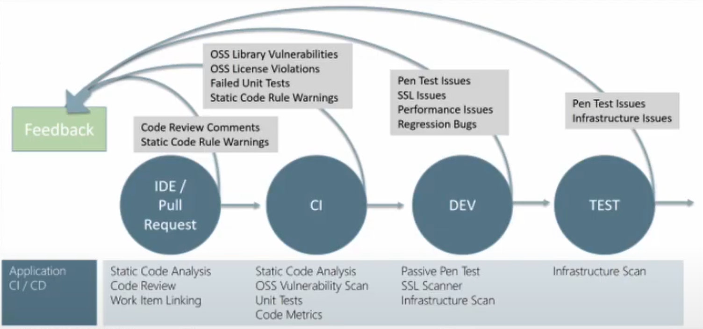 

Перші кроки для імплементації DevSecOps у вашій команді можуть
бути наступними:
1. Синхронізація всіх учасників. Це стратегічні сесії за участю представників від розробників, IT-Sec, експлуатації та керівництва. Це дає змогу обговорити допустимі та критичні ризики, наприклад `OWASP Top Ten`. Це стандартний інформаційний документ для розробників про найбільш критичні ризики безпеки веб-застосунків.

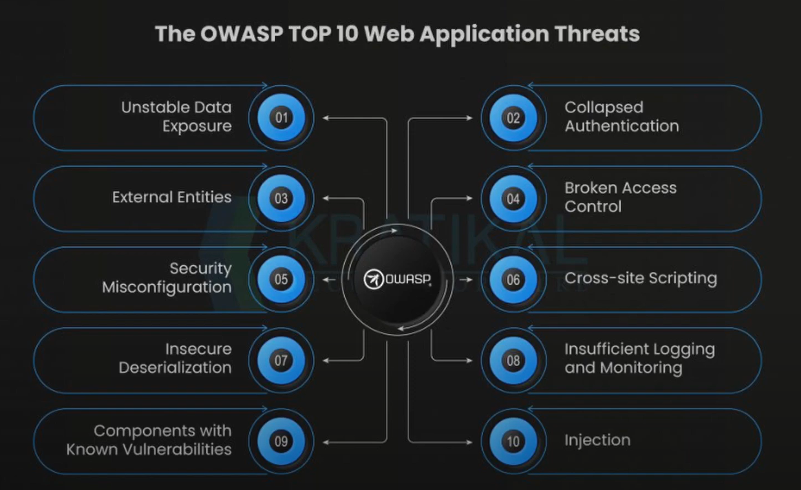 

2. Розширення CI/CD системами статичного аналізу коду й автоматичної перевірки образів контейнерів на наявність вразливостей.

3. Безперервний процес безпеки та щоденне сканування інфраструктури [інструментами аудиту](https://github.com/nccgroup/ScoutSuite), що дасть змогу оцінити рівень безпеки та надати рекомендації щодо усунення знайдених проблем. Провести Security audit та [benchmarks](https://www.cisecurity.org/cis-benchmarks) або еталони Центру інтернет-безпеки (CIS) найкращих практик і
рекомендацій у сфері безпеки.

### Додаткові матеріали 
[DevSecOps Glossary](https://blog.gitguardian.com/glossary/)  
[DevSecOps Playbook](https://github.com/6mile/DevSecOps-Playbook)  
[Ultimate DevSecOps library](https://github.com/sottlmarek/DevSecOps)

## Найкращі практики безпечної інфраструктури

В екосистемі CNCF у розділі [Provisioning - Security & Compliance](https://landscape.cncf.io/card-mode?category=security-compliance&company-type=for-profit&grouping=category) (Конфігурація - Безпека та Відповідність) представлено 73 продукти. Ознайомившись з описом до десятка продуктів, можна зробити висновок про актуальні запити і тренди в індустрії.

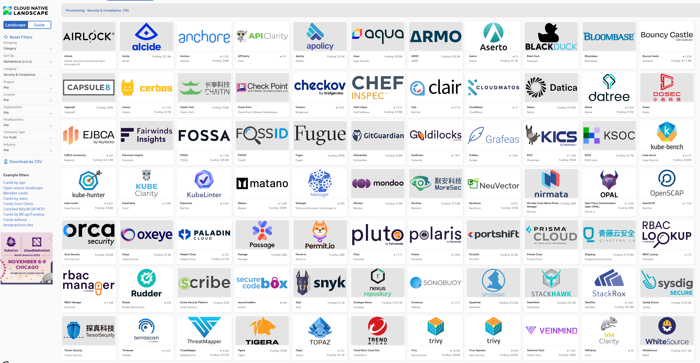  

"`DevSecOps` означає вбудувати безпеку в розробку застосунку end2end" — кажуть у RedHat у своєму блозі [What is DevSecOps](https://www.redhat.com/en/topics/devops/what-is-devsecops).
 
[](https://www.redhat.com/en/topics/devops/what-is-devsecops)  

1. Команди DevOps повинні автоматизувати процеси безпеки для захисту всіх середовищ розробки та даних. 
2. Автоматизація безпеки в Pipeline CI/CD, включно з артефактами і мікросервісами в контейнерах. 

Інтегруйте сканери безпеки для контейнерів. Це має бути частиною процесу додавання контейнерів до реєстру. [Функція сканера образів контейнера](https://jfrog.com/devops-tools/article/how-to-use-docker-security-scanning/) з репортом про знайдені вразливості вже вбудована в більшість container registry.

Здебільшого це платна функція або така, що вимагає передплати, але є і безкоштовні варіанти, обмежені кількістю перевірок. Забігаючи наперед, реалізується ця вимога налаштуванням скану у вашому реєстрі. Потрібно врахувати, що образ стає в чергу і результат сканування буде доступний не відразу після створення образу.

Оскільки процес проходить не в realtime, подальший промоушен можна проводити автоматично. **Автоматизуйте тестування безпеки в процесі CI**. Це охоплює запуск інструментів статичного аналізу безпеки в процесі складання, а також сканування будь-яких попередньо створених образів контейнерів на наявність відомих вразливостей у безпеці, коли вони потрапляють у конвеєр білду.

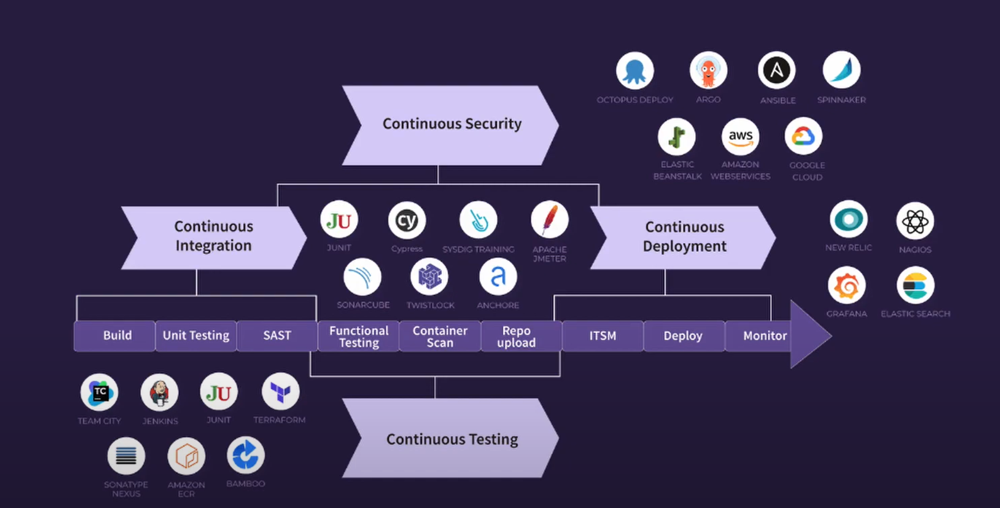  

**Статичне тестування безпеки додатків (SAST)**. SAST використовує вихідний код застосунку або бінарний код як вхідні дані і сканує цей код на наявність відомих вразливих шаблонів коду, щоб генерувати результати, які визначають потенційні вразливості. Інструменти SAST зазвичай використовуються на ранніх і пізніх стадіях розроблення програмного забезпечення, особливо перед надсиланням коду в продакшен.

Автоматизуйте тести перевірки введення, а також перевірки аутентифікації та авторизації. На етапі QA часто проводять [DAST](https://www.softwaretestinghelp.com/dynamic-application-security-testing-dast-software/). **Динамічне тестування — тест коду на запущеному застосунку.** Інструменти DAST виявляють підмножину вразливостей прикладного рівня, про які ми знаємо за результатом статичного тестування і які відомі як ті, що можна експлуатувати. [Інструменти DAST](https://www.g2.com/products/sonarqube/competitors/alternatives) також можуть знаходити вразливості, пропущені інструментами SAST, наприклад, ті, що пов'язані із середовищем виконання операційної системи, фреймворками, мережею.

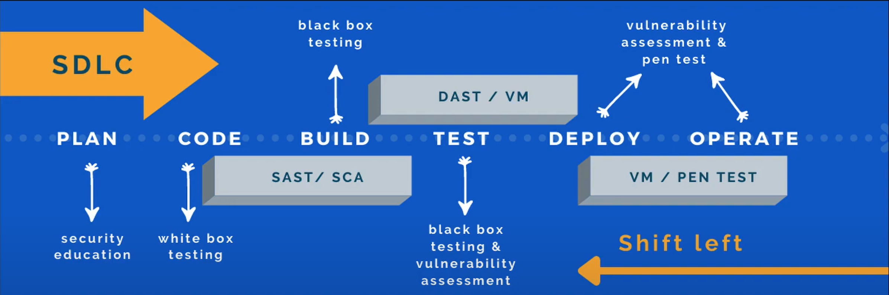  

Автоматизуйте **оновлення безпеки та виправлення для відомих вразливостей**. У цьому разі найбільш нетривіальним може виявитися автоматизація процесу накладення патча. Усе залежить від реліз-стратегії.  
- Чи повинен хотфікс проходити всі оточення dev-qa-staging, але це займе час, чи можна відразу виводити на продакшен.
- Чи варто тестувати hotfix? Усі ці ризики ми зважуємо і приймаємо, залежно від ступеня критичності ситуації.

Автоматизація можливості управління конфігурацією систем і сервісів **на етапі доставляння (CD)**. Це дає змогу забезпечити відповідність політикам безпеки й усунути помилки, допущені вручну. Аудит і виправлення помилок також мають бути автоматизовані.

Важлива тема **управління конфігурацією сервісів**, що покриває щонайменше три аспекти:
 - security storage або безпечне сховище, 
 - автоматизацію доставляння конфігурації та чутливої (sensitive) інформації, 
 - безперервний аудит.


`HashiCorp Vault` — це система управління секретами і шифруванням на основі ідентифікації. `Секрет` — це все, до чого ви хочете жорстко контролювати доступ, наприклад, ключі шифрування API, паролі та сертифікати. Vault надає сервіс шифрування, який контролюється методами аутентифікації та авторизації. Використовуючи призначений для користувача інтерфейс Vault, CLI або HTTP API, доступ до секретів та інших конфіденційних даних можна надійно зберігати й керувати ними, жорстко контролювати (обмежувати) і проводити аудит.

`Security as Code`, `Security by Design` або безпека як код. Це заклик до розробників подумати про безпеку як про код застосунку. Адже розробляючи застосунок, розробник планує вимоги і залежності, дизайн і архітектуру, методи і тести. І ось коли в беклозі спринту опиняться завдання з безпеки, вимоги до конфіденційності, моделювання загроз, безпека supply chain, статичне й динамічне тестування, оцінювання ризиків, на додачу до цього й автоматизація — тоді все перераховане вище, можна буде назвати безпекою за задумом або Security as Code.

### Підготовка до практичної частини лекції

1. Припустимо що на прикладі репозиторію з kbot створено продуктовий проект з основним кодом застосунку. 
2. Розробники вже реалізували основні кроки тестування:
- збірки
- тестування
- пакування
- розгортання  

3. Мы як DevOps створимо інфраструктурний проект який назвемо `SecOps`, в якому будемо розробляти шаблони pipeline-ів для:
- IC
- безпеки
- автоматизацій 

що будуть використовуватись для розгортання продуктового проекту. Шаблони можна порівняти з модулями Terraform але для Pipeline. Свого роду розширення до основного продуктового Pipeline, де можна виконувати технічні або допоміжні кроки. В нашому випадку це буде сканування коду продуктового репозиторію на наявність чутливих даних. 

4. Основний Pipeline продуктового проекту буде використовувати шаблони за допомогою директиви `include`. Таким чином Pipeline буде виконувати ті самі кроки, але з додатковим кодом з шаблонів. 

5. В коді проекту ми застосуємо проект [Gitleaks](https://github.com/gitleaks/gitleaks). Це система статичного аналізу коду для виявлення та запобігання витоку Hurd code secrets таких як паролі, ключі, токени в гіт-репозиторіях. Gitleaks може працювати в двох режимах як із статичними файлами так і з динамічними. 

6. Ми використаємо офіційний докер образ з бінарним Gitleaks, що вже вмішує конфігурацію та набір правил (rules sets) для виявлення різних типів чутливих даних. 

7. Налаштуємо тригер сканеру на необхідну подію в гіт-репозиторії, наприклад  Push, Merge, MR. Оберемо подію Merge Request при якій буде запускатись наш сканер коду на наявність чутливих даних. А ще ми маємо перевіряти всі коміти, або набір комітів за певний проміжок часу.     

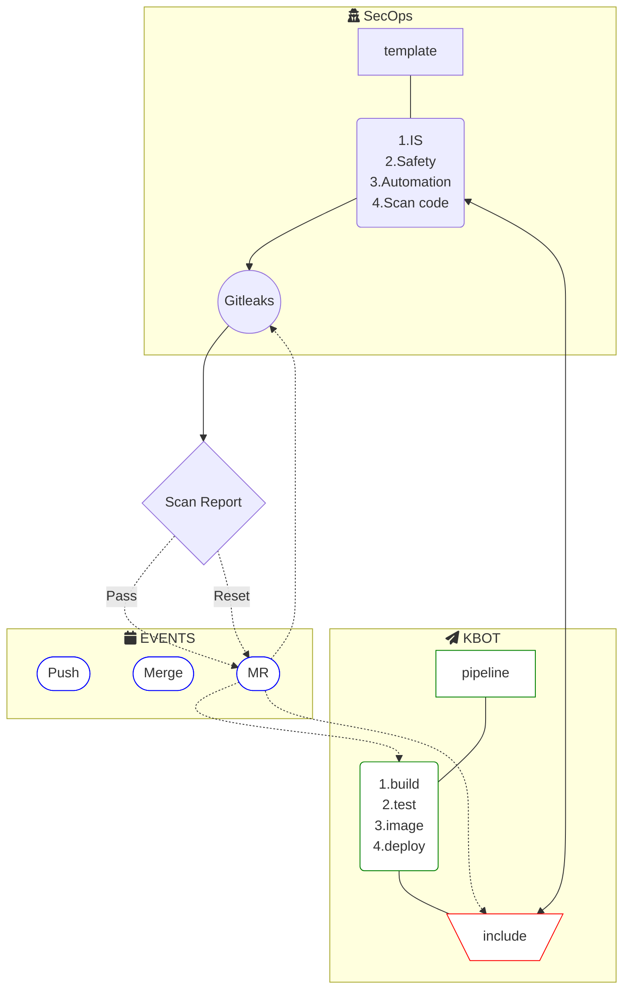
```mermaid
flowchart TB
    subgraph fa:fa-user-secret SecOps
        direction RL
        A[template] 
        B(1.IS\n2.Safety\n3.Automation\n4.Scan code)
        C((Gitleaks))
        A --- B --> C
    end
    subgraph fa:fa-paper-plane KBOT
        direction RL
        D[pipeline]:::SecO
        I(1.build\n2.test\n3.image\n4.deploy):::SecO
        F[\include/]:::INCL
        D --- I --- F    
    end
    subgraph fa:fa-calendar EVENTS 
        direction RL
        G1([Push]):::Triger
        G2([Merge]):::Triger
        G3([MR]):::Triger
    end
    H{Scan Report} 
    H -.->|Pass| G3 
    H -.->|Reset| G3
    F <--> B
    G3 -.-> I & F & C
    C ---> H

    classDef SecO stroke:green, fill:white
    classDef INCL stroke:red, fill:white
    classDef Triger stroke:blue, fill:white
```
### [Практична частина лекції](https://youtu.be/G4hAj7RuAo8?si=_L9pVIjbYZs1utR1&t=402)
1. Створимо [новий проект на GitLAB](https://gitlab.com/projects/new) імпортувавши наш репозиторій kbot з GitHub. Це буде наш продуктовий проект

2. Створимо для проекту [Build Pipeline](https://gitlab.com/vit-um/kbot/-/pipelines) скориставшись шаблоном golang 

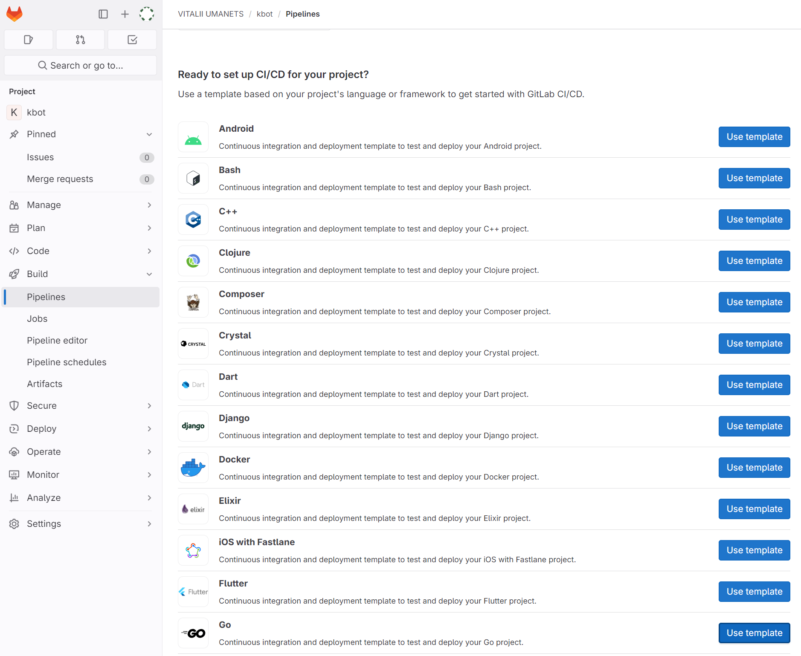

3. Це створить .gitlab-ci.yml file з мінімально необхідними кроками. Збережемо файл та перевіримо що [Pipeline](https://gitlab.com/vit-um/kbot/-/blob/main/.gitlab-ci.yml) працює.

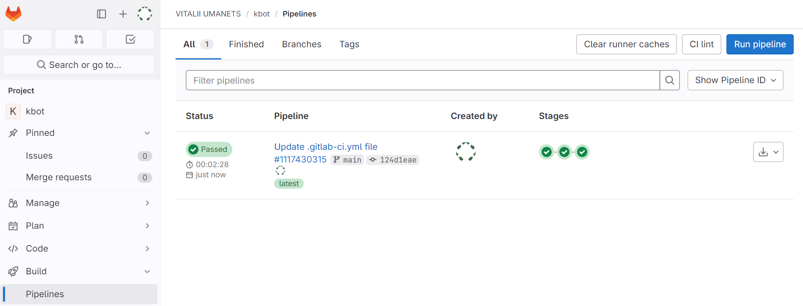  

4. Система виконала [кроки](https://gitlab.com/vit-um/kbot/-/jobs) 
- format
- compile
- deploy

5. Додамо інформаційний проект для шаблонів безпеки. Це буде пустий приватний проект з ім'ям `secops`. Users потрібно обрати `vit-um` як не імпортованому репозитарії. 

6. Створимо директорію `templates`, а в ній файл шаблону `.gitlab-ci-secrets-scan.yaml` в якому:
- Визначимо змінні шаблону, які будуть використовуватись в основному Pipeline, вони будуть стосуватись налаштуванню образу контейнера 'gitleaks' 
```yaml
variables:
    GITLEAKS_IMAGE_REPO: 'zricethezav'
    GITLEAKS_IMAGE_NAME: 'gitleaks'
    GITLEAKS_IMAGE_BUILD: 'latest'
    GITLEAKS_REPORT: 'report.json'
    GITLEAKS_OPTS: 'detect --redact -v'
```
- Задамо в змінній ім'я файлу звіту `report.json`, який буде згенеровано gitleaks
- Винесемо опцію запуску сканера: режим `detect`, опція `--redact` для приховування чутливих даних у виводі, та опція `-v` (verbose) для виводу детальної інформації про виявлені проблеми.   
- Опишемо блок з роботами що має виконати pipeline. Завдання які починаються з крапки це прихованні завдання. Вони не будуть оброблятися gitlab. Ви можете використовувати цю функцію щоб ігнорувати завдання або скористатися спеціальними можливостями yaml та перетворити приховані завдання на шаблони
- Вказуємо крок "test" та імідж Gitleaks, що збирається і змінних вище.
- Далі важливий параметр. Переписуємо entrypoint щоб виконувалася саме Gitleaks на дефолтний
entrypoint контейнера
```yaml
.secrets-scanning:
    stage: test
    image:
        name: "$GITLEAKS_IMAGE_REPO/$GITLEAKS_IMAGE_NAME:$GITLEAKS_IMAGE_BUILD"
        entrypoint: [""]
```
- Після цього вкажемо `allow_failure: false`, що в даному випадку забороняє продовжувати виконання pipeline,якщо ця джоба поверне статус `fail`. 
- Додамо ще одну змінну - gitlog опції, які будуть використовуватися для визначення комітів, що будуть скануватися. Gitleaks в своєї роботі з репозиторієм використовую gitlog для набору комітів для сканування.
```yaml
    allow_failure: false
    variables:
        GITLEAKS_GIT_LOSS: '--since=2023-05-01'
```
- Далі вказуємо команду скрипту, яка буде виконуватися в контейнері. Описуємо gitleaks-опції, репорт файл та опції gitlog.
```yaml
    script:
        - gitleaks $GITLEAKS_OPTS --report-path ${GITLEAKS_REPORT} --log-opts=${GITLEAKS_GIT_LOSS}
```
- Опишемо де брати та як зберігати артефакти. Вкажемо шлях до файлу та expiry - час зберігання артефакту. 
- Правила для тригера. Вкажемо запускатися тільки на подію `merge_request_event`.
```yaml
    artifacts:
        paths:
            - ${GITLEAKS_REPORT}
        expire_in: 1 hour
    rules:
        -if: $CI_PIPELINE_SOURCE == `merge_request_event`
```
- Назвемо файл `.gitlab-ci-secrets-scan.yml` та закомітимось у гілку `feature/secret-scan`. Як бачимо ця дія відразу викликала подію: "New merge request"

7. Перейдемо до продуктового репозиторію та додамо зміни у основний pipeline файл `.gitlab-ci.yml`. 
- Внесемо блок include. Вкажемо проект, де знаходиться шаблон, а також шлях до файлу з шаблоном. ref - це гілка, де знаходиться шаблон:
```yaml
include: 
  - project: vit-um/secops
    file: /templates/.gitlab-ci-secrets-scan.yaml
    ref: feature/secret-scan
```
- Вкладка `Full configuration` показує повний конфіг пайплайну, який буде виконуватися
з урахуванням динамічних даних з шаблону. Ми можемо побачити приховану джобу сканера та
параметри за замовчуванням.

8. Створимо нову джобу на базі шаблону `.gitlab-ci.yml`.
- змінимо параметри за замовчуванням, блок `secrets-test`, що розширює (extends:) `.secrets-scanning`, та додамо параметр сканування тільки останнього коміту `HEAD~1..HEAD`.
```yaml
secrets-test:
  extends: .secrets-scanning
  variables:
    GITLEAKS_GIT_LOSS: "HEAD~1..HEAD"
```
- Запушимо зміни в основну гілку для перевірки що pipeline коректний.

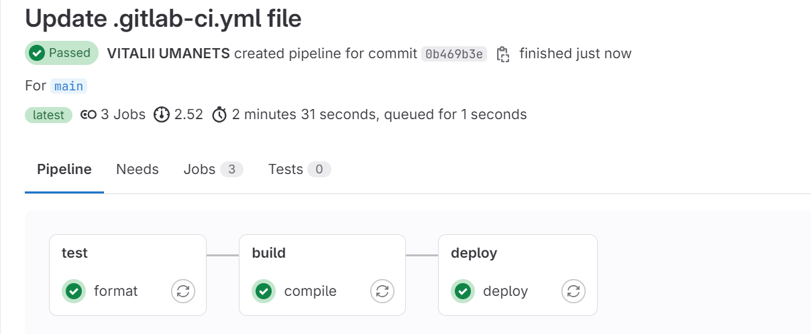 

9. Зробимо зміни [в коді](https://gitlab.com/vit-um/kbot/-/blob/main/helm/values.yaml), на базі цього MR та перевіримо як працює сканер. 
- Внесемо якісь мінорні змінні в код та запушимо в гілку `test/scanner-no-secrets` (назви всі довільні)

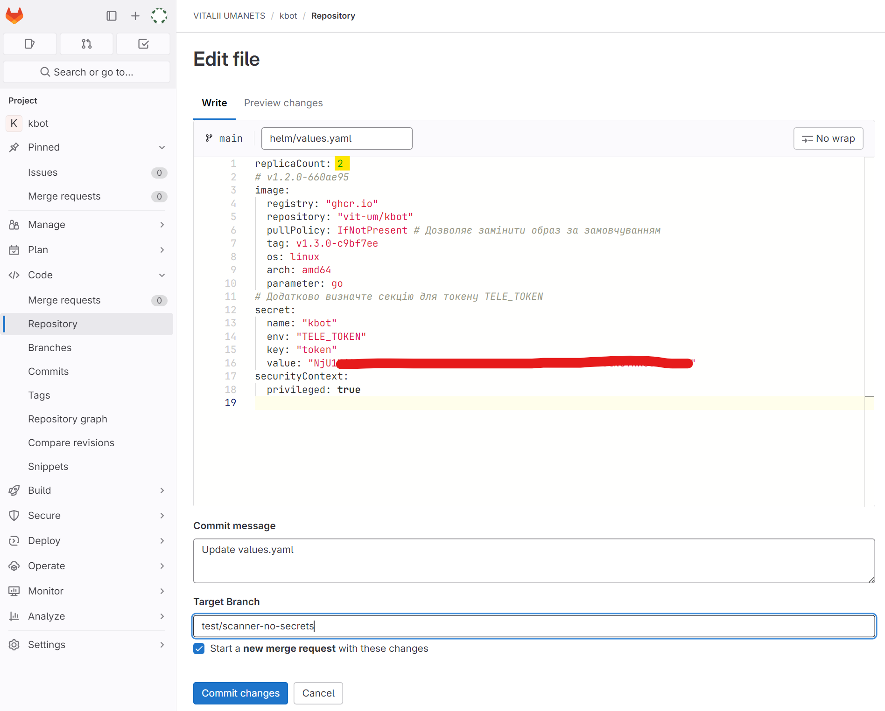 

- Зробимо відразу `Create merge request` в основну гілку (From test/scanner-no-secrets into main) що тригерне сканер.

- Джоба стартанула - подивимося що там відбувається. Все зелене, `INF no leaks found`. Це означає що в коді не було знайдено sensitive даних. 

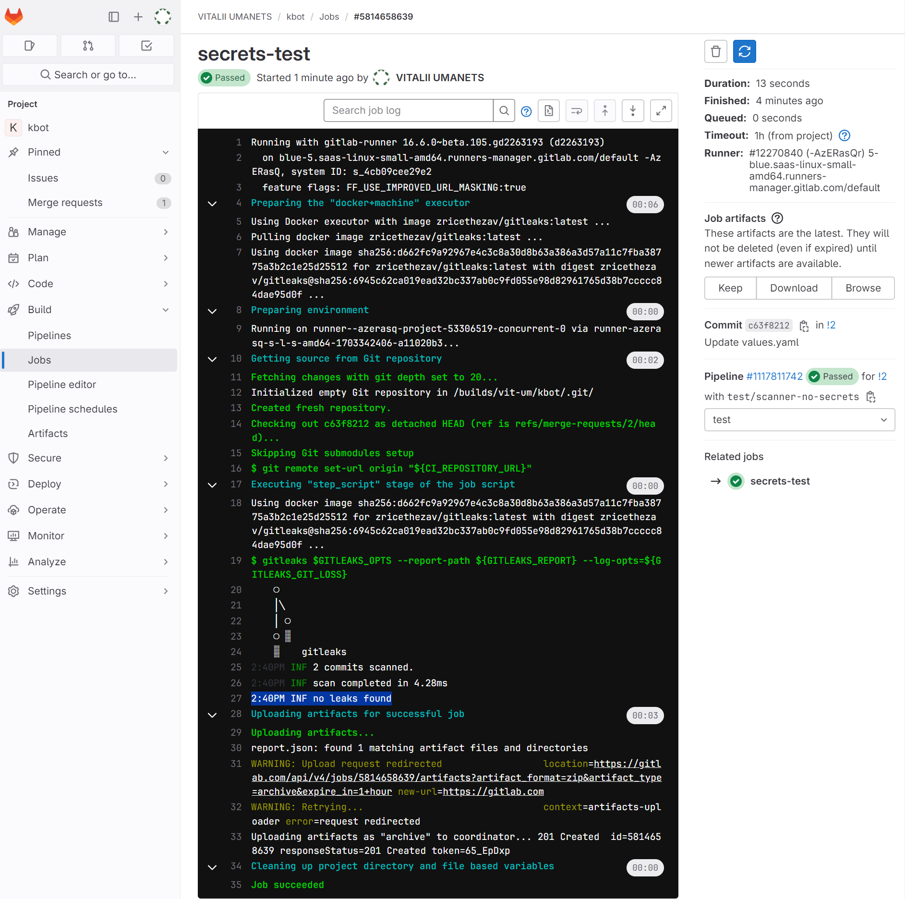  

- Можемо приймати Merge request та мержити:

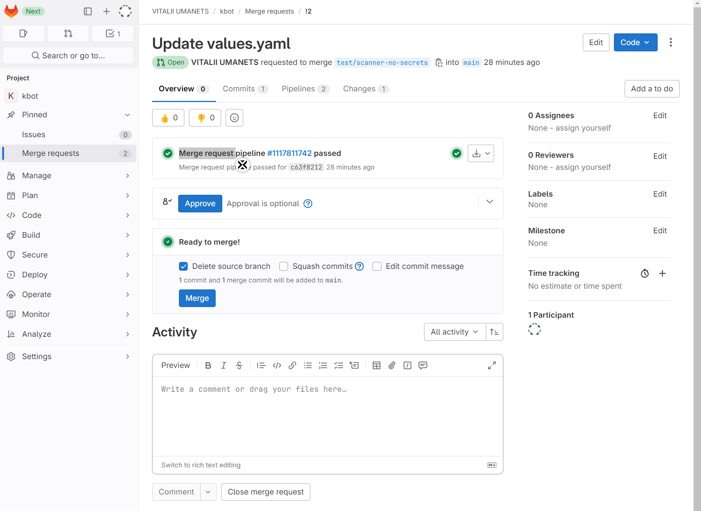  

- Додамо ще трохи змін в код. На цей раз додамо secret з реальним токеном від телеграму. Файл secret.txt:
```yaml
apiVersion: v1
data:
  token: NjU1Mj2Nz0OTpBQUZHR3k3Wn4REdjlwpRExmdEx5OV85cDF5U0tNSTNkeU00aE==
kind: Secret
metadata:
  creationTimestamp: null
  name: kbot
  namespace: demo
```
- Комітимо та відкриваємо MR. Перевіряємо джобу, яка в решті матиме статус `Failed` та буде позначена червоним кольором:
```
Finding:     token: REDACTED
kind: Secret
Secret:      REDACTED
RuleID:      generic-api-key
Entropy:     5.027115
File:        helm/templates/secret.txt
Line:        3
Commit:      d6c62577ddf2ff40beb3fc945d9c5aec4102d899
Author:      VITALII UMANETS
Email:       umantaliy@gmail.com
Date:        2023-12-23T14:58:36Z
Fingerprint: d6c62577ddf2ff40beb3fc945d9c5aec4102d899:helm/templates/secret.txt:generic-api-key:3
2:59PM INF 2 commits scanned.
2:59PM INF scan completed in 5.08ms
2:59PM WRN leaks found: 1
Cleaning up project directory and file based variables
00:00
ERROR: Job failed: exit code 1
```
- Це означає що в коді було знайдено sensitive дані: 
    - знайдено токен, 
    - RuleId, 
    - File, 
    - рядок 3,
    - Сам `Secret:` приховано, 
    - Дані коміту:  автор, дата та відбиток коміту.

- Джоба зафейлила Pipeline і відповідно Merge request. Це означає що код не може
бути злитий в основну гілку. 

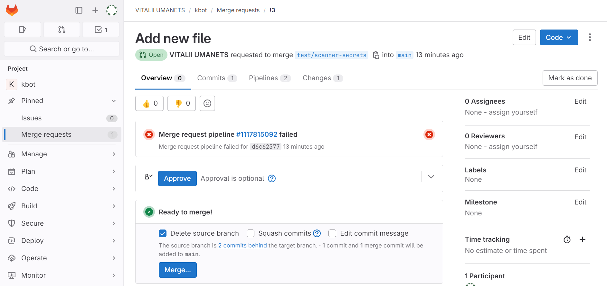  

### Додаткові матеріали
[Top 10 SonarQube Alternatives & Competitors](https://www.g2.com/products/sonarqube/competitors/alternatives)  
[Cloud Security Labs](https://github.com/iknowjason/Awesome-CloudSec-Labs)  
[10 BEST Dynamic Application Security Testing (DAST) Software](https://www.softwaretestinghelp.com/dynamic-application-security-testing-dast-software/)  
[The full reading list/attacks guide](https://blog.cloudflare.com/2022-attacks-an-august-reading-list-to-go-shields-up)  


## Топ-10 ризиків безпеки веб-додатків та Software supply chain Security або безпека ланцюжків постачання

Хмарна інфраструктура і сервіси, що надаються провайдером, у більшій своїй частині прагнуть відповідати вимогам безпеки за дизайном. Наприклад, продукти GCP регулярно проходять незалежну
перевірку контролю безпеки, конфіденційності та відповідності нормативним вимогам.

Сервіси отримують сертифікати відповідності світовим стандартам, таким як ISO 27001 27002 27017. На боці DevOps — відповідальність за побудову безпечного стеку поверх хмарної інфраструктури.

### Network Security
Основні напрямки трафіку в системі можна поділити на внутрішні між компонентами системи (Схід-Захід) та зовнішні(Південь-Північ), тоб-то такі де вхідний та вихідний трафік проходить не контрольованими нами каналами, поза периметром ІС:  

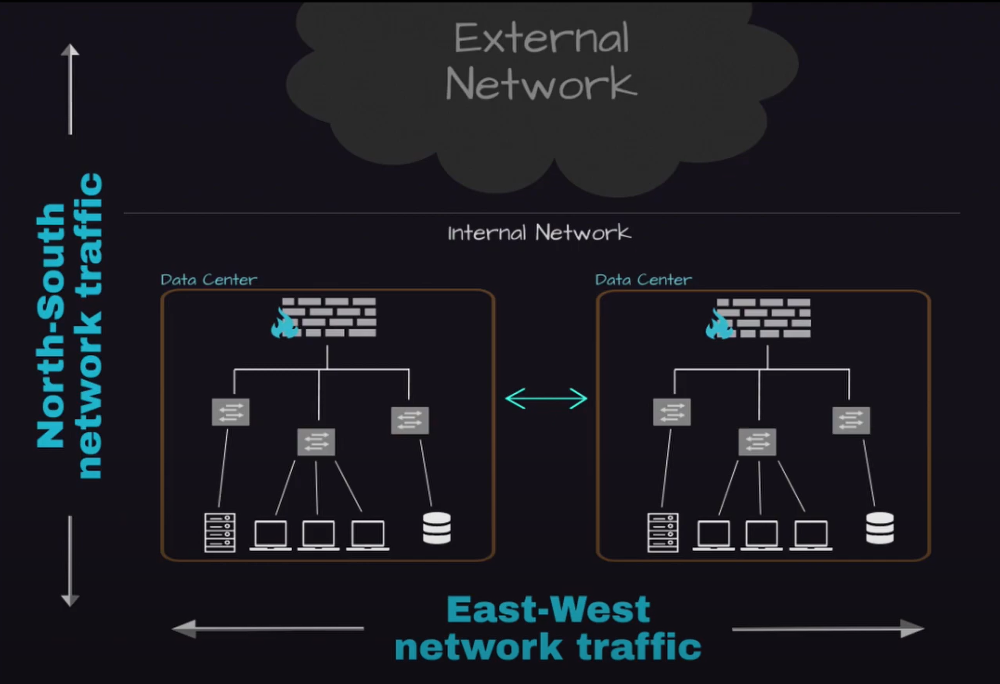

**До внутрішнього трафіку** застосовуються наступні правила:
- потрібно забезпечити маршрутизацію
- контроль доступу
- авторизацію між сервісами
- шифрування та неможливість перехоплення трафіку навіть у середині периметру. 

Існує декілька способів реалізувати захист цього потоку:
- Сервіс меш та інтегровані функції безпеки в платформі оркестрації 
- Kubernetes network polices 
- [Istio Mutual TLS](https://istio.io/latest/docs/concepts/security/)
- [Kubernetes Goat](https://madhuakula.com/kubernetes-goat/docs/)   
- [Calico Cloud](https://www.tigera.io/tigera-products/calico-cloud/)  
- Cilium
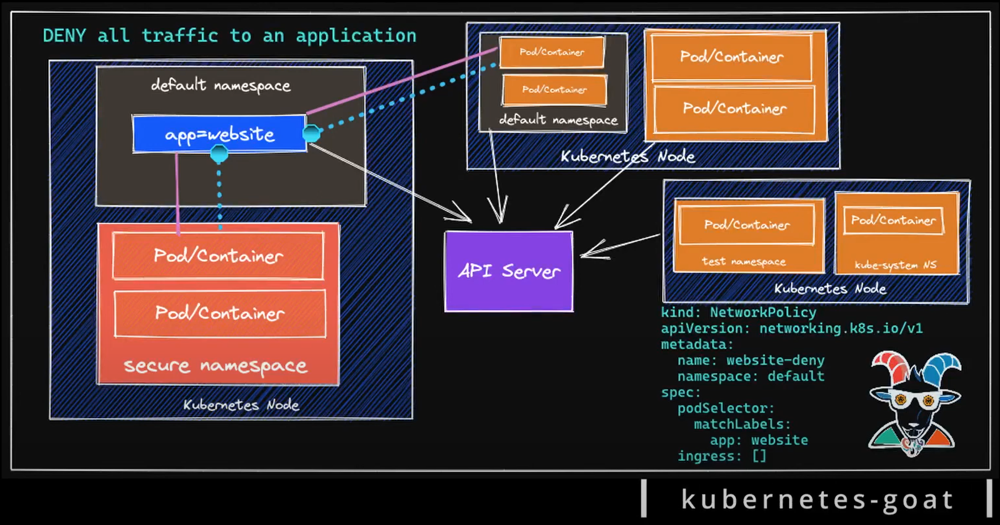 

**Напрямок Південь-Північ** 

Потік зовнішнього світу ми теж можемо контролювати Ingress інтерфейсами сервіс-меш та штатними, вбудованими засобами Kubernetes. Але тут можуть бути використані такі системи контролю трафіку як API-Gateway: 
- [Ambassador](https://www.getambassador.io/) 
- [Gloo](https://docs.solo.io/)  
- [Traefik](https://github.com/traefik/traefik)  

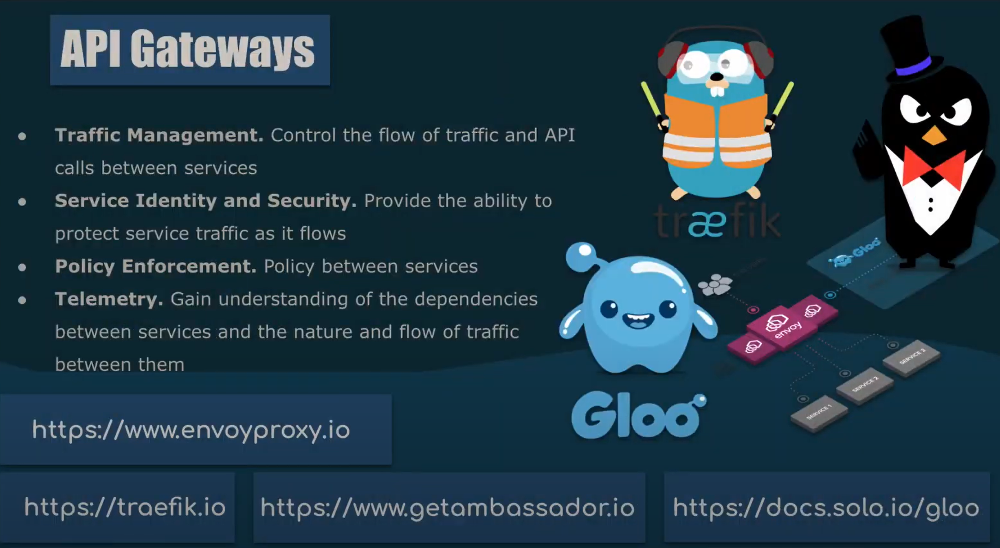  

Для заглиблення в тему знадобляться базові знання понять як:
 - TLS
 - SSL (безпечний транспорт)
 - WAF (Web-application firewall)
 - Cloudflare 

**Доступ до систем всередині периметру**  

Найчастіше такий доступ забезпечує Бастіон або Jump-хости. По суті це сервер з відкритими портами на зовні, як правило порт 22 для безпечного з'єднання для використання ключів. Cloud Shell - приклад такого Jump-хоста тому що він вже авторизований та знаходиться в периметрі. 

[Jump Box](https://www.linux-magazine.com/Online/Features/Jump-Box-Security/(language)/eng-US) використовують для організації доступу в DMZ.Як правило такі системи мають в складі систему моніторингу.

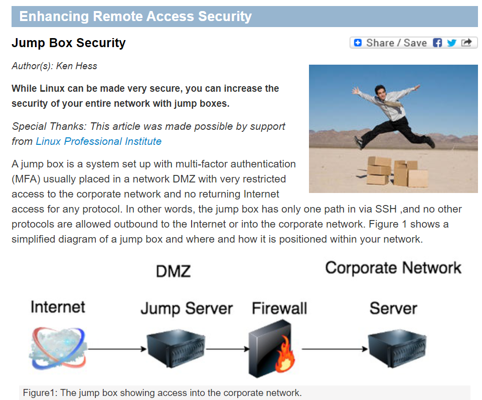

### OWASP 
Щоб уникнути праної в організації системи безпеки спільнота прийшла до розробки стандартів та рекомендацій з безпеки, моделей загроз та відкритих інформаційних бюлетенів про критичні ризики в індустрії. Наприклад  [OWASP Juice Shop](https://owasp.org/www-project-juice-shop/) некомерційний фонд завдяки програмним проектам з відкритим вихідним кодом є джерелом інформації для розробників щодо безпеки в інтернеті. OWASP має топ 10 загроз веб-додаткам та рекомендації з безпеки ІС, контролю даних, трафіку всередині та зовні ІС.     

[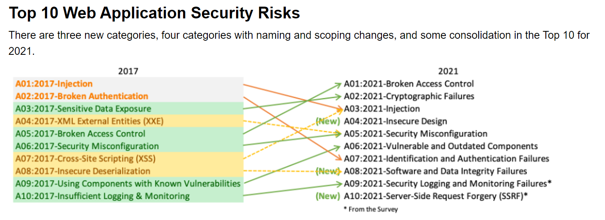](https://owasp.org/www-project-top-ten/)  

OWASP пропонує критерії вибору інструментів для кожного етапу розробки. Так же існує низка OWASP проектів, наприклад [AppSec Pipeline](OWASP_Tampa_02_19_2016_AppSec_Pipeline.pdf) - це місце збору інформації, методів та інструментів для створення власного Pipeline. AppSec Pipeline використовує принципи DevOps та застосовує іх до програм безпеки застосунків.  

Для ширшого управління ризиками існують стандарти аналізу компонентів застосунку. Наприклад [OWASP Software Component Verification Standard](https://owasp.org/www-project-software-component-verification-standard/) Але для DevOps важливо розуміння та імплементація цих методів саме у Pipeline

### Supply Chain Security

[Software supply chain Security або SSCS](https://cd.foundation/blog/2020/07/07/devsecops-building-a-trusted-software-supply-chain/) описує практику захисту компонентів, підходів та методів, що беруть учать у створенні та розгортанні ПЗ. Сюди входять сторонній і власний код, методи розгортання та інфраструктура, інтерфейси і протоколи, а також практика розробників та інструменти розробки.

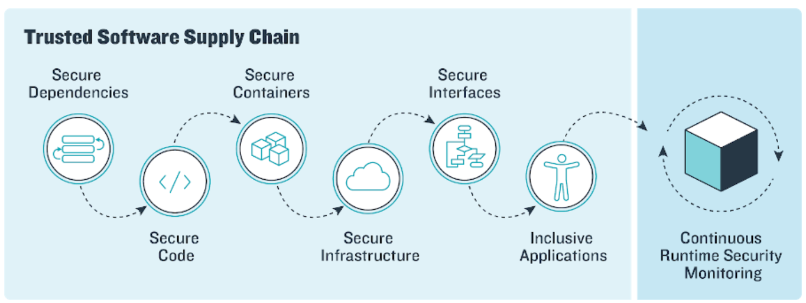  

[GitHub у книзі безпека застосунків](https://docs.github.com/en/code-security/supply-chain-security/understanding-your-software-supply-chain/about-supply-chain-security) визначає ланцюжок постачання ПЗ як усе що входить, або впливає на вашу кодову базу від розроблення до конвеєру CD/CD і продакшен. Це нормально що у Ваших проектах використовуються залежності з відкритим вихідним кодом, які Ви не писали самі, але якщо будь яка з ваших залежностей має вразливість є шанс, що весь застосунок матиме вразливість. 

Можливість використовувати відкритий код означає, що тисячі його авторів мають вплив на роботу вашого застосунку, який базується на їхньому коді. Щоб сприяти безпеці відкритого коду GitHUB будує граф залежностей і бот залежностей безперервно перевіряє весь базовий відкритий код опенсоурс проектів та бібліотек на наявні вразливості. GitHUB зберігає в своїх базах результати сканування публічних репозиторіїв, та надаю функцію сканування як сервіс, поряд з такими функціями як наявність паролів, токенів та ключів у коді.  

Чому тема безпеки стала такою важливою можна зрозуміти на цьому прикладі [A 'Worst Nightmare' Cyberattack: The Untold Story Of The SolarWinds Hack](https://www.npr.org/2021/04/16/985439655/a-worst-nightmare-cyberattack-the-untold-story-of-the-solarwinds-hack) 

GitLAB у своєму блозі [How a DevOps Platform helps protect against supply chain attacks](https://about.gitlab.com/blog/2021/04/28/devops-platform-supply-chain-attacks/) пропонує 5 кроків захисту ланцюжка CI/CD: 
1. Оцінюйте гігієну безпеки враховуючи нові поля для атак. Перегляньте свої параметри безпеки та розгляньте нові можливості для атак. 
2. Автоматизуйте сканування політик та комплайнсу 
3. Захист ІС: контроль доступу, логування, моніторинг, захист хмарних ресурсів  
4. Захистіть фабрику ПЗ, тоб-то принцип нульової довіри, мінімально можливі права розробникам
5. Безперервний процес оцінки та вдосконалення безпеки

[COMPUTER SECURITY RESOURCE CENTER DevSecOps](https://csrc.nist.gov/Projects/devsecops)  

## Coding Session. Flux + SOPS

[SOPS](https://github.com/getsops/sops) — це інструмент з відкритим вихідним кодом, який дозволяє шифрувати секрети в конфігураційних файлах за допомогою різних алгоритмів шифрування, таких як [AES-256-GCM](https://codeby.net/threads/asm-cng-chast-2-shifrovanie-aes-256-v-rezhime-gcm.78007/) і [RSA-OAEP](https://habr.com/ru/articles/99376/).  

SOPS підтримує багато популярних форматів конфігураційних файлів, включаючи YAML, JSON і INI. SOPS також забезпечує інтеграцію з популярними сторонніми інструментами, такими як Kubernetes, Helm та KMS, що робить його універсальним інструментом для управління
секретами.

`Flux` — популярний інструмент GitOps, який забезпечує безперервне доставляння додатків Kubernetes. Він працює шляхом моніторингу Git-репозиторію на предмет змін у маніфестах додатків та автоматичного розгортання цих змін на кластері Kubernetes. Flux також інтегрується з іншими інструментами DevOps, такими як Helm та Prometheus, щоб забезпечити повне наскрізне рішення для управління додатками Kubernetes.

`KMS` — це хмарний сервіс, який надає безпечний і масштабований спосіб керування криптографічними ключами та секретами. KMS зазвичай використовується в робочих процесах DevOps для управління шифруванням секретів і ключів, що використовуються для захисту конфіденційних даних.

При використанні з SOPS і Flux, KMS може забезпечити додатковий рівень безпеки процесу шифрування. SOPS забезпечує інтеграцію з декількома службами KMS, такими як:
- AWS KMS, 
- Google Cloud KMS 
- Azure Key Vault. 

Використовуючи KMS з SOPS, ви можете забезпечити безпечне керування та зберігання ключів шифрування, а також контроль і аудит доступу до конфіденційних даних. 

Щоб використовувати KMS з SOPS і Flux, спочатку потрібно створити ключ KMS і налаштувати SOPS на використання цього ключа для шифрування. Коли ви шифруєте свої секрети за допомогою SOPS, ключ буде використовуватися для шифрування даних, забезпечуючи додатковий рівень безпеки. Потім ви можете зберігати зашифровані секрети в репозиторії GitOps і використовувати Flux для автоматичного розгортання секретів на кластері Kubernetes.

Щоб використовувати SOPS і Flux разом, потрібно спочатку зашифрувати свої секрети за допомогою SOPS, а потім зберегти їх у репозиторії GitOps. Коли Flux виявить зміни в репозиторії Git, він автоматично розшифрує секрети і застосує їх до кластера Kubernetes.

Використання KMS з SOPS і Flux забезпечує безпечний і спрощений спосіб управління секретами в процесі DevOps. KMS гарантує безпечне керування та зберігання ключів шифрування, в той час як SOPS надає простий та потужний спосіб шифрування секретів у файлах конфігурації. Flux автоматизує розгортання додатків на кластері Kubernetes, гарантуючи, що секрети завжди розгортаються безпечно і вчасно.

`Підхід Sealed Secrets` можна описати як контролер Kubernetes, який забезпечує безпечний спосіб зберігання та управління зашифрованими секретами в репозиторіях GitOps. Він працює шляхом шифрування секретів Kubernetes за допомогою асиметричної пари ключів, де відкритий ключ зберігається в кластері Kubernetes, а приватний ключ безпечно зберігається поза кластером. **Зашифровані секрети можна зберігати в репозиторії GitOps** разом з іншими конфігураційними файлами, що дозволяє здійснювати контроль версій і спільне
редагування.

Коли до зашифрованих секретів у репозиторії GitOps вносяться зміни, **контролер Sealed Secrets автоматично розшифровує секрети і застосовує їх до кластера Kubernetes**. Це гарантує, що секрети завжди актуальні та безпечно керовані, а також спрощує процес розгортання.

Контролер `Kustomize у Flux` надає можливість керувати складними маніфестами та конфігураціями Kubernetes за допомогою декларативного підходу. Він дозволяє вам визначити набір ресурсів у базовій конфігурації, а потім застосувати оверлеї, щоб налаштувати ці
ресурси для різних середовищ або додатків.

При використанні з Sealed Secrets, контролер Kustomize можна використовувати для керування зашифрованими секретами у подібний спосіб.

Базова конфігурація для закритих секретів включатиме відкритий ключ, який використовується для шифрування секретів, а також самі зашифровані секрети. Базову конфігурацію можна зберігати в репозиторії GitOps разом з іншими конфігураційними файлами.

Коли в репозиторій GitOps вносяться зміни, Flux виявить ці зміни і застосує їх до кластера Kubernetes. Потім контролер Kustomize об'єднає базову конфігурацію з будь-якими патчами і згенерує потрібний маніфест для Secrets. Потім контролер розшифрує секрети і застосує їх до кластера.

### Додаткові матеріали
[Workload Identity](https://cloud.google.com/kubernetes-engine/docs/concepts/workload-identity)  
[Use Workload Identity](https://cloud.google.com/kubernetes-engine/docs/how-to/workload-identity)  
[Encrypting using GCP KMS](https://github.com/mozilla/sops#encrypting-using-gcp-kms)  
[Secrets Management with SOPS and GCP KMS](https://fluxcd.io/flux/use-cases/gcp-source-repository/#secrets-management-with-sops-and-gcp-kms)  

### Coding Session.

`TELE_TOKEN` це може бути токен для доступу до API пароль для бази даних сертифікат або будь-яка конфіденційна інформація. Розглянемо комплексу інтеграцію:
- gitops,  
- sealsecrets,  
- workload identity, 
- сервіс ключів шифрування, 
- secrets operations або `Sops` як один із методів зберігання конфіденційної інформації в коді. 

1. Робоче середовище налаштуємо в [Google Shell](https://console.cloud.google.com/), робочий каталог для розгортання ІС беремо з [попередньої лекції](https://github.com/vit-um/tf) 
- назва репозиторій для зберігання конфігурації інфраструктури та застосунку буде `flux-system`.
- Розгорнемо ІС та створимо конфігураційний репозиторій за прикладом попередньої лекції:
```sh
$ tf init
$ tf validate
Success! The configuration is valid.
$ tf plan -var-file=terraform.tfvars
$ tf apply -auto-approve
Apply complete! Resources: 6 added, 0 changed, 0 destroyed.
```
- Після розгортання IC перевіримо ресурси що створив тераформ:
```sh
 ✗ tf state list
module.flux_bootstrap.flux_bootstrap_git.this
module.github_repository.github_repository.this
module.github_repository.github_repository_deploy_key.this
module.gke_cluster.data.google_client_config.current
module.gke_cluster.data.google_container_cluster.main
module.gke_cluster.google_container_cluster.this
module.gke_cluster.google_container_node_pool.this
module.tls_private_key.tls_private_key.this
module.gke_cluster.module.gke_auth.data.google_client_config.provider
module.gke_cluster.module.gke_auth.data.google_container_cluster.gke_cluster
```
- Отримуємо доступ до [нового кластеру](https://console.cloud.google.com/kubernetes/list/overview) та перевіримо його ресурси: 
```sh
✗ gcloud container clusters get-credentials main --zone us-central1-c --project vit-um
Fetching cluster endpoint and auth data.
kubeconfig entry generated for main. 

✗ k get no
NAME                          STATUS   ROLES    AGE   VERSION
gke-main-main-1fc8c3a6-7jdg   Ready    <none>   14m   v1.27.3-gke.100
gke-main-main-1fc8c3a6-rgx9   Ready    <none>   14m   v1.27.3-gke.100

✗ k get ns
NAME              STATUS   AGE
default           Active   20m
flux-system       Active   15m
gmp-public        Active   19m
gmp-system        Active   19m
kube-node-lease   Active   20m
kube-public       Active   20m
kube-system       Active   20m
```
- Тепер перевіримо namespace Flux-system а також що всі його компоненти піднято та вони працюють:
```sh
✗ k get po -n flux-system  
NAME                                       READY   STATUS    RESTARTS   AGE
helm-controller-5b48549d95-nbs7j           1/1     Running   0          18m
kustomize-controller-5c8878fd86-7x2kh      1/1     Running   0          18m
notification-controller-59696fbb58-l5fmg   1/1     Running   0          18m
source-controller-fc5555fb-zglcl           1/1     Running   0          18m
```
2. Додому namespace `demo` для наших додатків методом gitops

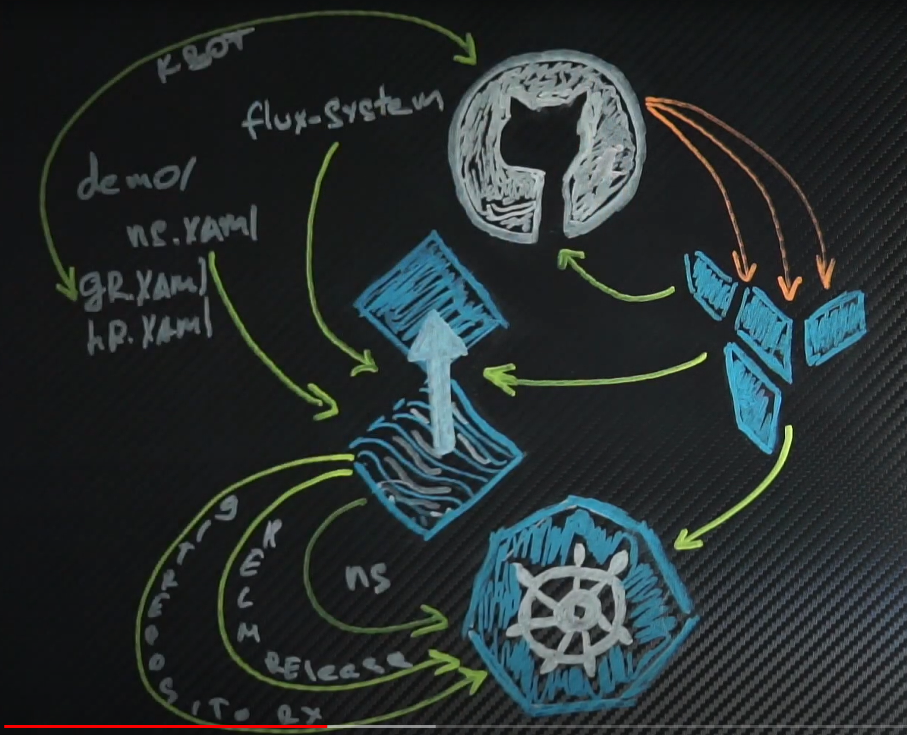  

- Створимо директорію demo та файл ns.yaml, що свою чергу буде підхоплено flux та розгорнуто в кластері: 
```sh
✗ cd .. && git clone https://github.com/vit-um/flux-gitops.git
✗ cd flux-gitops/clusters
✗ mkdir demo && cd demo
✗ k ai --require-confirmation=false "створи маніфест ns demo" >ns.yaml
✗ nano ns.yaml
✗ git add .
✗ git commit -m"add ns"
✗ git push
# перевіримо стан кластеру та переконаємося що namespace створився 
✗ k get ns -w
NAME              STATUS   AGE
default           Active   66m
demo              Active   51s
flux-system       Active   61m
```
- Для зручності встановимо [CLI клієнт Flux](https://fluxcd.io/flux/installation/)
```sh
✗ curl -s https://fluxcd.io/install.sh | bash
✗ flux get all
NAME                            REVISION                SUSPENDED       READY   MESSAGE                                           
gitrepository/flux-system       main@sha1:d649554a      False           True    stored artifact for revision 'main@sha1:d649554a'

NAME                            REVISION                SUSPENDED       READY   MESSAGE                              
kustomization/flux-system       main@sha1:d649554a      False           True    Applied revision: main@sha1:d649554a

# Для спостереження за логами розгортання ресурсів 
✗ flux logs -f

```
- Створимо два СRD ресурси системи flux для розгортання наших додатків це файли Git репозиторію `kbot-gr.yaml` та helm Release `kbot-hr.yaml`. Flux автоматично розгорне наше додатки як тільки ці файли з'являться у репозиторії, а репозиторієм для додатків буде kbot. 
```sh
✗ pwd
/home/umanetsvitaliy/flux-gitops/clusters/demo
✗ flux create source git kbot \
    --url=https://github.com/vit-um/kbot \
    --branch=main \
    --namespace=demo \
    --export > kbot-gr.yaml 
✗ flux create helmrelease kbot \
    --namespace=demo \
    --source=GitRepository/kbot \
    --chart="./helm" \
    --interval=1m \
    --export > kbot-hr.yaml 
✗ ls
kbot-gr.yaml  kbot-hr.yaml  ns.yaml
# edit helm.toolkit.fluxcd.io/v2beta1
✗ git add .
✗ git commit -m"add CRD"
✗ git push
# в namespace demo повинні з'явитися поди застосунку kbot
✗ k get po -n demo -w
NAME                   READY   STATUS    RESTARTS   AGE
kbot-66dc58657-tmlpn   0/1     Pending   0          0s
kbot-66dc58657-tmlpn   0/1     ContainerCreating   0          0s
kbot-66dc58657-tmlpn   0/1     CreateContainerConfigError   0          3s

# перевіримо через describe та маємо побачити: "Secret kbot not found"
✗ k describe po -n demo kbot-66dc58657-tmlpn | grep Warn
  Warning  Failed     9s (x8 over 89s)  kubelet            Error: secret "kbot" not found
```

3. Створення Secret с токеном для доступу до api через [Workload Identity](https://cloud.google.com/kubernetes-engine/docs/concepts/workload-identity) та sealed secrets

Варіанти створення секретів для додатків:
- мануальна - це не надійно та незручно 
```sh
$ k apply -f secret.yaml 
$ k get secrets -n demo
```
- використовуючи систему [Vault](https://www.hashicorp.com/products/vault) - це можливо але це додаткова система яка потребує підтримки та налаштування
- за допомогою нативного механізму Kubernetes та Flux: workload Identity та sealed secrets. 

`Workload Identity` дозволяє додаткам в кластерах gke ідентифікувати себе під певним сервіс акаунтом служби Identity та Access менеджменту IAM для доступу до хмарних сервісів Google. В даному випадку
ми використовуємо його для авторизації в KMS (Cloud Key Management Service).

[KMS](https://cloud.google.com/kms/docs/key-management-service) - сервіс ключів шифрування який дозволяє шифрувати та дешифрувати дані за допомогою цих ключів. В даному випадку ми використовуємо його для шифрування і дешифрування secrets.

- Створимо [key ring](https://cloud.google.com/kms/docs/resource-hierarchy#key_rings) - це контейнер для ключів.
```sh
✗ gcloud kms keyrings list --location global
NAME: projects/vit-um/locations/global/keyRings/sops-flux
```
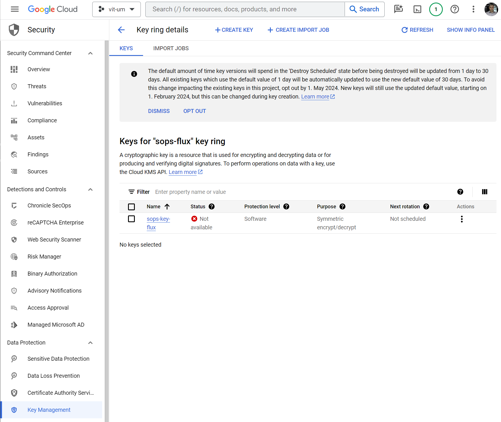  

- Створимо [ключ KMS](https://cloud.google.com/kms/docs/resource-hierarchy#keys) - це симетричний ключ який можна використовувати для шифрування та дешифрування даних 

- Workload Identity в свою чергу, шляхом анотації в маніфесті вже існуючого сервісного акаунту flux під назвою та `kustomize controller` налаштує доступ до KMS. Це дозволить контролеру дешифрувати Secret-и, які ми зашифруємо за допомогою KMS ключа. 

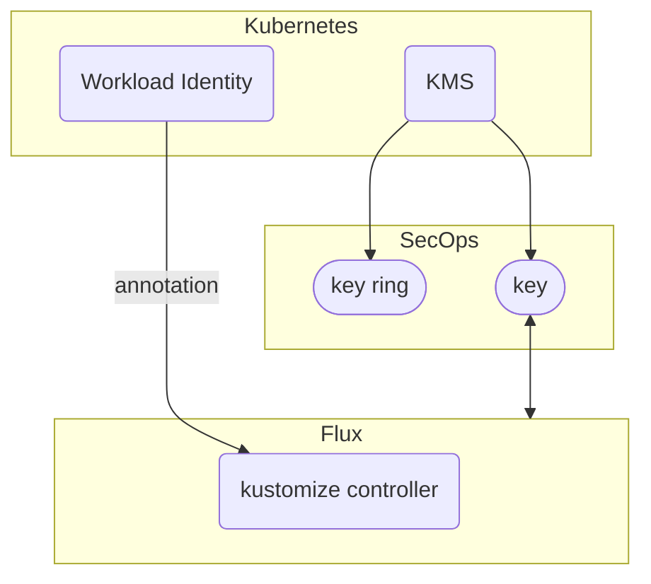
```mermaid

flowchart TB
    subgraph Flux
        direction RL
        A(kustomize controller)
    end
    subgraph Kubernetes
        direction RL
        C(Workload Identity)
        D(KMS)    
    end
    subgraph SecOps 
        direction RL
        E([key ring])
        F([key])
    end
D --> E & F
C --> |annotation| A
F <--> Flux
```
4. Додамо до коду terraform два модулі [gke-workload-identity](https://github.com/terraform-google-modules/terraform-google-kubernetes-engine/blob/master/modules/workload-identity/main.tf) і kms. 

- [Параметрами першого модуля](https://registry.terraform.io/modules/terraform-google-modules/kubernetes-engine/google/latest/submodules/workload-identity) будемо використовувати:
    - існуючій kubernetes сервіс акаунт з ім'ям `kustomize controller`,  
    - в неймспейсі `flux-system` на існуючому кластері,  
    - дозволимо анотацію,  
    - роль `cloudkms.cryptoKeyEncrypterDecrypter`

```hcl
module "gke-workload-identity" {
  source              = "terraform-google-modules/kubernetes-engine/google//modules/workload-identity"
  use_existing_k8s_sa = true
  name                = "kustomize-controller"
  namespace           = "flux-system"
  project_id          = var.GOOGLE_PROJECT
  cluster_name        = "main"
  location            = var.GOOGLE_REGION
  annotate_k8s_sa     = true
  roles               = ["roles/cloudkms.cryptoKeyEncrypterDecrypter"]
}
```

- [Для модуля kms](https://registry.terraform.io/modules/terraform-google-modules/kms/google/latest) це будуть два довільні ім'я для кейтерингу та ключа.

```hcl
module "kms" {
  source             = "github.com/vit-um/terraform-google-kms"
  project_id         = var.GOOGLE_PROJECT
  keyring            = "sops-flux"
  location           = "global"
  keys               = ["sops-key-flux"]
  prevent_destroy    = false
}
```
5. Зробимо ініціалізацію нових модулів `terraform init` і після цього зробимо `tf apply` та отримаємо помилку через не дозволений сервіс:

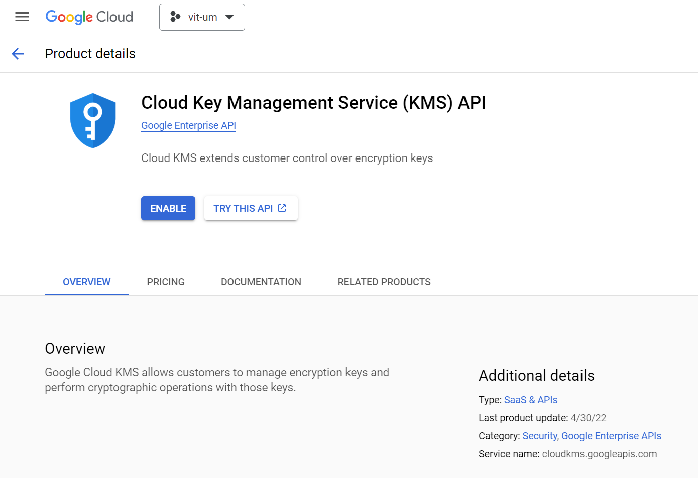  

- Дозволяємо та повторюємо розгортання модулів хвилин через п'ять:
```sh
✗ tf init 
Terraform has been successfully initialized!
✗ tf apply -auto-approve
Apply complete! Resources: 2 added, 0 changed, 0 destroyed.
✗ tf state list
```
- Перевіримо анотацію сервісного акаунта `flux-system` `kustomize-controller` та переконуємося що вона відповідає нашим очікування. 
```sh
✗ k get sa -n flux-system kustomize-controller -o yaml
apiVersion: v1
kind: ServiceAccount
metadata:
  creationTimestamp: "2023-12-25T10:16:08Z"
  labels:
    app.kubernetes.io/component: kustomize-controller
    app.kubernetes.io/instance: flux-system
    app.kubernetes.io/part-of: flux
    app.kubernetes.io/version: v2.2.1
    kustomize.toolkit.fluxcd.io/name: flux-system
    kustomize.toolkit.fluxcd.io/namespace: flux-system
  name: kustomize-controller
  namespace: flux-system
  resourceVersion: "73118"
  uid: 7d528d09-d2e7-422d-85c6-36c227e3735c
```
- Як ми можемо бачити до kubernetes сервіс акаунту не було додано анотацію, в якій повинно було зазначено ім'я `gcp-service-account` під яким flux kustomize контролер буде звертатися до сервісів Google Cloud, ось так: 

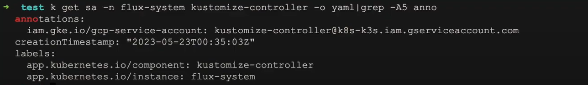  

- Створена модулем `gke-workload-identity` анотація сервісному акаунту `kustomize-controller` просто зникла тому що анотацію виставляли імперативно з тераформ, а flux синхронізується на інфраструктурний репозиторій, в якому відсутня інформація про анотацію сервісного акаунта.

- Виправити проблему можна за допомогою двох патчів:
        - sa-patch.yaml 
        - sops-patch.yaml

- Створюємо ці файли в інфраструктурному репозиторію `flux-gitops/clusters/flux-system/ `
- Patch виду ServiceAccount буде містити name: `kustomize-controller`, namespace: `flux-system` та анотацію, яку треба додати до сервіс акаунту на Kubernetes-кластері. Отже заповнимо `sa-patch.yaml` наступними даними:
```yaml
apiVersion: v1
kind: ServiceAccount
metadata:
  name: kustomize-controller
  namespace: flux-system
  annotations:
    iam.gke.io/gcp-service-account: kustomize-controller@vit-um.iam.gserviceaccount.com
```
- Другий файл `sops-patch.yaml` який надасть налаштування `provider:sops` для Flux kustomization. Це дозволить flux автоматично розшифровувати секрети, які були зашифровані за допомогою KMS ключа.  
```sh
✗ cd ../flux-gitops/clusters/flux-system 

✗ flux create kustomization flux-system \
    --namespace=flux-system \
    --path=./clusters \
    --source=GitRepository/flux-system \
    --interval=10m \
    --prune=true \
    --decryption-provider=sops \
    --export >sops-patch.yaml
```
- Додамо ці два файли до `kustomization.yaml`. Це означає що flux буде використовувати ці файли для патчінгу
ресурсів які він розгортає та відстежує. Kustomize - це `kubernetes native configuration management` включений за замовчуванням в kubectl, що використовується у flux для патчінгу ресурсів.
```yaml
apiVersion: kustomize.config.k8s.io/v1beta1
kind: Kustomization
resources:
- gotk-components.yaml
- gotk-sync.yaml
patches:
  - patch: sops-patch.yaml
    target:
      kind: Kustomization
  - patch: sa-patch.yaml
    target:
      kind: ServiceAccount
      name: kustomize-controller
```
- Запушимо ці зміни та перевіримо що відображається на кластері:
```sh
✗ git add .
✗ git commit -m"add patches files"
✗ git push

✗ k get po  
NAME                                       READY   STATUS    RESTARTS   AGE
helm-controller-5b48549d95-45flh           1/1     Running   0          9h
kustomize-controller-5c8878fd86-czxnm      1/1     Running   0          9h
notification-controller-59696fbb58-s7chl   1/1     Running   0          9h
source-controller-fc5555fb-qskdz           1/1     Running   0          9h
```
- Лог flux показують, що він успішно виконала реконсіляцію та використав наші патчі 
```sh
✗ k logs -n flux-system kustomize-controller-5c8878fd86-czxnm -f --tail 10
{"level":"info","ts":"2023-12-27T20:51:35.810Z","msg":"Reconciliation finished in 1.578240643s, next run in 10m0s","controller":"kustomization","controllerGroup":"kustomize.toolkit.fluxcd.io","controllerKind":"Kustomization","Kustomization":{"name":"flux-system","namespace":"flux-system"},"namespace":"flux-system","name":"flux-system","reconcileID":"c0f7d51b-5ba2-4e4c-8d46-450e95c8343c","revision":"main@sha1:dc74456474966c5bc8d450eb3d7f381965b416bc"}
```
- Тепер перевіримо анотацію сервісному акаунту та переконаємося, що анотація на місці. Це означає що flux використовує сервісний акаунт контролера для авторизації в KMS

```sh
✗ k get sa -n flux-system kustomize-controller -o yaml | grep -A5 anno
 annotations:
    iam.gke.io/gcp-service-account: kustomize-controller@vit-um.iam.gserviceaccount.com
  creationTimestamp: "2023-12-27T19:15:17Z"
  labels:
    app.kubernetes.io/component: kustomize-controller
    app.kubernetes.io/instance: flux-system
```

- Зараз перевіримо наявність keyring та ключа kms:
```sh
✗ kubectl config set-context --current --namespace=flux-system
Context "gke_vit-um_us-central1-c_main" modified.

✗ gcloud config set project vit-um                    
Updated property [core/project].

✗ gcloud kms keys list --location global --keyring sops-flux               
NAME: projects/vit-um/locations/global/keyRings/sops-flux/cryptoKeys/sops-key-flux
PURPOSE: ENCRYPT_DECRYPT
ALGORITHM: GOOGLE_SYMMETRIC_ENCRYPTION
PROTECTION_LEVEL: SOFTWARE
LABELS: 
PRIMARY_ID: 1
PRIMARY_STATE: ENABLED
```

6. Для створення secret для токена ми використовуємо [Mozilla Sops](https://github.com/getsops/sops#encrypting-using-gcp-kms) - інструмент для шифрування та дешифрування даних.  
    - Візьмемо наш TELE_TOKEN 
    - Згенеруємо з нього Secret маніфест Kubernetes
    - Зашифруємо за допомогою SOPS та KMS ключів 
    - Збережемо на github 

- Встановимо sops локально за допомогою wget: 
    - завантажено з офіційного сайту бінарнік 
    - надамо йому права на виконання 
    - перевіримо локально

```sh
$ wget https://github.com/getsops/sops/releases/download/v3.8.1/sops-v3.8.1.linux.amd64
$ chmod +x sops-v3.8.1.linux.amd64
$ mv sops-v3.8.1.linux.amd64 tf/sops
```

- Призначимо змінній TELE_TOKEN значення яке ми отримали при створенні боту
```sh
$ read -s TELE_TOKEN
# експортуємо його 
$ export TELE_TOKEN
```
- Створимо секрети за допомогою `kubectl create secret` з опцією `dry-run`, що згенерує yaml маніфест. 
```sh
$ k -n demo create secret generic kbot --from-literal=token=$TELE_TOKEN --dry-run=client -o yaml

apiVersion: v1
data:
  token: NjU1MjQ2NzQ0OTpBQUZHR3k3WnREdjlpRExmdEx5OV85cDF5U0tN2TNkeU00aw==
kind: Secret
metadata:
  creationTimestamp: null
  name: kbot
  namespace: demo
```
- Збережемо маніфест у файлі з назвою secret.yaml та зашифровано його за допомогою sops.
Для чого надамо sops наступні параметри:
    - `-e` це означає що ми хочемо шифрувати encrypted
    - `-gcp-kms` використовувати ключ gcp для шифрування 
    - `--encrypted regex` це регулярний вираз, який визначає які саме дані шифрувати (даному
випадку token)
    - `secret.yaml` - файл який ми шифруємо. 

Вивід збережемо у файл `secret-enc.yaml` та перевіримо його:
```sh
✗ k -n demo create secret generic kbot --from-literal=token=$TELE_TOKEN --dry-run=client -o yaml > secret.yaml

✗ ./sops -e -gcp-kms projects/vit-um/locations/global/keyRings/sops-flux/cryptoKeys/sops-key-flux --encrypted-regex '^(token)$' secret.yaml > secret-enc.yaml

✗ cat secret-enc.yaml
```
- Маємо бачити наступний результат:
    - `data: token:`- зашифровано
    - `sops: gcp-kms:` передані параметри:
        - `resource_id:` де знайти ключ
        - `created_at:` коли створений
    - `sops: mac:` message authentication code або чек-сума для зашифрованого message.

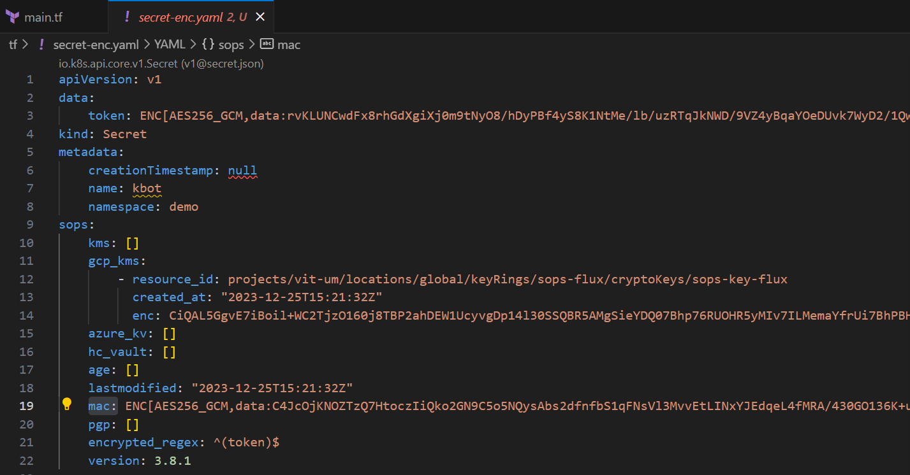  

7. Збережемо зашифрований маніфест з secret-ом в репозиторій `flux-gitops`, де Flux автоматично повинен його розшифрувати та створити Secret на Kubernetes.
```sh
$ cp secret-enc.yaml ../flux-gitops/clusters/demo
cd ../flux-gitops && git add . && git commit -m"add secret-enc.yaml" && git push
```
- Ми очікуємо що наш token додано до маніфесту Secret зашифровано за допомогою ключа та збережено
в репозиторії 
- flux controller повинен розшифрувати Secret за допомогою kms ключа, доступ до якого забезпечує анотований сервіс акаунт та workload Identity 
- Після чого буде створено нативні Secret kubernetes, які ми використовуємо для доступу до API телеграму

8. Перевіримо чи Secret вже в namespace демо та побачимо, що Secret вже є, це каже про те що flux зміг його розшифрувати:
```sh
$ k get secrets -n demo         
NAME                         TYPE                 DATA   AGE
kbot                         Opaque               1      62m
sh.helm.release.v1.kbot.v1   helm.sh/release.v1   1      62m
```
- Розгортання застосунку теж на місці: 
```sh
$ k get deploy -n demo
NAME   READY   UP-TO-DATE   AVAILABLE   AGE
kbot   0/1     1            0           30m
```
- З секретом може бути наступна проблема:
```sh
k get secrets -n demo kbot -o yaml
Error from server (NotFound): secrets "kbot" not found

# Ось так виглядає видача без помилок:
$ k get secrets -n demo kbot -o yaml
apiVersion: v1
data:
  token: dG9rZW4=
kind: Secret
metadata:
  annotations:
    meta.helm.sh/release-name: kbot
    meta.helm.sh/release-namespace: demo
  creationTimestamp: "2023-12-27T20:26:36Z"
  labels:
    app.kubernetes.io/managed-by: Helm
    helm.toolkit.fluxcd.io/name: kbot
    helm.toolkit.fluxcd.io/namespace: demo
  name: kbot
  namespace: demo
  resourceVersion: "40587"
  uid: 2b5fe453-2fdb-4bf9-9fac-a7b0ba8610c0
type: Opaque
```

- Перевіримо роботу застосунку прямо в телеграмі. Напишемо сигнал hello і отримуємо версію.
- Перевіримо версію image в деплойменті. 
```sh
k get deploy -o wide
NAME                      READY   UP-TO-DATE   AVAILABLE   AGE    CONTAINERS   IMAGES                                          SELECTOR
helm-controller           1/1     1            1           147m   manager      ghcr.io/fluxcd/helm-controller:v0.37.1          app=helm-controller
kustomize-controller      1/1     1            1           147m   manager      ghcr.io/fluxcd/kustomize-controller:v1.2.1      app=kustomize-controller
notification-controller   1/1     1            1           147m   manager      ghcr.io/fluxcd/notification-controller:v1.2.3   app=notification-controller
source-controller         1/1     1            1           147m   manager      ghcr.io/fluxcd/source-controller:v1.2.3         app=source-controller

```

9. Видаляємо IC. Помилки tf destroy 
```sh

module.gke_cluster.google_container_node_pool.this: Destruction complete after 4m15s
╷
│ Error: Could not delete Flux
│ 
│ could not clone git repository: unable to clone: repository not found: git repository: 'https://github.com/vit-um/flux-gitops.git'
╵
✗ tf state list
module.flux_bootstrap.flux_bootstrap_git.this
module.gke_cluster.data.google_client_config.current
module.gke_cluster.data.google_container_cluster.main
module.gke_cluster.google_container_cluster.this

✗ tf state rm module.flux_bootstrap.flux_bootstrap_git.this
Removed module.flux_bootstrap.flux_bootstrap_git.this
Successfully removed 1 resource instance(s).
Releasing state lock. This may take a few moments...

✗ tf destroy
Destroy complete! Resources: 1 destroyed.
```


### Контрольні запитання по розділу

1. Яка основна мета "Червоної Команди" ("Red Team") в DevSecOps?

Основна мета "Червоної Команди" ("Red Team") в DevSecOps - симулювати атаки з реального світу і оцінювати вразливості системи. Червона команда - це група фахівців з безпеки, які працюють над виявленням і усуненням вразливостей у системах і мережах. Вони використовують різні методи, включаючи тестування на проникнення, соціальну інженерію та інші техніки, щоб знайти шляхи входу в систему.

2. Яка практика DevSecOps передбачає використання автоматизованих тестів, щоб гарантувати, що зміни в коді не призведуть до появи вразливостей в системі безпеки?

Continuous security - це практика, яка спрямована на забезпечення безпеки програмного забезпечення на всіх етапах життєвого циклу розробки (SDLC). Вона передбачає використання автоматизованих інструментів та процесів для виявлення та усунення вразливостей безпеки на ранніх етапах SDLC.

Однією з ключових практик continuous security є використання автоматизованих тестів безпеки. Ці тести можуть бути використані для виявлення вразливостей у коді, конфігурації та інших аспектах системи безпеки.

Наприклад, можна використовувати статичний аналіз коду (SAST) для виявлення вразливостей у коді, а динамічний аналіз коду (DAST) для виявлення вразливостей у поведінці коду. Також можна використовувати тестування на проникнення (Pentesting) для виявлення вразливостей у конфігурації та інших аспектах системи безпеки.

Continuous security є важливою частиною будь-якої програми DevSecOps. Вона допомагає організаціям виявляти і усувати вразливості безпеки на ранніх етапах SDLC, коли їх легше і дешевше виправити.

3. Яка практика передбачає внесення невеликих інкрементних змін до програми та постійне тестування і розгортання цих змін?

`Progressive Delivery` - це підхід до розробки програмного забезпечення, який базується на інкрементальному впровадженні малих змін у програмі та постійному тестуванні цих змін перед впровадженням вирішальних вирішень. Цей підхід дозволяє зберігати стабільність програми під час внесення нового функціоналу, а також швидше реагувати на змінені вимоги та виявлені проблеми.

4. Який з наведених нижче інструментів використовується для сканування безпеки контейнерів у DevSecOps?

`Clair` - це інструмент від компанії Aqua Security, який використовується для виявлення вразливостей безпеки в контейнерах. Він може бути використаний для сканування контейнерів на локальних системах, у хмарі та в інших середовищах.

Clair підтримує широкий спектр форматів контейнерів, включаючи Docker, Kubernetes та OpenShift. Він також підтримує різні типи вразливостей безпеки, включаючи вразливості у коді, конфігурації та інфраструктурі.

Clair є популярним інструментом для сканування безпеки контейнерів у DevSecOps. Він може допомогти організаціям забезпечити безпеку своїх контейнерів і запобігти атакам.

5. Яка основна мета Software Composition Analysis (SCA) в DevSecOps pipeline?

Основна мета Software Composition Analysis (SCA) в DevSecOps pipeline - це виявлення та управління залежностями з відкритим кодом та пов'язаними з ними ризиками.

SCA - це процес, який використовується для виявлення та оцінки залежностей програмного забезпечення від відкритого коду. SCA може допомогти організаціям зрозуміти, які відкриті коди використовуються в їхньому програмному забезпеченні, і оцінити ризики, пов'язані з цими залежностями.

SCA є важливим компонентом DevSecOps, оскільки він допомагає організаціям забезпечити безпеку свого програмного забезпечення. SCA може допомогти організаціям запобігти атакам, пов'язаним з відкритим кодом, шляхом виявлення і усунення вразливостей у залежностях з відкритим кодом.