## GitOps - тренд DevOps

[GitOps](https://www.weave.works/technologies/gitops/) — це спосіб управління інфраструктурою та додатками з використанням *Git як єдиного джерела істини*.  Робочий процес GitOps передбачає внесення змін до інфраструктури шляхом внесення змін до Git, а потім використання інструментів автоматизації для застосування цих змін до інфраструктури. Початок GitOps бере з часів до появи інфраструктури як коду (IaC) на початку `2010-х` років. 

`IaC` — це спосіб визначення та управління інфраструктурою за допомогою машинозчитуваного коду замість ручної конфігурації, що забезпечує автоматизацію та послідовність у розгортанні та управлінні інфраструктурою.

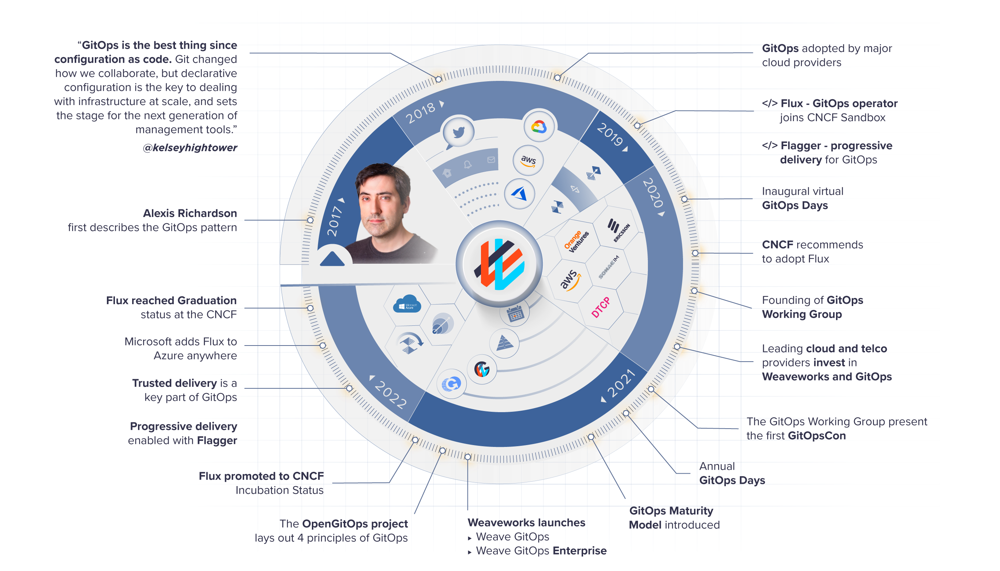

Термін «GitOps» ввів Алексіс Річардсон, генеральний директор `Weaveworks`, у своєму блозі в 2017 році. У дописі описувався новий підхід до управління інфраструктурою з використанням Git'у як джерела істини та автоматизованого розгортання. У 2017 році команда інженерів [Weaveworks](https://github.com/weaveworks/awesome-gitops) представила концепцію GitOps як спосіб управління інфраструктурою Kubernetes. В основі GitOps лежить ідея, що всі процеси конфігурації та розгортання повинні управлятися через Git, а репозиторій Git слугує єдиним джерелом істини для всієї системи.

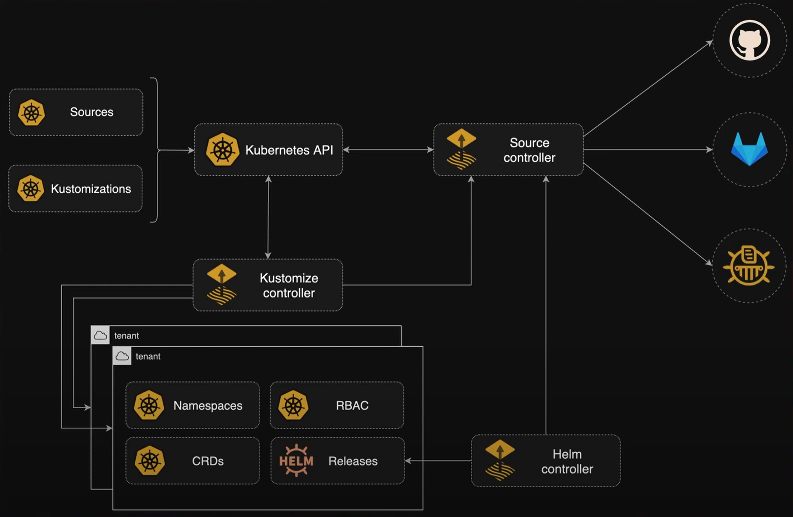 

**Підхід GitOps базується на кількох ключових принципах:**
- `Декларативна інфраструктура:` вся інфраструктура та конфігурація додатків визначається декларативно, за допомогою YAML-файлів або інших машинозчитуваних форматів.
- `Git як джерело істини:` всі зміни в інфраструктурі та додатках вносяться через Git, а репозиторій Git слугує єдиним джерелом істини для системи.
- Зміни в системі `автоматично розгортаються на основі змін, внесених до Git-репозиторію`.  
- Система забезпечує `зворотній зв'язок у реальному часі` та видимість стану інфраструктури та додатків, що дозволяє швидше знаходити та вирішувати проблеми.


GitOps базується на принципах `інфраструктури як коду` та `декларативного управління` конфігурацією. Він розвиває ці концепції, використовуючи Git як центральний інструмент для управління інфраструктурою та додатками, а також підкреслюючи важливість автоматизації та моніторингу.

Підхід GitOps був прийнятий багатьма організаціями, включаючи великі корпорації та хмарні провайдери. Адаптація надала значні переваги використання GitOps, такі як підвищення ефективності, скорочення часу простою та краща співпраця між командами.

З часом GitOps еволюціонував, включивши в себе нові технології та найкращі практики. Наприклад, деякі організації використовують GitOps з операторами Kubernetes, які є програмними розширеннями, що автоматизують завдання, пов'язані з управлінням додатками Kubernetes.   

GitOps виступає за In Cluster Pull модель, коли управління інфраструктурою та застосунком виконується зсередини кластеру, відстежуючи зміни в репозиторії контролю версії, спеціально написаним для цього оператором з ексклюзивним доступом   

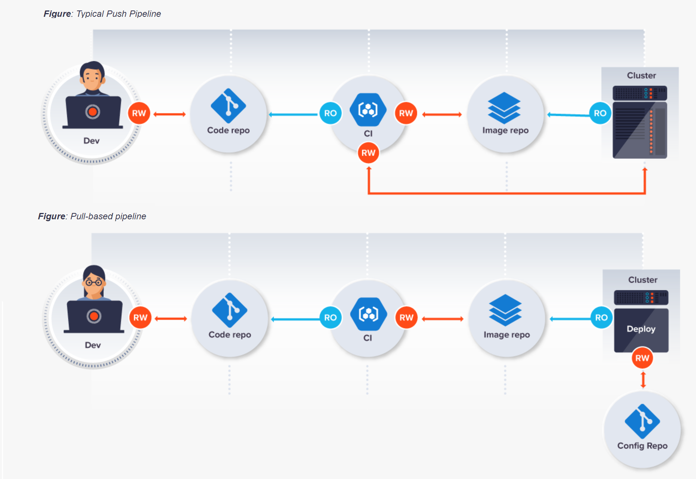 

Pipeline CI системи не повинні виконувати зміни на ІС. `CI антипатерн`- коли система запускає build та тестування після чого запускає застосунок безпосередньо на Kubernetes:  

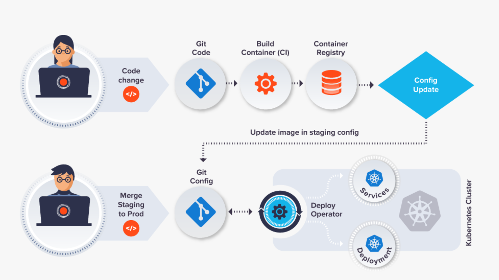  

GitOps також породив ряд супутніх інструментів і технологій, таких як Argo CD, [Flux CD](https://github.com/weaveworks/awesome-gitops), [Flagger](https://docs.flagger.app/)  і GitLab CI/CD. Ці інструменти надають додаткову функціональність для управління інфраструктурою та додатками за принципами GitOps.

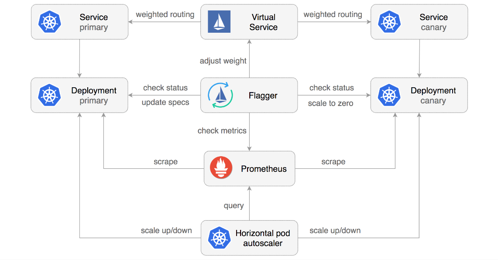 

Flagger реалізує підхід Canary Deployment на основі автоматизації тестів.

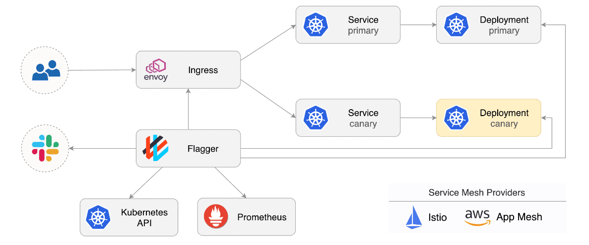  

[Awesome-GitOps](https://github.com/weaveworks/awesome-gitops) або чудовий gitops це публічний репозиторій де зібраний список інструментів, що реалізують принципи та методи GitOps:  

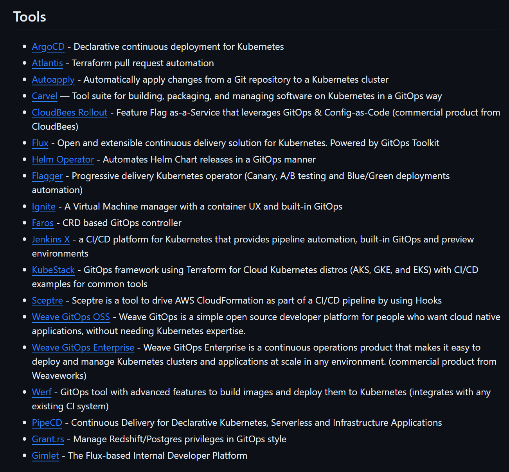 

Підхід GitOps не обмежується Kubernetes або додатками на основі контейнерів. Він може бути використаний для управління будь-яким типом інфраструктури, яка може бути визначена декларативно за допомогою коду.

В 2018 році Kelsey Hightower підтримав GitOps в Tweet-ері: "Припиняйте скриптувати та починайте доставляти":

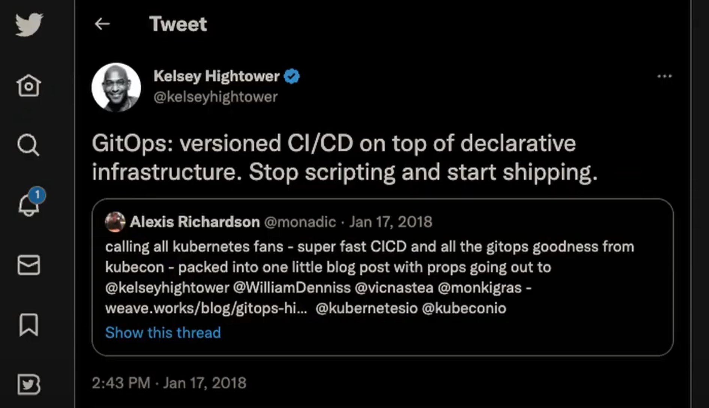  

В цьому ж році GitOps підхід адаптують в своїх проектах AWS, Google Cloud, Microsoft Azure. 

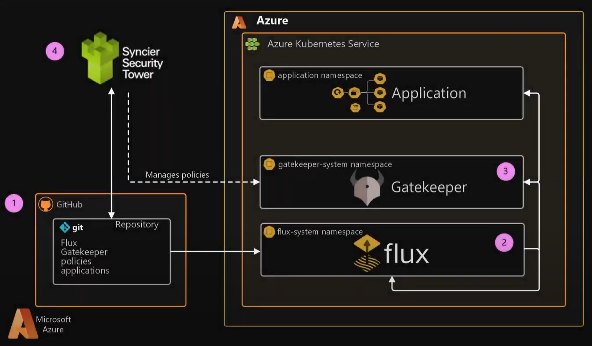 

## CI/CD — основа DevOps

Основним завданням `Pipeline` є автоматизація процесу розгортання програмного забезпечення. Pipeline може бути написаний: 
- розробниками, 
- DevOps-інженерами 
- спеціалістами з автоматизації тестування — QA.

**Під час інтерв'ю на позицію DevOps-інженера можуть запитувати** про знання процесу CI/CD, термінологію, інструменти, які використовують в Pipeline, а також про реалізацію інших DevOps-процесів, на зразок, навести приклад повного циклу CI/CD додатку від білду до запуску. У CI/CD існує багато термінів, які варто знати:
- `Continuous Integration` (постійна інтеграція), 
- `Continuous Delivery` (постійне доставляння), 
- `Continuous Deployment`(постійне розгортання)

За версією [RedHat](https://www.redhat.com/en/topics/devops/what-is-ci-cd) частина Delivery починається після автоматизації розробки, модульного та інтеграційного тестування в CI. Безперервне доставляння автоматизує випуск перевіреного коду як артефакту, а розгортання Continuous Deployment є останнім етапом CI/CD та автоматизує вихід сервісу в Production.  

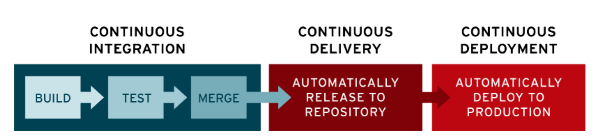

Терміни, такі як:
- Pipeline, 
- QA - тестування,
- HLD - High-Level Design, 
- збирання артефактів, 
- деплоймент

`HLD (Високорівневий дизайн)` - це етап проектування програмного забезпечення, на якому визначаються загальна архітектура та основні компоненти системи. Тут важливо при відповіді лаконічно дати визначення поняттю HLD, та вміння поєднати ці компоненти на базі свого практичного досвіду.  

Для успішної реалізації `Pipeline` важливо визначити:
- стратегію, 
- політики та правила (іменування гілок, версіювання, Reviewers, Approvers),
- середовище розробки (SCM, сховище артефактів, build-server),
- платформу,
- необхідні інструменти,

які будуть використовуватися в процесі розгортання програмного забезпечення.

`Артефакти` — це результати роботи Pipeline, такі як:
- скомпільований код, 
- скрипти конфігурації, 
- збірки, 
- контейнери, 
- набір файлів, 
- пакет з документацією тощо. 

Вони можуть бути використані для подальшого розгортання програмного забезпечення. Для зберігання артефактів поганою практикою є використання серверу розробки. Зазвичай їх зберігають в репозиторії який дозволяє зберігати велику кількість файлів та регулює до них доступ. 

`Інструменти`, що використовуються при розгортанні Pipeline:
- Jenkins, 
- GitLab CI/CD, 
- CircleCI, 
- GitHub Actions, 
- AWS CodePipeline, 
- Azure DevOps та інші.

Pipeline as a code — це підхід до розгортання, при якому всі складові Pipeline описуються в коді. Це дозволяє зберігати Pipeline в системі контролю версій та використовувати його для автоматичного розгортання програмного забезпечення.

`Перший крок` — це створення скрипту, який буде виконуватися на кожному кроці пPipeline. Скрипт повинен бути написаний у відповідному форматі та мати доступ до необхідних ресурсів. З'ясовуються конфігурація та змінні, сервісні endpoint-и, методи та інструменти тестування та логування. Всі конфігураційні параметри додатку мають бути винесені в змінні та мати значення за замовчуванням. 

`Другий крок` — це створення конфігураційного файлу, який містить опис всіх кроків Pipeline. Цей файл повинен бути збережений в системі контролю версій та відповідати встановленим  правилам кодування. Тут в репозиторії мають бути вже готовими Makefile, Dockerfile, Helm
`Третій крок` — це тестування Pipeline на відповідність вимогам та налагодження його роботи. Тут ми створюємо автоматизацію, за якою Pipeline можна використовувати для автоматичного розгортання програмного забезпечення.

`SoW` — це документ, який містить опис обсягу робіт, які потрібно виконати для реалізації проєкту. У контексті CI/CD SoW може містити опис процесу розгортання програмного забезпечення та вимог до Pipeline.

## Coding Session. GitHub Actions

`GitHub Actions` — це інструмент для автоматизації робочих процесів у репозиторії GitHub. 

`Events` — це певна активність, що запускає Pipeline. Events виникають після запуску певних дій: push, pull request, issue, release. Також можна запускати Workflow через REST інтерфейс або вручну.  

`Workflow` — це сукупність дій, які виконуються при спрацюванні певної події. Workflow може містити один або кілька Job-ів. Виконується на свіжій щойно наданій ВМ, або в контейнері.  

`Runner` — це сервер, який виконує Workflow. Кожен Runner одночасно може виконувати тільки одне завдання.  

`Jobs` — завдання — це окреме завдання, яке виконується в середовищі виконання (runner). У Job можуть бути виконані один або кілька кроків (Steps). Jobs можуть бути визначені за допомогою YAML-файлів і можуть виконувати такі завдання як створення і тестування коду, розгортання додатків і надсилання сповіщень. У маркетплейсі GitHub доступно багато готових дій, або ви можете створити власні кастомні дії.  

`Steps` — це або скрипти (Scripts) або дії (Actions). Вони виконуються в певному порядку та залежать один від одного.   

`Actions` — це готові модулі, які можна використовувати в Job-ах. Кожна Action містить набір Steps, які виконують певні дії.

`GitHub Actions в якості Runner-а` надає широкий вибір попередньо визначених середовищ, включаючи віртуальні машини Linux, MacOS і Windows, а також контейнери. Якщо потрібне власне середовище, то можна запустити Self-hosted runners та підключити його Pipeline.   
`Self-hosted runners` — це середовища, які дозволяють запускати робочі процеси на власній інфраструктурі, що може бути корисно для запуску робочих процесів, які вимагають доступу до приватних ресурсів або не можуть бути запущені у віртуальному середовищі.

Загальна схема роботи GitHub Actions: визначення події, запуск Workflow, виконання Job-ів, виконання Steps, встановлення залежностей, вивід результатів або утворення Artifact-у:  

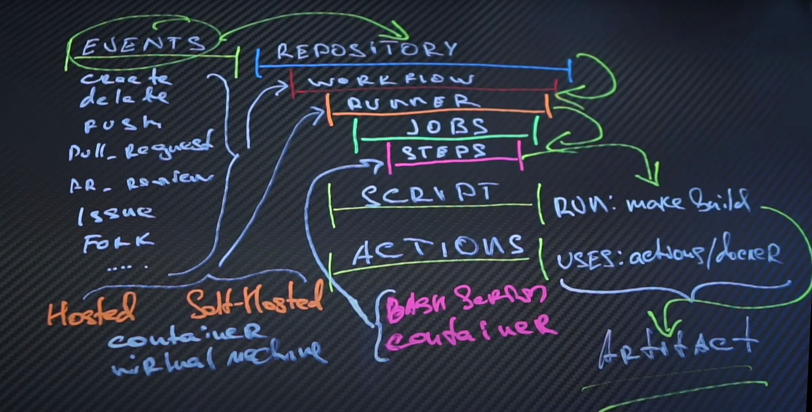  


Робочий процес GitHub Actions описується в каталозі `.github` в корні репозиторію, в якій розташуємо каталог `workflows`, де створимо `cicd.yaml` з кодом Pipeline. Зазвичай у кожного action є окремий репозиторій версії та [документація](https://github.com/actions/checkout#checkout-v4)

```yaml
# Перша секція в файлі не обов'язкова та описує назву  Pipeline:
name: KBOT-CICD

# Визначимо подію, яка запустить виконання workflow процесу.
on: push
# блок задач який налаштовано на запуск завдання на новій ВМ з останньою версією ubuntu
jobs:
  ci:
    name: CI
    runs-on: ubuntu-latest
# перший крок задачі дозволить запускати на ранері репозиторій із скриптами для виконання дії. 
    steps:
      - name: Checkout
        uses: actions/checkout@v3
# наступним кроком запустимо команду make test, зробимо коміт та подивимось як це працює
      - name: Run test
        run: make test

```
Зайдемо на [github.com](https://github.com/vit-um/kbot/actions) в розділ Actions де знайдемо наш файл `workflow` та журнал подій по кожному кроку.

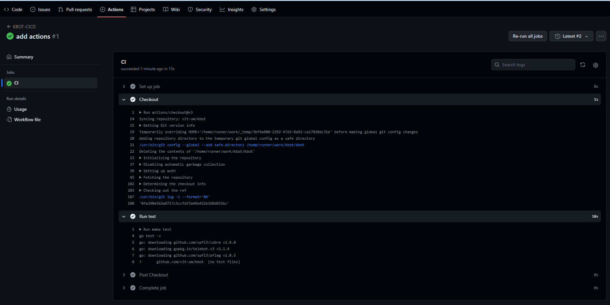 

Для ускладнення виконання завдань нам потрібна буде авторизація на Docker hub за нашими контейнерами. Для цього скористуємось [документацією](https://github.com/docker/login-action#docker-hub) для опису параметрів.  
```yaml
      - name: Login to Docker Hub
        uses: docker/login-action@v3
        with:
          username: ${{ vars.DOCKERHUB_USERNAME }}
          password: ${{ secrets.DOCKERHUB_TOKEN }}
```
З паролями працюємо через спеціальний механізм зберігання секретних даних гітхабу [Actions secrets and variables](https://github.com/vit-um/devops/settings/secrets/actions), де додамо дві змінних описаних вище:

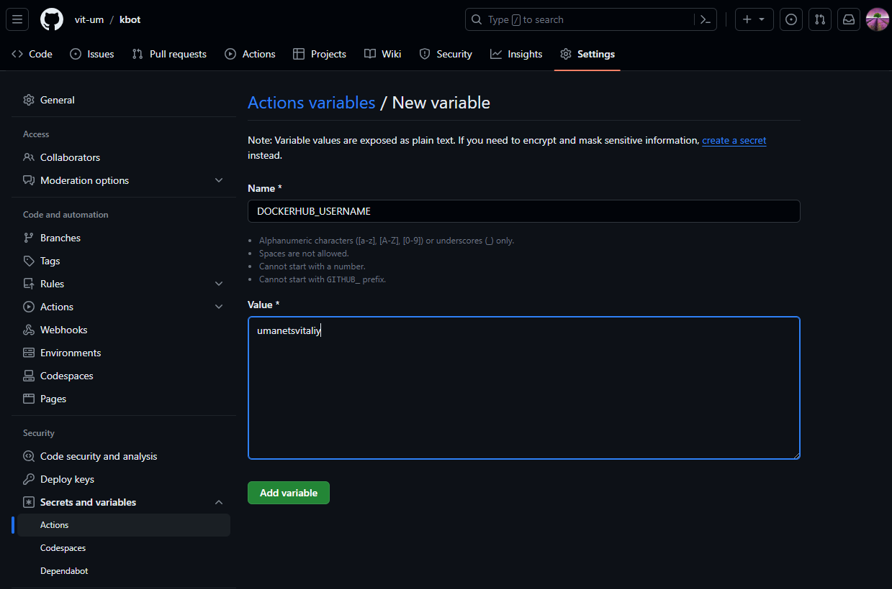 

Токен потрібно згенерувати на сторінці [акаунта Docker Hub](https://hub.docker.com/settings/security) 

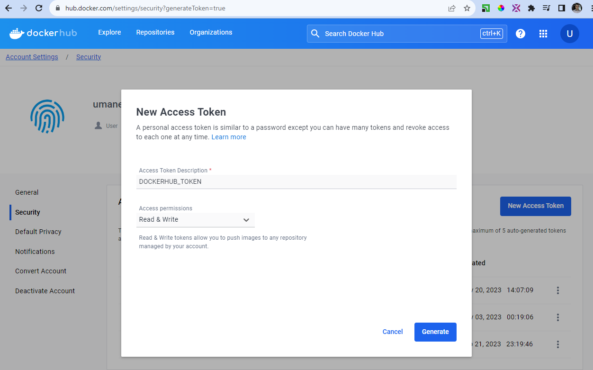  

Далі йде крок збірки та пушу іміджу контейнеру. Тут треба ми використовуємо змінну середовища та повернемось до першого кроку, щоб вказати функцію `fetch-depth:0` з якою нам потрібно виконати `actions/checkout@v3` щоб витягнути з гітхабу не один коміт за замовчуванням, а всю історію гілок та тегів, бо ми на їх базі будемо збирати образ. На цьому кроці важливо щоб в налаштуваннях VSCode була дозволена функція передачі тегів: `Ctr+,` `followta`

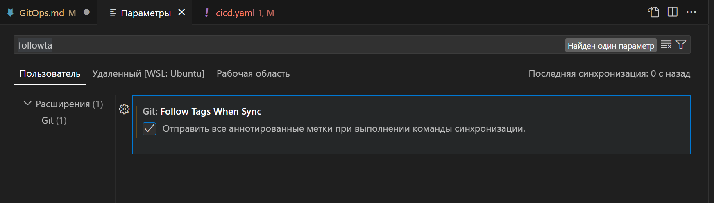 
```yaml

    steps:
      - name: Checkout
        uses: actions/checkout@v3
        with:
          fetch-depth: 0
# .......
     - name: Build&Push
        env:
          APP: "kbot"
          REGISTRY: ${{ vars.DOCKERHUB_USERNAME }}
        run: make image push
```
Додамо задачу безперервного розгортання. Ця задачу назвемо CD, перший крок буде відрізнятись від CI спеціальним налаштуванням - це призначення змінної `version` на базі значень тегу та короткого хешу коміту. Далі цю змінну передамо в спеціальне середовище зберігання змінних: `$GITHUB_ENV`. Це дозволить нам користуватись значенням цієї змінної на подальших кроках 
```yaml
  cd:
    name: CD
    runs-on: ubuntu-latest

    steps:
    - uses: actions/checkout@v3
      with:
        fetch-depth: 0 
    - run: echo "VERSION=$(git describe --tags --abbrev=0)-$(git rev-parse --short HEAD)" >> $GITHUB_ENV
```
Наступним кроком змінимо значення `tag` у файлі `helm/values.yaml` на нове, що відповідає образу контейнера, що ми запушили у попередньому джобі CI. Для цього використаємо дію, тоб-то скористаємось [бібліотекою для зміни файлів у форматі yaml](https://github.com/mikefarah/yq#yq).

```yaml
    - uses: mikefarah/yq@master
      with:
        cmd: yq -i '.image.tag=strenv(VERSION)' helm/values.yaml
```
Останнім кроком буде налаштування глобальних параметрів git на спеціальні значення `github-actions`, та команда коміта з повідомленням і заливка до репозиторію
```yaml
    - run: |
        git config user.name github-actions
        git config user.email github-actions@github.com
```
Важливим моментом є вказання залежності виконання jobs. Опцією `needs: ci` ми дозволяємо виконувати задачу CD тільки в разі успішного виконання CI.

Після успішного виконання workflow на віддаленому репозиторії відбудуться зміни версії, що можуть стати тригером для подальшої обробки коду будь яким інструментом GitOps, наприклад ArgoCD або [Flux](https://github.com/weaveworks/awesome-gitops) для етапу Deployment.  

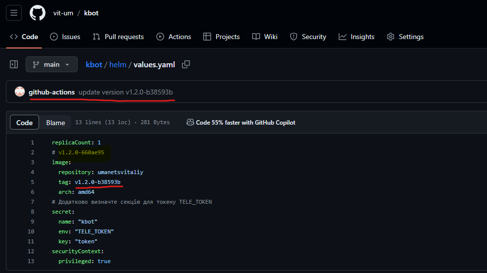

Робочий процес GitHub Actions можна розбити на кілька кроків:
1. Визначте подію, яка запустить виконання workflow процесу. Це може бути push до репозиторію, pull request, коментар до задачі або інші події.  
2. Визначте workflow у файлі YAML, включаючи завдання та кроки, які будуть виконані.
3. Коли подія спрацює, GitHub створить workflow та почне виконувати визначені завдання.  
4. Кожне завдання буде виконуватись на окремому виконавці, який є віртуальною машиною, що виконує кроки завдання.
5. Кожен крок завдання буде виконуватись послідовно або паралельно, залежно від того, як визначений workflow (pipeline).
6. Для виконання конкретних завдань у кроках можуть використовуватись дії (actions), такі як збірка та тестування коду, розгортання додатків або відправлення повідомлень (notifications)  
7. Кроки також можуть містити команди shell, які можуть використовуватись для виконання власних скриптів або виконання інших завдань.
8. Після виконання всіх кроків job, завдання буде помічено як успішне або невдале, залежно від результату.
9. Якщо в pipeline визначені декілька завдань, вони можуть виконуватись паралельно або послідовно.
10. Ви можете переглянути статус виконання workflow в інтерфейсі GitHub та отримувати повідомлення про помилки завдання.


Практичний приклад Workflow: CI/CD для Docker-контейнера. Workflow складається з двох Job-ів: CI та CD:
1. У CI Job виконуються дії для перевірки коду та збірки Docker-контейнера. 
    - У Steps встановлюються залежності, виконується перевірка коду та збірка контейнера. 
    - Першим кроком у CD Job є логін в Docker. Для цього використовується Action, яка надає доступ до Docker Hub.
    - У наступному Step відбувається збірка та пуш Docker-контейнера до Docker Hub.
2. У CD Job виконується дія для розгортання контейнера на хмарному сервісі. У Steps встановлюються залежності, виконується розгортання на сервісі.  
3. Після успішного розгортання контейнера можна виконати тригери для запуску Deploy системи, яка автоматично розгортатиме оновлений контейнер.


## Jenkins — мультитул для DevOps

`Jenkins` є однією з найпопулярніших систем автоматизації розробки програмного забезпечення. Вона збільшує ефективність та швидкість розробки та забезпечує:
- автоматизацію процесу збирання, 
- тестування та розгортання програмного забезпечення.

**Функції Jenkins для автоматизації цих же завдань:**
- конвеєри, 
- завдання,
- агенти.

Jenkins можна *інтегрувати* з широким спектром інструментів і технологій, включаючи GitOps —
методологією, що базується на Git. Це дозволяє автоматизувати процеси розгортання та управління інфраструктурою, що є важливим для ефективної розробки та доставляння програмного забезпечення.

Jenkins також надає можливість *запускати скрипти* на основі різноманітних подій, наприклад, зміни в репозиторії чи запуск розкладу. 

Для цього можна використовувати `Jenkins Pipeline` — скрипт, що виконує різноманітні завдання в Jenkins. 

Існують два типи Pipeline: `Declarative та Scripted`, які дозволяють визначити послідовність команд,
що повинні бути виконані. Завдання описуються мовою на основі `groovy`, а конфігурація як код схожа на маніфести yaml

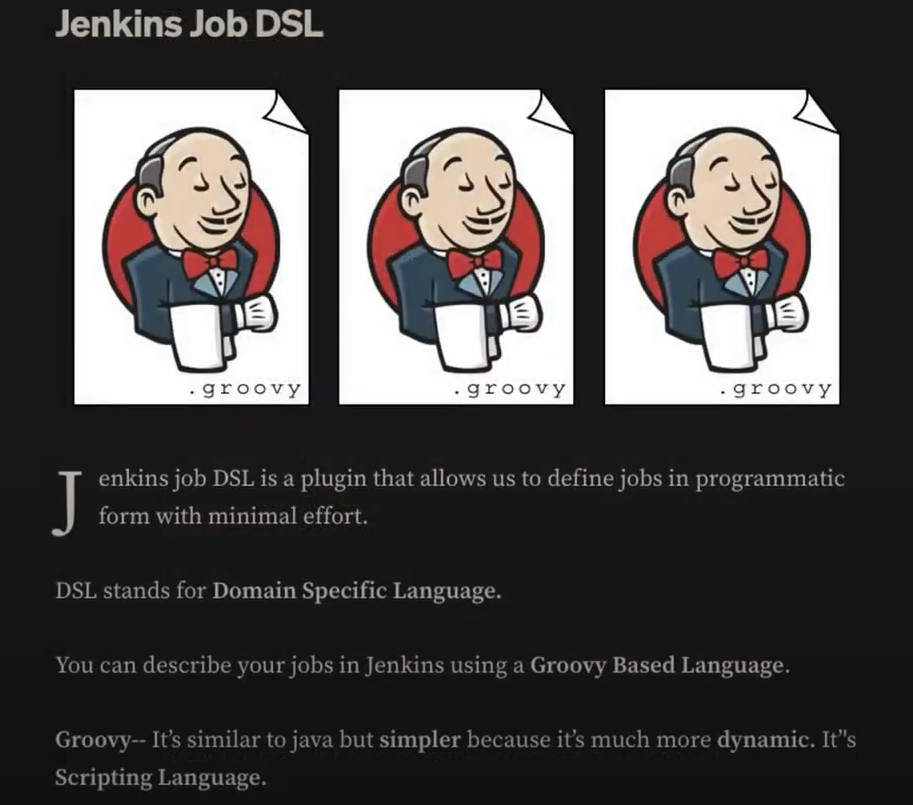 

`Jenkins Job` — це завдання, яке можна виконати в Jenkins. В ньому можна визначити команди, що повинні бути виконані та їх послідовність. Маємо три основні типи формату Job:
- jenk_type_job (універсальна задача)
- Pipeline (workflow - найчастіший варіант)
- Multibranch Pipeline (це коли один шаблон Pipeline може виконуватись для різних гілок репозиторію)

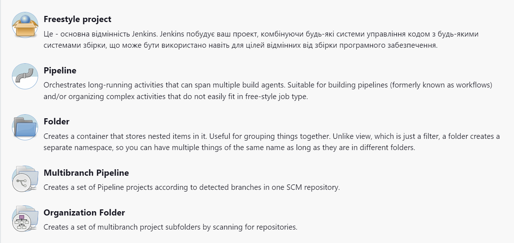  


Для виконання `команд в Job` можна використовувати `агентів Jenkins` — вузлів, на яких можуть виконуватись команди. 

Існують різні види агентів, включаючи агентів на основі Docker та Codespaces, які забезпечують більш гнучкий підхід до автоматизації процесу розробки програмного забезпечення.

`Параметризована збірка` — це Job, який може приймати параметри від користувача та виконувати команди з використанням цих параметрів.

`Jenkins плагіни` — це розширення, які дозволяють додати нові можливості. Для управління плагінами в Jenkins існує процес встановлення, оновлення та видалення плагінів. Плагіни можна встановлювати з центрального репозиторію плагінів або з локальних репозиторіїв, що дозволяє забезпечити більш
гнучкий підхід до налаштування Jenkins. 

`Jenkins і GitOps` — це два інструменти, які часто використовуються разом при розробці програмного забезпечення, але вони мають різні цілі та функції.

`GitOps` — це методологія управління інфраструктурою за допомогою Git. В її основі лежить ідея, що вся інфраструктура повинна бути версифікована в Git'і, включаючи конфігураційні файли, скрипти та інші
ресурси. Робочий процес GitOps передбачає внесення змін до інфраструктури шляхом внесення змін до Git, а потім використання інструментів автоматизації для застосування цих змін до інфраструктури.

`Jenkins` можна використовувати для автоматизації створення, тестування та розгортання програмного забезпечення, а GitOps - для управління інфраструктурою, на якій розгортається програмне забезпечення.
Використовуючи Jenkins та GitOps разом, розробники можуть створити високоавтоматизований та ефективний робочий процес розробки програмного забезпечення.

1. Встановлення Jenkins
Зазвичай під Jenkins виділяють окремий сервер з java машиною, або запускають в контейнері. Нашим варіантом встановлення буде встановлення helm пакету на Kubernetes:
```sh
$ helm repo add jenkins https://charts.jenkins.io
"jenkins" has been added to your repositories

$ helm repo update

$ helm install jenkins jenkins/jenkins
NAME: jenkins
LAST DEPLOYED: Sun Dec 10 17:43:58 2023
NAMESPACE: default
STATUS: deployed
REVISION: 1
NOTES:
1. Get your 'admin' user password by running:
  kubectl exec --namespace default -it svc/jenkins -c jenkins -- /bin/cat /run/secrets/additional/chart-admin-password && echo
2. Get the Jenkins URL to visit by running these commands in the same shell:
  echo http://127.0.0.1:8080
  kubectl --namespace default port-forward svc/jenkins 8080:8080

3. Login with the password from step 1 and the username: admin
4. Configure security realm and authorization strategy
5. Use Jenkins Configuration as Code by specifying configScripts in your values.yaml file, see documentation: http://127.0.0.1:8080/configuration-as-code and examples: https://github.com/jenkinsci/configuration-as-code-plugin/tree/master/demos

For more information on running Jenkins on Kubernetes, visit:
https://cloud.google.com/solutions/jenkins-on-container-engine

For more information about Jenkins Configuration as Code, visit:
https://jenkins.io/projects/jcasc/
```
2. Це буде StateFullSet та MultiContainerPod, який місить в собі контейнери: jenkins, config-reload, config-reload-init для налаштування конфігурації   

```sh
$ k get po
NAME        READY   STATUS    RESTARTS   AGE
jenkins-0   2/2     Running   0          2m42s

$ k logs jenkins-0 
Defaulted container "jenkins" out of: jenkins, config-reload, config-reload-init (init), init (init)
Running from: /usr/share/jenkins/jenkins.war
```

3. Отримаємо пароль та переадресацію портів:
```sh
$ kubectl exec --namespace default -it svc/jenkins -c jenkins -- /bin/cat /run/secrets/additional/chart-admin-password && echo
IqDYh0bWV2dgxaEcAYMWvH
```

4. Розглянемо приклад універсальної джоби (jenk_type_job). Де за необхідністю визначається джерело коду, налаштовуємо тригери, Build Environment та зробимо один Build Steps, що запусте команду в оболонці (Execute shell):
```sh
echo "Job 1"
```
- Збережемо та запустимо Job1 кнопкою "Build Now"
- Нижче виконання джоби відображається в реальному часі.
- В основному меню, внизу "Статус виконавців побудов" встановимо шестернею кількість виконавців "1". Лейби використовуються щоб визначити на якому саме агенті запускати джоби. 

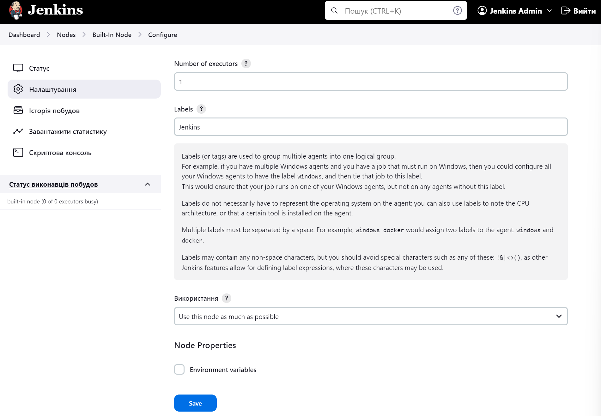  

- Перейдемо до меню першого білду, він буде зеленого кольору со статусом завершено успішно, та матиме наступний консольний вивід:

```
Started by user Jenkins Admin
Running as SYSTEM
Agent default-vmd2s is provisioned from template default
---
apiVersion: "v1"
kind: "Pod"

Building remotely on default-vmd2s (jenkins-jenkins-agent) in workspace /home/jenkins/agent/workspace/Job1
[Job1] $ /bin/sh -xe /tmp/jenkins3317144917135290953.sh
+ echo Job 1
Job 1
Finished: SUCCESS
```

5. Зробимо Job 2 з використанням git-репозиторію як джерела коду.  
- Вкажемо адресу https://github.com/vit-um/kbot та в тому ж вікні змінимо гілку на `develop`

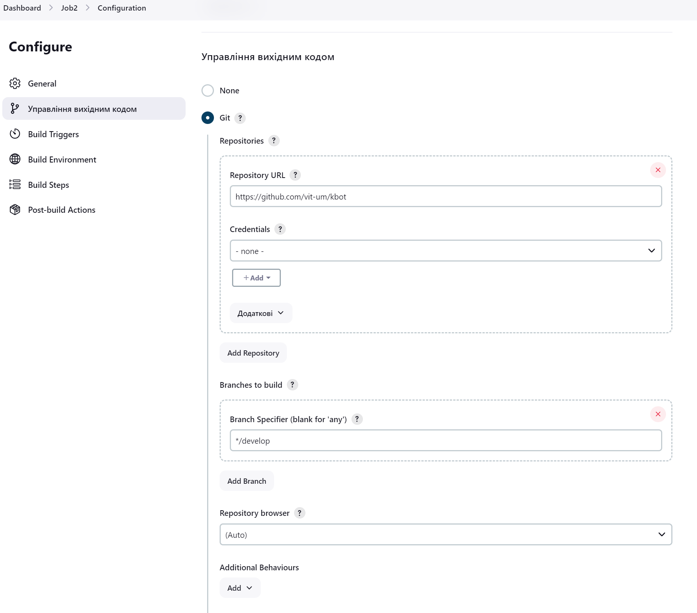 

- Збережемо, запустимо та проаналізуємо код виконання:  
```
Started by user Jenkins Admin
Running as SYSTEM
Building in workspace /var/jenkins_home/workspace/Job2
The recommended git tool is: NONE
No credentials specified
Cloning the remote Git repository
Cloning repository https://github.com/vit-um/kbot
 > git init /var/jenkins_home/workspace/Job2 # timeout=10
Fetching upstream changes from https://github.com/vit-um/kbot
 > git --version # timeout=10
 > git --version # 'git version 2.39.2'
 > git fetch --tags --force --progress -- https://github.com/vit-um/kbot +refs/heads/*:refs/remotes/origin/* # timeout=10
 > git config remote.origin.url https://github.com/vit-um/kbot # timeout=10
 > git config --add remote.origin.fetch +refs/heads/*:refs/remotes/origin/* # timeout=10
Avoid second fetch
 > git rev-parse refs/remotes/origin/develop^{commit} # timeout=10
Checking out Revision 80e32f1c3ad1df876276ed1712b936b2c5639ea9 (refs/remotes/origin/develop)
 > git config core.sparsecheckout # timeout=10
 > git checkout -f 80e32f1c3ad1df876276ed1712b936b2c5639ea9 # timeout=10
Commit message: "update version v1.3.0-c9bf7ee"
First time build. Skipping changelog.
Finished: SUCCESS
``` 
6. Комплексний підхід забезпечує Pipeline
- Зробимо Job3 цього типу.
- В інтерфейсі з'явився блок Pipeline з опцією визначення коду прямо в джобі, або з окремого репозиторію:

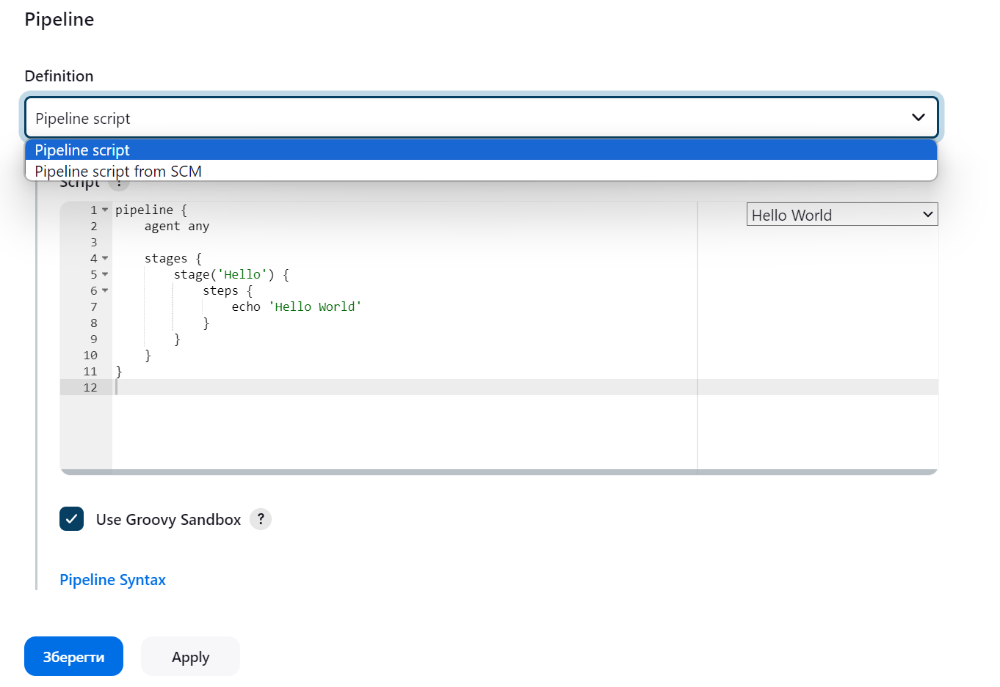 
- структура файлу досить проста, див в коді вище 
- створимо простий Pipeline для репозиторію kbot. Зауважте, що який саме репозиторій використовувати ми вказуємо не в налаштуванні джоби, а саме у pipeline.

```groovy
pipeline {
    agent any

    environment {
        REPO = 'https://github.com/vit-um/kbot'
        BRANCH = 'main'
    }

    stages {

        stage('clone') {
            steps {
                echo 'Clone Repository'
                git branch: "${BRANCH}", url: "${REPO}"
            }
        }

        stage('test') {
            steps {
                echo 'Testing started'
                sh "make test"
            }
        }

        stage('build') {
            steps {
                echo "Building binary started"
                sh "make build"
            }
        }

        stage('image') {
            steps {
                echo "Building image started"
                sh "make image"
            }
        }

        stage('login to GHCR') {
            steps {
                sh "echo $GITHUB_TOKEN_PSW | docker login ghcr.io -u $GITHUB_TOKEN_USR --password-stdin"
            }
        }
        
        stage('push image') {
            steps {
              sh "make push"
            }
        } 
    }
}
```
- після запуску бачимо помилку в логах, яка означає, що в нашому агенті не встановлені потрібні команди. 
```
+ make test
/home/jenkins/agent/workspace/Job3@tmp/durable-22f28cde/script.sh: 1: make: not found
```
- підключимо наш codespace-сервер в якості агента на якому встановлені всі потрібні команди для виконання job3. Для чого переходимо за шляхом `Dashboard`->`Nodes`->`New node`

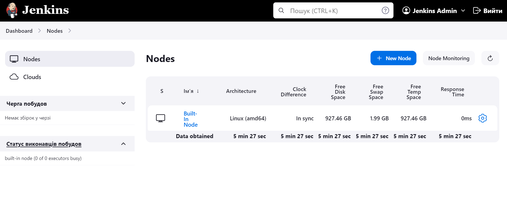  
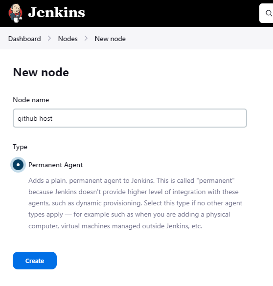
- Далі нам потрібно буде обрати метод підключення агенту через SSH сервер, але такого пункту немає. Потрібно встановити плагін `SSH Build Agents`. 
- Знайдемо потрібну адресу вузла на якому запущено контейнер:
```sh
$ ip a
2: eth0: <BROADCAST,MULTICAST,UP,LOWER_UP> mtu 1500 qdisc mq state UP group default qlen 1000
    link/ether 00:0d:3a:2e:47:18 brd ff:ff:ff:ff:ff:ff
    inet 172.16.5.4/24 metric 100 brd 172.16.5.255 scope global eth0
       valid_lft forever preferred_lft forever
    inet6 fe80::20d:3aff:fe2e:4718/64 scope link 
       valid_lft forever preferred_lft forever

$ ssh 172.16.5.4
ssh: connect to host 172.16.5.4 port 22: Connection refused

# перевіримо налаштування сервера sshd_config
$ cat /etc/ssh/sshd_config
Include /etc/ssh/sshd_config.d/*.conf

Port 2222

$ ssh 172.16.5.4 -p 2222
ssh 172.16.5.4 -p 2222
The authenticity of host '[172.16.5.4]:2222 ([172.16.5.4]:2222)' can't be established.
```  
- Згенеруємо ключі доступу
```sh
$ ssh-keygen
$ cat ~/.ssh/id_rsa.pub
```
- Публічний ключ додамо до файлу authorized_keys та перевіримо доступ:
```sh
$ cat >>~/.ssh/authorized_keys
$ ssh 172.16.5.4 -p 2222
Welcome to Ubuntu 20.04.6 LTS (GNU/Linux 6.2.0-1016-azure x86_64)
```
- Додамо отримані параметри до Jenkins. Нам потрібні будуть IP, порт та приватний ключ.
```sh
$ cat ~/.ssh/id_rsa
```
- У  Jenkins є своя система зберігання чутливої інформації. На етапі push ми використаємо нотацію докер плагіну та посилання на вбудований secret storage Jenkins-у.  Додамо її: Credentials +ADD

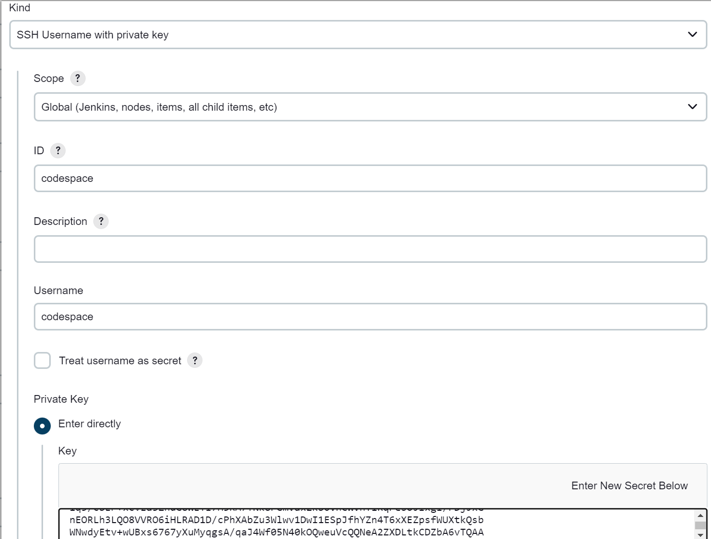 

- Виключимо вбудований сервер задавши параметр Number of executors = 0  
- Запустимо ще раз джобу та побачимо в логах помилку:`‘github host’ is offline`. 
- Перевіримо статус хоста, найчастіша помилка в логах: "SSH Connection failed with IOException"
- Здогадуємось що проблема в опції `Host Key Verification Strategy` та виключаємо її бо хосту є довіра.  
- Запустимо знову задачу та отримаємо в логах якусь дивну помилку:
```
Also:   org.jenkinsci.plugins.workflow.actions.ErrorAction$ErrorId: 13e9dac5-d796-4630-b91b-63575bd8e7cb
Finished: FAILURE
```
- Припустимо що це проблема отримання credentials до DockerHub та підемо за шляхом `Dashboard` ->` Manage Jenkins` -> `Credentials System` -> `Global credentials (unrestricted)` де додамо до system storage верхньої таблиці запис доступний для всіх джобів. 

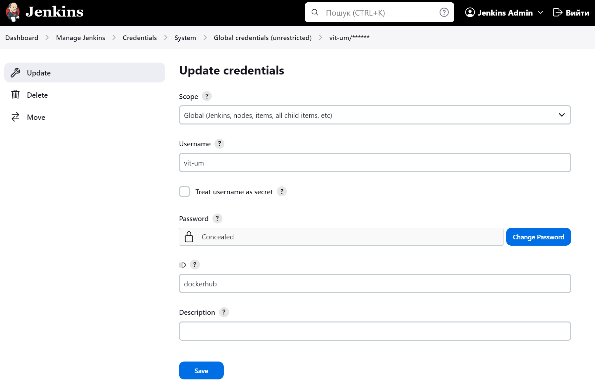  

- Перезапустимо задачу.

7. Встановлення плагінів, тут все інтуітивно зрозуміло:

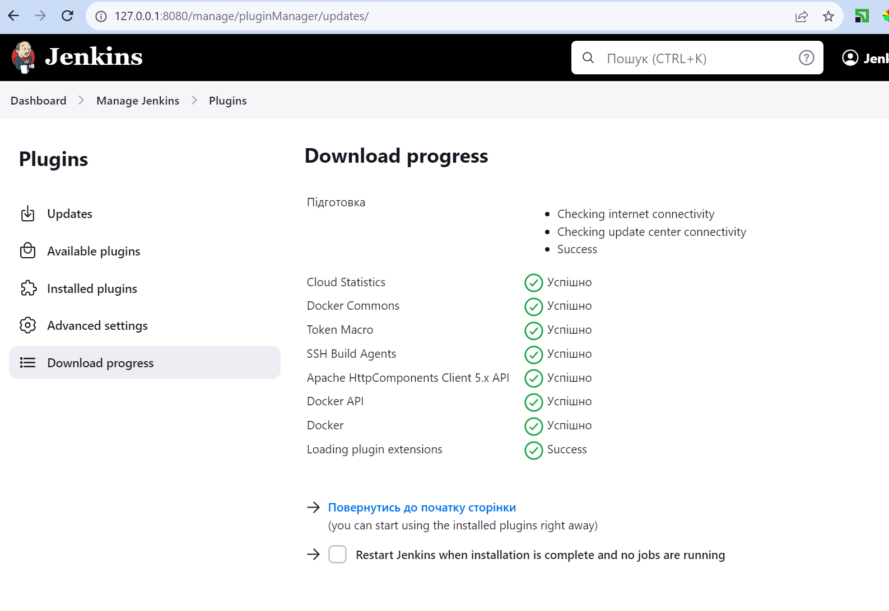   

### Контрольні запитання
- Як краще візуалізувати CI/CD пайплайни у Jenkins? 

Кращим способом візуалізації CI/CD пайплайнів у Jenkins є використання плагіна BlueOcean. BlueOcean надає сучасний та інтуїтивно зрозумілий інтерфейс для візуалізації та керування пайплайнами. 
 
Щоб використовувати BlueOcean, вам потрібно встановити та активувати цей плагін у вашому Jenkins. 
 
Після активації плагіна BlueOcean, ви зможете переглядати свої CI/CD пайплайни у вигляді графіків та діаграм, що допомагає вам легко спостерігати за процесом виконання, виявляти проблеми та аналізувати результати. 

- Яка роль агента Jenkins у розподіленому середовищі збірки?

Агент Jenkins - це програма, яка працює на окремому комп'ютері та виконує завдання збірки, призначені для нього майстром Jenkins. Це дозволяє розподілити навантаження на кілька комп'ютерів, що може значно підвищити продуктивність збірки. 

Агенти Jenkins є вузлами, на яких виконуються фактичні кроки збірки, такі як клонування репозиторію, компіляція коду, запуск тестів тощо. 
 
Розподілення завдань збірки на агентів дозволяє розподілити навантаження та прискорити процес збирання, особливо у випадку великих та складних проектів. Крім того, агенти можуть бути розташовані на різних фізичних або віртуальних машинах, що дозволяє розгортати збірку на різних платформах або середовищах. 

- Як у GitOps зазвичай застосовуються зміни до бажаного стану?  

У GitOps зміни до бажаного стану зазвичай застосовуються шляхом надіслання pull-request до Git-репозиторію, який містить оновлення для конфігурації системи. Цей pull-request потім рецензується та приймається, після чого інструмент GitOps автоматично застосовує зміни до запущеної системи.

### Додаткові матеріали 

1.  Лабораторна робота [Continuous Delivery with Jenkins in Kubernetes Engine](https://www.cloudskillsboost.google/focuses/1104?parent=catalog)

- Дізнаємось назву активного акаунта та проекту:
```sh
$ gcloud auth list
Credentialed Accounts

ACTIVE: *
ACCOUNT: umanetsvitaliy@gmail.com

To set the active account, run:
    $ gcloud config set account `ACCOUNT`

$ gcloud config list project
[core]
project = vit-um

Your active configuration is: [cloudshell-32054]
```
- Копіюємо приклад проекту в локальну директорію
```sh
$ gsutil cp gs://spls/gsp051/continuous-deployment-on-kubernetes.zip .
Copying gs://spls/gsp051/continuous-deployment-on-kubernetes.zip...
- [1 files][  3.3 MiB/  3.3 MiB]                                                
Operation completed over 1 objects/3.3 MiB.
$ unzip continuous-deployment-on-kubernetes.zip
$ cd continuous-deployment-on-kubernetes
```
- Ця команда встановить зону обчислювальних ресурсів в  europe-central2 , що відповідає центральній Європі в Google Cloud. Після встановлення зони, ви можете використовувати інші команди  gcloud  для створення та керування ресурсами в цій зоні.
```sh
$ gcloud compute zones list
NAME: europe-central2-a
REGION: europe-central2
STATUS: UP

$ gcloud config set compute/zone europe-central2-a
Updated property [compute/zone].
```
- Створюємо контейнер в Kubernetes:
```sh
$ gcloud container clusters create jenkins-cd \
--num-nodes 2 \
--machine-type e2-standard-2 \
--scopes "https://www.googleapis.com/auth/source.read_write,cloud-platform"

$ gcloud container clusters list
NAME: jenkins-cd
LOCATION: europe-central2-a
MASTER_VERSION: 1.27.3-gke.100
MASTER_IP: 34.116.165.24
MACHINE_TYPE: e2-standard-2
NODE_VERSION: 1.27.3-gke.100
NUM_NODES: 2
STATUS: RUNNING
```

- Тепер отримаємо облікові дані для свого кластера:
```sh
$ gcloud container clusters get-credentials jenkins-cd
Fetching cluster endpoint and auth data.
kubeconfig entry generated for jenkins-cd.

$ kubectl cluster-info
Kubernetes control plane is running at https://34.116.165.24
GLBCDefaultBackend is running at https://34.116.165.24/api/v1/namespaces/kube-system/services/default-http-backend:http/proxy
KubeDNS is running at https://34.116.165.24/api/v1/namespaces/kube-system/services/kube-dns:dns/proxy
Metrics-server is running at https://34.116.165.24/api/v1/namespaces/kube-system/services/https:metrics-server:/proxy
```

- Встановимо Helm з додаванням repo:
```sh
$ helm repo add jenkins https://charts.jenkins.io
"jenkins" has been added to your repositories

$ helm repo update
```

- Configure and Install Jenkins. Попередня конфігурація Jenkins задана в файлі `/home/umanetsvitaliy/continuous-deployment-on-kubernetes/jenkins/values.yaml` та передбачає встановлення наступних плагінів: 

Kubernetes:latest
Workflow-multibranch:latest
Git:latest
Configuration-as-code:latest
Google-oauth-plugin:latest
Google-source-plugin:latest
Google-storage-plugin:latest

```sh
$ helm install cd jenkins/jenkins -f jenkins/values.yaml --wait
NAME: cd
LAST DEPLOYED: Mon Dec 11 14:30:01 2023
NAMESPACE: default
STATUS: deployed
REVISION: 1
NOTES:
1. Get your 'admin' user password by running:
  kubectl exec --namespace default -it svc/cd-jenkins -c jenkins -- /bin/cat /run/secrets/additional/chart-admin-password && echo
2. Get the Jenkins URL to visit by running these commands in the same shell:
  echo http://127.0.0.1:8080
  kubectl --namespace default port-forward svc/cd-jenkins 8080:8080

# Налаштуємо обліковий запис служби Jenkins, щоб мати можливість розгортати в кластері:
$ kubectl create clusterrolebinding jenkins-deploy --clusterrole=cluster-admin --serviceaccount=default:cd-jenkins
clusterrolebinding.rbac.authorization.k8s.io/jenkins-deploy created

$ kubectl get pods
NAME           READY   STATUS    RESTARTS   AGE
cd-jenkins-0   2/2     Running   0          2m46s

# Виконайте таку команду, щоб налаштувати переадресацію портів до інтерфейсу користувача Jenkins із Cloud Shell
$ export POD_NAME=$(kubectl get pods --namespace default -l "app.kubernetes.io/component=jenkins-master" -l "app.kubernetes.io/instance=cd" -o jsonpath="{.items[0].metadata.name}")
kubectl port-forward $POD_NAME 8080:8080 >> /dev/null &
[1] 6071

$ kubectl get svc
NAME               TYPE        CLUSTER-IP    EXTERNAL-IP   PORT(S)     AGE
cd-jenkins         ClusterIP   10.80.13.79   <none>        8080/TCP    34m
cd-jenkins-agent   ClusterIP   10.80.1.7     <none>        50000/TCP   34m
kubernetes         ClusterIP   10.80.0.1     <none>        443/TCP     47m

$ kubectl exec --namespace default -it svc/cd-jenkins -c jenkins -- /bin/cat /run/secrets/additional/chart-admin-password && echo
Y9G3Otemueu6JUyvRMqWZT

$ kubectl --namespace default port-forward svc/cd-jenkins 8080:8080&
[1] 4272
```

- Отримаємо доступ до інтерфейсу Jenkins
```sh
# Щоб не вводити пароль адміністратора вручну скористаємось чартом Дженкінса:
$ printf $(kubectl get secret cd-jenkins -o jsonpath="{.data.jenkins-admin-password}" | base64 --decode);echo
Y9G3Otemueu6JUyvRMqWZT
```
- Щоб перейти на localhost скористаємось наступною командою Web-консолі:
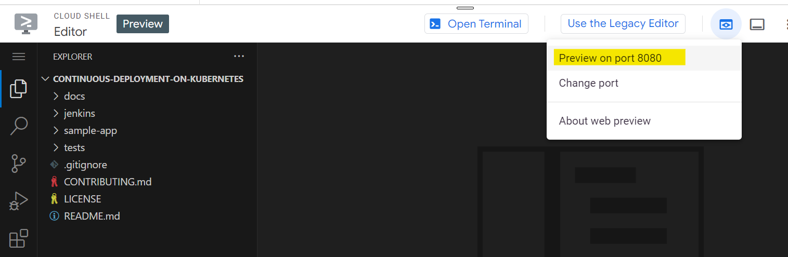  

- Розгорнемо додаток, шо має два режими роботи  
    - `backend mode:` gceme listens on port 8080 and returns,   
    - `frontend mode:` gceme queries the backend gceme service and renders the resulting JSON in the user interface  
та буде працювати у двох різних середовищах:
    - `Production:` живий сайт, до якого мають доступ ваші користувачі.  
    - `Canary:` сайт меншої ємності, який отримує лише відсоток вашого трафіку користувачів.  

Використовуйте це середовище, щоб перевірити своє програмне забезпечення за допомогою живого трафіку, перш ніж воно буде випущено для всіх ваших користувачів

```sh
$ cd sample-app

$ kubectl create ns production
namespace/production created

$ kubectl apply -f k8s/production -n production
deployment.apps/gceme-backend-production created
deployment.apps/gceme-frontend-production created

$ kubectl apply -f k8s/canary -n production
deployment.apps/gceme-backend-canary created
deployment.apps/gceme-frontend-canary created

$ kubectl apply -f k8s/services -n production
service/gceme-backend created
service/gceme-frontend created

# масштабуємо репліки 
$ kubectl scale deployment gceme-frontend-production -n production --replicas 4
deployment.apps/gceme-frontend-production scaled

# перевіримо кількість запущених подів в режимі frontend
$ kubectl get pods -n production -l app=gceme -l role=frontend
NAME                                        READY   STATUS    RESTARTS   AGE
gceme-frontend-canary-5f47969dd8-t9bgw      1/1     Running   0          10m
gceme-frontend-production-cc48bb495-55jpt   1/1     Running   0          4m13s
gceme-frontend-production-cc48bb495-87249   1/1     Running   0          4m13s
gceme-frontend-production-cc48bb495-c2knd   1/1     Running   0          4m13s
gceme-frontend-production-cc48bb495-cblft   1/1     Running   0          10m

# та в режимі backend
$ kubectl get pods -n production -l app=gceme -l role=backend
NAME                                        READY   STATUS    RESTARTS   AGE
gceme-backend-canary-6dd848bcd6-k796q       1/1     Running   0          11m
gceme-backend-production-76bb986587-c26gj   1/1     Running   0          11m

# Зовнішній IP отримаємо тільки для виробничих служб:
$ kubectl get service gceme-frontend -n production
NAME             TYPE           CLUSTER-IP   EXTERNAL-IP    PORT(S)        AGE
gceme-frontend   LoadBalancer   10.80.2.66   34.118.70.47   80:31534/TCP   15m
```
- Зайдемо в браузері по призначеній адресі та перевіримо роботу продакшн серверу

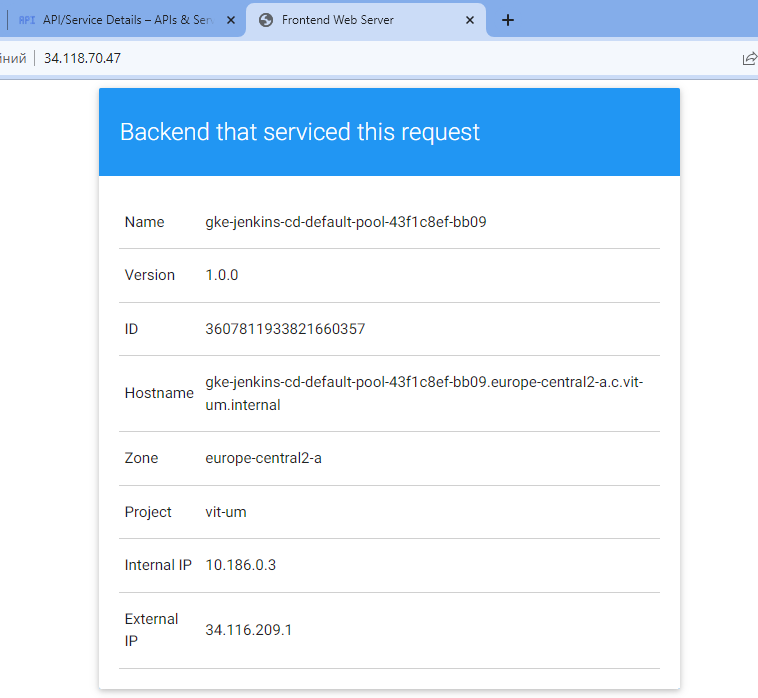  

- Збережемо IP адресу продакшн серверу в змінну середовища для подальшого використання
```sh
$ export FRONTEND_SERVICE_IP=$(kubectl get -o jsonpath="{.status.loadBalancer.ingress[0].ip}" --namespace=production services gceme-frontend)

$ curl http://$FRONTEND_SERVICE_IP/version
1.0.0
```
2. Створення конвеєра (Jenkins Pipeline)  
- Створимо репозиторій в [Cloud Source Repository](https://source.cloud.google.com/) для розміщення прикладу вихідного коду програми в 
```sh
$ gcloud source repos create default
API [sourcerepo.googleapis.com] not enabled on project [vit-um]. Would you like to enable and retry (this will take a few 
minutes)? (y/N)?  y

Enabling service [sourcerepo.googleapis.com] on project [vit-um]...
Operation "operations/acat.p2-957309904619-93bc487f-a7fe-4f24-b2a3-4470153cd11f" finished successfully.
Created [default].
WARNING: You may be billed for this repository. See https://cloud.google.com/source-repositories/docs/pricing for details.

$ git init
hint: Using 'master' as the name for the initial branch. This default branch name
hint: is subject to change. To configure the initial branch name to use in all
hint: of your new repositories, which will suppress this warning, call:
hint: 
hint:   git config --global init.defaultBranch <name>
hint: 
hint: Names commonly chosen instead of 'master' are 'main', 'trunk' and
hint: 'development'. The just-created branch can be renamed via this command:
hint: 
hint:   git branch -m <name>
Initialized empty Git repository in /home/umanetsvitaliy/continuous-deployment-on-kubernetes/sample-app/.git/
```
- Ініціалізуйте каталог прикладної програми як власне сховище Git
```sh
$ git config credential.helper gcloud.sh

$ git remote add origin https://source.developers.google.com/p/$DEVSHELL_PROJECT_ID/r/default

$ git config --global user.email "umanetsvitaliy@gmail.com"

$ git config --global user.name "Vitalii Umanets"

$ echo $DEVSHELL_PROJECT_ID
vit-um
```

- Запушимо файли нашого програмного кода в репозиторій:
```sh
$ git add .
$ git commit -m "Initial commit"
[master (root-commit) 98f33dd] Initial commit
$ git push origin master
Everything up-to-date
$ git branch 
* master
```

- Додамо облікові дані (credentials) вашого сервісного облікового запису в Jenkins UI: click `Manage Jenkins` in the left navigation then click `Security > Credentials` > `System` > `Global credentials (unrestricted)`.

- Обираємо `Google Service Account from metadata` в полі `Kind`, всі інші поля заповнювати не обов'язково, вони створяться автоматично. 

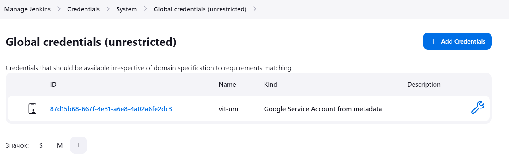  

- Налаштуйте Jenkins Cloud для Kubernetes: `Dashboard` > `Manage Jenkins` > `Clouds` > `New cloud` 

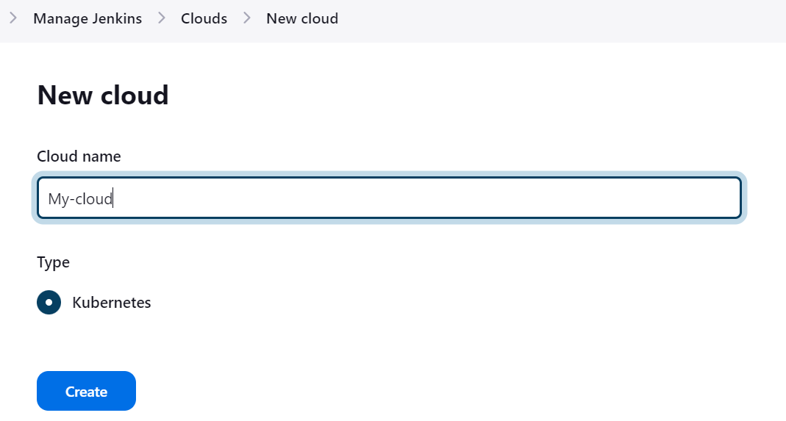

- Click Kubernetes Cloud Details та додайте:   
`http://cd-jenkins:8080`  
`cd-jenkins-agent:50000`  

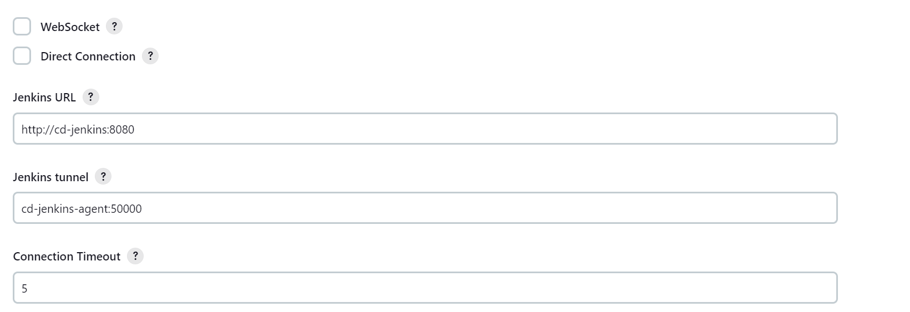 

- В інтерфейсі створимо Jenkins job з назвою `sample-app` та типом `Multibranch Pipeline`

- На наступній сторінці в розділі `Branch Sources` виберіть `Git` зі спадного меню `Add Source`. Вказати адресу `https://source.developers.google.com/p/vit-um/r/default`

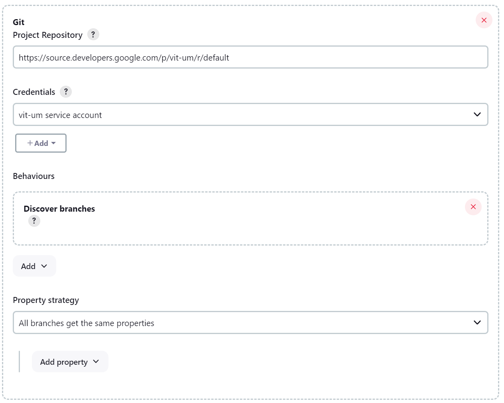  

- У розділі `Scan Multibranch Pipeline Triggers` встановіть прапорець `Periodically if not otherwise run`, і встановіть значення `Interval` на 1 хвилину.

- Після збереження джоба запуститься виконання pipeline та завершиться помилкою:

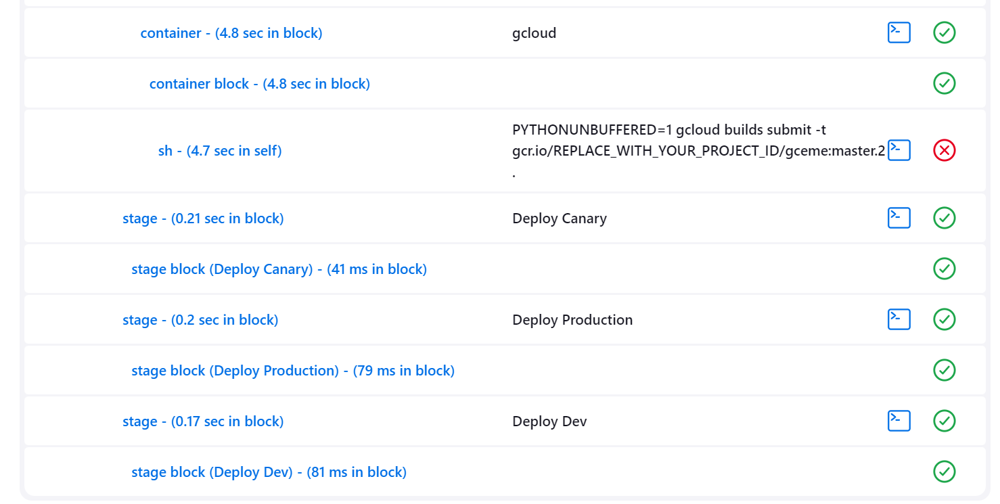  

3. Створення середовища розробки
- Development branches — це набір середовищ, які ваші розробники використовують для тестування змін коду перед тим, як надсилати їх для інтеграції в діючий сайт. Ці середовища є зменшеними версіями вашої програми, але їх потрібно розгортати за допомогою тих самих механізмів, що й живе середовище
- Створіть гілку розробки та надішліть її на сервер Git
```sh
$ git checkout -b new-feature
Switched to a new branch 'new-feature'
```
- Зміна визначень у [Pipeline](https://www.jenkins.io/doc/book/pipeline/syntax/)
- `Jenkinsfile` має знаходитись в корені репозиторію та описує весь Pipeline збірки в одному файлі, який знаходиться поряд із вашим вихідним кодом. Отже змінимо ідентифікатор проекту на якому зупинився наш Pipeline (конвеєр)

```sh
$ vi Jenkinsfile
# Замінимо значення REPLACE_WITH_YOUR_PROJECT_ID на дійсне ім'я проекту `vit-um` 
$ gcloud config get-value project
Your active configuration is: [cloudshell-1822]
vit-um
# Change the value of CLUSTER_ZONE to `europe-central2-a`
$ gcloud config get compute/zone
Your active configuration is: [cloudshell-1822]
europe-central2-a
```
- Змінимо трохи код сайту:
```sh
$ nano html.go
# Change the two instances of <div class="card blue"> with following: <div class="card orange">

$ nano main.go
# Update version to the following: const version string = "2.0.0"
```
- Запушимо зміни репозиторію до його віддаленої гілки
```sh
$ git add Jenkinsfile html.go main.go
$ git commit -m "Version 2.0.0"
[new-feature 4e713fd] Version 2.0.0
 3 files changed, 5 insertions(+), 5 deletions(-)

$ git push origin new-feature
Enumerating objects: 9, done.
Counting objects: 100% (9/9), done.
Delta compression using up to 4 threads
Compressing objects: 100% (5/5), done.
Writing objects: 100% (5/5), 485 bytes | 485.00 KiB/s, done.
Total 5 (delta 4), reused 0 (delta 0), pack-reused 0
remote: Resolving deltas: 100% (4/4)
remote: Waiting for private key checker: 3/3 objects left
To https://source.developers.google.com/p/vit-um/r/default
 * [new branch]      new-feature -> new-feature

$ kubectl proxy &
[2] 15402
```
- Create a canary branch and push it to the Git server:
```sh
git checkout -b canary
git push origin canary

export FRONTEND_SERVICE_IP=$(kubectl get -o \
jsonpath="{.status.loadBalancer.ingress[0].ip}" --namespace=production services gceme-frontend)
while true; do curl http://$FRONTEND_SERVICE_IP/version; sleep 1; done
```
- Deploying to production
Тепер, коли наш реліз Canary був успішним і ми не почули жодних скарг від клієнтів, розгорніть решту свого виробничого парку.
```sh
git checkout master
git merge canary
git push origin master
export FRONTEND_SERVICE_IP=$(kubectl get -o \
jsonpath="{.status.loadBalancer.ingress[0].ip}" --namespace=production services gceme-frontend)

while true; do curl http://$FRONTEND_SERVICE_IP/version; sleep 1; done

kubectl get service gceme-frontend -n production


```


4. [How to Push an Image to GitHub Container Registry Using Jenkins](https://www.youtube.com/watch?v=HTou7pGnS0Y)


