## Адміністрування Kubernetes

1. Групи команд kubectl
Налаштування локального оточення та доступу до кластерів - основні завдання адміністрування Kubernetes. Інструментом імперативного підходу в Kubernetes є консольна утиліта `kubectl`, що має наступні групи команд:
```bash
Basic Commands: # базові 
  create          Create a resource from a file or from stdin
  expose          Take a replication controller, service, deployment or pod and expose it as a new Kubernetes service
  run             Run a particular image on the cluster
  set             Set specific features on objects
  explain         Get documentation for a resource
  get             Display one or many resources
  edit            Edit a resource on the server
  delete          Delete resources by file names, stdin, resources and names, or by resources and label selector

Deploy Commands: # команди розгортання
  rollout         Manage the rollout of a resource
  scale           Set a new size for a deployment, replica set, or replication controller
  autoscale       Auto-scale a deployment, replica set, stateful set, or replication controller

Cluster Management Commands: # команди керування кластером
  certificate     Modify certificate resources
  cluster-info    Display cluster information
  top             Display resource (CPU/memory) usage
  cordon          Mark node as unschedulable
  uncordon        Mark node as schedulable
  drain           Drain node in preparation for maintenance
  taint           Update the taints on one or more nodes

Troubleshooting and Debugging Commands: # команди пошуку та усунення проблем 
  describe        Show details of a specific resource or group of resources
  logs            Print the logs for a container in a pod
  attach          Attach to a running container
  exec            Execute a command in a container
  port-forward    Forward one or more local ports to a pod
  proxy           Run a proxy to the Kubernetes API server
  cp              Copy files and directories to and from containers
  auth            Inspect authorization
  debug           Create debugging sessions for troubleshooting workloads and nodes
  events          List events

Advanced Commands: # розширені
  diff            Diff the live version against a would-be applied version
  apply           Apply a configuration to a resource by file name or stdin
  patch           Update fields of a resource
  replace         Replace a resource by file name or stdin
  wait            Experimental: Wait for a specific condition on one or many resources
  kustomize       Build a kustomization target from a directory or URL

Settings Commands:
  label           Update the labels on a resource
  annotate        Update the annotations on a resource
  completion      Output shell completion code for the specified shell (bash, zsh, fish, or powershell)

Other Commands:
```
Для кожної задачі існує своя група команд `kubectl` та функція автоматичного доповнення — kubectl completion. Якщо не задано іншого опцією `--kubeconfig` конфігурацію доступу до кластеру (сертифікати, адреси, паролі та токени) `kubectl` бере ось з файлу `nano ~/.kube/config`  

2. Як працює kubectl

Для відображення поточного кластеру, або швидкого перемикання між кластерами можуть стати в нагоді утиліти [kube-ps1](https://github.com/jonmosco/kube-ps1), [kubectx and kubens](https://github.com/ahmetb/kubectx) або [K9s- Kubernetes CLI To Manage Your Clusters](https://k9scli.io/).
  
`kubectl explain [node, ns, pod]` - команда для повного опису об'єкта та його специфікації

`kubectl get namespaces -v 8` - дає уявлення послідовності взаємодії команди з API-сервером.
```bash
$ k get namespaces -v 8
# починається виконання з завантаження конфігураційного файлу:
I1128 22:32:38.832167   34247 loader.go:395] Config loaded from file:  /root/.kube/config  
# далі з налаштування GET робиться запит до серверу:
I1128 22:32:38.836140   34247 round_trippers.go:463] GET https://0.0.0.0:43297/api/v1/namespaces?limit=500
# ---
I1128 22:32:38.841762   34247 round_trippers.go:580]     Content-Type: application/json
# тут ми бачимо REST-запит та відповідь серверу (json payload) в скороченому вигляді (опція -v 9 для повного виводу payload) 
I1128 22:32:38.841863   34247 request.go:1212] Response Body: {"kind":"Table","apiVersion":"meta.k8s.io/v1","metadata":{"resourceVersion":"30330"},"columnDefinitions":[{"name":"Name","type":"string","format":"name","description":"Name must be unique within a namespace. Is required when creating resources, although some resources may allow a client to request the generation of an appropriate name automatically. Name is primarily intended for creation idempotence and configuration definition. Cannot be updated. More info: https://kubernetes.io/docs/concepts/overview/working-with-objects/names#names","priority":0},{"name":"Status","type":"string","format":"","description":"The status of the namespace","priority":0},{"name":"Age","type":"string","format":"","description":"CreationTimestamp is a timestamp representing the server time when this object was created. It is not guaranteed to be set in happens-before order across separate operations. Clients may not set this value. It is represented in RFC3339 form and is in UTC.\n\nPopulated by the system. Read-only. Null for lis [truncated 3587 chars]
NAME              STATUS   AGE
kube-system       Active   3d5h
default           Active   3d5h
kube-public       Active   3d5h
kube-node-lease   Active   3d5h
argocd            Active   3d3h
```

Змоделюємо роботу команди за допомогою `curl`:
```bash
# Зробимо доступним API-сервер командою 
$ k proxy&`
[1] 37976
Starting to serve on 127.0.0.1:8001
# Отримаємо доволі об'ємний вивід тому що kubectl використовує для цього кешування та інкримінацію    
$ curl http://127.0.0.1:8001/api/v1/namespaces
{
  "kind": "NamespaceList",
  "apiVersion": "v1",
  "metadata": {
    "resourceVersion": "30774"
  },
# ---
```
Розберемо як обійти обмеження застарілої команди прямим API-запитом:
```bash
$ k get componentstatuses 
Warning: v1 ComponentStatus is deprecated in v1.19+
NAME                 STATUS    MESSAGE   ERROR
etcd-0               Healthy             
controller-manager   Healthy   ok        
scheduler            Healthy   ok        

$ k get --raw='/readyz?verbose' 
[+]ping ok
[+]log ok
[+]etcd ok
[+]etcd-readiness ok

$ curl http://127.0.0.1:8001/livez\?verbose          
[+]ping ok
[+]log ok
[+]etcd ok
[+]poststarthook/start-kube-apiserver-admission-initializer ok

```

3. Початкові namespaces  
За замовчуванням Kubernetes створює [чотири namespaces](https://kubernetes.io/docs/concepts/overview/working-with-objects/namespaces/#initial-namespaces):
```bash
$ k get ns
NAME              STATUS   AGE
kube-system       Active   3d5h
default           Active   3d5h # spam - всі об'єкти що створені без вказання простору імен опиняються тут 
kube-public       Active   3d5h # публічно доступний простір імен для завдань управління кластером 
kube-node-lease   Active   3d5h # допомагає виявити відмову вузла

# В цьому namespace всі системні ресурси створені Kubernetes
$ k get all -n kube-system
```


4. Група команд для пошуку та перегляду ресурсів [Viewing and finding resources](https://kubernetes.io/docs/reference/kubectl/cheatsheet/#viewing-and-finding-resources):


API сервер приймає REST HTTP виклики у форматі payload json. Будь-який формат взаємодії з kubectl завжди закінчиться перетворенням
команд до передавання валідного маніфесту в json на API сервер.

`kubectl get [all, ns, service]` - команда пошуку та сортування. Допоможе провести огляд кластера, його ресурсів та об'єктів. Але слід враховувати, що ця команда показує тільки активні об'єкти, що відносяться до runtime- контейнерів.  `kubectl api-resources` - команда видає повний список ресурсів, що можна отримати командою `k get`. Тут зазначені ім'я, скорочення та тип ресурсів (специфікація для маніфестів). Якщо в стовпчику 'NAMESPACED' позначено `false` то ресурс доступний з усього кластеру а не в окремому namespace.   

Вивід команди можемо отримати:
- в табличному форматі `k get ns`  
- `k get ns -o json`
- `k get ns -o yaml`
Останні два формати по суті являють собою готові маніфести (файли специфікації)  

5. Створення об'єктів    

Маніфести ми можемо редагувати, писати з нуля або створювати з шаблонів, які можна заповнювати під час розгортання. А це вже перший крок до декларативного підходу що використовує [helm](https://helm.sh/) - нативний пакетний менеджер Kubernetes. Розглянемо приклад створення маніфесту поду, що буде запускати контейнер `nginx`:  
```bash
# спочатку запустимо з опцією --dry-run для запуску команду клієнтом без звернення на сервер на виводу її в форматі yaml 
# коли опускаємо повний шлях до контейнер-режестрі, то буде задіяний docker hub 
$ k run nginx --image nginx --dry-run=client -o yaml
apiVersion: v1
kind: Pod
metadata:
  creationTimestamp: null
  labels:
    run: nginx
  name: nginx
spec:
  containers:
  - image: nginx
    name: nginx
    resources: {}
  dnsPolicy: ClusterFirst
  restartPolicy: Always
status: {}

# якщо запустити команду без опції то буде створено под, що є імперативним підходом 
$ k run nginx --image nginx                         
pod/nginx created

# також ми можемо зберегти отриманий маніфест та виконати створення поду за допомогою наступних команд
$ k run nginx --image nginx --dry-run=client -o yaml | tee > nginx-pod.yaml
$ cat nginx-pod.yaml

# спробуємо створити под імперативною командою за допомогою файлу з маніфестом: 
$ k create -f nginx-pod.yaml 
Error from server (AlreadyExists): error when creating "nginx-pod.yaml": pods "nginx" already exists

# помилка бо такий под вже існує:
$ k get po
NAME    READY   STATUS    RESTARTS   AGE
nginx   1/1     Running   0          4m28s

# спробуємо іншу команду та отримаємо попередження, що команда очікує декларативний підхід :
$ k apply -f nginx-pod.yaml 
Warning: resource pods/nginx is missing the kubectl.kubernetes.io/last-applied-configuration annotation which is required by kubectl apply. kubectl apply should only be used on resources created declaratively by either kubectl create --save-config or kubectl apply. The missing annotation will be patched automatically.
pod/nginx configured

# команда виконана бо вона призначена для внесення змін та є декларативною, отже змінимо файл, додамо мітку з довільним ім'ям 
$ code nginx-pod.yaml 
  labels:
    run: nginx
    version: v1.0.0

# застосуємо команду ще раз
$ k apply -f nginx-pod.yaml
pod/nginx configured

# перевіримо под:
$ k get po --show-labels      
NAME    READY   STATUS    RESTARTS   AGE   LABELS
nginx   1/1     Running   0          17m   run=nginx,version=v1.0.0
```
Треба зауважити, що мітки, або labels - дуже потужний механізм в пошуку, вибору та багатьох інших системних призначень включаючи маршрутизацію трафіку. 

`kubectl apply` - декларативна команда що упорядковує операції та об'єднує стани визначені користувачем в маніфесті. 

Розгорнемо той самий контейнер за допомогою деплойменту:

```bash
$ k create deploy nginx --image nginx 
deployment.apps/nginx created

# перевіримо в поточному просторі імен (без -A) та побачимо, що ми отримали pod, deployment та replicaset
$ k get all
NAME                         READY   STATUS    RESTARTS   AGE
pod/nginx                    1/1     Running   0          34m
pod/nginx-77b4fdf86c-mskt9   1/1     Running   0          24s

NAME                 TYPE        CLUSTER-IP   EXTERNAL-IP   PORT(S)   AGE
service/kubernetes   ClusterIP   10.43.0.1    <none>        443/TCP   3d6h

NAME                    READY   UP-TO-DATE   AVAILABLE   AGE
deployment.apps/nginx   1/1     1            1           24s

NAME                               DESIRED   CURRENT   READY   AGE
replicaset.apps/nginx-77b4fdf86c   1         1         1       24s

# зробимо розширений вивід 
$ k get po -o wide --show-labels 
NAME                     READY   STATUS    RESTARTS   AGE    IP            NODE                NOMINATED NODE   READINESS GATES   LABELS
nginx                    1/1     Running   0          40m    10.42.0.115   k3d-argo-server-0   <none>           <none>            run=nginx,version=v1.0.0
nginx-77b4fdf86c-mskt9   1/1     Running   0          6m9s   10.42.0.116   k3d-argo-server-0   <none>           <none>            app=nginx,pod-template-hash=77b4fdf86c

$ k get rs -o wide --show-labels
NAME               DESIRED   CURRENT   READY   AGE     CONTAINERS   IMAGES   SELECTOR                                 LABELS
nginx-77b4fdf86c   1         1         1       7m23s   nginx        nginx    app=nginx,pod-template-hash=77b4fdf86c   app=nginx,pod-template-hash=77b4fdf86c

$ k get deploy -o wide --show-labels
NAME    READY   UP-TO-DATE   AVAILABLE   AGE     CONTAINERS   IMAGES   SELECTOR    LABELS
nginx   1/1     1            1           7m34s   nginx        nginx    app=nginx   app=nginx

```
Зверніть увагу на значення хешу у полі селектор розширеного виводу, саме так робиться ключ за яким будується ієрархія об'єктів за допомогою міток.  

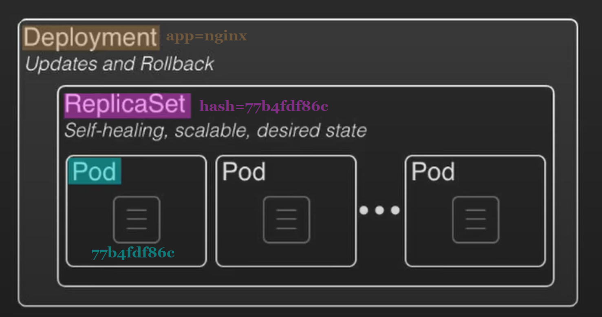  

Два лайфхаки по створенню об'єктів за допомогою:
- stdin
```bash
$ k apply -f - <<EOF        # вказуємо читати stdin до спеціального символу
heredoc> apiVersion: v1     # копіюємо контекст 
kind: Pod
metadata:
  creationTimestamp: null
  labels:
    run: nginx
    version: v1.0.0
  name: nginx
spec:
  containers:
  - image: nginx
    name: nginx
    resources: {}
  dnsPolicy: ClusterFirst
  restartPolicy: Always
status: {}
heredoc> EOF                # вказуємо спеціальний символ
pod/nginx created           # отримуємо результат
```
- прямого посилання url
```bash
$ k apply -f https://raw.githubusercontent.com/.....app.yaml
```

6. Вибірка об'єктів
```bash
# робиться за допомогою прапорця l та вказанням мітки 
$ k get po -lapp=nginx -Lapp
NAME                     READY   STATUS    RESTARTS   AGE   APP
nginx-77b4fdf86c-mskt9   1/1     Running   0          28m   nginx
```

7. Видалення об'єктів
```bash
# дивимось що є
$ k get po
NAME                     READY   STATUS    RESTARTS   AGE
nginx                    1/1     Running   0          66m
nginx-77b4fdf86c-mskt9   1/1     Running   0          31m

# видаляємо за файлом маніфесту:
$ k delete -f nginx-pod.yaml 
pod "nginx" deleted

# перевіряємо результат:
$ k get po                  
NAME                     READY   STATUS    RESTARTS   AGE
nginx-77b4fdf86c-mskt9   1/1     Running   0          32m

# кожному процесу дається час 30 сек на завершення (grace-period). Якщо процес застряг можна використати примусове видалення без очікування.
$ k delete pod nginx-77b4fdf86c-mskt9 --grace-period=0 --force
Warning: Immediate deletion does not wait for confirmation that the running resource has been terminated. The resource may continue to run on the cluster indefinitely.
pod "nginx-77b4fdf86c-mskt9" force deleted
```

8. Команди для запитів стану, детального опису специфікації об'єкта, оновлення та внесення змін

`scale` - масштабування ресурсів забезпечує створення нових подів або їх видалення. Kubernetes також підтримує автомасштабування Pods. 

Запуск кількох реплік застосунку вимагає способу балансування трафіку між усіма ними. Сервіси мають вбудований балансувальник навантаження `loadbalancer`, який буде розподіляти мережевий трафік між усіма подами поточного деплойменту.

Сервіси будуть безперервно відстежувати запущені поди за допомогою `endpoints`, щоб переконатися, що трафік надсилається
тільки на доступні контейнери. Масштабування здійснюється шляхом зміни кількості реплік у деплоймент.

Коли у вас буде кілька екземплярів застосунку, ви зможете виконувати, так звані, `Rolling updates` — тобто, накочувати оновлення без простоїв — `zero downtime deployment`.

9. Взаємодія з нодами (Interacting with Nodes)  

Основні завдання експлуатації або життєвого циклу ноди — це створення і видалення, отримання стану і подій, підготовка ноди до обслуговування (maintenance), а також переведення ноди в спеціальний режим експлуатації.  

Команди для виведення серверу з експлуатації:  
- `top` — інформацію про утилізацію ресурсів  
```bash
$ kubectl top nodes
NAME                CPU(cores)   CPU%   MEMORY(bytes)   MEMORY%   
k3d-argo-server-0   65m          1%     2450Mi          31%     
```
`describe` — які поди розміщуються наразі на ноді, події та помилки     
`cordon` — позначаємо ноду як невикористану планувальником для розміщення нових подів  
`drain` — запускає процес звільнення ноди від запущених на ній процесів і перенесення подів на сусідні ноди кластера  

10. Дебаг і взаємодія з контейнерами в подах. (Debugging and Formatting)

Для пошуку та усуненню проблем, а також дебагу складних комплексних ситуацій можна використати наступні команди:  
`kubectl debug` — потужний інструмент для дослідження не тільки подів і контейнерів, а й ноди, до якої зазвичай доступ обмежений. Дозволяє перегляд ресурсів кластера за допомогою інтерактивних контейнерів:  
- Створення копії наявного контейнера зі зміною певних атрибутів, наприклад, змінити тег контейнер іміджу на нову версію.  
- Додавання ефемерного контейнеру у вже запущений pod, наприклад, для додавання утиліт без перезапуску поду.  
- Створення нового pod, що працює в просторі імен ноди і має доступ до файлової системи та процесів сервера.     

`kubectl logs [Follow, tail, previous]` — для перегляду логів. Параметр `--all-containers` дозволяє отримати потік логів з усіх контейнерів одночасною.  

`attach` та `exec` - команди для підключення до запущеного контейнеру та виконання в його середовищі команд. Слід врахувати,
що ці команди мають бути присутніми в контейнер іміджі. Отже, остання може запускатися в режимі інтерактивного терміналу, за умови наявності оболонки в контейнер іміджі. По суті ви потрапляєте в програмне оточення самого контейнера

### [Практичне завдання](https://github.com/vit-um/DevOps/blob/main/Task7_ktop/README.md)


## Pod та ресурси Kubernetes

`Pod` — це логічний хост для одного або декількох контейнерів, який інкапсулює сховище, мережу та інші ресурси, необхідні для роботи контейнерів. Кожен pod у Kubernetes має унікальну` IP-адресу`, а контейнери в межах одного поду можуть взаємодіяти один з одним через локальний хост.   
От же що таке [Kubernetes Pod](https://devopscube.com/kubernetes-pod/) та які властивості йому притаманні:  
- Всі контейнери у поді завжди розміщуються на одному візлі 
- Кожен контейнер працює в своїй власній `cgroup`, але вони розділяють один `namespace`
- Процеси запущені в одному поді використовують одну й туж IP адресу та пул портів  
- Файлова система доступна та розділяється між всіма процесами  

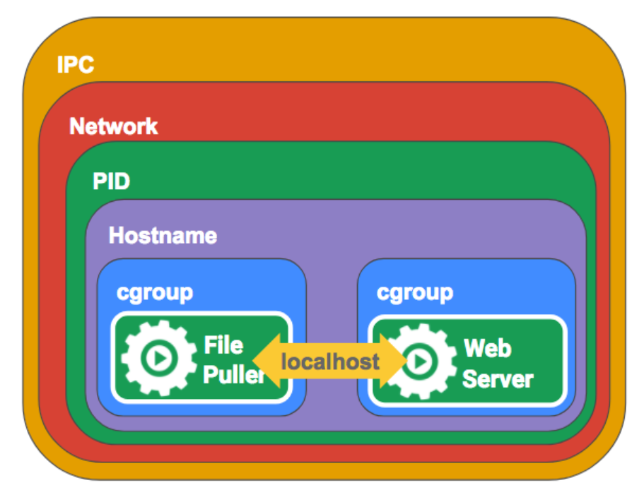 

Контрольне запитання: **Чи будуть контейнери правильно працювати якщо вони розмістяться на різних фізичних серверах?**    
- **НІ НЕ БУДУТЬ:** Один под є правильним вибором для розміщення контейнерів
- **ТАК БУДУТЬ:**  Розділяйте контейнери на окремі поди 

`Single-container pod` використовується, коли для запуску програми достатньо одного контейнера   

`Multi-container pod` використовується, коли для запуску програми потрібно кілька контейнерів. Цей тип подів корисний для складних додатків, які потребують окремих контейнерів для різних компонентів, таких як вебсервер і база даних, між якими забезпечується зв'язок в межах одного поду.

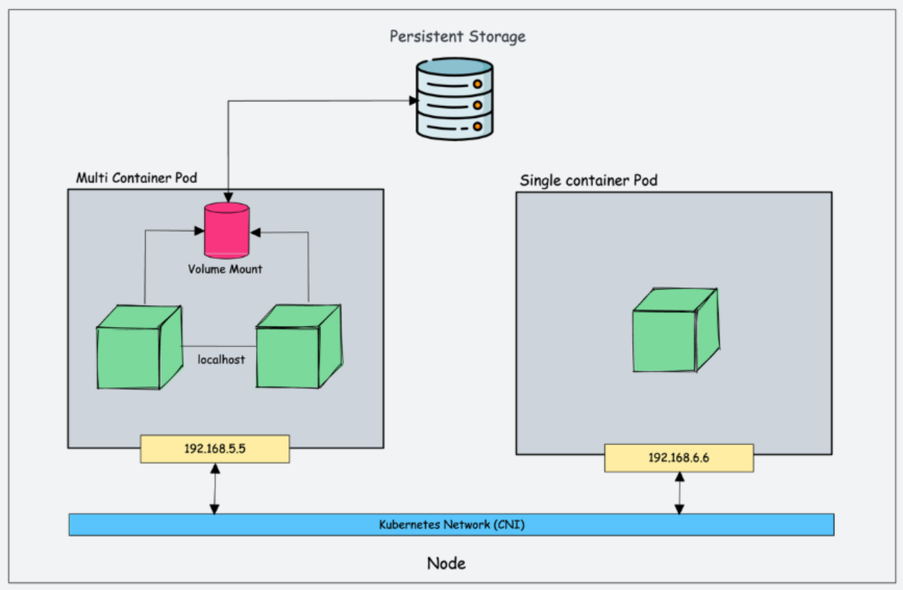  

Все що ми запускаємо в Kubernetes можна розділити на категорії
1. `long time running service`:
    - `Stateless` - процеси без збереження стану, наприклад Web-server 
    - `Stateful` - процеси з збереженням стану, наприклад БД.
2. `short term jobs` або короткострокові задачі
3. `сервісні контейнери`, що відповідають збереження та передачу даних:
    - `init` — спеціалізований тип контейнеру, що використовується для виконання завдань ініціалізації перед запуском основного контейнера. Відповідальний за налаштування конфігураційних файлів або завантаження даних  
    - `sidecar`— спеціалізований тип контейнеру, що надає додаткової функціональності основному контейнеру: ведення журналів, проксі або моніторинг.  

Все це можна розглядати як різні варіанти запуску контейнерів або процесів на серверах у специфічному оточені, підібраному під завдання, або як верхньорівневі об'єкти API Kubernetes, що контролюють групу або один под.     

При виборі типу контейнеру слід враховувати наступні фактори:
- масштабованість  
- вимоги до ресурсів   
- відмовостійкість  

**Типи контейнерів:**  
`ReplicaSets` —  використовуються щоб забезпечити постійну роботу потрібної кількості ідентичних подів, що може покращити масштабованість та відмовостійкість.    
`StatefulSets`— використовуються для додатків зі збереженням станів, які потребують постійного зберігання та впорядкованого розгортання, наприклад, бази даних. На відміну від Deployment, модулі StatefulSet не є взаємозамінними. Кожен модуль має унікальний постійний ідентифікатор, який контролер зберігає протягом будь-якого перепланування.     

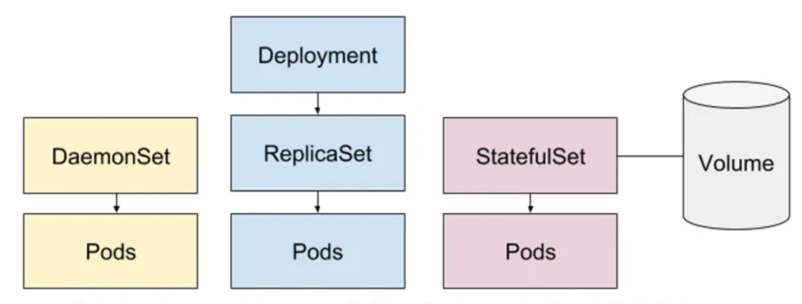  
 

**Типи ресурсів:**  
`Deployment`— використовується для керування розгортанням і масштабуванням контейнерних додатків, гарантує, що вказана кількість реплік контейнера працює постійно, а також підтримує оновлення та rollback для безперебійного оновлення додатків.    
`ReplicaSet`— використовується для забезпечення постійної роботи вказаної кількості реплік контейнера. Набори реплік можуть використовуватися для горизонтального масштабування подів або для забезпечення високої доступності шляхом створення декількох реплік одного і того ж поду.  
`StatefulSet`— використовується для програм зі станом, які потребують стабільних мережевих ідентифікаторів та впорядкованого розгортання.   
`DaemonSet`— гарантують, що на кожному вузлі кластера працює певний модуль, що може бути корисним для запуску утиліт, таких як збирачі журналів або агенти моніторингу.  
`Services`—  визначає логічний набір подібних за функціональністю піддоменів, до яких можна звертатися через їхні імена. Вона дозволяє забезпечити стійку адресацію для робочих навантажень у кластері та забезпечує взаємодію між контейнерами, що входять до складу служби.  
`Ingresses` (Входи) — визначає правила маршрутизації трафіку зовнішнього світу до служб у кластері. Це дає змогу здійснювати управління трафіком, використовуючи правила, такі як маршрутизація за URL, вирішення імен та інші. Ingress дозволяє ефективно керувати зовнішнім доступом до додатків, що розгортані в Kubernetes.  
`Persistent Volumes` (Постійні томи, PV) — це механізм у Kubernetes, який надає стійкі зберігаючи об'єкти для контейнерів. Вони дозволяють зберігати дані поза межами контейнерів, щоб забезпечити постійність навіть під час перезапуску або перерозгортання контейнерів. Persistent Volumes можуть бути використані для зберігання інформації, такої як бази даних, файли конфігурації та інші дані, що потребують постійного зберігання.    

`Pod` як абстракція над контейнерами керується верхньорівневі ресурсами `ReplicaSet`, який в свою чергу підпорядковується `Deployment`   

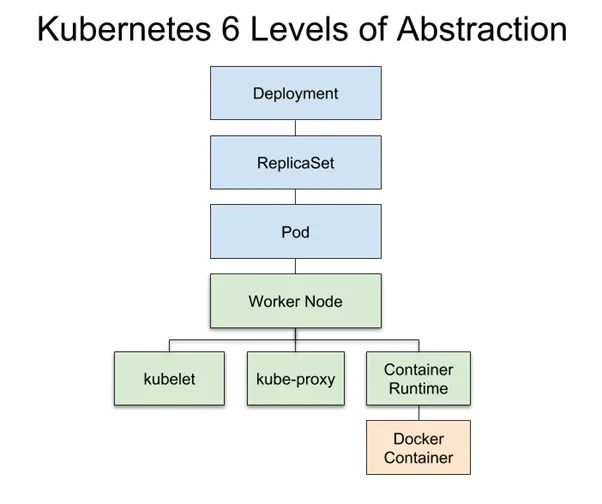  
`Deployment` - це ресурс, що має назву `pod blueprint` або проект поду. Об'єкт, у якому ми описуємо специфікацію поду.  `Deployment` за цією специфікацією створить `ReplicaSet` - об'єкт, що керує кінцевим набором подів. Таким чином всі ці абстракції дають нам повний контроль над життєвим циклом всіх реплік і копій поду.  

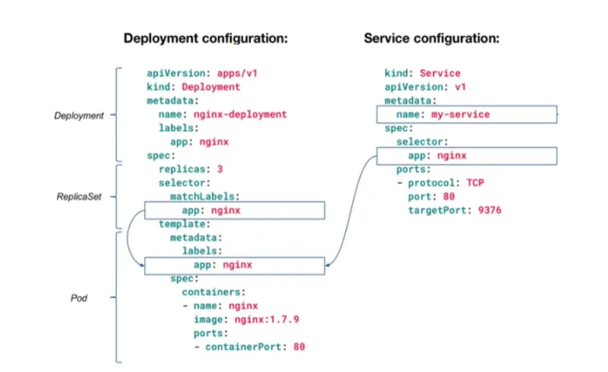  

### Kubernetes Services

**Типи сервісів:**   
`clusterIP`— використовується для надання доступу до набору подів до інших подів у тому ж кластері. Цей тип сервісу надає стабільну IP-адресу та DNS-ім'я для доступу до вузлів, що може бути корисним для внутрішньої комунікації між різними компонентами програми.  
`nodePort` — відповідає за надання доступу до набору подів зовнішньому світу шляхом відкриття порту на кожному вузлі в кластері. Цей тип сервісу корисний для доступу до додатків ззовні кластера, наприклад, з веббраузера або іншого зовнішнього клієнта.  
`LoadBalancer`— спеціалізований тип сервісу для розподілу трафіку між набором подів за допомогою балансувальника навантаження, наданого хмарним провайдером.   
`ExternalName`— використовується для надання псевдоніму зовнішньому сервісу, такому як база даних або API, який не працює в кластері Kubernetes.  
Мета Kubernetes `Headless Service` полягає в тому, щоб створити сервіс, який не має кластерного IP  

[Kubernetes: ClusterIP vs NodePort vs LoadBalancer, Services, and Ingress – an overview with examples](https://rtfm.co.ua/en/kubernetes-clusterip-vs-nodeport-vs-loadbalancer-services-and-ingress-an-overview-with-examples/)

Сполучною ланкою для ресурсів яка дозволяє їм взаємодіяти між собою та з користувачем є сервіси `Services`. Це абстракція нал мережевою системою Linux, яка утворює комунікацію всередині кластеру (потік що називається: Схід - Захід [W<-->E]), та комунікацію з зовнішнім середовищем (потік Північ - Південь [S<-->N]).    

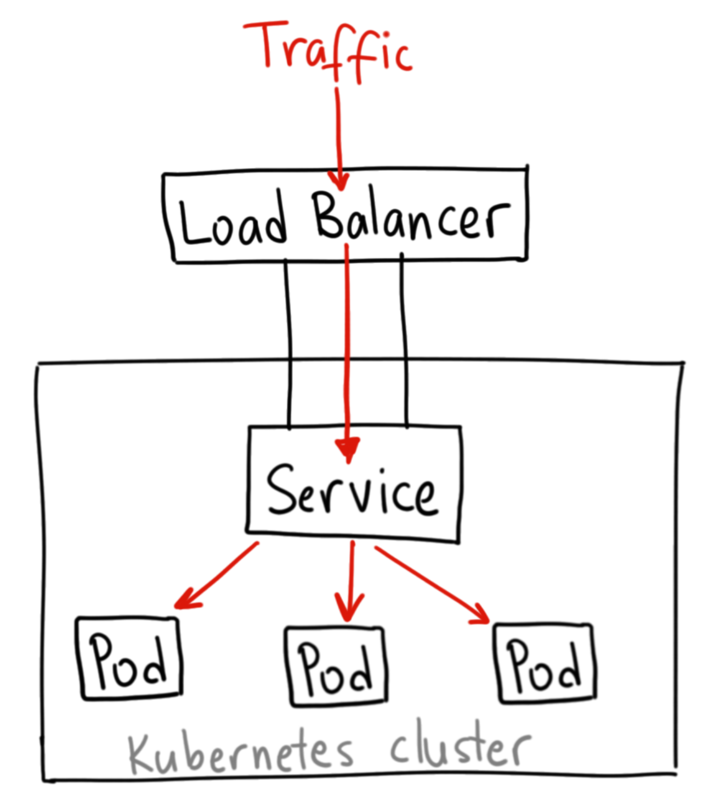 

У вигляді схеми `Kubernetes Service` можна розглядати як ієрархію:
1. зовнішнього `LoadBalancer` 
2. зарезервованих портів під кожен сервіс на подах, 
3. порт-mapping та маршрутизацію кожного конкретного контейнеру  

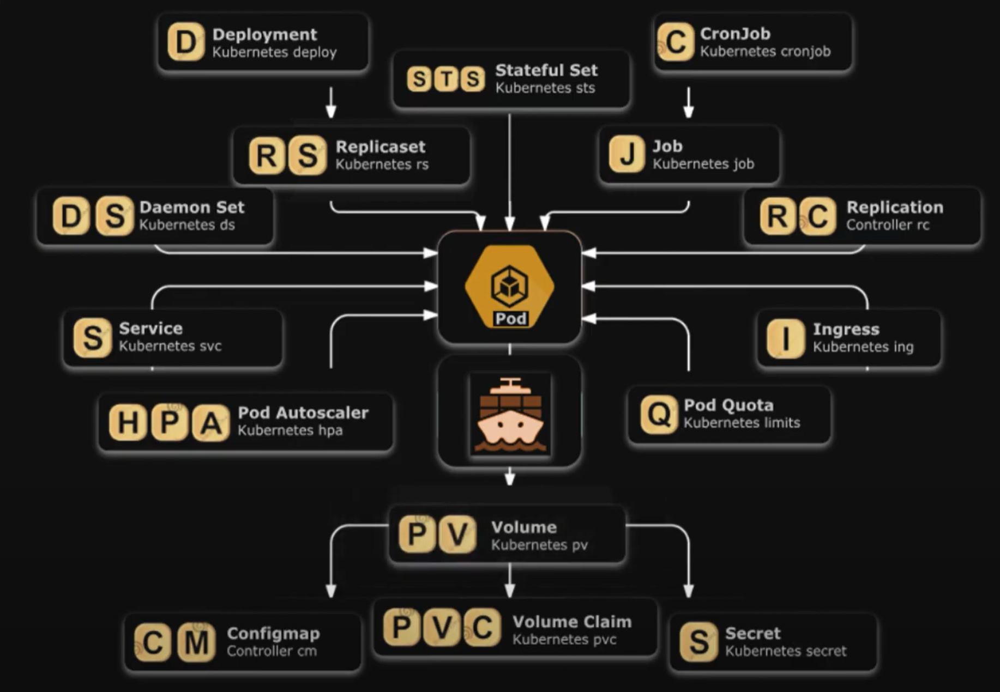 

`Custom Resource Definitions (CRD)` — розширює API Kubernetes, створюючи користувацькі ресурси та контролери. CRD дозволяють визначати власні типи ресурсів з власними властивостями та поведінкою, а
потім керувати цими ресурсами за допомогою інструментів та API Kubernetes. CRD особливо корисні для керування **базами даних**, **чергами повідомлень** або **моделями машинного навчання**. 

`CRD створюються` за допомогою маніфестів YAML, які визначають схему і поведінку кастомного ресурсу. Після визначення CRD ви можете використовувати інструменти та API Kubernetes для створення, оновлення та видалення екземплярів кастомного ресурсу, так само як і для вбудованих ресурсів Kubernetes, таких як модулі або служби.

`CRD дозволяють створювати` кастомні **контролери**, які можуть автоматизувати управління цими ресурсами. Контролери можуть виконувати такі дії як масштабування кількості реплік кастомного ресурсу, моніторинг стану або оновлення конфігурації на основі зовнішніх подій.

**Розгортання з нульовим часом простою**   
`Zero-downtime deployments` можна досягти, використовуючи стратегію   
- `rolling update` Kubernetes. Ця стратегія поступово замінює старі модулі новими, гарантуючи, що завжди є достатня кількість модулів для обробки трафіку. Стратегія `rolling update` також підтримує `rollbacks`, які дозволяють повернутися до попередньої версії програми, якщо виникають будь-які проблеми.
- `Canary deployments` передбачає створення нової версії програми і поступове перенаправлення частини трафіку на нову версію, зберігаючи при цьому більшу частину трафіку на існуючій версії. Це дозволяє протестувати нову версію в контрольованому середовищі, перш ніж розгортати її для всіх користувачів.  

**Контейнерних додатки:**  
`Helm` — це менеджер пакетів для Kubernetes, який спрощує розгортання та керування програмами за допомогою попередньо визначених *charts*. `Charts Helm` — це шаблони, які визначають конфігурацію та залежності програми, їх можна легко налаштувати та розгорнути за допомогою інструменту командного рядка helm. Helm забезпечує стандартизований спосіб керування програмами в Kubernetes і ними можна легко ділитися та повторно використовувати в різних проектах.

`Operators` — це фреймворки для створення та керування додатками Kubernetes з використанням кастомних ресурсів і контролерів. Оператори дозволяють автоматизувати складні завдання розгортання та управління, такі як масштабування, оновлення та моніторинг додатків, використовуючи кастомні ресурси, які визначають властивості та поведінку програми. Оператори можна створювати за допомогою мов програмування, таких як `Go` або `Python`, а розгортати і керувати ними можна як будь-якими іншими ресурсами Kubernetes  

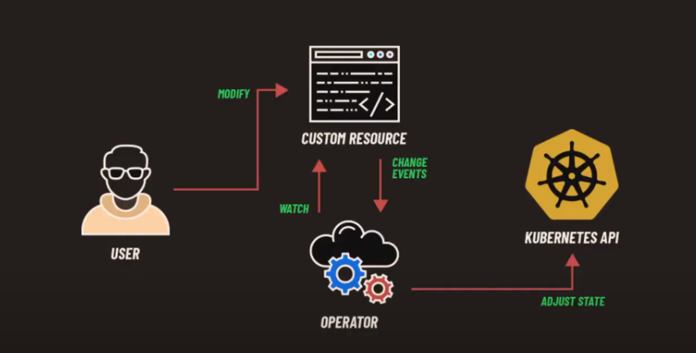  

`Operators та Helm` в Kubernetes інструментами, які взаємодоповнюють один одного та забезпечують різні рівні абстракції та кастомізації для розгортання та керування контейнеризованими програмами. Оператори корисні для керування складними додатками, які потребують спеціальної логіки та автоматизації, в той час як Helm чарти корисні для розгортання та керування додатками, які слідують стандартній конфігурації та шаблону розгортання.  


### Практична частина
1. Для виконання практичної частини будемо використовувати [Google Cloud](https://shell.cloud.google.com/):
```bash
Welcome to Cloud Shell! Type "help" to get started.
To set your Cloud Platform project in this session use “gcloud config set project [PROJECT_ID]”
$ gcloud config set project devops-55250
Updated property [core/project].
(devops-55250)$ 
```

2. Переходимо в інтерактивний режим `gcloud` щоб розгорнути кластер в зоні `us-central1-a` на двох ВМ типу `e2-medium`. Ім'я кластеру дамо `demo`.  

```bash
(devops-55250)$ gcloud beta interactive 
Welcome to the gcloud interactive shell environment.

    Tips:

      o start by typing commands to get auto-suggestions and inline help
      o use tab, up-arrow, or down-arrow to navigate completion dropdowns
      o use space or / to accept the highlighted dropdown item
      o run gcloud <alpha|beta> interactive --help for more info

    Run $ gcloud feedback to report bugs or request new features.

$ gcloud container clusters create demo --zone us-central1-a --machine-type e2-medium --num-nodes 2
Default change: VPC-native is the default mode during cluster creation for versions greater than 1.21.0-gke.1500. To create advanced routes based clusters, please pass the `--no-enable-ip-alias` flag
Default change: During creation of nodepools or autoscaling configuration changes for cluster versions greater than 1.24.1-gke.800 a default location policy is applied. For Spot and PVM it defaults to ANY, and for all other VM kinds a BALANCED policy is used. To change the default values use the `--location-policy` flag.
Note: Your Pod address range (`--cluster-ipv4-cidr`) can accommodate at most 1008 node(s).
ERROR: (gcloud.container.clusters.create) ResponseError: code=403, message=Kubernetes Engine API has not been used in project devops-55250 before or it is disabled. Enable it by visiting https://console.developers.google.com/apis/api/container.googleapis.com/overview?project=devops-55250 then retry. If you enabled this API recently, wait a few minutes for the action to propagate to our systems and retry.
```
3. Отримали помилку та посилання за яким її можна виправити, скористаємось ним виконавши наступні кроки:  
- Дозволяємо Engine API
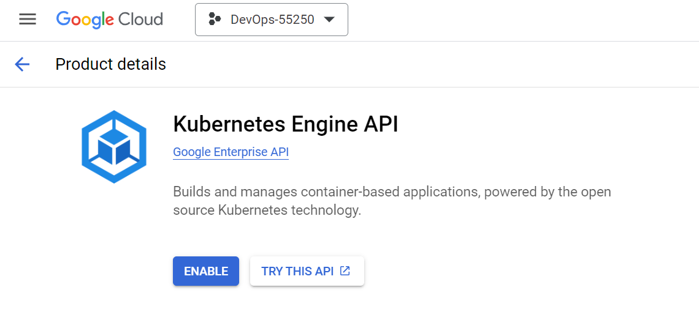  
- Бачимо попередження про необхідність `Credentials`, тому переходимо за посиланням
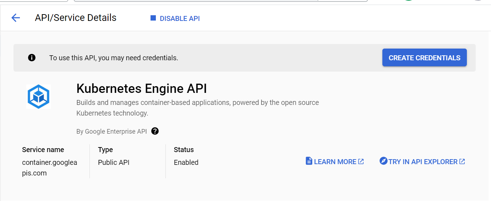 
- Обираємо за рекомендацією `Credential Type`   
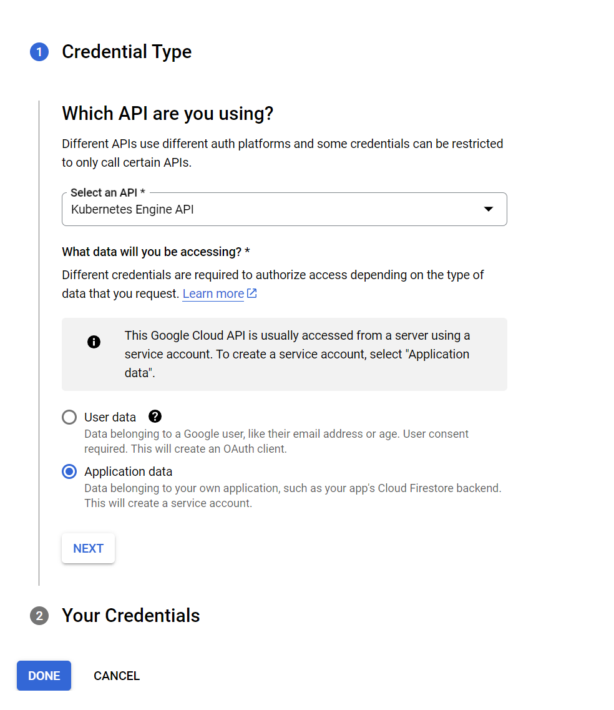  
- Повторимо запит на створення кластеру:  
```bash
$ gcloud container clusters create demo --zone us-central1-a --machine-type e2-medium --num-nodes 2
Default change: VPC-native is the default mode during cluster creation for versions greater than 1.21.0-gke.1500. To create advanced routes based clusters, please pass the `--no-enable-ip-alias` flag
Default change: During creation of nodepools or autoscaling configuration changes for cluster versions greater than 1.24.1-gke.800 a default location policy is applied. For Spot and PVM it defaults to ANY, and for all other VM kinds a BALANCED policy is used. To change the default values use the `--location-policy` flag.
Note: Your Pod address range (`--cluster-ipv4-cidr`) can accommodate at most 1008 node(s).
Creating cluster demo in us-central1-a... Cluster is being health-checked (master is healthy)...done.                                                
Created [https://container.googleapis.com/v1/projects/devops-55250/zones/us-central1-a/clusters/demo].
To inspect the contents of your cluster, go to: https://console.cloud.google.com/kubernetes/workload_/gcloud/us-central1-a/demo?project=devops-55250
kubeconfig entry generated for demo.
NAME: demo
LOCATION: us-central1-a
MASTER_VERSION: 1.27.3-gke.100
MASTER_IP: 35.184.245.57
MACHINE_TYPE: e2-medium
NODE_VERSION: 1.27.3-gke.100
NUM_NODES: 2
STATUS: RUNNING
```

3. Після створення кластеру отримаємо налаштування `kubeconfig` наступною командою:  
```bash
$ gcloud container clusters get-credentials demo --zone us-central1-a --project devops-55250 
Fetching cluster endpoint and auth data.
kubeconfig entry generated for demo.

#Перелік створених контейнерів:
$ gcloud container clusters list
NAME: demo
LOCATION: us-central1-a
MASTER_VERSION: 1.27.3-gke.100
MASTER_IP: 35.184.245.57
MACHINE_TYPE: e2-medium
NODE_VERSION: 1.27.3-gke.100
NUM_NODES: 2
STATUS: RUNNING
```

4. Перевіримо ресурси, та звернемо увагу наскільки їх більше на відміну від локального розгортання за рахунок сервісних контейнерів:  
```bash
$ alias k=kubectl
$ k get all -A
```

5. Згадаємо в якому середовищі ми працюємо. Це директорія demo з Dockerfile нашого першого ОК-серверу. Який ми пушили в реєстр гугла з тегом демо версії v1.0.0

```bash
$ pwd
/home/umanetsvitaliy/demo
$ ls
config.json  Dockerfile  rootfs
$ cat Dockerfile
    FROM busybox 
    CMD while true; do { echo -e 'HTTP/1.1 200 OK\n\n Version: 1.0.0'; } | nc -vlp 8080; done
    EXPOSE 8080
$ docker push gcr.io/devops-55250/demo:v1.0.0
The push refers to repository [gcr.io/devops-55250/demo]
An image does not exist locally with the tag: gcr.io/devops-55250/demo

$ docker build .

$ docker images
REPOSITORY   TAG       IMAGE ID       CREATED        SIZE
<none>       <none>    c613587b7e6b   4 months ago   4.26MB

$ docker tag c613587b7e6b gcr.io/devops-55250/demo:v1.0.0

$ docker images
REPOSITORY                 TAG       IMAGE ID       CREATED        SIZE
gcr.io/devops-55250/demo   v1.0.0    c613587b7e6b   4 months ago   4.26MB

$ docker push gcr.io/devops-55250/demo:v1.0.0
The push refers to repository [gcr.io/devops-55250/demo]
3d24ee258efc: Layer already exists 
v1.0.0: digest: sha256:5d7d48c7e01ae5e628eb5286622b0ce5b1cc412ab5767e848c3886473d44ef44 size: 528
```

6. Налаштуємо наше робоче середовище та namespace:
```bash
$ sudo apt install zsh

$ wget https://raw.githubusercontent.com/ohmyzsh/ohmyzsh/master/tools/install.sh
$ sh install.sh

$ git clone https://github.com/jonmosco/kube-ps1.git

$ nano ~/.zshrc  

source ~/kube-ps1/kube-ps1.sh
PROMPT='$(kube_ps1)'$PROMPT
alias k=kubectl 

$ source ~/.zshrc
(⎈|gke_devops-55250_us-central1-a_demo:N/A)➜  demo 

$ source <(kubectl completion zsh)
$ kubectl completion zsh > "${fpath[1]}/_kubectl"

$ k create ns demo
namespace/demo created

$ k config set-context --current --namespace demo      
Context "gke_devops-55250_us-central1-a_demo" modified.
(⎈|gke_devops-55250_us-central1-a_demo:demo)➜  demo 

```
7. Створимо deploy або проект поду, тоб-то ресурс в якому ми описуємо специфікацію поду:
```sh
$ k create deployment demo --image gcr.io/devops-55250/demo:v1.0.0

$ k get deploy                                                    
NAME   READY   UP-TO-DATE   AVAILABLE   AGE
demo   1/1     1            1           5s

# deployment за цією специфікацією створить ReplicaSets, об'єкт що керує кінцевим набором подів
$ k get po
NAME                    READY   STATUS    RESTARTS   AGE
demo-6695d747b4-qwr9v   1/1     Running   0          3m22s

$ k get all
NAME                        READY   STATUS    RESTARTS   AGE
pod/demo-6695d747b4-qwr9v   1/1     Running   0          4m12s

NAME                   READY   UP-TO-DATE   AVAILABLE   AGE
deployment.apps/demo   1/1     1            1           4m13s

NAME                              DESIRED   CURRENT   READY   AGE
replicaset.apps/demo-6695d747b4   1         1         1       4m12s
```

8. Скористуємось сервісом "прямо із коробки" та створимо сервіс типу `LoadBalancer` Команда `expose` приймає параметри тип сервісу `LoadBalancer`, зовнішній порт `80` та порт до якого адресується мережевий трафік для взаємодії з подом `8080`.    
```sh
$ k expose deployment demo --port 80 --type LoadBalancer --target-port 8080 
service/demo exposed

# cloud controller manager через google API-server створить зовнішній LoadBalancer, реальну IP адресу на налаштує cloud-маршрутизацію    
$ k get svc -w
NAME   TYPE           CLUSTER-IP     EXTERNAL-IP      PORT(S)        AGE
demo   LoadBalancer   10.68.13.114   35.184.238.228   80:30075/TCP   52s

# після призначення адреси отримаємо відповідь від нашого серверу-застосунку
$ curl 35.184.238.228
 Version: 1.0.0

# збережемо призначену IP адресу в змінній LB 
$ k get svc demo -o jsonpath="{..ingress[0].ip}"
35.184.238.228%                                      
# тут ми вказали вивести конкретне поле з json структури яке містить IP-адресу першого ingress-у
$ LB=$(k get svc demo -o jsonpath="{..ingress[0].ip}")

$ echo $LB
35.184.238.228

$ curl $LB
 Version: 1.0.0
``` 

9. Внесемо зміни в докер-файл замінивши версію на наступну `Version: 2.0.0`, зберемо контейнер та завантажимо його в реєстр:
```sh
$ nano Dockerfile
$ docker build . -t gcr.io/devops-55250/demo:v2.0.0 
[+] Building 0.4s (5/5) FINISHED                   docker:default

$ docker push gcr.io/devops-55250/demo:v2.0.0
The push refers to repository [gcr.io/devops-55250/demo]
3d24ee258efc: Layer already exists 
v2.0.0: digest: sha256:ff121a92885d0db7e612710d3e7fc06f3927b4327b9484ea6a107197ad976a04 size: 528
```

10. В окремому терміналі запустимо цикл запиту на адресу балансеру:
```sh
$ LB=$(k get svc demo -o jsonpath="{..ingress[0].ip}")
$ curl $LB
 Version: 1.0.0
$ while true; do curl $LB; sleep 0.3; done
```

11. Виконаємо оновлення на нову версію деплойменту  
```sh
$ k set image deploy demo demo=gcr.io/devops-55250/demo:v2.0.0
deployment.apps/demo image updated

$ k get deployments.apps -o wide
NAME   READY   UP-TO-DATE   AVAILABLE   AGE   CONTAINERS   IMAGES                            SELECTOR
demo   1/1     1            1           57m   demo         gcr.io/devops-55250/demo:v2.0.0   app=demo
```
12. Засвоїмо нову команду `rollout`. Команда для процесу розгортання ресурсів  
```sh
# подивимось на історію для деплойменту demo та побачимо, що було дві ревізії початкова на на версію 2. 
$ k rollout history deployment demo
deployment.apps/demo 
REVISION  CHANGE-CAUSE
1         <none>
2         <none>

# відкотитись на попередню версію, або на будь яку точку в історії можна за допомогою опції undo
$ k rollout undo deployment demo --to-revision 1 
deployment.apps/demo rolled back

# Було б коректно вказувати причину зміни та робити анотації до deployment. Це можна зробити двома шляхами
# За допомогою застарілої опції --record до команди set image:
$ k set image deploy demo demo=gcr.io/devops-55250/demo:v2.0.0 --record 
Flag --record has been deprecated, --record will be removed in the future
deployment.apps/demo image updated
# Або прямою командою анотації
$ k annotate deploy demo kubernetes.io/change-cause="update to v2.0.0"
deployment.apps/demo annotated

# Перевіримо
$ k rollout history deployment demo
deployment.apps/demo 
REVISION  CHANGE-CAUSE
3         <none>
4         update to v2.0.0
```

13. Розглянемо як працюють мітки  
```sh
# Створимо ще один deployment з ім'ям demo-2
$ k create deployment demo-2 --image gcr.io/devops-55250/demo:v2.0.0
deployment.apps/demo-2 created

# Виведемо поди з опцією показати мітки, де побачимо ім'я застосунку та хеші подів
$ k get pod --show-labels                                           
NAME                      READY   STATUS    RESTARTS   AGE    LABELS
demo-2-85cb4d9bfb-qf6vk   1/1     Running   0          3m1s   app=demo-2,pod-template-hash=85cb4d9bfb
demo-745cd8b559-72r9d     1/1     Running   0          14m    app=demo,pod-template-hash=745cd8b559
# При виводі налаштувань сервісу у полі селектор ми побачимо які саме поди попадають у вибірку сервісу демо. 
# Тоб-то саме на цей список подів будуть налаштовані правила IP-table. В даному випадку тільки под deployment-у demo підпадає під селектор 
$ k get svc -o wide
NAME   TYPE           CLUSTER-IP     EXTERNAL-IP      PORT(S)        AGE   SELECTOR
demo   LoadBalancer   10.68.13.114   35.184.238.228   80:30075/TCP   71m   app=demo

# Зробимо групову мітку run=demo та промаркуємо нею всі поди
$ k label po --all run=demo
pod/demo-2-85cb4d9bfb-qf6vk labeled
pod/demo-745cd8b559-72r9d labeled

# Призначимо мітку run=demo конкретному поду demo-6695d747b4-7nml5 
$ kubectl label pod demo-6695d747b4-7nml5 run=demo
pod/demo-6695d747b4-7nml5 labeled
```

14. За допомогою імперативної команди `edit` внесемо зміни у сервіс 
```sh
$ k edit svc demo
service/demo edited
```
Команда `edit` робить запит на API-серверу на маніфест сервісу та відкриє його в локальному редакторі
```yaml
apiVersion: v1
kind: Service
metadata:
  annotations:
    cloud.google.com/neg: '{"ingress":true}'
  creationTimestamp: "2023-12-01T19:38:46Z"
  finalizers:
  - service.kubernetes.io/load-balancer-cleanup
  labels:
    app: demo
  name: demo
  namespace: demo
  resourceVersion: "213819"
  uid: d95229fb-332c-4315-bd1f-08fe1a1bb0f0
spec:
  allocateLoadBalancerNodePorts: true
  clusterIP: 10.68.13.114
  clusterIPs:
  - 10.68.13.114
  externalTrafficPolicy: Cluster
  internalTrafficPolicy: Cluster
  ipFamilies:
  - IPv4
  ipFamilyPolicy: SingleStack
  ports:
  - nodePort: 30075
    port: 80
    protocol: TCP
    targetPort: 8080
  selector:
    run: demo   # app: demo
  sessionAffinity: None
  type: LoadBalancer
status:
  loadBalancer:
    ingress:
    - ip: 35.184.238.228
:%y
:wq
```
Як тільки ми збережемо файл kubectl:
- зробить валідацію,  
- створить json payload,  
- відправить маніфест на API-сервер де відбудуться зміни, 
- балансер почне розподіляти трафік між двома подами рівномірно.

15. Масштабуємо поди, розгорнувши потрібну кількість реплік deployment-у першої версії командою `scale`
```sh
$ k scale deployment demo --replicas 9
deployment.apps/demo scaled
# отже маємо співвідношення подів 1:9 або 10% - версія 1 та 90% - версія 2
$ k get po -w
NAME                      READY   STATUS    RESTARTS   AGE
demo-2-85cb4d9bfb-qf6vk   1/1     Running   0          81m
demo-6695d747b4-4zn9s     1/1     Running   0          38s
demo-6695d747b4-5ck8b     1/1     Running   0          38s
demo-6695d747b4-7nml5     1/1     Running   0          35m
demo-6695d747b4-glc5p     1/1     Running   0          38s
demo-6695d747b4-hhx9p     1/1     Running   0          38s
demo-6695d747b4-lr56j     1/1     Running   0          37s
demo-6695d747b4-m4cj9     1/1     Running   0          37s
demo-6695d747b4-q8clf     1/1     Running   0          37s
demo-6695d747b4-zcmxf     1/1     Running   0          37s
```
16. Зімітуємо `Canary deployment` 
```sh
# Як бачимо по виводу, після масштабування подів трафік не розподілився на нові поди і ось чому:   
$ k get po -Lapp,run
NAME                      READY   STATUS    RESTARTS   AGE   APP      RUN
demo-2-85cb4d9bfb-qf6vk   1/1     Running   0          93m   demo-2   demo
demo-6695d747b4-4zn9s     1/1     Running   0          12m   demo     
demo-6695d747b4-5ck8b     1/1     Running   0          12m   demo     
demo-6695d747b4-7nml5     1/1     Running   0          48m   demo     demo
demo-6695d747b4-glc5p     1/1     Running   0          12m   demo     
demo-6695d747b4-hhx9p     1/1     Running   0          12m   demo     
demo-6695d747b4-lr56j     1/1     Running   0          12m   demo     
demo-6695d747b4-m4cj9     1/1     Running   0          12m   demo     
demo-6695d747b4-q8clf     1/1     Running   0          12m   demo     
demo-6695d747b4-zcmxf     1/1     Running   0          12m   demo     

# Щоб балансування запрацювало ми промаркуємо ще раз всі поди. 
$ k label po --all run=demo
pod/demo-2-85cb4d9bfb-qf6vk not labeled
pod/demo-6695d747b4-4zn9s labeled
pod/demo-6695d747b4-5ck8b labeled
pod/demo-6695d747b4-7nml5 not labeled
pod/demo-6695d747b4-glc5p labeled
pod/demo-6695d747b4-hhx9p labeled
pod/demo-6695d747b4-lr56j labeled
pod/demo-6695d747b4-m4cj9 labeled
pod/demo-6695d747b4-q8clf labeled
pod/demo-6695d747b4-zcmxf labeled

# На цей раз у вибірку попадають всі поди і ми бачимо інше розподілення версій та роботу  Canary deployment
 Version: 2.0.0
 Version: 1.0.0
 Version: 1.0.0
 Version: 1.0.0
 Version: 1.0.0
 Version: 1.0.0
 Version: 1.0.0
 Version: 1.0.0
 Version: 1.0.0
 Version: 1.0.0
 Version: 1.0.0

$ k get svc -o wide
NAME   TYPE           CLUSTER-IP     EXTERNAL-IP      PORT(S)        AGE    SELECTOR
demo   LoadBalancer   10.68.13.114   35.184.238.228   80:30075/TCP   163m   run=demo

# Після перевірки ми можемо змінити співвідношення версій 
$ k scale deployment demo --replicas 4
deployment.apps/demo scaled

$ k get po -Lapp,run
NAME                      READY   STATUS    RESTARTS   AGE     APP      RUN
demo-2-85cb4d9bfb-qf6vk   1/1     Running   0          111m    demo-2   demo
demo-6695d747b4-5t78d     1/1     Running   0          3m16s   demo     demo
demo-6695d747b4-grdcp     1/1     Running   0          3m16s   demo     demo
demo-6695d747b4-skbvg     1/1     Running   0          101s    demo     demo
demo-6695d747b4-vmcbv     1/1     Running   0          101s    demo     demo

# або взагалі прибрати першу версію
$ k scale deployment demo --replicas 0
deployment.apps/demo scaled

$ k get po -Lapp,run                  
NAME                      READY   STATUS        RESTARTS   AGE     APP      RUN
demo-2-85cb4d9bfb-qf6vk   1/1     Running       0          113m    demo-2   demo

 Version: 2.0.0
 Version: 2.0.0
 Version: 2.0.0
 Version: 2.0.0
 Version: 2.0.0
 Version: 2.0.0
```    

Тут проблема в імперативному підході, нові репліки подів не отримали мітку `run=demo`, тому що ми змінювали все вручну і deployment нічого не знає про ці зміни. Це дуже важливий момент в розумінні різниці підходів та мінусів в імперативних змінах інфраструктури. 

### [Задача з налаштування моніторингового сервісу Uptime Robot](https://github.com/vit-um/DevOps/blob/main/Task8_UptimeRobot/README.md).


## Маніфести Kubernetes, YAML

[YAML](https://www.cloudbees.com/blog/yaml-tutorial-everything-you-need-get-started) — Yet Another Markup Language, що з'явився на світ у 2001 році, являє собою мову серіалізації даних на основі `Unicode`. Акцент мови на даних, а не розмітці. По суті, YAML призначений для взаємодії з людиною і добре працює з сучасними мовами програмування.  

Використовується для: 
- конфігураційних файлів,  
- обміну повідомленнями в інтернеті,  
- зберігання об'єктів.

В `декларативному` підході ми описуємо бажаний стан програмного середовища за допомогою `маніфестів`. Тобто,декларуємо конфігурацію за допомогою різного роду типів даних і форматів. Відступи використовуються для позначення вкладеності та загальної структури файлу `yaml`.  

[Типи даних у YAML наступні](https://learnxinyminutes.com/docs/yaml/): 
- `Скаляри (scalars)` — це рядки, цілі числа, булеві значення.  
- `Послідовності (sequences)` — це списки, кожен елемент яких починається з дефісу (-).  
- `Mappings` — дає можливість перерахувати ключі із значеннями.  

В YAML можливо використовувати анкори та alias для вказання на один об'єкт в кількох місцях файлу. Ось приклад:
```yaml
# Використання анкору для позначення об'єкта
person: &anchor1
  name: John Doe
  age: 30

# Використання alias для посилання на попередній анкор
employee1: *anchor1
employee2: *anchor1
```
У цьому прикладі `&anchor1` використовується для створення анкору для об'єкта `person`, а `*anchor1` використовується для створення alias для цього об'єкта у полях employee1 та employee2. Це дозволяє використовувати один і той же об'єкт у кількох місцях файлу. От же alias є Іменоване посилання на блок конфігурації.  

Рекомендується використовувати чотири символи відступу для вкладених рівнів у YAML. Це робить файли YAML більш читабельними та зрозумілими. Ось приклад того, як використовується відступ у YAML:
```YAML
apiVersion: v1
kind: Pod
metadata:
  name: my-pod
spec:
  containers:
  - name: my-container
    image: nginx
```
У цьому прикладі рівень контейнерів вкладений на один рівень нижче рівня контейнерів. Тому відступ для контейнерів становить чотири символи.

Щоб **зберігати кілька yaml документів в одному файлі** потрібно **розділити їх трьома дефісами**. Це дуже допомагає у випадку, коли потрібно об'єднати групи об'єктів. Наприклад, ми можемо одним файлом описати всі необхідні об'єкти нашого застосунку: deployment, service, config map тощо.  
```yaml
---
```

Рекомендую вам скористатися утилітами `yq` і `jq` для зручного виведення, фільтрації та маніпуляції файлами у форматі YAML та JSON відповідно. 

`YAML` реалізовано як надбудову формату `JSON`. Це означає, що ми можемо аналізувати `JSON` за допомогою парсера `YAML`. В JSON точно швидший і простіший парсинг серіалізованих об'єктів, тому саме його використовують як формат передачі даних у Kubernetes API. Але, наприклад, у JSON немає можливості коментарів, а YAML у цьому випадку більш читабельний.

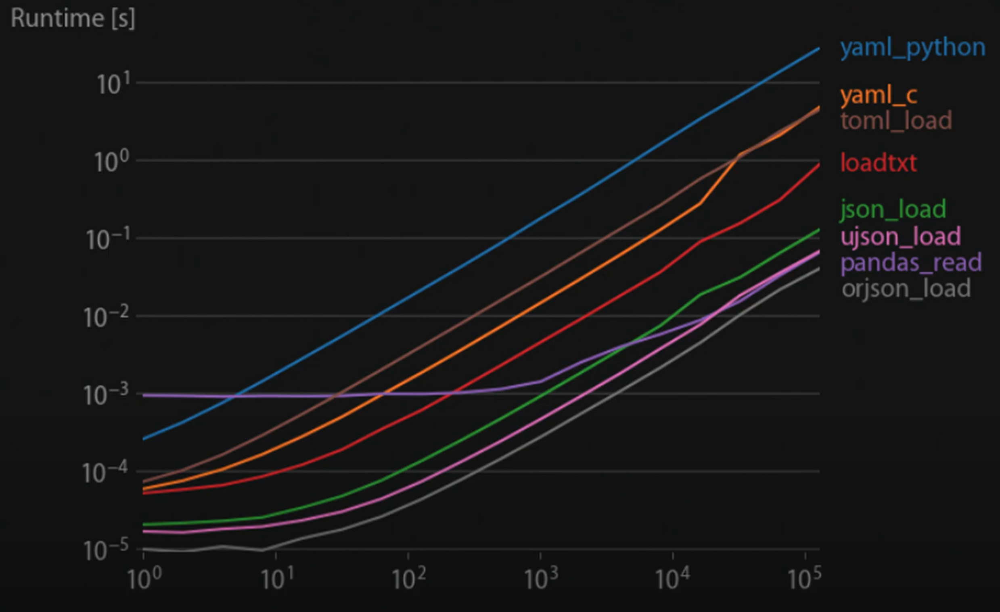  

`Маніфести Kubernetes` — це конфігураційні файли, які визначають бажаний стан кластера Kubernetes (ім'я, мітки та параметри конфігурації.) Вони написані у форматі YAML або JSON і описують ресурси, які потрібно створити, оновити або видалити на кластері. 

Замість того, щоб вручну налаштовувати кожен ресурс у кластері, ви можете визначити бажаний стан у маніфесті і дозволити Kubernetes обробляти деталі реалізації. Цей підхід відомий як `Infrastructure as Code (IaC)` і широко використовується в індустрії для управління складною хмарною інфраструктурою.

Щоб застосувати маніфест до кластера використовують Інструмент `kubectl`, який прочитає маніфест і створить ресурси на
кластері, як зазначено. Якщо на кластері вже існують ресурси з такими ж іменами, як і визначені у маніфесті, kubectl apply оновить наявні ресурси, щоб вони відповідали бажаному стану.

Які є варіанти створити маніфест:
- вивчити специфікацію і написати все власноруч (`kubectl` explain може нам у цьому допомогти);  
- експортувати об'єкт з kubectl get опцією -o yaml або json (файл буде роздутий технічною інформацією);  
- згенерувати файли доступними онлайн ресурсами, наприклад, [k8syaml.com](https://k8syaml.com/).  

`kubectl create` містить список із двадцяти шести об'єктів, але сюрприз, усіх, крім простого поду.  

### Розглянемо структуру маніфестів, зберемо в пакет Helm та будемо готувати основу для CI/CD 
1. Почнемо з [демо репозиторію](/yaml) з прикладами маніфестів, зібраних для вивчення базових ресурсів:  
    - liveness та readiness probe
    - inject даних у контейнер
    - монтування
    - storages 
    - secrets
    - jobs, cronjobs
    - services  
2. Маніфест [поду](yaml/app.yaml)
```yaml
apiVersion: v1 # версія API Kubernetes для створення об'єкту
kind: Pod      # тип об'єкту
metadata:      # унікальні дані для ідентифікації об'єкту
  name: app
  namespace: demo
  labels: 
    app: demo
    run: demo
spec:         # Стан що ми визначаємо для об'єкту (для кожного свій)
  containers:
    - image: gcr.io/k8s-k3s/demo:v1.0.0   # образ контейнеру 
      name: app
      ports:
        - containerPort: 8000   # порт 
          name: http            # ім'я поду за визначенням DNS
```
Формат специфікації відрізняється для кожного об'єкту та містить поля специфічні саме для цього об'єкту. 

3. Специфікація [multi container pod](yaml/app-multicontainer.yaml) включає список контейнерів  
- В даному випадку з двома зв'язаними контейнерами: `nginx` та `debian`  
- Як бачимо вони використовують той самий storage `name: html` але монтують кожен свою директорію `mountPath:`  
- `emptyDir: {}` - спеціальний тип директорії, що надається поду на час виконання   
- Контейнер `nginx` читає дані зі своєї директорії `/usr/share/nginx/html`  
- Контейнер з `debian` пише дані `date >> /html/index.html;`, готуючи динамічний контент для web-серверу  

4. Специфікація [Data inject](yaml/app-volumeMounts.yaml)  
- Включає точки монтування `volumeMounts:` та самі `volumes:`
- Один под може використовувати будь яку кількість [типів томів](https://kubernetes.io/docs/concepts/storage/volumes/) одночасно:   
- [Ефемерні типи томів або ephemeral volumes](https://www.airplane.dev/blog/kubernetes-ephemeral-storage) існують протягом терміну життя поду: 
    - emptyDir;
    - ConfigMap, downward API, secret;
    - CSI volumes;
    - Generic volumes;  
- В той час як [Persistent Volumes](https://kubernetes.io/docs/concepts/storage/persistent-volumes/) існують і після перезапуску контейнеру, після закінчення терміну життя поду:  
    - [cephfs](https://kubernetes.io/docs/concepts/storage/volumes/#cephfs);  
    - [csi](https://kubernetes.io/docs/concepts/storage/volumes/#csi);  
    - [fc (fibre channel)](https://kubernetes.io/docs/concepts/storage/volumes/#csi);  
    - [hostPath](https://kubernetes.io/docs/concepts/storage/volumes/#hostpath); 
    - [iscsi](https://kubernetes.io/docs/concepts/storage/volumes/#iscsi);  
    - [local](https://kubernetes.io/docs/concepts/storage/volumes/#local);  
    - [nfs (Network File System)](https://kubernetes.io/docs/concepts/storage/volumes/#nfs);
    - [rbd (Rados Block Device)](https://kubernetes.io/docs/concepts/storage/volumes/#rbd);  
- В даному випадку ми використовуємо `hostPath` щоб змонтувати каталог `/var/lib/app` локальної файлової системи ноди  

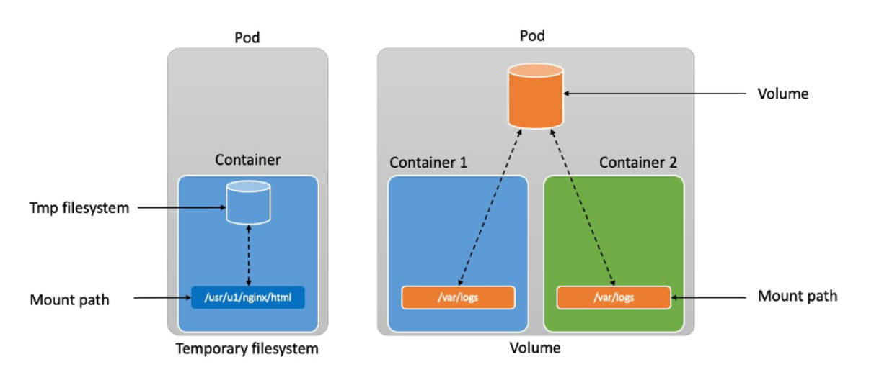
5. Спеціальні ресурси такі як `secret` або `configMap` монтуються в кластер таким самим чином: 
```yaml
spec:
  containers:
  - name: mypod
    image: redis
    volumeMounts:
    - name: foo
      mountPath: "/etc/foo"
      readOnly: true
  volumes:
  - name: foo
    secret:                      # тип тому
      secretName: simple-secret  # точка монтування 
```  
- `kubelet` забезпечить доступність даних цих ресурсів в контейнері у вигляді файлів, або змінних середовища:  
```yaml
spec:
  containers:
    - name: mypod
      image: redis
      imagePullPolicy: Always
      env:                        # вказує звідки брати значення для конкретної змінної
        - name: CONFIGMAP_PARAM
          valueFrom:
            configMapKeyRef:      # вказує ім'я ресурсу та ключа
              name: app-config
              key: config-param
      volumeMounts:
        - name: config-volume
          mountPath: /config
  volumes:
    - name: config-volume
      configMap:
        name: app-config
  restartPolicy: Never
``` 

6. [Постійний том](yaml/app-pv.yaml) `pv` або `pvc`
- Постійний том в сховищі - це частина сховища в кластері, яка виділена адміністратором або динамічно за допомогою `storageClass`
Цей об'єкт API фіксує деталі реалізації сховища та робить їх прозорими для користувача, будь то NFS, iSCSI або система зберігання, яка відповідає конкретному хмарному провайдеру.
- `PersistentVolumeClaim (PVC)` — це запит користувача на зберігання. Поди споживають ресурси вузлів, а PVC споживають ресурси PV. Модулі можуть запитувати певні рівні ресурсів (ЦП і пам'ять), рівень доступу (читання/запис), розмір тому. 

7. [Health probes](yaml/app-readinessProbe.yaml)
- Kubelet використовує `liveness` проби, щоб знати коли перезапустити контейнер. Деякі програми що працюють тривалий час з рештою переходять у неробочий стан з якого можуть вийти тільки шляхом перезапуску.  
```yaml
     livenessProbe:
        httpGet:      # Kubelet відправляє цей запит на сервер
          path: /     # який запущений у контейнері 
          port: 8000  # та слухає порт 8080 буль яка відповідь з кодом >=200 < 400 означає успіх, інакше - перезапуск. 
        initialDelaySeconds: 5
        timeoutSeconds: 1
        periodSeconds: 10
        failureThreshold: 3
``` 
- При помилках `readiness` якщо под не готовий, то він видаляється з балансеру трафіку, а не перезапускається як в попередньому випадку.

8. Маніфест [деплойменту](https://kubernetes.io/docs/concepts/workloads/controllers/deployment/) якому можна знайти:
- стратегія апдейтів 
- історія відкатів - rollout
- масштабування scaling 
- селектор для нижчерівневих ресурсів та шаблону поду, який включає специфікацію за яку відповідає деплоймент 

9. Маніфест короткострокових (short time running) процесів або [jobs](yaml/app-job.yaml)

В наданому прикладі (модель для навчання) маніфесту специфікація включає:  
- монтування `volumes:` для вхідних та вихідних даних 
- `initContainers:` що є патерном для підготовки до запуску основного контейнеру (синхронізація дата сету)
- `command:` для основного контейнеру надає можливість запускати процеси з різними опціями
- етапи життєвого циклу `lifecycle:` контролюють `postStart:` та `preStop:` події.

10. Маніфест об'єкту [cronjob](yaml/app-cronjob.yaml) надає додаткові параметри запуску об'єкту записані у секції `jobTemplate:`  
- `schedule:` - планувальник, що дозволяє у форматі linux crontab запускати сервісні задачі. Наприклад ротацію токенів та сертифікатів. Відкладена обробка масиву даних, тощо.   

### Створення простого поду або StateFullSet

## Пакетний менеджер Helm 

[Helm](https://helm.sh/docs/intro/quickstart/) — популярний менеджер пакетів для Kubernetes, який спрощує розгортання та керування складними додатками на кластерах Kubernetes. Helm надає систему шаблонів, яка дозволяє визначати компоненти програми та їх залежності за допомогою формату, який
називається charts. Якщо застосувати його в комплексі з системами автоматизації то можна реалізувати повний цикл декларативного розгортання проектів нв базі Kubernetes.    

Можливості використання Helm для програм на кластері Kubernetes:
- встановлення, 
- оновлення,
- відкату,
- видалення . 

[Chart](https://helm.sh/docs/topics/charts/#the-chart-file-structure) — це набір YAML-файлів, які визначають ресурси Kubernetes. Набір шаблонів та конфігураційних файлів для розгортання програми Kubernetes. Знаходяться вони на [ArtifactHUB.io](https://artifacthub.io/stats)

Один Chart може бути використаним для розгортання чогось простого, наприклад [Redis](https://artifacthub.io/packages/helm/redis/redis) або невеликого проекту  

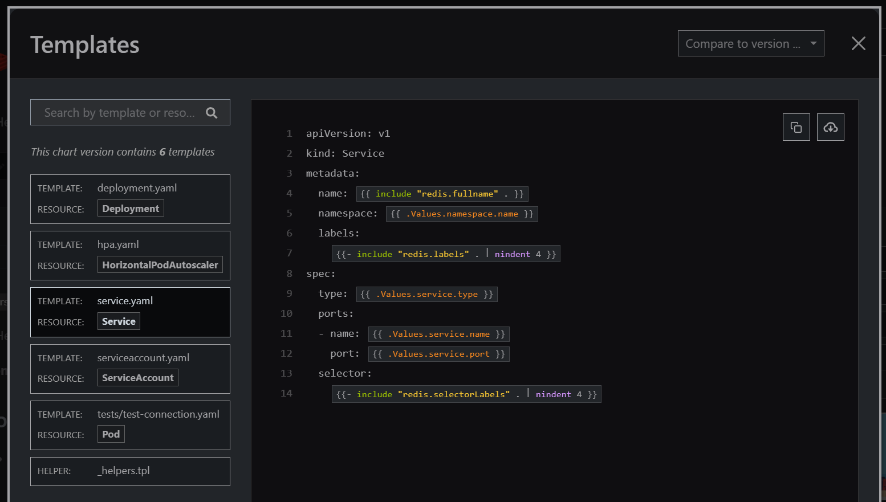 

Або навпаки чогось дуже [складного](https://artifacthub.io/packages/helm/argo/argo-cd), наприклад повного стеку мікросервісів з http-серверами, БД, caches і так далі.   

`Chart` створюється у вигляді файлів розміщених у визначеною структурою дерева каталогів. Вони можуть бути упакованими в tar архів та версіонуватись. 

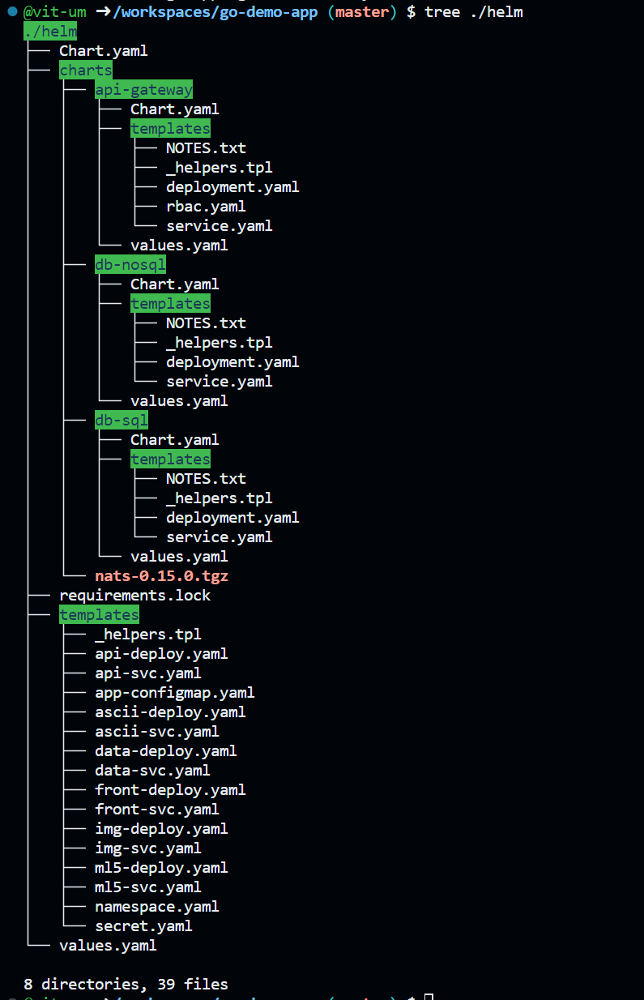  


Helm має `вбудовану систему репозиторіїв`, яка дозволяє:  
- ділитися чартами з іншими користувачами 
- полегшує повторне використання
- сприяє розповсюдженню програм і компонентів Kubernetes.

[Репозиторії Helm](https://artifacthub.io/packages/search) використовуються для зберігання та розповсюдження Helm чартів, зазвичай розміщуються на вебсервері або хмарній платформі і доступ до них можна отримати за допомогою Helm CLI. Helm підтримує як публічні, так і приватні сховища, дозволяючи вам ділитися і поширювати чарти з іншими користувачами у вашій організації або спільнотою. 

Є низка проектів що реалізує механізм `Helm-репозиторію`, наприклад [Chart Museum](https://github.com/helm/chartmuseum). 

Після того, як створено Helm чарт, ви можете скористатися інструментом командного рядка helm, щоб встановити її на кластер Kubernetes. Helm прочитає та заповнить шаблони і створить необхідні ресурси Kubernetes на кластері.

`Hooks` функція Helm що дозволяє визначати сценарії, що запускаються до або після встановлення або оновлення діаграми.

Хуки можна використовувати для виконання таких завдань:  
- Міграція бази даних або запуск програми.
- Розгортання та керування складними програмами на Kubernetes, такими як бази даних, системи обміну повідомленнями та
вебпрограми.  
- Спрощення процесу розгортання мікросервісів та інших розподілених додатків.
- Спільне та повторне використання компонентів і додатків Kubernetes різними командами та організаціями.
- Автоматизація розгортання та управління додатками на кластерах Kubernetes. 

`Helm` широко використовується у спільноті Kubernetes і **має велику та активну базу користувачів**. Він підтримується багатьма хмарними
провайдерами і використовується багатьма організаціями для управління інфраструктурою Kubernetes.  

`Helm` має **потужну екосистему плагінів і розширень**, які можна використовувати для розширення його функціональності:
- плагіни для керування секретами, 
- плагіни для розгортання додатків на декількох кластерах, 
- інтеграції з інструментами безперервної інтеграції та розгортання (CI/CD).

`Helm 3 (остання версія Helm)` отримала такі функції як:
- спрощені залежності, 
- поліпшені функції безпеки,  
- підтримку Kubernetes RBAC (Role-based access control).

Helm надає можливість керувати значеннями, що використовуються для налаштування діаграми, за допомогою аргументів командного рядка або YAML-файлів.

`Values` використовуються для налаштування конфігурації Helm чартів. `Значення Helm` — це змінна, яку можна використовувати для налаштування поведінки чарту:
- кількість реплік розгортання, 
- номер порту сервісу,
- namespaces Kubernetes.  

*Значення визначаються в YAML-файлі і можуть бути передані helm під час розгортання.*

Різниця між значенням Helm і параметром Helm полягає в тому, що значення Helm є значенням, яке задається для параметра Helm. Параметр Helm - це назва параметра, який може бути змінений користувачем. Наприклад, параметр Helm може називатися `image`, і його значенням за замовчуванням може бути `nginx`. Користувач може змінити значення цього параметра на інше, наприклад `my-image`. **Значення Helm є параметром за замовчуванням, в той час як параметр Helm є параметром, визначеним користувачем**.

Команда, яка використовується для встановлення Helm-чарту, це `helm install`. 

Команда, яка використовується для оновлення релізу Helm, це` helm upgrade`. 

Команда, яка використовується для видалення релізу Helm, це `helm uninstall`.

### План практичної частини лекції: 
- Зробимо helm intro
- Розглянемо принципи та методи роботи helm cli
- Розгортання системи gitops за допомогою Helm

1. WORKSPACE. Підготовка робочого простору.  
- Працюємо на [github codespace](https://github.com/codespaces) 
- Перейдемо в [репозиторій автора курсу](https://github.dev/den-vasyliev/go-demo-app) та створимо codespace з двома ядрами.
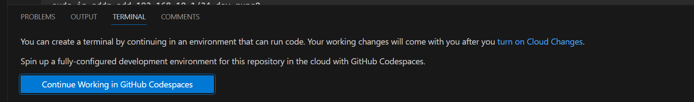
- Встановлюємо розширення Kubernetes k3d, kube-ps1, зміну оточення: 
```sh
$ git clone https://github.com/jonmosco/kube-ps1.git

$ nano ~/.zshrc

export PATH=$PATH:/home/codespace/.vs-kubernetes/tools/k3d
source ~/kube-ps1/kube-ps1.sh
PROMPT='$(kube_ps1)'$PROMPT
alias k=kubectl 

$ source ~/.zshrc
```
- Додаємо новий кластер з мінімальними параметрами 
```sh
$ k3d cluster create k3d-cluster-290 --servers 1 --agents 3 --kubeconfig-update-default

$ k3d cluster list
NAME              SERVERS   AGENTS   LOADBALANCER
k3d-cluster-290   1/1       3/3      true

```

- Перевіримо доступи та готовність нод:  
```sh
$ k version
Client Version: v1.28.4
Kustomize Version: v5.0.4-0.20230601165947-6ce0bf390ce3
Server Version: v1.27.4+k3s1

$ k get no
NAME                              STATUS   ROLES                  AGE     VERSION
k3d-k3d-cluster-go-app-agent-0    Ready    <none>                 3m46s   v1.27.4+k3s1
k3d-k3d-cluster-go-app-agent-2    Ready    <none>                 3m46s   v1.27.4+k3s1
k3d-k3d-cluster-go-app-agent-1    Ready    <none>                 3m45s   v1.27.4+k3s1
k3d-k3d-cluster-go-app-server-0   Ready    control-plane,master   3m53s   v1.27.4+k3s1
```
- Для початку роботи нам потрібен `Helm-клієнт` який вже встановлено за замовчуванням в codespace. Перевіримо це:
```sh
$ helm version
version.BuildInfo{Version:"v3.13.2", GitCommit:"2a2fb3b98829f1e0be6fb18af2f6599e0f4e8243", GitTreeState:"clean", GoVersion:"go1.20.10"}
```
- В [офіційному репозиторії](https://github.com/helm/helm/releases) ми можемо знайти збірки для інших систем та інструкції для інсталяцій. 

2. Коли Chart інстальовано бібліотека Helm створює `Release` для відстеження цієї інсталяції.  
`Release` - це екземпляр чарту, що працює в кластері Kubernetes. Один чарт може бути установлено багато разів в один й той самий кластер. Коли пакет встановлюється створюється новий реліз. 

```sh
$ helm repo add argo https://argoproj.github.io/argo-helm
"argo" has been added to your repositories

$ helm install my-argo-cd argo/argo-cd --version 5.51.6
NAME: my-argo-cd
LAST DEPLOYED: Mon Dec  4 00:33:33 2023
NAMESPACE: default
STATUS: deployed
REVISION: 1
TEST SUITE: None
# перевірити який пакет встановлено можна за допомогою команди 
$ helm ls
NAME            NAMESPACE       REVISION        UPDATED                                 STATUS          CHART           APP VERSION
my-argo-cd      default         1               2023-12-04 00:33:33.239827884 +0000 UTC deployed        argo-cd-5.51.6  v2.9.3     
# або цією з вказанням релізу:
$ helm status my-argo-cd
NAME: my-argo-cd
LAST DEPLOYED: Mon Dec  4 00:33:33 2023
NAMESPACE: default
STATUS: deployed
REVISION: 1
TEST SUITE: None
NOTES:
In order to access the server UI you have the following options:

1. kubectl port-forward service/my-argo-cd-argocd-server -n default 8080:443

    and then open the browser on http://localhost:8080 and accept the certificate

2. enable ingress in the values file `server.ingress.enabled` and either
      - Add the annotation for ssl passthrough: https://argo-cd.readthedocs.io/en/stable/operator-manual/ingress/#option-1-ssl-passthrough
      - Set the `configs.params."server.insecure"` in the values file and terminate SSL at your ingress: https://argo-cd.readthedocs.io/en/stable/operator-manual/ingress/#option-2-multiple-ingress-objects-and-hosts

```

3. `Принцип роботи helm` полягає у наступному:
- В каталозі `template` розміщуються файли шаблонів 
- Коли Helm працює з чартом, він надсилає всі файли з каталогу через механізм рендерингу шаблонів 

```sh
$ helm template demo ./helm
---
# Source: helm/charts/nats/templates/pdb.yaml
apiVersion: policy/v1
kind: PodDisruptionBudget
metadata:
  name: demo-nats
```
- Потім він збирає результат цієї операції, а це вже регулярні yaml-маніфести 
- Упорядковує їх та надсилає до Kubernetes API-server 
- Файл `go-demo-app/helm/values.yaml` містить значення за замовчуванням для чартів  
- Ці значення у `values.yaml` можуть бути замінені користувачем під час виконання команди helm за допомогою опції `set`

4. Заглянемо в [Artifacthub](https://artifacthub.io/packages/helm/argo/argo-cd) на на прикладі розберемо проект `ArgoCD`  
- Це GetOps проект що реалізує CD для Kubernetes 
- В Templates можна побачити YAML-маніфести, але значення більшості з них містяться у **фігурних дужках** 
- Саме так працюють `golang templates` або [шаблони go](https://blog.gopheracademy.com/advent-2017/using-go-templates/) - це потужний інструмент для налаштування текстового виводу незалежно від того чи Ви створюєте Web-сторінку чи маніфести. 
- `Actions` в термінології golang представляють собою обчислення даних, функцію або цикл управління що відокремлюються символом подвійної дужки `{{ }}`, а інші фрагменти тексту залишаються без змін.  

5. Перевіримо чи остання у нас версія репозиторію ArgoCD: 
```sh
$ helm repo update argo 
Hang tight while we grab the latest from your chart repositories...
...Successfully got an update from the "argo" chart repository
Update Complete. ⎈Happy Helming!⎈
```

6. Перевіримо поди на кластері
```sh
$ k get po
NAME                                                          READY   STATUS    RESTARTS   AGE
my-argo-cd-argocd-redis-74fbc598cd-n2r7r                      1/1     Running   0          37m
my-argo-cd-argocd-notifications-controller-9c47477b4-ftvw4    1/1     Running   0          37m
my-argo-cd-argocd-applicationset-controller-5c556457b-8kn84   1/1     Running   0          37m
my-argo-cd-argocd-dex-server-7b6b478dcb-r65l6                 1/1     Running   0          37m
my-argo-cd-argocd-server-6584cb8449-bxjnf                     1/1     Running   0          37m
my-argo-cd-argocd-repo-server-6f498cb4dd-5gqff                1/1     Running   0          37m
my-argo-cd-argocd-application-controller-0                    1/1     Running   0          37m

# бачимо що включений цілий список контейнерів та БД Redis

# оберемо потрібний NAMESPACE: default
$ k get ns
NAME              STATUS   AGE
default           Active   11h
kube-system       Active   11h
kube-public       Active   11h
kube-node-lease   Active   11h

$ k config set-context --current --namespace default   

```

7. Повернемось до інструкції (команда status) та виконаємо переадресацію портів:
```sh
$ kubectl port-forward service/my-argo-cd-argocd-server -n default 8080:443&
Forwarding from 127.0.0.1:8080 -> 8080
Forwarding from [::1]:8080 -> 8080
Handling connection for 8080
```

8. За наступник кроком інструкції отримаємо пароль доступу до інтерфейсу програми 
```sh
# наступна команда поверне список секретів у поточному namespace 
$ k get secrets  
NAME                               TYPE                 DATA   AGE
argocd-notifications-secret        Opaque               0      57m
sh.helm.release.v1.my-argo-cd.v1   helm.sh/release.v1   1      57m
argocd-initial-admin-secret        Opaque               1      56m
argocd-secret                      Opaque               5      57m

$ k describe secrets argocd-initial-admin-secret
Name:         argocd-initial-admin-secret
Namespace:    default
Labels:       <none>
Annotations:  <none>

Type:  Opaque

Data
====
password:  16 bytes

# отримаємо маніфест та знайдемо цей закодований пароль: 
$ k get secrets argocd-initial-admin-secret -o yaml
apiVersion: v1
data:
  password: LWctcUFLS1BKTWRjT3Zvaw==
kind: Secret
metadata:
  creationTimestamp: "2023-12-04T00:34:18Z"
  name: argocd-initial-admin-secret
  namespace: default
  resourceVersion: "4175"
  uid: 08967033-cddb-453a-a482-ec1ef0823302
type: Opaque

# отже повна команда з інструкції вибирає з json-а пароль та робить розшифровку паролю  

$ kubectl -n default get secret argocd-initial-admin-secret -o jsonpath="{.data.password}" | base64 -d
-g-qAKKPJMdcOvok

```

9. Розглянемо чарт мікросервісного демо проекту 
- Поглянемо на вміст шаблонів `helm/Chart.yaml`: містить версії та додатковий опис пакету
- Файл `helm/values.yaml` заповнений параметрами за замовчуванням, які можна контролювати за змінювати під час рантайму. 
- Каталог `helm/charts` містить чарти залежностей 
- Каталог `helm/templates` містить основні шаблони маніфестів для застосунків  

10. Більш детально розглянемо шаблон маніфесту сервісу `helm/templates/api-svc.yaml` 
```yaml
# тут ми бачимо роботу з попередньо визначеними блоками helm: 
{{- define "canary-weight" }}{{ if .Values.api.canary }}weight: {{.Values.api.canary}}{{ end }} {{- end }}
{{- define "canary-header" }}{{ if .Values.api.header  }}headers:{{ end }} {{- end }}
{{- define "canary-header-mode" }}{{ if .Values.api.header  }}x-mode: {{ .Values.api.header }}{{ end }} {{- end }}
---
apiVersion: v1
kind: Service
metadata:
  name: {{ .Release.Name }}-api
  namespace: {{ .Release.Namespace }}
  labels:
    app: api
    version: {{ .Values.app.version }}
  annotations:
# приклад використання анотації Kubernetes, автоматичне налаштування шлюзу та реалізація canary deployment   
    getambassador.io/config: |
      ---
      apiVersion: ambassador/v1
      kind:  Mapping
      name:  {{ .Release.Name }}-api-api
      prefix: /api/
      service: {{ .Release.Name }}-api     
      {{include "canary-header" .}}
        {{include "canary-header-mode" .}}
      {{include "canary-weight" .}}
```
- три попередньо визначені блоки на початку файлу будуть додані функцією include за умовою визначення відповідних даних у файлі `helm/values.yaml`
- Застосуємо команду `helm template` з довільним ім'ям `demo`, шляхом до локальної директорії з чартом `./helm`, та самого шаблона `-s templates/api-svc.yaml`  що буде оброблено командою для локального рендерингу шаблонів та згенеруємо маніфест цього сервісу з параметрами:

```sh
$ helm template demo ./helm -s templates/api-svc.yaml 
---
# Source: helm/templates/api-svc.yaml
apiVersion: v1
kind: Service
metadata:
  name: demo-api
  namespace: default
  labels:
    app: api
    version: v4
  annotations:
    
    getambassador.io/config: |
      ---
      apiVersion: ambassador/v1
      kind:  Mapping
      name:  demo-api-api
      prefix: /api/
      service: demo-api

spec:
  ports:
  - name: http
    port: 80
    targetPort: 8080
  selector:
    app: demo-api
```
- Запустимо ту саму команду але з параметром виконання canary deployment-у:
```sh
$ helm template demo ./helm -s templates/api-svc.yaml --set api.canary=5 
---
# Source: helm/templates/api-svc.yaml
apiVersion: v1
kind: Service
metadata:
  name: demo-api
  namespace: default
  labels:
    app: api
    version: v4
  annotations:
    
    getambassador.io/config: |
      ---
      apiVersion: ambassador/v1
      kind:  Mapping
      name:  demo-api-api
      prefix: /api/
      service: demo-api
      
        
      weight: 5
       
```
- Додамо ще один параметр header з довільним текстовим значенням:
```sh
$ helm template demo ./helm -s templates/api-svc.yaml --set api.canary=5 --set api.header=ewcino3938534hoqsJJJ
---
# Source: helm/templates/api-svc.yaml
    getambassador.io/config: |
      ---
      apiVersion: ambassador/v1
      kind:  Mapping
      name:  demo-api-api
      prefix: /api/
      service: demo-api
      headers:
        x-mode: ewcino3938534hoqsJJJ
      weight: 5
```
- Отже що ми зробили. За замовчуванням трафік при розгортанні проекту розподілився 50 на 50%. Як тільки ми внесли значення 5% - тестова версія забрала на себе тільки 5% трафіку, а додавши секретний url:header ми забезпечили тестувальників адресою за якою вони будуть отримувати 100% трафіку нової версії застосунку. 

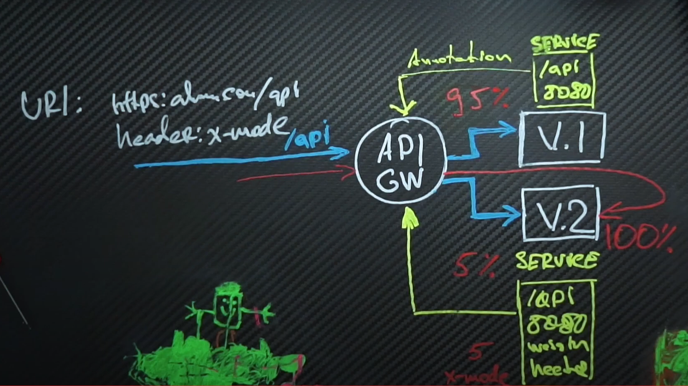 

## Coding Session. Helm
1. Заходимо в браузері в репозиторій нашого застосунку `kbot`, та надимаємо точку на клавіатурі для створення `codespace`
2. Налаштовуємо робоче середовище [за першим розділом цієї книги](Налаштування-середовища-розробки)
3. Для автоматичного розгортання системою CI/CD нашого застосунку створимо helm пакет:
```sh
$ helm create -h 
# команда приймає параметром ім'я пакета, так буде називатись створена командою тека в корні проекту 
$ helm create helm
Creating helm
```
Створена директорія буде автоматично заповнена прикладами шаблонів для зміни та налаштування.

4. Залишимо у файлі values.yaml тільки ту частину шаблона що стосується іміджу:  
```yaml
replicaCount: 1

image:
  # вказуємо поточку назву докер хаб акаунту де зберігаються іміджі  
  repository: umanetsvitaliy
  # Overrides the image tag whose default is the chart appVersion.
  tag: "v1.1.1-33f8b7e"
```

```sh
echo $(git describe --tags --abbrev=0)-$(git rev-parse --short HEAD)
v1.1.1-33f8b7e
```
5. Не потрібні шаблони файлів видаляємо, та роздивимось шаблон деплойменту
```sh
$ rm hpa.yaml 
$ rm ingress.yaml 
$ rm service*
```
- Як бачимо в шаблоні ім'я контейнеру вже запрограмовано на значення з файлу `values.yaml` а також дефолтне значення на версію із файлу `Chart.yaml` 
```yaml
        - name: {{ .Chart.Name }}
          securityContext:
            {{- toYaml .Values.securityContext | nindent 12 }}
          image: "{{ .Values.image.repository }}:{{ .Values.image.tag | default .Chart.AppVersion }}"
          imagePullPolicy: {{ .Values.image.pullPolicy }}
```
- Додамо в налаштування змінної середовища, яка буде посилатися на значення з secret з ім'ям `kbot` та ключем `token` 
```yaml
          env:
          - name: TELE_TOKEN
            valueFrom:
              secretKeyRef:
                key: token
                name: kbot
```
- Запрограмуємо щоб ці значення брались з файлу `values.yaml`
```yaml
          env:
          - name: {{ .Values.secret.env }}
            valueFrom:
              secretKeyRef:
                key: {{ .Values.secret.key }}
                name: {{ .Values.secret.name }}
```
- Додамо ці значення у файл  `values.yaml`
```yaml
secret:
  name: "kbot"
  env: "TELE_TOKEN"
  key: "token"
```
6. Це були базові налаштування. Внесемо спеціальну конфігурацію для контейнеру.  
- Наприклад ми можемо додати доступ через `volumeMounts:` до спеціального пристрою `/dev/mem`, що знаходиться на вузлі де розгорнуто контейнер   
```yaml
# додамо секцію 
      volumes:
      - hostPath:
          path: /dev/mem
          type: ""
        name: dev-mem


      containers:
        - name: {{ .Chart.Name }}
          securityContext:
            {{- toYaml .Values.securityContext | nindent 12 }}


          volumeMounts:
          - mountPath: /dev/mem
            name: dev-mem
```
- Додамо альтернативний DNS до якого буде звертатись наш сервер перед тим як звернутись NS Kubernetes  
```yaml
      dnsConfig:
        nameservers:
          - 1.1.1.1
```

7. За допомогою наступної команди перевіримо на помилки нашу конфігурацію:
```sh
$ helm lint ./helm
==> Linting ./helm
[INFO] Chart.yaml: icon is recommended

1 chart(s) linted, 0 chart(s) failed
```

8. Згенеруємо результуючий файл та перевіримо що у нас вийшло:
```sh
 $ helm template kbot ./helm
---
# Source: helm/templates/deployment.yaml
apiVersion: apps/v1
kind: Deployment
metadata:
  name: kbot-helm
  labels:
    helm.sh/chart: helm-0.1.0
    app.kubernetes.io/name: helm
    app.kubernetes.io/instance: kbot
    app.kubernetes.io/version: "1.16.0"
    app.kubernetes.io/managed-by: Helm
spec:
  replicas: 1
  selector:
    matchLabels:
      app.kubernetes.io/name: helm
      app.kubernetes.io/instance: kbot
  template:
    metadata:
      labels:
        helm.sh/chart: helm-0.1.0
        app.kubernetes.io/name: helm
        app.kubernetes.io/instance: kbot
        app.kubernetes.io/version: "1.16.0"
        app.kubernetes.io/managed-by: Helm
    spec:
      dnsConfig:
        nameservers:
          - 1.1.1.1
      securityContext:
        null
      volumes:
      - hostPath:
          path: /dev/mem
          type: ""
        name: dev-mem
      containers:
        - name: helm
          securityContext:
            privileged: true
          volumeMounts:
          - mountPath: /dev/mem
            name: dev-mem
          image: "umanetsvitaliy:v1.1.1-33f8b7e"
          env:
          - name: TELE_TOKEN
            valueFrom:
              secretKeyRef:
                key: token
                name: kbot
```
9. Робимо коміт та тег `v.1.1.2` для наших змін у коді  

### [Практичне завдання до лекційного матеріалу](https://github.com/vit-um/kbot/blob/main/README.md)