## Хмарні провайдери

Комп'ютерні ресурси, такі як віртуальні машини, обчислювальна потужність, бази даних та інші сервіси, можуть бути доступні користувачам через інтернет. Хмарні ресурси надаються хмарними
провайдерами, такими як `Amazon Web Services` (AWS), Microsoft `Azure` та `Google Cloud Platform`. 

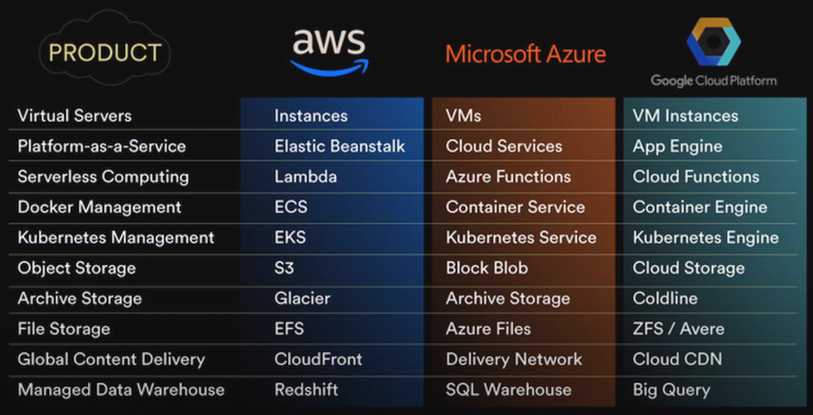

Інструменти хмарних ресурсів включають такі сервіси як:  
- моніторинг, 
- автоматизацію, 
- управління базами даних. 

Управління хмарними ресурсами може здійснюватись за допомогою `UI`, `API REST` або `CLI`

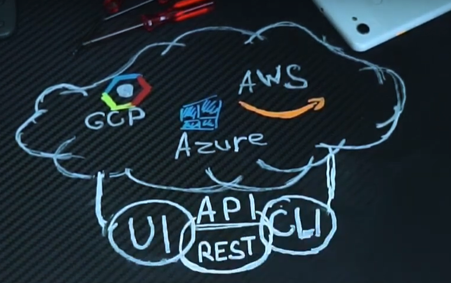  

Найпростішим способом є UI, як приклад можна згадати як це робиться в [Google Cloud Platform](https://console.cloud.google.com/kubernetes/auto/add)

Щоб створити кластер за допомогою `REST API` нам потрібно надіслати HTTP-запит до хмарної платформи складений на будь якій мові програмування.   

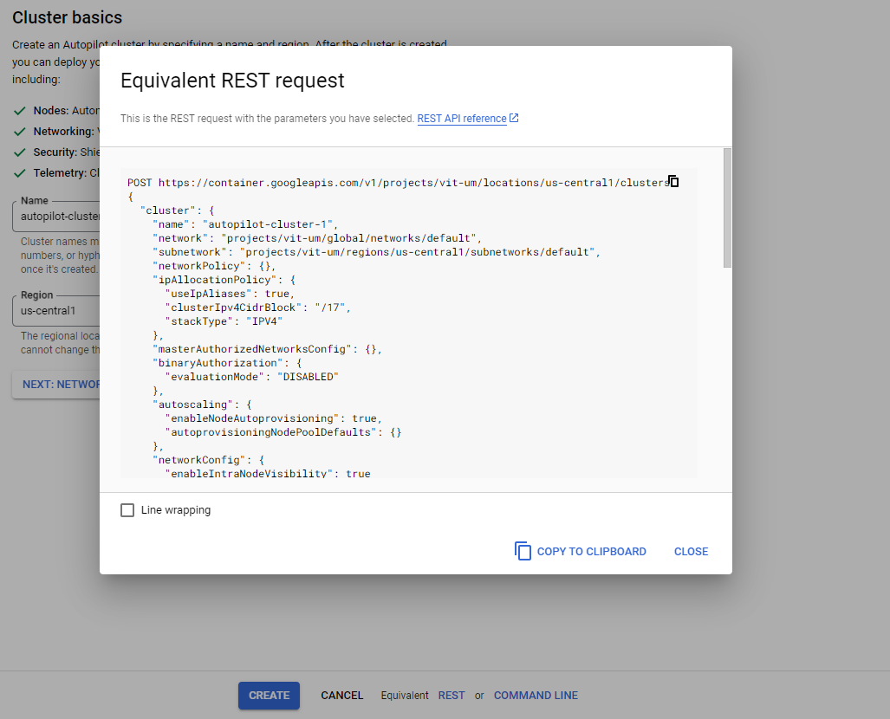 

Або вже знайомий нам метод створення кластеру за допомогою командного рядка:

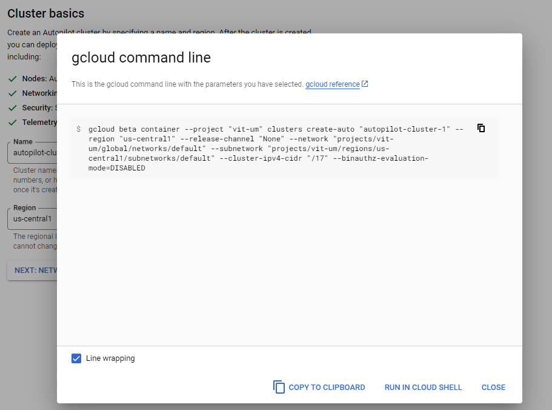 

До автоматизованих систем створення та управління кластером (Infrastructure as code) можемо віднести [Terraform](https://www.terraform.io/use-cases/infrastructure-as-code). Тут нам потрібно написати конфігураційний файл Terraform, який визначає бажаний стан інфраструктури:  

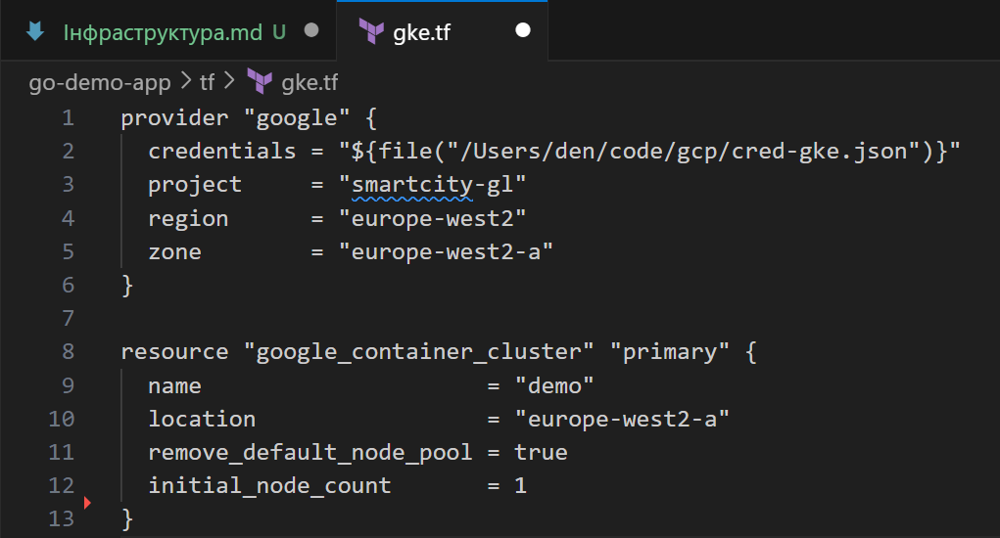 


`Дата-центри або ЦОД` використовуються для зберігання, управління та обробки цифрових даних, і ними керують організації або компанії, які пропонують хмарні обчислення або інші ІТ-послуги. ЦОД класифікуються за рівнем безпеки та надійності. Тут важливо розуміти такі поняття як:
- Region - окремі географічні локації де хмарні провайдери пропонують свої послуги
- Zone - ізольовані місця в межах регіону, що забезпечують підвищену надійність та стабільність 
- Multi Region - декілька регіонів у межах однієї географічної області, що забезпечують HA та можливість аварійного відновлення. 

Існує чотири основних типів `хмарних ресурсів`:  
- публічні
- приватні
- гібридні 
- мульти-хмарні

Модель обчислень, коли користувачі отримують доступ до обчислювальних ресурсів через Інтернет, а не розміщують їх локально — це `Хмарні обчислення`, які можуть приймати наступні форми:  
- інфраструктуру як послугу (IaaS), 
- платформу як послугу (PaaS),
- програмне забезпечення як послугу (SaaS).

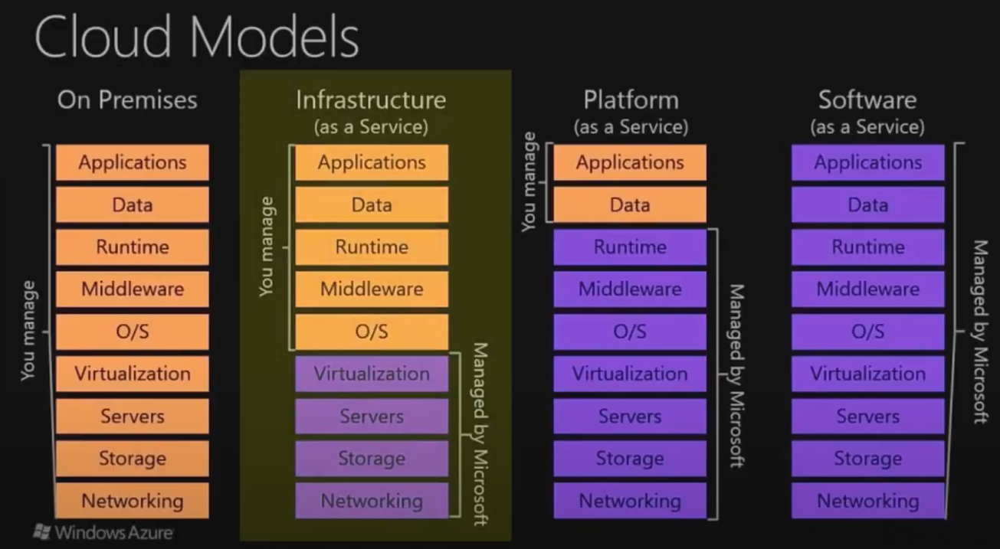  

`Cloud Native` або Хмарні технології — термін, що використовується для опису додатків і сервісів, призначених для роботи в хмарній інфраструктурі з використанням хмарних інструментів і технологій.

`Хмарні додатки`, як правило, мають високу масштабованість, розподіленість та відмовостійкість і часто створюються з використанням архітектур контейнеризації та мікросервісів.

`Хмарне сховище` — послуга, яка дозволяє користувачам зберігати цифрові дані та
отримувати до них доступ через Інтернет. Зазвичай пропонується хмарними провайдерами як послуга за
передплатою.

`Канали передачі даних`, якими дані передаються всередині ЦОД та між комп'ютерними системами, можуть включати дротові та бездротові з'єднання, такі як кабелі Ethernet, оптоволоконні кабелі та інше. 

Час, необхідний для передачі даних між двома точками мережі — `мережева затримка`. На неї може впливати багато факторів, зокрема відстань між двома точками, якість каналу передачі даних і час
обробки, необхідний мережевим пристроям. 

`Edge` - модель обчислень, при якій обробка і зберігання даних переміщується ближче до краю мережі,
поблизу джерела даних, для зменшення мережевих затримок і підвищення продуктивності додатків, які потребують обробки даних у реальному часі, таких як пристрої Інтернету речей та автономні
транспортні засоби.

Керування `хмарним бюджетом` є важливим аспектом для компаній, оскільки дозволяє контролювати витрати та планувати ресурси.

Управління хмарною Інфраструктурою зазвичай відбувається за допомогою IAC - методології, що полягає в описі інфраструктури в програмному коді, що дозволяє автоматизувати процеси управління та розгортання інфраструктури. Це дозволяє швидко створювати та масштабувати інфраструктуру, що використовується для підтримки хмарних ресурсів.

## Хмарні ресурси, інструменти та бюджет

`Google Cloud Platform` пропонує різноманітні сервіси, які можна використовувати для DevOps. Ці сервіси надають командам DevOps комплексний набір інструментів для створення, тестування, розгортання та моніторингу додатків у хмарі: [Google Cloud Platform Services Summary](https://cloud.google.com/terms/services). Використовуючи ці сервіси, команди DevOps можуть впорядкувати свої робочі процеси,автоматизувати їх, а також підвищити загальну якість і надійність додатків і сервісів. 

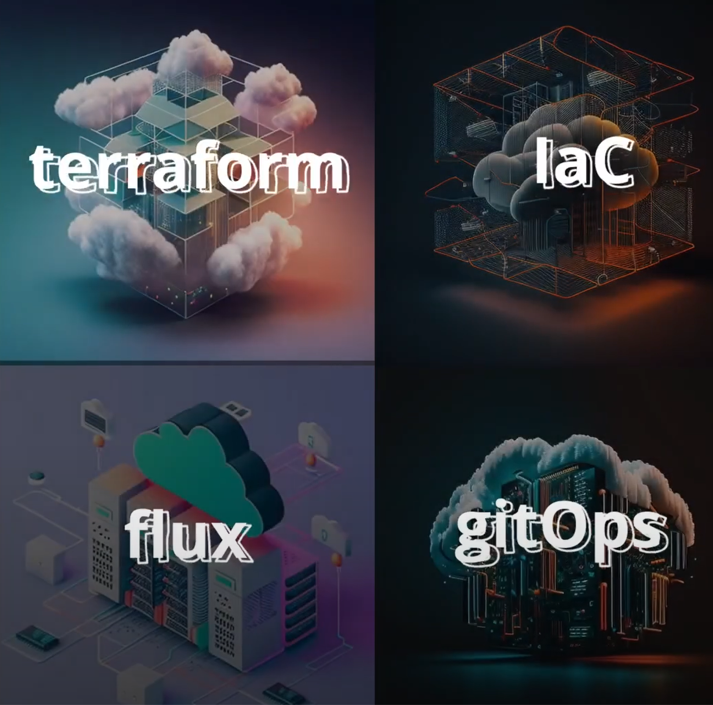 

`Compute Engine` — віртуальна машина, яку можна використовувати для запуску додатків або сервісів у хмарі.

`Kubernetes Engine (GKE)` — сервіс для запуску контейнерних додатків, який дозволяє користувачам автоматизувати розгортання, масштабування та управління контейнерними додатками.

`Cloud Build` — платформа безперервної інтеграції та безперервного доставляння (CI/CD), яка дозволяє розробникам швидко та надійно створювати, тестувати та розгортати додатки.  

`Cloud Run` — повністю керована безсерверна (serverless) платформа,яка дозволяє розробникам запускати HTTP-контейнери без стану (state-less), не турбуючись про базову інфраструктуру.

`Cloud Functions` — serverless обчислювальна платформа, яка дозволяє розробникам запускати код без необхідності керувати серверами.

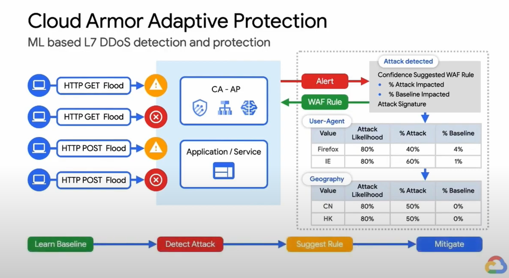 

`Cloud Storage` — масштабований сервіс зберігання об'єктів (object storage), що дозволяє користувачам зберігати та отримувати дані в хмарі.

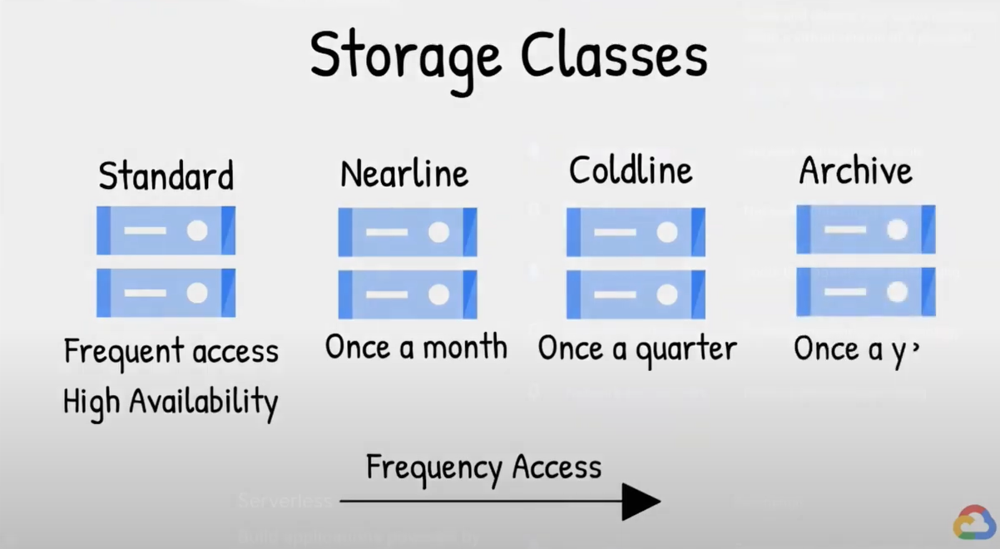

`Cloud SQL` — сервіс керованих реляційних баз даних, що дозволяє користувачам запускати бази даних у хмарі.

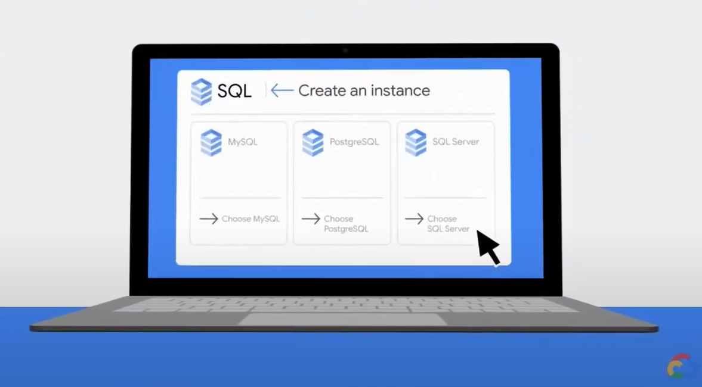

`Cloud Monitoring` — сервіс моніторингу, який забезпечує видимість продуктивності, часу безвідмовної роботи та стану додатків та інфраструктури.
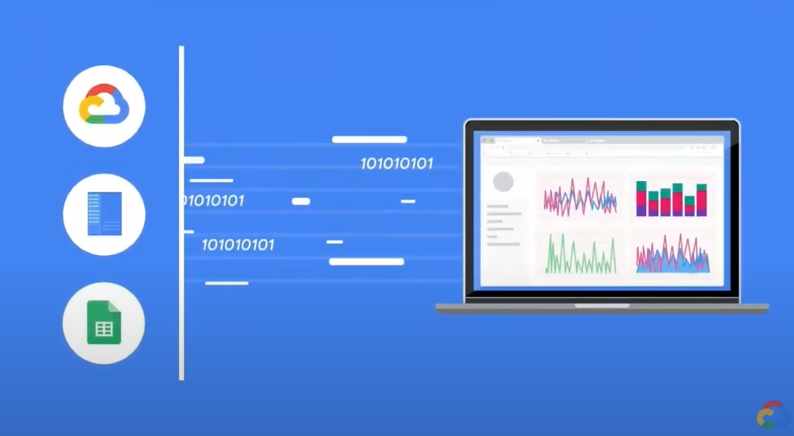 
 
`Cloud Logging` — сервіс ведення журналів, який дозволяє користувачам зберігати, шукати та аналізувати журнали, створені програмами та інфраструктурою.

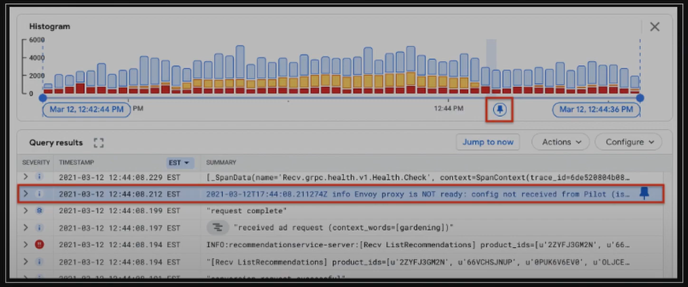

`Cloud Trace` — розподілений сервіс трасування, який дозволяє користувачам відстежувати запити через складну систему та виявляти вузькі місця в продуктивності.

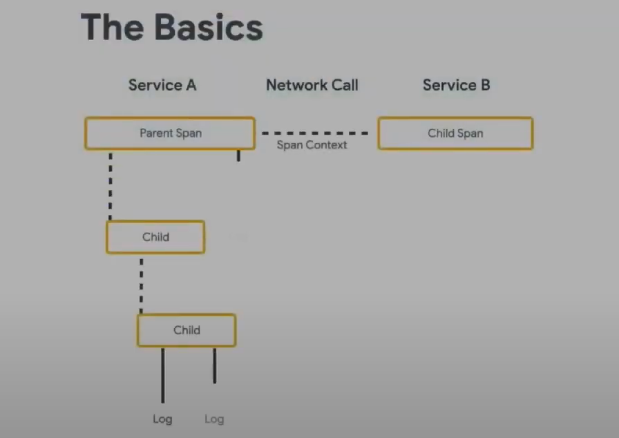 

Оскільки все більше організацій переносять свої продукти та сервіси в хмару, управління витратами стає все більш важливим питанням. `Управління витратами на хмарну інфраструктуру` передбачає оптимізацію використання хмари з метою мінімізації витрат,забезпечуючи при цьому задоволення потреб організації.

IaC передбачає наявність опису інфраструктури, її параметрів та властивостей у вигляді коду. Одним з найпотужніших інструментів для цієї задачі є [Terraform](https://www.terraform.io/use-cases/infrastructure-as-code) А для GitOps - це [Flux](https://fluxcd.io/flux/concepts/)  


**Найкращі практики управління витратами на хмарну інфраструктуру:**  
- Планування та прогнозування  

Організації повинні чітко розуміти свої потреби в хмарній інфраструктурі та моделі її використання. Вони також повинні мати чітке уявлення про те, як провайдери хмарних послуг стягують плату за свої послуги. Озброївшись цією інформацією, організації можуть скласти бюджет і спрогнозувати свої потреби в хмарній інфраструктурі з плином часу.

- Оптимізація використання ресурсів

Одним з найефективніших способів управління витратами на хмарну інфраструктуру є оптимізація використання ресурсів. Це передбачає виявлення невикористаних ресурсів та їх усунення. Наприклад, якщо віртуальна машина працює, але не використовується, її можна вимкнути, щоб заощадити кошти. Хмарні провайдери часто пропонують інструменти, які можуть допомогти виявити такі ресурси та надати рекомендації щодо оптимізації.

- Використання зарезервованих інстансів

`Reserved Instances (RI)` — це цінова модель, яку пропонують хмарні провайдери, що дозволяє організаціям зарезервувати потужності на певний період часу за зниженою вартістю. Це може бути ефективним способом заощадити витрати для робочих навантажень, які, як очікується, будуть довготривалими. Організації також можуть
використовувати RI, щоб зафіксувати ціну на певний період часу, що може допомогти з бюджетуванням та прогнозуванням.

- Використання спотових інстансів 

`Спотові екземпляри` — це модель ціноутворення, яку пропонують деякі хмарні провайдери, що дозволяє організаціям робити ставки на невикористані хмарні потужності. Це може бути ефективним способом заощадити витрати на робочі навантаження, які є гнучкими і не мають фіксованих термінів виконання. Спотові екземпляри можуть бути значно дешевшими, ніж екземпляри на вимогу, але вони супроводжуються ризиком переривання, якщо спотова ціна перевищує
ціну пропозиції.  

- Відстежуйте та аналізуйте використання 

Ефективне управління витратами на хмарну інфраструктуру вимагає постійного моніторингу та аналізу моделей використання. Організації повинні мати чітке розуміння того, які ресурси використовуються, як вони використовуються і ким. Це може допомогти визначити сфери, де витрати можна скоротити або оптимізувати, наприклад, виявити ресурси, що простоюють, або знайти більш економічно ефективні послуги.

- Використовуйте автоматизацію та оркестрацію

Інструменти автоматизації та оркестрації можуть допомогти оптимізувати управління хмарною інфраструктурою та зменшити витрати. Наприклад, автоматизоване масштабування може гарантувати, що ресурси надаються та вилучаються за потребою, зменшуючи ризик надмірного або недостатнього надання ресурсів.

`Інструменти оркестрування` допомагають спростити розгортання та управління складними додатками, зменшуючи потребу в ручному втручанні та знижуючи ризик помилок.

Ефективне управління витратами на хмарну інфраструктуру вимагає поєднання `планування`, `оптимізації`, `аналізу` та `автоматизації`. Дотримуючись цих найкращих практик, організації можуть оптимізувати використання хмарної інфраструктури, щоб мінімізувати витрати, забезпечуючи при цьому задоволення своїх бізнес-потреб.

Для підрахунку вартості хмарних рішень Гугла є [Google Cloud Pricing Calculator](https://cloud.google.com/products/calculator-legacy) 

[Infracost](https://www.infracost.io/docs/) — сервіс, що аналізує код інфраструктури в Terraform та дає кошторис витрат на її утримання.  

## Інфраструктура як код
[Terraform](https://www.terraform.io/) — це інструмент Infrastructure as Code (IaC), що він дозволяє вам керувати своєю інфраструктурою за допомогою коду. Це полегшує автоматизацію створення та управління вашою інфраструктурою, а також гарантує, що ваша інфраструктура є
послідовною та повторюваною.

`Terraform ресурси` — це будівельні блоки вашої інфраструктури, що представляють різні компоненти вашої інфраструктури, такі як віртуальні машини, балансувальники навантаження і бази даних. Ви визначаєте ресурси в конфігураційних файлах Terraform, а Terraform
використовує ці визначення для створення та управління інфраструктурою.

`Провайдери` — це плагіни, які Terraform використовує для взаємодії з різними інфраструктурними платформами, такими як AWS, Google Cloud і Azure. [Кожен провайдер](https://registry.terraform.io/) має власний набір ресурсів, які ви можете використовувати для управління своєю інфраструктурою. Ви вказуєте провайдера, якого хочете використовувати, у файлі конфігурації Terraform.

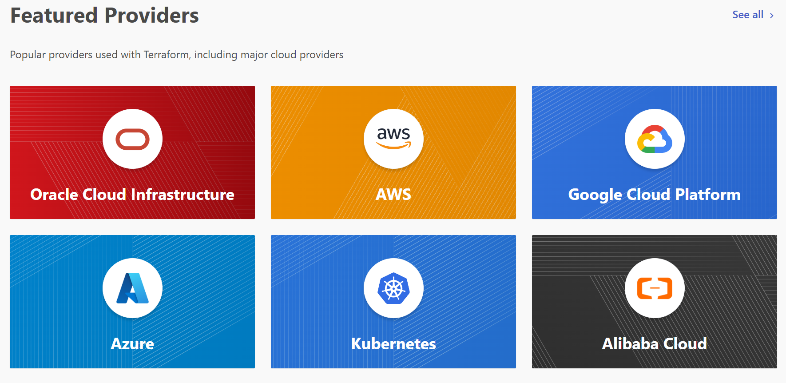  

`Мова конфігурації Terraform (HCL)` — це декларативна мова, яка дозволяє вам вказати, як ви хочете, щоб ваша інфраструктура була налаштована. HCL розроблена таким чином, щоб її було легко читати і писати, і щоб ви могли визначати складні конфігурації інфраструктури в стислій і читабельній формі.

[Синтаксис мови](https://developer.hashicorp.com/terraform/language/syntax/configuration) побудовано навколо двох основних синтаксичних елементів:
- аргументів - що присвоюють значення кожному імені
```hcl
image_id = "abc123"
```

- блоків - контейнер для контенту, який має свій тип
```hcl
resource "aws_instance" "example" {
  ami = "abc123"

  network_interface {
    # ...
  }
}
```
У тілі блоку можуть бути вкладені елементи та блоки, створюючи ієрархію
Певний тип блоку може мати будь яку кількість необхідних міток, або не мати жодної:

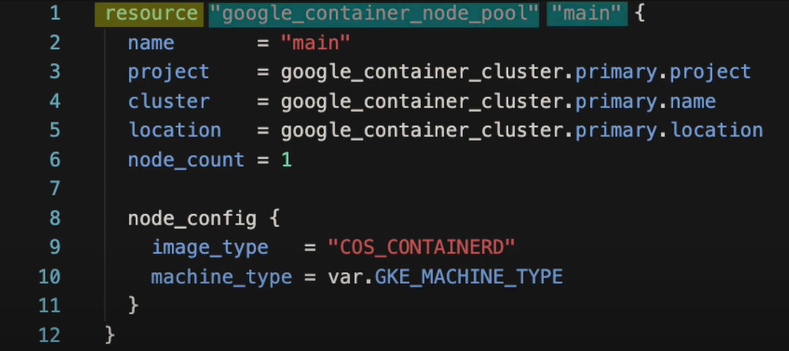

Вирази посилаються або обчислюють значення в конфігурації, можуть використовувати первні функції. Докладніше про синтаксис мови [тут](https://github.com/hashicorp/hcl/blob/main/hclsyntax/spec.md) 

`Cтан Terraform` — це запис про поточний стан вашої інфраструктури. Terraform використовує стан, щоб відстежувати створені ресурси і визначати, які зміни необхідно внести в інфраструктуру, щоб привести її до бажаного стану. Стан зберігається у файлі і може зберігатися віддалено в таких інструментах як Google Cloud Storage або AWS S3.  

`Модулі` — це спосіб організації конфігураційних файлів Terraform і повторного використання коду в різних проєктах. Модулі дозволяють визначити набір ресурсів, які можуть бути використані для створення певного типу інфраструктури, наприклад, вебсервера або кластера баз
даних. Потім ви можете повторно використовувати ці модулі в різних проєктах або ділитися ними з іншими користувачами.

`terraform plan` — аналізує ваші конфігураційні файли і генерує план створення або модифікації вашої інфраструктури. План показує, які ресурси будуть створені або змінені,
а також будь-які потенційні помилки або конфлікти, які можуть виникнути.

`terraform apply` — виконує план і створює або змінює вашу інфраструктуру. Terraform створить ресурси, які ще не існують, змінить ресурси, які змінилися, і видалить ресурси, які більше не потрібні.

`terraform destroy` — ця команда видалить всі ресурси, які створив Терраформ, коли інфраструктура вже не потрібна. Це гарантує, що ви не будете продовжувати нести витрати на ресурси, які ви більше не використовуєте.

### [Практична частина лекції](https://youtu.be/s8qSIruvAj4?si=e6Sayep--NAXc45D&t=224)

1. Дії будемо виконувати в GOOGLE CLOUD SHELL. 
- [Підготуємо середовище розробки](Налаштування-середовища-розробки) та перевіримо встановлену версію Terraform  
```sh
$ sudo apt install zsh

$ terraform -version
Terraform v1.6.5
on linux_amd64
```
- Щоб взаємодіяти з ресурсами будь якого провайдеру, він повинен бути визначеним в `required_providers`, основному блоку налаштування `Terraform`  
```HCL
terraform {
  required_providers {
    google = {
      source  = "hashicorp/google"
      version = "4.52.0"
    }
  }
}
```
- Terraform може автоматично встановлювати провайдерів під час автоматизації робочого каталогу:
```sh
$ terraform init
```
- Після виконання команди автоматично буде створено файл блокування `.terraform.lock.hcl`, щоб зафіксувати версію провайдера 
- [Кожен провайдер](https://registry.terraform.io/providers/hashicorp/google/latest/docs/guides/getting_started) додає намір типів ресурсів або джерел даних, якими може керувати Terraform. Без визначення провайдеру тераформ не може керувати жодним типом ІС.  
- Додамо [конфігурацію для GCP](https://registry.terraform.io/providers/hashicorp/google/latest/docs/guides/getting_started#configuring-the-provider), наприклад аутентифікація у Cloud-провайдера та налаштування проекту.   
- Додамо проект та регіон як параметри та подивимось як воно працює: 
```
provider "google" {
  # Configuration options
  project = var.GOOGLE_PROJECT
  region  = var.GOOGLE_REGION
}
```
- В доданому блоці оби два параметри посилаються на значення вхідних змінних, опишемо їх. Якщо в змінній не описане значення за замовчуванням, то при розгортанні ІС тераформ запитає його.
```
variable "GOOGLE_PROJECT" {
  type        = string
  description = "GCP project name"
}

variable "GOOGLE_REGION" {
  type        = string
  default     = "us-central1-c"
  description = "GCP region to use"
}
```
- `Ресурси` - це найважливіші елементи мови тераформ. Кожен блок ресурсів описує один або декілька об'єктів ІС такі як наприклад [google_container_cluster](https://registry.terraform.io/providers/hashicorp/google/latest/docs/resources/container_cluster) з ім'ям `demo` на три ноди:
```
resource "google_container_cluster" "demo" {
  name     = "demo"
  location = var.GOOGLE_REGION

  initial_node_count       = 3
}
```
- відформатуємо наш код, перевіримо його синтаксис та сплануємо нашу ІС командами:
```sh
✗ terraform fmt
main.tf

✗ terraform validate
Success! The configuration is valid.

✗ terraform plan
var.GOOGLE_PROJECT
  GCP project name
  Enter a value: vit-um

Plan: 1 to add, 0 to change, 0 to destroy.

Note: You didn't use the -out option to save this plan, so Terraform can't guarantee to take exactly these actions
if you run "terraform apply" now.

```
- план відображає ресурси які будуть створені, оновлені або видалені, але без застосування їх на реальній ІС. Ми бачимо, що 1 об'єкт буде додано, 0 змінено та 0 видалено. 
- цей план може бути переглянуто перед внесенням змін, або збережено у файл для подальшого використання цей варіант конфігурації:
```sh
✗ export TF_VAR_GOOGLE_PROJECT=vit-um
✗ terraform plan -out demo

Saved the plan to: demo

To perform exactly these actions, run the following command to apply:
    terraform apply "demo"
```
- Зменшимо кількість нод до 1, видалимо пул нод що створюється за замовчуванням `remove_default_node_pool = true`, та створимо свій з описаними параметрами:
```
resource "google_container_node_pool" "main" {
  name       = "main"
  project    = google_container_cluster.demo.project
  cluster    = google_container_cluster.demo.name
  location   = google_container_cluster.demo.location
  node_count = var.GKE_NUM_NODES

  node_config {
    machine_type = var.GKE_MACHINE_TYPE
  }
}
```
- Визначимо нові щойно додані змінні
```
variable "GKE_MACHINE_TYPE" {
  type        = string
  default     = "g1-small"
  description = "Machine type"
}

variable "GKE_NUM_NODES" {
  type        = number
  default     = 2
  description = "GKE nodes number"
}
```
- Затасуємо зміни та розгорнемо ІС
```sh
✗ terraform apply
Apply complete! Resources: 2 added, 0 changed, 0 destroyed.
``` 
- За замовчуванням файл конфігурації створеної ІС зберігається у файлі `terraform.tfstate` Але його можна зберігати віддалено. 
- Цей файл з локальним станом в подальшому використовується для створення планів та внесення змін до ІС:
```sh
✗ terraform show
# google_container_cluster.demo:
resource "google_container_cluster" "demo" {
    cluster_ipv4_cidr           = "10.48.0.0/14"
    enable_autopilot            = false
    enable_binary_authorization = false

✗ terraform state list
google_container_cluster.demo
google_container_node_pool.main
```
- Перед будь якою операцією тераформ актуалізує файл, щоб оновити стан до реальної ІС.

2. Важливим елементом Terraform є [Data Sources](https://registry.terraform.io/providers/hashicorp/google/latest/docs/data-sources/container_cluster), які дозволяють динамічно отримувати дані з API, або інших уже створених ресурсів Тераформ  

- демонстрація того як можна використовувати вбудовані `функції тераформ`, посилання на джерела даних :
```
data "google_compute_instance" "nodes" {
  for_each = toset(data.google_compute_instance_group.node_instance_groups.instances[*])
  self_link = each.key
}
```
- цикли та вихідні значення для маніпулювання даними:
```
output "node_ip" {
  value = [for node in data.data.google_compute_instance.nodes : node.network_interface[0].access_config[0].nat_ip]
}
```
- Наприклад нам після створення кластеру потрібно отримати реальні IP адреси, що були автоматично призначені віртуальним машинам з нового node-пулу  

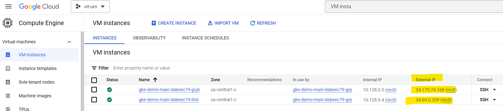 

- Створимо перший `Data Source` для отримання `node_instance_groups`. Гугл Cloud управляє ВМ з однаковими налаштуваннями через через так званні групи інстансів.  `node_pool` - один з прикладів як ці групи застосовуються. Створений блок конфігурації визначає Data Source який отримує інформацію про групу інстансів, тоб-то ВМ "Compute Engine" або "VM instances".
```
data "google_compute_instance_group" "node_instance_groups" {
  self_link = google_container_cluster.demo.node_pool[0].managed_instance_group_urls[0]
}
```
- `google_compute_instance_group` - отримує інформацію за параметром `self_link` Це посилання на URL адресу API GoogleCloud, пов'язаним с першим пулом вузлів кластера з назвою demo 
```sh 
✗ terraform apply  
✗ terraform console

> google_container_cluster.demo.node_pool[0].managed_instance_group_urls[0]
"https://www.googleapis.com/compute/v1/projects/vit-um/zones/us-central1-c/instanceGroups/gke-demo-main-dabeec79-grp"
```
- Другий Data Sources буде містити дані про самі ВМ в групі, або іншими словами в створеному нашою конфігурацією  "google_container_node_pool"-і з назвою "main"
```
data "google_compute_instance" "nodes" {
  for_each = toset(data.google_compute_instance_group.node_instance_groups.instances[*])
  self_link = each.key
}
```
- Функція [toset](https://developer.hashicorp.com/terraform/language/functions/toset) перетворює список на множину, в даному випадку це список інстансів:    
```sh
> toset(["a", "b", "c"])
toset([
  "a",
  "b",
  "c",
])

> toset(data.google_compute_instance_group.node_instance_groups.instances[*])
toset([
  "https://www.googleapis.com/compute/v1/projects/vit-um/zones/us-central1-c/instances/gke-demo-main-dabeec79-gcj6",
  "https://www.googleapis.com/compute/v1/projects/vit-um/zones/us-central1-c/instances/gke-demo-main-dabeec79-lln0",
])

```
- Мета аргумент `for_each` приймає утворену множину (set) та створює екземпляр для кожного елемента в наборі. В даному випадку Data Sources згенерований для кожної ВМ в instance групі.

- Параметр `self_link` має значення `each.key`, що э url адресою поточного instance, який обробляється в циклі, а отримані данні будуть збережені у вигляді мап з url адресами інстансів у якості ключів.

- output "node_ip" - це блок конфігурації визначає вихідні данні тераформ модулів:
```
output "node_ip" {
  value = [for node in data.google_compute_instance.nodes : node.network_interface[0].access_config[0].nat_ip]
}
```
- тут в циклі ми робимо перебір вузлів групи інстансів для отримання ip адреси першого мережевого інтерфейсу кожного вузла.

- Цей вивід ми побачимо після виконання команди `apply` або `destroy`:
```sh
Outputs:

node_ip = [
  "34.170.74.168",
  "34.69.0.209",
]
```
3. Рекомендації що до декомпозиції [кода](tf/main.tf) наведені в  [Terraform Best Practices](https://www.terraform-best-practices.com/v/uk/)

4. Коли інфраструктура не потрібна використовують команду `✗ terraform destroy` 
- Після запуску команди тераформ зчитує конфігураційні файли і порівнює поточний стан інфраструктури з бажаним. 
- Після перегляду плану та підтвердження тераформ видалить ресурси які більше не потрібні та вказані в конфігурації  
```sh
✗ terraform destroy 

Destroy complete! Resources: 2 destroyed.
```


## Coding Session. Terraform + Flux
Знайомство з концепцією тераформ модулів, розгорнемо набір інструментів що реалізують повний повний автоматичний цикл на базі GitOps та Kubernetes.
- Terraform створить  Kubernetes cluster та розгорне Flux 
- Flux почне узгоджувати стан ІС та застосунків базуючись на джерелі у GitHub
- GitHub в свою чергу також буде створено за допомогою Terraform

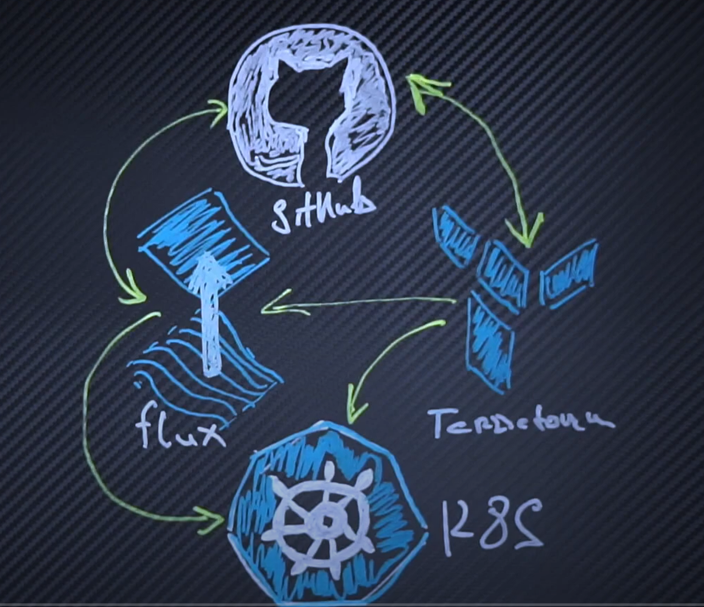


Для побудови ІС використаємо наступні модулі:  
- github-repository
- fluxcd-flux-bootstrap
- google-ske-cluster  
- hashicorp-tls-keys 

[Модулі](https://developer.hashicorp.com/terraform/language/modules/sources) можна завантажувати або з локальної файлової системи, або з [віддаленого джерела](https://registry.terraform.io/browse/modules)

Модуль Terraform це набір файлів в одному каталозі. Навіть проста конфігурація, що складається з одного .tf-файлу є модулем.    
 
Коли програма тераформ запускається з каталогу що містить tf-файли, то він вважається кореневим модулем.  

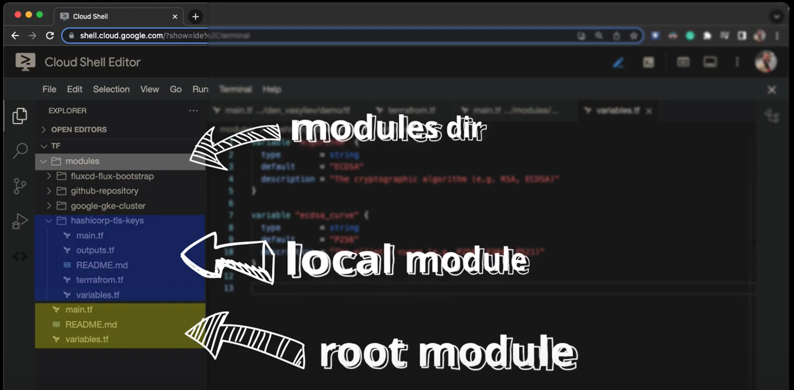 

Структура каталогу локального модулю, назва якого складається з частин: провайдер-ім'я модулю включає наступні файли:  
- `terraform.tf`- файл конфігурації тераформ, де зазначено провайдера що використовує модуль
- `main.tf`- основний файл модулю де описаний ресурс із зазначення початкових налаштувань 
- `variables.tf` - файл що описує змінні  
- `output.tf`- описує вихідні дані  
- `README.md` - для документування та інструкцій використання  

Виклик модулю здійснюється в блоці module за допомогою аргументу source, також в модулі зазначаються аргументи що підтримує модуль, наприклад `algorithm = "RSA"`. Це вхідні змінні. Наприклад алгоритм для генерації ключів RSA:  

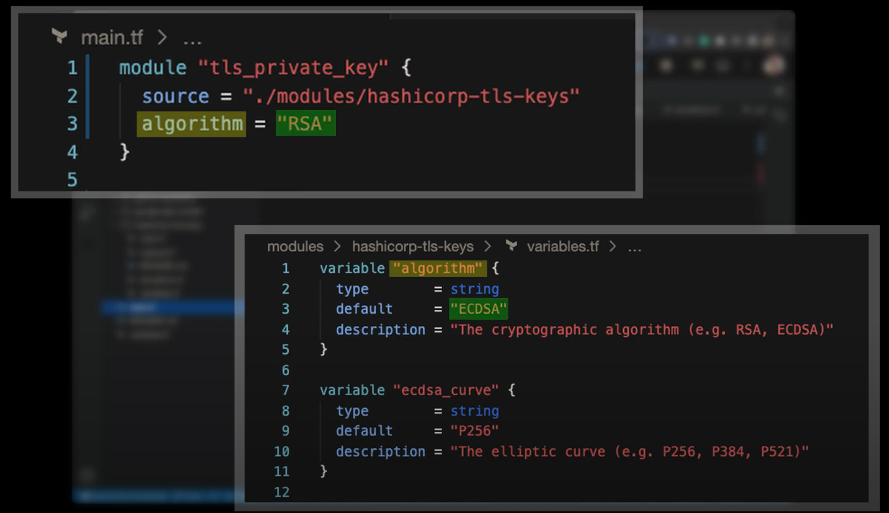  

1. Виконаємо ініціалізацію terraform:
```sh
✗ terraform init
Terraform has been successfully initialized!
```
після її виконання в разі локальних модулів тераформ створить символічні лінки в каталозі .terraform та завантажить віддалені модулі в цей каталог:

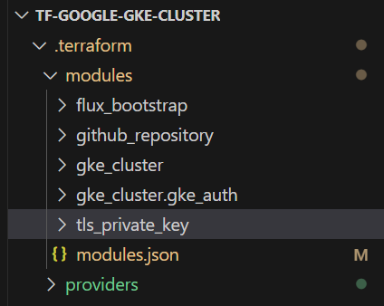 

2. Виконаємо початкові команду `terraform apply` та перевіримо результат у tfstate-файлі, де ми побачимо згенеровану пару ключів та аргументи в яких можна посилатись наприклад в output блоці.

3. Ми можемо створити окремий репозиторій для новоствореного модуля, та змінити `source` аргумент на посилання до віддаленого репозиторію: "github.com/vit-um/tf-google-gke-cluster".   Опишемо основні компонентні модулі в головному файлі кореневого модуля:
```hcl
module "github_repository" {
  source                   = "github.com/den-vasyliev/tf-github-repository"
  github_owner             = var.GITHUB_OWNER
  github_token             = var.GITHUB_TOKEN
  repository_name          = var.FLUX_GITHUB_REPO
  public_key_openssh       = module.tls_private_key.public_key_openssh
  public_key_openssh_title = "flux0"
}

module "gke_cluster" {
  source         = "github.com/den-vasyliev/tf-google-gke-cluster"
  GOOGLE_REGION  = var.GOOGLE_REGION
  GOOGLE_PROJECT = var.GOOGLE_PROJECT
  GKE_NUM_NODES  = 1
}

module "flux_bootstrap" {
  source            = "github.com/den-vasyliev/tf-fluxcd-flux-bootstrap"
  github_repository = "${var.GITHUB_OWNER}/${var.FLUX_GITHUB_REPO}"
  private_key       = module.tls_private_key.private_key_pem
  config_path       = module.gke_cluster.kubeconfig
}

module "tls_private_key" {
  source = "github.com/den-vasyliev/tf-hashicorp-tls-keys"
  algorithm = "RSA"
}
```
- Зверніть увагу, що модулі на локальній файловій системі використовуватись не будуть.  
- В модулі `flux_bootstrap` бачимо посилання посилання для значень `private_key` на модуль `tls_private_key`,
- В цьому ж модулі аргумент `config_path` вказує на значення `gke_cluster.kubeconfig`,
- Тоб-то значення файлу `kubeconfig`, що створюється після розгортання кластеру буде використано наступним залежним від нього модулем `flux_bootstrap`.

4. Додамо в консолі дві змінних, а саме [логин та кокен](https://github.com/settings/tokens) с правами створення репозиторіїв на github:
```sh
$ tf init
Terraform has been successfully initialized!
$ export TF_VAR_GITHUB_OWNER=vit-um
$ export TF_VAR_GITHUB_TOKEN=ghp_HLD0c53mk0psx...

$ tf apply

```
- Після виконання цієї команди будьте обережні з доступом до файлу `terraform.tfstate` в якому містяться чутливі до розголошення данні, в даному випадку ключі до гітхабу.
- Після виконання `tf apply` отримаємо помилку. 

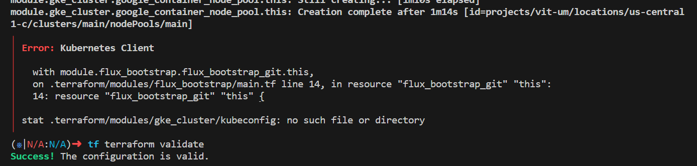 

- Після натяку шановного [@den-vasyliev](https://github.com/den-vasyliev) на те що проблема відноситься до розряду chicken-egg problem, поміняв в `main.tf` місцями описи модулів  "tls_private_key" та "flux_bootstrap" та отримав іншу помилку з авторизацією:

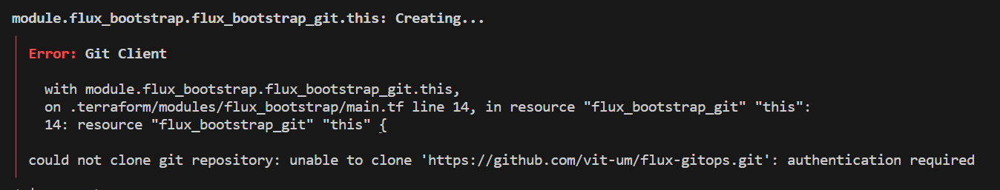 

- Далі знов помилки, вже на етапі планування `tf plan`

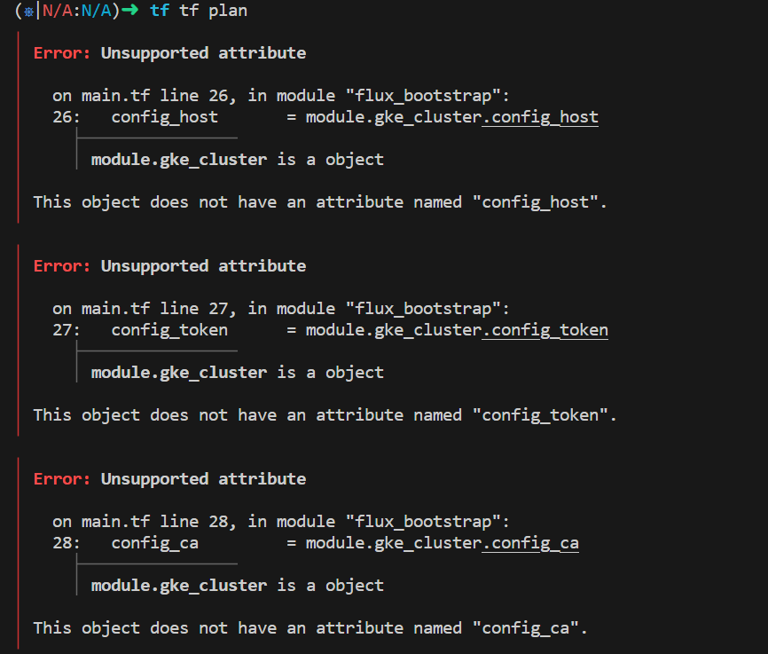  

- Шукаємо відповіді в гілках гіта [@den-vasyliev](https://github.com/den-vasyliev).
- По перше змінюємо output створення кластеру так щоб замість `kubeconfig` отримати параметри для авторизації в робочий репозиторій `flux-gitops` що створюється та видаляється автоматично конфігурацією Terraform
```hcl
# output "kubeconfig" {
#  value       = "${path.module}/kubeconfig"
#  description = "The path to the kubeconfig file"
#}

output "config_host" {
  value = "https://${data.google_container_cluster.main.endpoint}"
}

output "config_token" {
  value = data.google_client_config.current.access_token
}

output "config_ca" {
  value = base64decode(
    data.google_container_cluster.main.master_auth[0].cluster_ca_certificate,
  )
}

output "name" {
  value = google_container_cluster.this.name
}
```
- При створені модуля `flux_bootstrap` в `main.tf` посилаємось на вихідні змінні створені на попередньому кроці модулем `gke_cluster`

- Відповідно `flux` має їх отримати, тому в основному файлі цього модулю зазначаємо:
```hcl
provider "flux" {
  kubernetes = {
    host                   = var.config_host
    token                  = var.config_token
    cluster_ca_certificate = var.config_ca
  }
```
- Також зміниться файл зі зіміними модулю `tf-fluxcd-flux-bootstrap`
- На виході знов помилка:

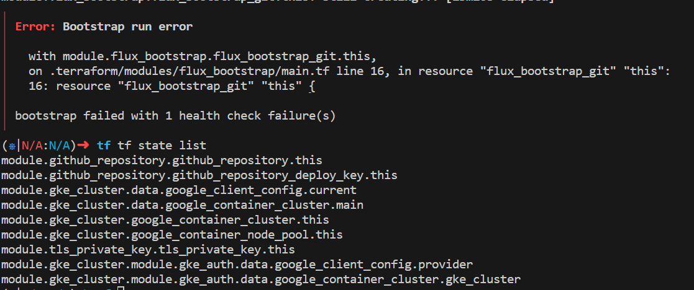  

- Щоб вивести на екран створені модулем змінні додамо їх у файл:
```hcl
output "FLUX_GITHUB_TARGET_PATH" {
  value = var.FLUX_GITHUB_TARGET_PATH
}
``` 

- Створені ресурси:
```sh
$ tf state list
module.github_repository.github_repository.this
module.github_repository.github_repository_deploy_key.this
module.gke_cluster.data.google_client_config.current
module.gke_cluster.data.google_container_cluster.main
module.gke_cluster.google_container_cluster.this
module.gke_cluster.google_container_node_pool.this
module.tls_private_key.tls_private_key.this
module.gke_cluster.module.gke_auth.data.google_client_config.provider
module.gke_cluster.module.gke_auth.data.google_container_cluster.gke_cluster
```

- Дозволимо в файлі `tf/modules/gke_cluster/main.tf` створення "kubeconfig", як результат помилка зникне:
```sh
module.gke_cluster.local_file.kubeconfig
```

- Розміщення файлу в [bucket](https://console.cloud.google.com/storage/browser)  
Щоб розмістити файл state в бакеті, ви можете використовувати команду terraform init з опцією --backend-config. Наприклад, щоб розмістити файл state в бакеті Google Cloud Storage, ви можете виконати наступну команду:
```sh
# Створимо bucket:
$ gsutil mb gs://vit-secret
Creating gs://vit-secret/...

# Перевірити вміст диску:
$ gsutil ls gs://vit-secret
gs://vit-secret/terraform/

# Зберігання файлу конфігурації при ініціалізації  
$ terraform init --backend-config="bucket=vit-secret"  

Warning: Missing backend configuration
│ 
│ -backend-config was used without a "backend" block in the configuration.
│ 
│ If you intended to override the default local backend configuration,
│ no action is required, but you may add an explicit backend block to your
│ configuration to clear this warning:
│ 
│ terraform {
│   backend "local" {}
│ }
```
- Отримаємо помилку. Як створити bucket [читаємо документацію](https://developer.hashicorp.com/terraform/language/settings/backends/gcs#example-configuration) та додаємо до основного файлу конфігурації наступний код:

```hcl
terraform {
  backend "gcs" {
    bucket  = "tf-state-prod"
    prefix  = "vit-secret"
  }
}

```
- Після повторної ініціалізації файл terraform.tfstate стане пустим, а його вміст буде зберігатись в бакеті
```sh
$ terraform init
$ tf show | more

```

5. Конвеєр управління ІС - Flux  

[Flux](https://fluxcd.io/flux/get-started/) передбачає що вся система описується декларативно, контролюється версіями та має автоматизований процес, що гарантує, архівує, зберігає та інше.  

Flux складається з [GitOps Toolkit components](https://fluxcd.io/flux/components/) які фактично є спеціалізованими Kubernetes контролери. 

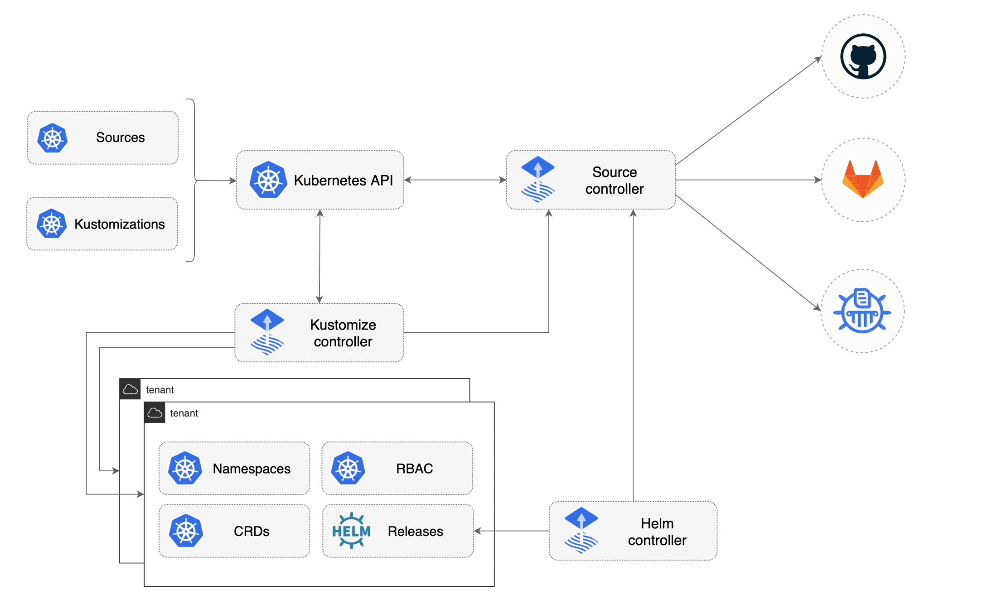  

[Source Controller](https://fluxcd.io/flux/components/source/) реалізує ресурс або джерело з якого буде відбуватись реконселяція або узгодження між актуальним та бажаним станом ІС. Це відбувається за допомогою [Git](https://fluxcd.io/flux/components/source/gitrepositories/), [Helm](https://fluxcd.io/flux/components/source/helmrepositories/) та інших контролерів через Kubernetes API та CRD (Custom Resource Definitions), тоб-то ресурсами розширення Kubernetes.

Зворотній зв'язок про стан ІС у вигляді events, alerts, notifications можна отримувати в стандартні месенджери, web-hucks та системи типу Slack

Створений репозиторій `flux-gitops` містить інфраструктурну директорію `clusters/flux-system/`, що відповідає за компоненти flux на кластері у namespace `flux-system`. Тут можна знайти маніфести для наступних компонентів:
- gotk-components.yaml
- gotk-sync.yaml (містить 2 CRD для GitRepository та Kustomization для синхронізації саме компонентів flux)
- kustomization.yaml - файл конфігурації, що описує які ресурси контролювати

6. Отримаємо доступ до [нового кластеру](https://console.cloud.google.com/kubernetes/list/overview) за допомогою команди:
```sh

$ gcloud container clusters get-credentials main --zone us-central1-c --project vit-um
Fetching cluster endpoint and auth data.
kubeconfig entry generated for main.

# Якщо робота з локальної машини, то попередньо потрібно встановити плагін
$ gcloud components install gke-gcloud-auth-plugin
```
7. Перевіримо список ns по стан поду системи flux:
```sh
➜  k get ns
NAME              STATUS   AGE
default           Active   6h23m
flux-system       Active   155m
gmp-public        Active   6h23m
gmp-system        Active   6h23m
kube-node-lease   Active   6h23m
kube-public       Active   6h23m
kube-system       Active   6h23m
➜  k get po -n flux-system  
NAME                                       READY   STATUS    RESTARTS   AGE
helm-controller-69dbf9f968-cf9kg           1/1     Running   0          156m
kustomize-controller-796b4fbf5d-wzt5g      1/1     Running   0          156m
notification-controller-78f97c759b-9wrb5   0/1     Pending   0          156m
source-controller-7bc7c48d8d-495nb         1/1     Running   0          156m
``` 
- Перевірка подів показала, що всі контролери на місці. По суті контролери це звичайні процеси, що запущені в контейнері та слухають event-loop через Kubernetes-API  

- Для зручності встановимо [CLI клієнт Flux](https://fluxcd.io/flux/installation/)
```sh
curl -s https://fluxcd.io/install.sh | bash
```
- Вивчимо деякі команди CLI Flux
```sh
$ flux get all
NAME                            REVISION                SUSPENDED       READY   MESSAGE                                           
gitrepository/flux-system       main@sha1:7a3534f9      False           True    stored artifact for revision 'main@sha1:7a3534f9'

NAME                            REVISION                SUSPENDED       READY   MESSAGE                              
kustomization/flux-system       main@sha1:7a3534f9      False           True    Applied revision: main@sha1:7a3534f9

$ flux logs -f
2023-12-16T17:48:01.390Z info Kustomization/flux-system.flux-system - Source is not ready, artifact not found 
2023-12-16T17:50:14.799Z info Kustomization/flux-system.flux-system - server-side apply for cluster definitions completed 
```
8. Розбираємо приклад роботи Flux
- Додамо в репозиторій каталог `demo` та файл `ns.yaml` що містить маніфест довільного `namespace`  
```sh
$ k ai "маніфест ns demo"
✨ Attempting to apply the following manifest:

apiVersion: v1
kind: Namespace
metadata:
  name: demo
```
- Після зміни стану репозиторію контролер Flux їх виявить:
    - зробить git clone  
    - підготує артефакт   
    - виконає узгодження поточного стану IC   

У даному випадку буде створено `ns demo`:
```sh
k get ns 
NAME              STATUS   AGE
default           Active   6h57m
demo              Active   4m36s
flux-system       Active   3h8m
```
Це був приклад як Flux може керувати конфігурацією ІС Kubernetes

9. Роздивимось взаємодію Flux з репозиторієм на якому код застосунку.
- застосуємо CLI для генерації маніфестів необхідних ресурсів:
```sh
$ flux create source git kbot \
    --url=https://github.com/vit-um/kbot \
    --branch=main \
    --namespace=demo \
    --export
---
apiVersion: source.toolkit.fluxcd.io/v1
kind: GitRepository
metadata:
  name: kbot
  namespace: demo
spec:
  interval: 1m0s
  ref:
    branch: main
  url: https://github.com/vit-um/kbot
```
- отриманим маніфестом ми визначимо об'єкт за який відповідає source контролер.
- наступною командою згенеруємо helm release, тоб-то об'єкт для HELM-контролера 
```sh
$ flux create helmrelease kbot \
    --namespace=demo \
    --source=GitRepository/kbot \
    --chart="./helm" \
    --interval=1m \
    --export
---
apiVersion: helm.toolkit.fluxcd.io/v2beta2
kind: HelmRelease
metadata:
  name: kbot
  namespace: demo
spec:
  chart:
    spec:
      chart: ./helm
      reconcileStrategy: ChartVersion
      sourceRef:
        kind: GitRepository
        name: kbot
  interval: 1m0s
```
- Зверніть увагу на специфікацію, ми вказуємо:
    - посилання на `sourceRef`
    - шлях до `chart: ./helm`
    - стратегію для узгодження `reconcileStrategy: ChartVersion`   

Або простими словами: "Встанови хелм чарт з репозиторію з ім'ям kbot шлях ./helm` якщо змінилася чарт версія, перевіряти зміни щохвилини.

- Ми можемо імперативно створити ці ресурси в Kubernetes cluster за допомогою `flux cli` або `kubectl`, але то буде не декларативний підхід якого ми прагнемо. 

- Отже додамо маніфести в репозиторій, створивши в каталозі `demo` файли `kbot-gr.yaml` та `kbot-hr.yaml` з отриманими нами маніфестами та перевіримо логи:

```sh
$ flux logs -f
2023-12-16T21:40:54.999Z info GitRepository/flux-system.flux-system - stored artifact for commit 'Update kbot-hr.yaml' 
2023-12-16T21:40:56.108Z info Kustomization/flux-system.flux-system - server-side apply for cluster definitions completed 
2023-12-16T21:40:56.610Z error Kustomization/flux-system.flux-system - Reconciliation failed after 1.567913005s, next try in 10m0s HelmRelease/demo/kbot dry-run failed, error: no matches for kind "HelmRelease" in version "helm.toolkit.fluxcd.io/v1beta2"
```

- Flux побачив додані маніфести, але через якісь помилки з мережею узгодження (Reconciliation) не відбулось. Наступні команди дозволять розгледіти цю помилку ближче:
```sh
$ flux get all
NAME                            REVISION                SUSPENDED       READY   MESSAGE                                           
gitrepository/flux-system       main@sha1:75068d4d      False           True    stored artifact for revision 'main@sha1:75068d4d'

NAME                            REVISION                SUSPENDED       READY   MESSAGE                                                                                                                    
kustomization/flux-system       main@sha1:e473307f      False           False   HelmRelease/demo/kbot dry-run failed, error: no matches for kind "HelmRelease" in version "helm.toolkit.fluxcd.io/v1beta2"

$ flux get all -A
```
- Проаналізуємо журнал kubectl:
```sh
$ kubectl logs -n flux-system deployment/helm-controller | jq -r 'select(.source != null) | .source'
kind source: *v2beta1.HelmRelease
kind source: *v1beta2.HelmChart

$  flux check --pre
► checking prerequisites
✔ Kubernetes 1.27.3-gke.100 >=1.26.0-0
✔ prerequisites checks passed

```
- Колеги підказали, що потрібно поміняти v2beta2 -> v2beta1 у helmrelease і реконсиляція проходить. Перевіряємо на нашому випадку:
```sh
➜ flux get all
NAME                            REVISION                SUSPENDED       READY   MESSAGE                                           
gitrepository/flux-system       main@sha1:fdf255bc      False           True    stored artifact for revision 'main@sha1:fdf255bc'

NAME                            REVISION                SUSPENDED       READY   MESSAGE                              
kustomization/flux-system       main@sha1:fdf255bc      False           True    Applied revision: main@sha1:fdf255bc

➜ flux get all -A
NAMESPACE       NAME                            REVISION                SUSPENDED       READY   MESSAGE                                           
demo            gitrepository/kbot              main@sha1:12f309fe      False           True    stored artifact for revision 'main@sha1:12f309fe'
flux-system     gitrepository/flux-system       main@sha1:fdf255bc      False           True    stored artifact for revision 'main@sha1:fdf255bc'

NAMESPACE       NAME                    REVISION        SUSPENDED       READY   MESSAGE                                    
demo            helmchart/demo-kbot     0.1.0           False           True    packaged 'helm' chart with version '0.1.0'

NAMESPACE       NAME                            REVISION                SUSPENDED       READY   MESSAGE                              
flux-system     kustomization/flux-system       main@sha1:fdf255bc      False           True    Applied revision: main@sha1:fdf255bc
```


- Далі перевіримо под, його теж немає, хоча він мав існувати в стані `CreateContainerConfigError` через те що ми не створили secret з токеном. 
```sh
$ k get po -n demo
No resources found in demo namespace.
$ k describe po -n demo
No resources found in demo namespace.
```
- Але після того як усунули проблему версії та відбулась реконселяція под знайшовся:
```sh
$ k get po -n demo
NAME                         READY   STATUS   RESTARTS       AGE
kbot-helm-6796599d7c-72k8b   0/1     Error    5 (107s ago)   3m26s

$ k describe po -n demo | grep Warning
  Warning  BackOff  4m59s (x4737 over 17h)  kubelet  Back-off restarting failed container kbot in pod kbot-helm-6796599d7c-72k8b_demo(796091a0-a42c-4840-a7fd-c70c478ded93)
```

Після виконання практичного завдання завдяки [Андрій Головін](https://blog.andygol.co.ua/uk/) та [Introduction to GitOps on Kubernetes with Flux v2](https://blog.sldk.de/2021/02/introduction-to-gitops-on-kubernetes-with-flux-v2/) з'явилась наступна діаграма взаємодії розглянутих інструментів: 


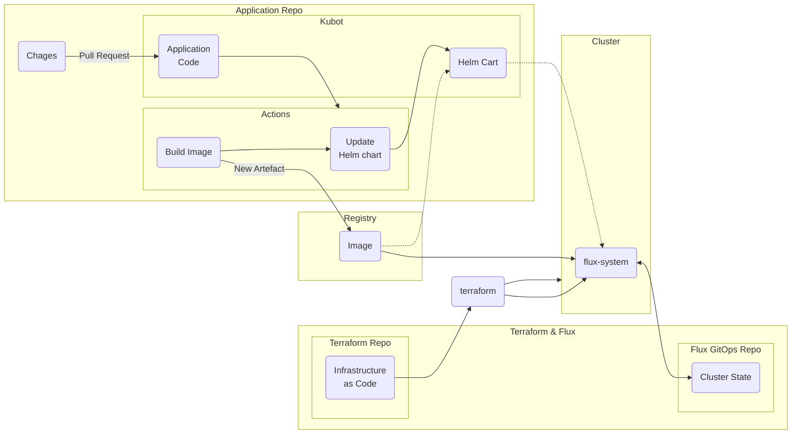
```mermaid
graph LR

subgraph Terraform & Flux

  subgraph Flux GitOps Repo
    cs(Cluster State)
  end

  subgraph Terraform Repo
    tfc("Infrastructure 
  as Code")
  end

end

subgraph Registry
  artf(Image)
end

subgraph Application Repo
  subgraph Kubot
    code("Application 
      Code")
    helm(Helm Cart)
  end

  subgraph Actions
    ht("Update 
      Helm chart")
    bi(Build Image)
    bi-->|New Artefact|artf
    bi-->ht
  end

  code-->Actions
 
  push(Chages)-->|Pull Request|code
  ht-->helm

end

subgraph Cluster
  flux(flux-system)
  artf-->flux
  artf-.->helm
end

tfc-->tfa(terraform)
tfa-->Cluster
tfa-->flux
flux<-->cs
helm-.->flux

subgraph Kubot
  helm(Helm Cart)
  code("Application 
    Code")
end
```


### Контрольні запитання


1.  Який з перелічених інструментів використовує імперативний підхід для створення та керування ресурсами?  

Ansible використовує імперативний підхід для створення та керування ресурсами. Ansible описує, що потрібно зробити, щоб створити або змінити ресурс, а не те, що буде створено або змінено. Ansible використовує команди, які називаються "playbooks", щоб описати, що потрібно зробити.

Terraform і Chef використовують декларативне підхід для створення та керування ресурсами. Terraform описує, що має бути створено або змінено, а не те, що потрібно зробити, щоб це зробити. Terraform використовує мову програмування HashiCorp Configuration Language (HCL), щоб описати, що має бути створено або змінено. Chef використовує мову програмування Ruby, щоб описати, що має бути створено або змінено.

2. Що з наведеного нижче є «best practice» для управління ресурсами cloud-provider за допомогою IaC?  

Згідно з [сайтом](https://www.terraform-best-practices.com/v/uk/), кращою практикою для управління ресурсами cloud-provider за допомогою IaC є використання SCM для відстеження змін в інфраструктурі. Це дозволяє вам легко відстежувати зміни в ваших Terraform-файлах, а також інтегрувати управління інфраструктурою з вашими існуючими процесами розробки та розгортання.

Інші дві відповіді також є важливими, але не обов'язковими. Зберігання state локально може бути корисним для розробки та тестування, але воно може призвести до проблем з регресією, якщо ви не будете чітко контролювати свої зміни. Невикористання tf.plan для уникнення витоку sensitive даних є гарною ідеєю, але це не завжди можливо або практичне.

3. В якому файлі Terraform зберігає поточний стан інфраструктури?

Terraform зберігає поточний стан інфраструктури в файлі з розширенням .tfstate. Цей файл містить інформацію про всі ресурси, які були створені за допомогою Terraform.

State-файл Terraform є JSON-файлом, який містить наступну інформацію:
- Ідентифікатори всіх ресурсів, які були створені за допомогою Terraform.  
- Стан кожного ресурсу.  
- Відношення між ресурсами.  

5. Як Flux забезпечує автоматичне впровадження змін у кластер Kubernetes?

Flux моніторить Git-репозиторій на зміни та виконує синхронізацію змін з кластером Kubernetes. Він перевіряє описи ресурсів (наприклад, маніфести) у Git і автоматично оновлює кластер згідно зі змінами, зробленими у репозиторії.

Flux - це інструмент для управління інфраструктурою Kubernetes, який забезпечує автоматичне впровадження змін у кластер Kubernetes. Flux працює шляхом моніторингу Git-репозиторію на зміни. Коли в репозиторії виявляється зміна, Flux перевіряє, чи ця зміна є описом ресурсу Kubernetes. Якщо так, Flux автоматично оновлює кластер згідно зі зміною.

6. Яка основна перевага Deployment Manager над іншими IaC інструментами при керуванні ресурсами в GCP?

НЕ Правильна відповідь: Більш глибока інтеграція з GCP, котра дозволяє бачити всі доступні ресурси на різних проєктах.

Можна сказати, що Deployment Manager дозволяє вам визначити вашу інфраструктуру та ресурси, використовуючи код у вигляді шаблонів, які описують ресурси, їх взаємозв'язки та конфігурацію?

7. Яка основна мета модулів в Terraform?

Основна мета модулів в Terraform - це організація та інкапсуляція конфігурацій для кращого розуміння коду та для повторного використання конфігурацій.

Модулі Terraform дозволяють вам групувати конфігурації разом, щоб вони могли бути повторно використані в різних проектах. Це робить ваш код більш зрозумілим і легко підтримуваним.

Модулі Terraform також можуть використовуватися для організації конфігурацій таким чином, щоб вони були логічно поєднані між собою. Це може допомогти вам поліпшити структуру вашого коду і зробити його більш легко читати та розуміти.

Модулі Terraform можуть використовуватися для будь-якого типу ресурсів, які підтримуються Terraform. Вони можуть бути використані для створення простих ресурсів, таких як веб-сервери, або для створення складніших ресурсів, таких як хмарна платформа.


8. Який сервіс Google Cloud надає декларативну мову для управління ресурсами GCP?

Deployment Manager - це сервіс Google Cloud, який дозволяє вам створювати, керувати та розгортати інфраструктуру GCP за допомогою декларативної мови. Декларативна мова - це мова, яка описує, що ви хочете, щоб ваша інфраструктура мала, а не як її створити. Це робить Deployment Manager ідеальним для створення інфраструктури, яка є масштабованою, відтворюваною та безпечною.

9. Який інструмент дозволяє автоматизувати створення та управління ресурсами GCP за допомогою Python? 

Pulumi - це інструмент управління конфігурацією, який дозволяє автоматизувати створення та управління ресурсами в різних хмарних середовищах, включаючи Google Cloud. Pulumi підтримує кілька мов програмування, включаючи Python.

10. Як Flux обробляє маніфести Kubernetes, що зберігаються в Git-репозиторії?

Flux обробляє маніфести Kubernetes, що зберігаються в Git-репозиторії, за допомогою оператора. Оператор Flux, який працює в кластері Kubernetes, відстежує зміни у Git-репозиторії та автоматично застосовує їх до кластера.

Оператор Flux працює у режимі "pull", тобто він перевіряє наявність змін у Git-репозиторії та застосовує їх до кластера. Це означає, що зміни застосовуються негайно, коли вони з'являються у репозиторії.

Оператор Flux не зберігає локальну копію маніфестів. Він працює лише з маніфестами, які зберігаються у Git-репозиторії.

11. Який інструмент зазвичай використовується разом з Flux для управління Kubernetes?

Helm - це інструмент, який часто використовується разом з Flux для управління Kubernetes.
