## Від chroot до контейнера

**Контейнеризація** — це технологія віртуалізації, яка дозволяє запускати додатки в ізольованому середовищі, що дозволяє розгортати додатки швидко та ефективно.
### Хронологія розвитку контейнеризації   
* 1979 - `Chroot`: Цей інструмент в Unix дозволив змінювати корневу директорію для процесів, створюючи ізольовані середовища для додатки в ОС. 
* 2000 - `FreeBSD jails`: технологія що дозволила створювати повністю ізольовані середовища для FreeBSD.  
* 2004 - `Solaris zones`: Sun (Oracle) створює технологію повністю ізольованих середовищ для Solaris.  
* 2005 - `OpenVZ server virtualization` - виходить латане (patched) ядро Linux для віртуалізації, ізоляції та управління ресурсами. Але спільнота Linux чинить опір інтеграції кода в ядро системи через те що вважає, що контейнер - це не завдання ядра.    
* 2006 - `cgroups`: Google стартує власний проект відокремлення ресурсів у контрольні, або контрольовані групи.  
* 2008 - `Linux Containers (LXC)`: з'являється технологія повністю ізольованих середовищ для Linux. З'являються `cgroups` та `linux namespaces` або контроль ресурсів та ізоляція процесу в рамках ОС, поки що без повної віртуалізації фізичних ресурсів (без ВМ).  
* 2013 - `Docker`: Докер випустив всій продукт.    
* 2015 - `Kubernetes`: Google випускає відкриту платформу для автоматизації розгортання, масштабування та управління контейнерами. В 2015 році вийшла версія 1.0 що мала в собі контейнер-оркестратор, або систему управління контейнер-ізольованими додатками.  

Ось так виглядає команда `chroot` в сучасній Debian 12:  
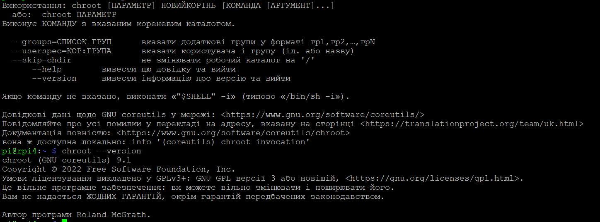  

У `FreeBSD Jail` можна віртуалізувати повний мережевий стек, що нагадує pod-и в Kubernetes:   
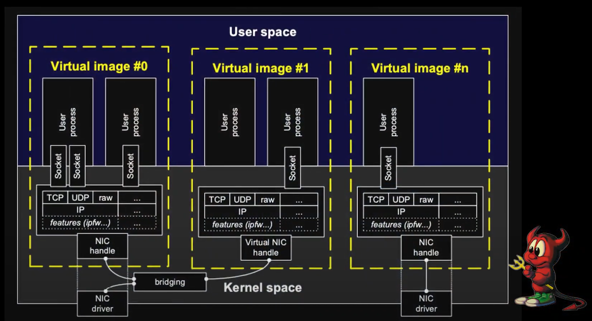  

Спроба створення Гуглом власного проекту з розробки контейнерної віртуалізації:  
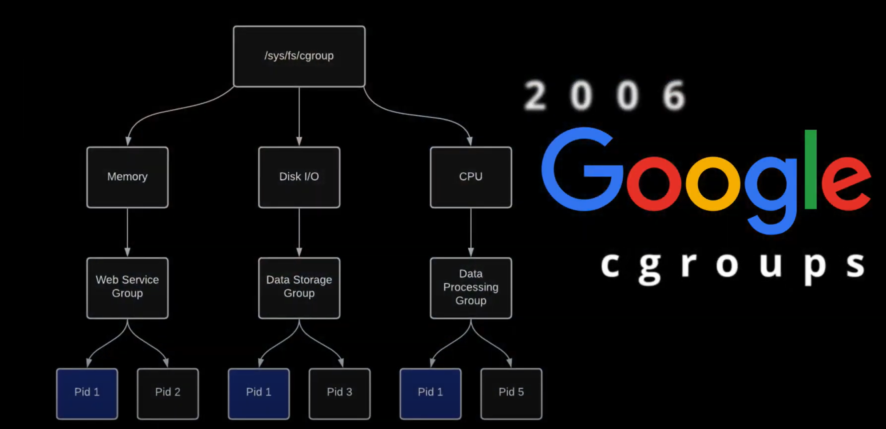  

На слайді різниця між рішенням LXC Linux та Docker. Перші версії Docker використовували лінукс контейнери під капотом:      
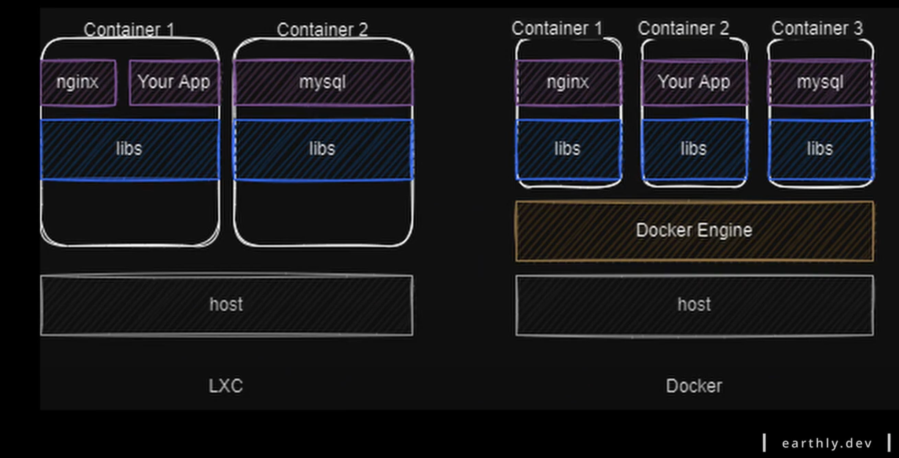

`ОС Windows` має два режими ізоляції:  
- Process (під час роботи в цьому режимі контейнер спільно використовує теж саме ядро що і хост, та інші процеси)  
- Hyper-V (кожний контейнер працює в середині високо оптимізованої ВМ, отримуючи власне віртуальне ядро)    

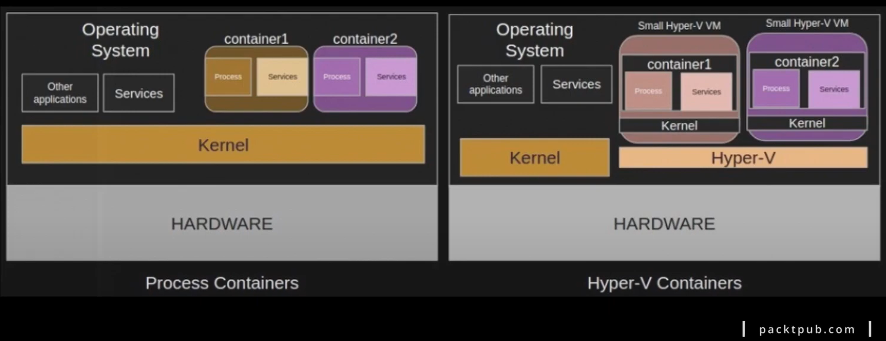  

`MacOS` - тут ми можемо встановити та запускати докер та контейнери завдяки емулятору `QEMU`, але саме ядро системи не підтримує віртуалізацію через обмеження закладене в ядро системи apple/darwin-xnu. Це гібридне ядро з Mach, BSD та компонентів C++.  

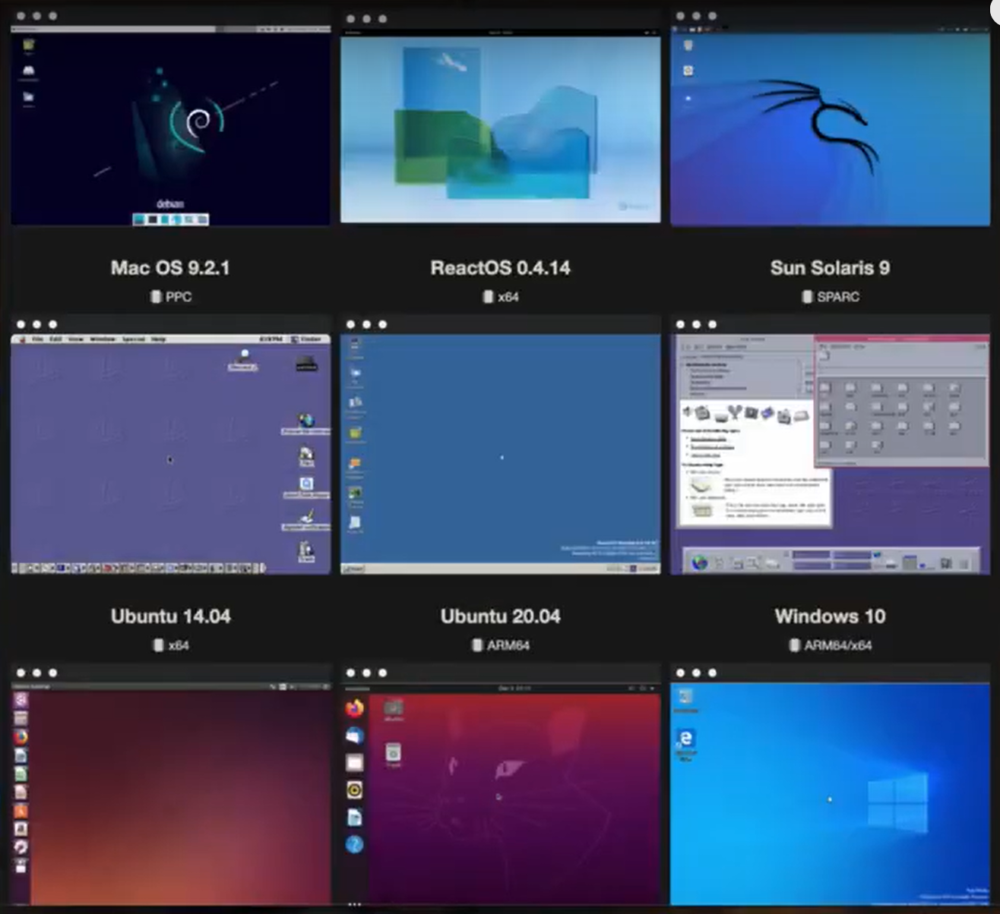

### Контейнеризація це:
1. Ізоляція або обмеження видимості на рівні міжпроцесорної взаємодії  
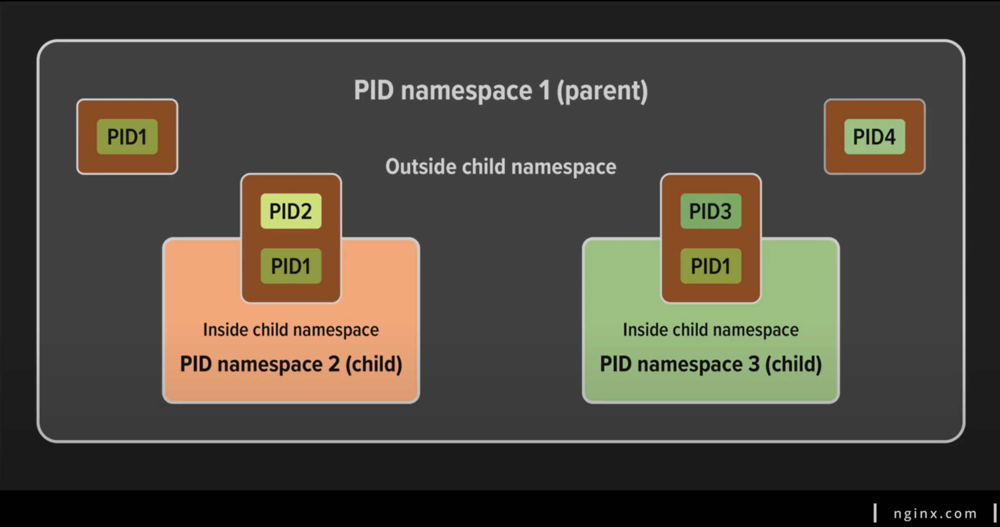  
2. Функція ядра, яка обмежує, веде облік та ізолює використання ресурсів для використання процесів   
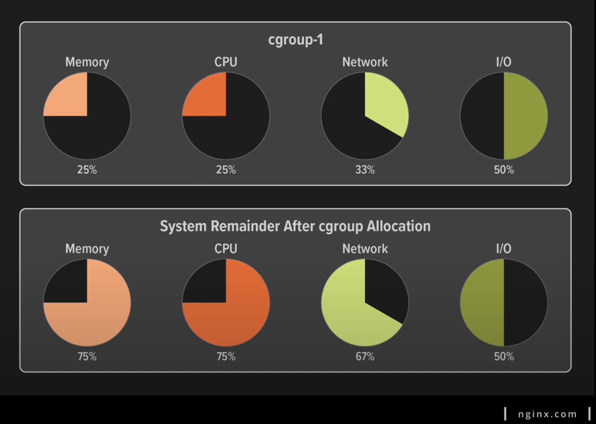

### Контрольні запитання до лекції
1. Які основні компоненти Docker-екосистеми?
Докер-екосистема включає в себе різні компоненти, що спільно працюють для управління та розгортанням контейнеризованих додатків. Основні компоненти Docker-екосистеми включають:  
- `Docker Engine:` Це основний компонент, який дозволяє створювати та управляти контейнерами. Включає сервер, API та інструменти командного рядка для взаємодії з Docker.
- `Docker Compose:` Інструмент для визначення та управління багатоконтейнерними додатками за допомогою YAML-файлів конфігурації. Дозволяє описувати сервіси, мережі та об'єднувати їх в єдиний стек.  
- `Docker Swarm:` Вбудований в Docker інструмент для оркестрації контейнерів, який дозволяє масштабувати додатки та керувати їх роботою в режимі кластеру.  
- `Docker Registry:` Це місце для зберігання та управління образами контейнерів. Docker Hub є публічним реєстром, але можна налаштувати приватні реєстри для зберігання власних образів.  
- `Docker Machine:` Інструмент для автоматизації роботи з Docker-хостами. Він дозволяє створювати, керувати та підключатися до Docker-хостів на різних платформах.
- `Docker Hub:` Це хмарний реєстр, який дозволяє розміщувати та ділитися образами контейнерів. Користувачі можуть використовувати Docker Hub для пошуку та завантаження образів.  
- `Docker CLI (Command Line Interface):` Інтерфейс командного рядка для взаємодії з Docker Engine та іншими компонентами. За допомогою команд CLI користувачі можуть створювати, запускати, масштабувати та управляти контейнерами.  
*Ці компоненти спільно створюють ефективну та потужну інфраструктуру для контейнеризації додатків за допомогою Docker.*
2. Які основні відмінності між Docker та Podman?
- Архітектура та архітектурна незалежність:  
    `Docker:` Використовує клієнт-серверну архітектуру, де Docker-клієнт взаємодіє з Docker-сервером.  
    `Podman:` Має архітектуру, що не вимагає централізованого демона. Кожен контейнер у Podman - це окремий процес.  
- Привілеї користувача:  
    `Docker:` Для виконання команд Docker потрібні привілеї користувача або членство в групі docker.   
    `Podman:` Можна використовувати без привілеїв root. Користувачі можуть створювати та запускати контейнери без необхідності в привілеях root.  
- Доступ до образів:  
    `Docker:` Зазвичай використовує Docker Hub для зберігання та обміну образами.  
    `Podman:` Може працювати з Docker Hub, але також підтримує роботу з іншими реєстрами та може безпосередньо використовувати образи Docker без необхідності перетягування їх через Podman.  
- Сховище контейнерів:  
    `Docker:` Зберігає контейнери в своєму власному сховищі.  
    `Podman:` Використовує локальний каталог для зберігання контейнерів, і кожен контейнер вважається окремим каталогом.  
- Оркестрація:  
    `Docker:` Має вбудований інструмент для оркестрації - Docker Swarm.  
    `Podman:` Не має вбудованого інструменту для оркестрації, але може використовуватися з іншими інструментами, такими як Kubernetes.  
3. Як можна забезпечити безпеку контейнерів в Docker?  
- **Встановленням обмежень ресурсів для контейнерів:**  
Docker дозволяє вам обмежувати ресурси, які може використовувати кожен контейнер, такі як обсяги CPU та пам'яті. Це допомагає управляти використанням ресурсів та запобігає можливим атакам або перевантаженню системи.
- **Використанням контролю доступу та шифрування даних:**    
Docker може використовувати механізми контролю доступу, такі як AppArmor або SELinux, щоб обмежити дії контейнерів та зменшити ризики вразливостей. Шифрування даних в контейнерах також може бути важливим, особливо при обробці чутливої інформації.
- **Регулярне оновлення образів контейнерів:**   
Забезпечення, що ви використовуєте актуальні та безпечні образи.
- **Використання мережевих політик:**  
Встановлення мережевих політик для контролю доступу до контейнерів.
- **Моніторинг та журналювання:**   
Ведення журналів дій контейнерів та системи для виявлення аномалій та можливих загроз.
- **Використання ізольованих мереж:**   
Використання мережевих ізоляцій для запобігання неправомірному доступу.
- **Встановлення мінімально необхідних привілеїв:**   
Зменшення привілеїв контейнера на мінімум, щоб уникнути можливих вразливостей.  

*Загальна безпека системи також грає важливу роль у забезпеченні безпеки контейнерів, і важливо використовувати передові практики безпеки для всієї інфраструктури.*

## Cgroups та контроль ресурсів  

1.Основні компоненти контейнеризації:
- `cgroup` -  механізмом у ядрі Linux, який надає можливість обмеження ресурсів для груп процесів. Це інструмент для керування та обмеження використання системних ресурсів, таких як CPU, пам'ять, мережа та інші, для процесів в системі. Основні функції:   
        - **1. Обмеження ресурсів**   
        - **2. Пріоритезацію CPU, IO**  
        - **3. Ізоляція ресурсів** так що одній групі простору імен не доступні процеси, мережа та файли іншої  
        - **4. Облік витрат** тих чи інших ресурсів групою  
        - **5. Управління** напряму через `/proc`, опосередковано через бібліотеки, наприклад Docker, або утилітами: cgcreate, cgexec та іншими з бібліотеки libcgroup.    
[Вихідна документація](https://www.kernel.org/doc/html/latest/admin-guide/cgroup-v2.html)   

- `namespace` - або простір імен - механізмом у ядрі Linux, який надає можливість ізоляції ресурсів для груп процесів. Кожний namespace створює окремий контекст для певного типу ресурсів:  
        - **PID Namespace:** Ізолює простір імен процесів. Кожен PID namespace має свій власний дерево процесів.  
        - **Network Namespace:** Забезпечує ізоляцію мережевих ресурсів, таких як інтерфейси, таблиці маршрутизації та брандмауер.  
        - **Mount Namespace:** Ізолює простір імен файлових систем. Кожен Mount namespace має свою власну ієрархію файлової системи.  
        - **UTS Namespace:** Ізолює імена хост-системи та домену.  
        - **IPC Namespace:** Забезпечує ізоляцію між процесами у відношенні міжсистемних ресурсів, таких як черги повідомлень та семафори.  
        - **User Namespace:** Ізолює ідентифікатори користувачів та груп, дозволяючи створювати віртуальних користувачів у namespace, які не відображаються на реальних користувачів системи.  
- `container runtime` -  (запускач контейнерів) - це компонент системи, який відповідає за виконання контейнерів. Основна функція container runtime - це запуск і управління самими контейнерами. Цей компонент обробляє виконання операцій, таких як створення, запуск, зупинка та видалення контейнерів.  Прикладами container runtime є Containerd (Docker), rkt (Rocket), CRI-O та інші.   
Майже всі вони працюють на єдиному container runtime - `runc`. Це низькорівневе середовище виконання контейнерів за специфікацією OCI, або те, що фактично створює і запускає контейнери. Воно включає `libcontainer`, власну реалізацію на базі `Go` для створення контейнерів.

### Open Container Initiative (OCI)  
`OCI` Open Container Initiative заснована в 2015 року компанією Docker, [Linux Foundation](https://www.linuxfoundation.org/)  та є відкритою ініціативою, спрямованою на стандартизацію контейнерних технологій. [OCI](https://opencontainers.org/) створила набір відкритих стандартів для контейнерів, які включають в себе специфікації для формату образів контейнера, а також для container runtime. 
Наразі OCI містить дві основні специфікації:  
- [OCI Image Format Specification](https://github.com/opencontainers/image-spec#oci-image-format-specification)  
[Специфікація образу](https://github.com/opencontainers/image-spec/blob/main/spec.md) описує яка саме створити файловий образ на основі пакету файлів, призначених для контейнера  
- [Open Container Initiative Runtime Specification](https://github.com/opencontainers/runtime-spec#open-container-initiative-runtime-specification)  
[Runtime Specification](https://github.com/opencontainers/runtime-spec/blob/main/spec.md) описує як запустити цей пакет файлових систем, розпакований на диску.  

Основна мета OCI — забезпечити інтероперабельність між різними рішеннями для контейнеризації, такими як Docker, Containerd, CRI-O, та іншими. За допомогою OCI, різні інструменти та container runtime можуть працювати з однаковими контейнерними образами та використовувати стандартні специфікації для запуску та управління контейнерами.  

`Контейнер` — це ізольоване середовище виконання процесу.   
`Контейнер імідж` — це знімок (snapshot) файлової системи і метаданих.  

Комплексна платформа докер включає `UI`, `CLI`, `API`, що використовуються на протязі всього життєвого циклу проекту, а основними принципами [Docker](https://www.docker.com/) є `Build`,`Share`,`Run`:  

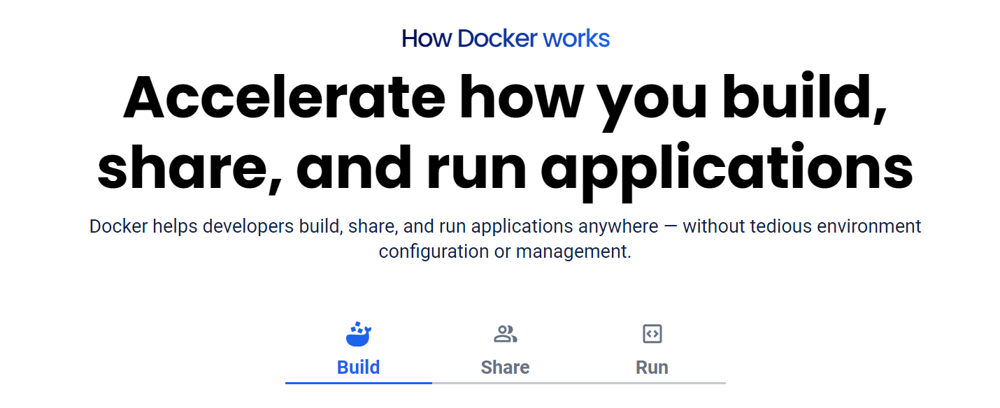

1. Unix-подібні системи представляють усе через файли. Використовуються так званні віртуальні файлові системи:
`ls -l /sys/fs/cgroup`  
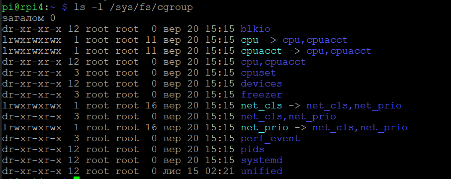  

2. Налаштування та управління контрольною групою виконується через:
- налаштування лімітів в конфігураційних файлах підсистеми 
- додавання id процесу в контрольну групу  

3. Приклад того як саме працює ядро Linux з лімітами пам'яті:
- створимо демонстраційну контрольну групу  `cgroup` для memory resource controller c назвою `demo`:   
`sudo mkdir /sys/fs/cgroup/memory/demo`  
- після виконання команди директорія наповниться службовими файлами, що відповідають за параметри пам'яті:  
```bash
total 0
-rw-r--r-- 1 root root 0 Nov 15 22:16 cgroup.clone_children
--w--w--w- 1 root root 0 Nov 15 22:16 cgroup.event_control
-rw-r--r-- 1 root root 0 Nov 15 22:16 cgroup.procs
-rw-r--r-- 1 root root 0 Nov 15 22:16 memory.failcnt
--w------- 1 root root 0 Nov 15 22:16 memory.force_empty
-rw-r--r-- 1 root root 0 Nov 15 22:16 memory.kmem.failcnt
-rw-r--r-- 1 root root 0 Nov 15 22:16 memory.kmem.limit_in_bytes
-rw-r--r-- 1 root root 0 Nov 15 22:16 memory.kmem.max_usage_in_bytes
-rw-r--r-- 1 root root 0 Nov 15 22:16 memory.kmem.tcp.failcnt
-rw-r--r-- 1 root root 0 Nov 15 22:16 memory.kmem.tcp.limit_in_bytes
-rw-r--r-- 1 root root 0 Nov 15 22:16 memory.kmem.tcp.max_usage_in_bytes
-r--r--r-- 1 root root 0 Nov 15 22:16 memory.kmem.tcp.usage_in_bytes
-r--r--r-- 1 root root 0 Nov 15 22:16 memory.kmem.usage_in_bytes
-rw-r--r-- 1 root root 0 Nov 15 22:16 memory.limit_in_bytes
-rw-r--r-- 1 root root 0 Nov 15 22:16 memory.max_usage_in_bytes
-rw-r--r-- 1 root root 0 Nov 15 22:16 memory.memsw.failcnt
-rw-r--r-- 1 root root 0 Nov 15 22:16 memory.memsw.limit_in_bytes
-rw-r--r-- 1 root root 0 Nov 15 22:16 memory.memsw.max_usage_in_bytes
-r--r--r-- 1 root root 0 Nov 15 22:16 memory.memsw.usage_in_bytes
-rw-r--r-- 1 root root 0 Nov 15 22:16 memory.move_charge_at_immigrate
-rw-r--r-- 1 root root 0 Nov 15 22:16 memory.oom_control
---------- 1 root root 0 Nov 15 22:16 memory.pressure_level
-rw-r--r-- 1 root root 0 Nov 15 22:16 memory.soft_limit_in_bytes
-r--r--r-- 1 root root 0 Nov 15 22:16 memory.stat
-rw-r--r-- 1 root root 0 Nov 15 22:16 memory.swappiness
-r--r--r-- 1 root root 0 Nov 15 22:16 memory.usage_in_bytes
-rw-r--r-- 1 root root 0 Nov 15 22:16 memory.use_hierarchy
-rw-r--r-- 1 root root 0 Nov 15 22:16 notify_on_release
-rw-r--r-- 1 root root 0 Nov 15 22:16 tasks
```
- для наочності відреагуємо файл `memory.limit_in_bytes`, що задає ліміт використання пам'яті в байтах:
```bash
~ sudo cat /sys/fs/cgroup/memory/demo/memory.limit_in_bytes
9223372036854771712
➜  ~ echo 10K |sudo tee /sys/fs/cgroup/memory/demo/memory.limit_in_bytes
10K
➜  ~ sudo cat /sys/fs/cgroup/memory/demo/memory.limit_in_bytes          
8192
```
- відкриємо додатковий термінал та виведемо поточний ID процесу `bash`: 
```bash
 ~ echo $$
6405
```
- Щоб застосувати задане обмеження використання пам'яті до нашого процесу додамо ID цього процесу до спеціального файлу tasks в директорії контрольної групи:  
```bash
 ~ echo 6405|sudo tee /sys/fs/cgroup/memory/demo/tasks
6405
```
- При спробі виконати будь яку дію в терміналі де ми запустили `bash` процес буде вбито, а ID процесу в tasks зникне.
Лог підтвердить, що спрацював out of memory killer - це процес який використовується ядром лінукс в разі недостачі пам'яті. 

4. З лімітом процесора поведінка системи під навантаженням буде виглядати інакше, як гальмування та нестабільна робота. Тут буде задіяний троттлінговий механізм. При перевищенні лімітів з'являтимуться затримки виконання обчислення виділеним ядром процесора. Ядро системи вимушене буде збільшувати інтервали часу доступу до ЦП 

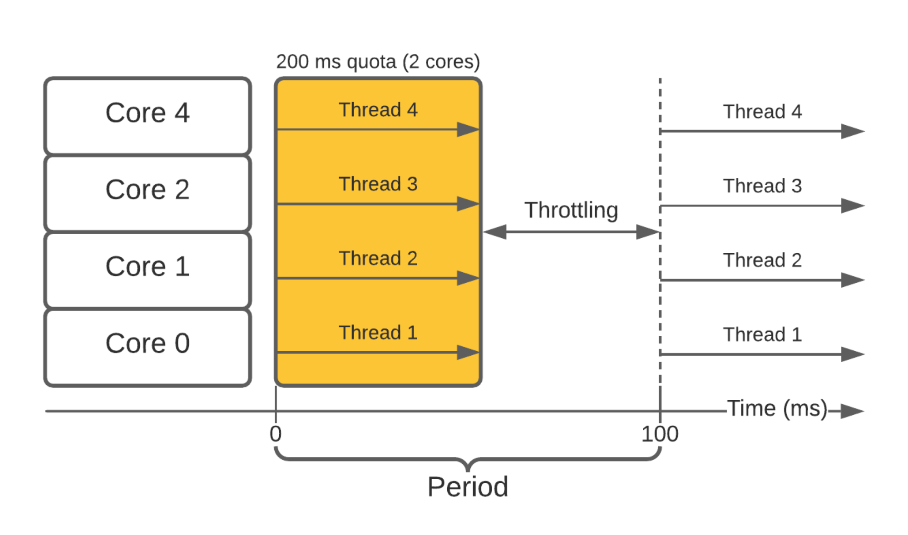  

- створимо контрольну групу `demo` в контролері `cpu`:  
```bash
 ~ sudo mkdir /sys/fs/cgroup/cpu/demo
 ~ ls -l /sys/fs/cgroup/cpu/demo
total 0
-rw-r--r-- 1 root root 0 Nov 15 23:46 cgroup.clone_children
-rw-r--r-- 1 root root 0 Nov 15 23:46 cgroup.procs
-rw-r--r-- 1 root root 0 Nov 15 23:46 cpu.cfs_burst_us
-rw-r--r-- 1 root root 0 Nov 15 23:46 cpu.cfs_period_us
-rw-r--r-- 1 root root 0 Nov 15 23:46 cpu.cfs_quota_us
-rw-r--r-- 1 root root 0 Nov 15 23:46 cpu.idle
-rw-r--r-- 1 root root 0 Nov 15 23:46 cpu.rt_period_us
-rw-r--r-- 1 root root 0 Nov 15 23:46 cpu.rt_runtime_us
-rw-r--r-- 1 root root 0 Nov 15 23:46 cpu.shares
-r--r--r-- 1 root root 0 Nov 15 23:46 cpu.stat
-rw-r--r-- 1 root root 0 Nov 15 23:46 notify_on_release
-rw-r--r-- 1 root root 0 Nov 15 23:46 tasks
 ~ cat /sys/fs/cgroup/cpu/demo/cpu.cfs_period_us
100000
 ~ echo 1000000 |sudo tee /sys/fs/cgroup/cpu/demo/cpu.cfs_period_us
1000000
 ~ cat /sys/fs/cgroup/cpu/demo/cpu.cfs_quota_us
-1
 ~ echo 1000000 |sudo tee /sys/fs/cgroup/cpu/demo/cpu.cfs_quota_us 
1000000
 ~ echo 7343 |sudo tee /sys/fs/cgroup/cpu/demo/tasks           
7343
 ~ echo 100000 |sudo tee /sys/fs/cgroup/cpu/demo/cpu.cfs_quota_us 
100000
 ~ echo 10000 |sudo tee /sys/fs/cgroup/cpu/demo/cpu.cfs_quota_us 
10000
```
- Встановлення обмеження виконане завдяки пропорційному планувальнику ресурсів `completely fair scheduling` який розподіляє процесорний час між `cgroups` залежно від пріоритетів.   
В даному випадку `cfs_period_us` визначає проміжок часу в мікросекундах, з якою періодичністю перерозподіляти `cgroup` доступ до ЦП  

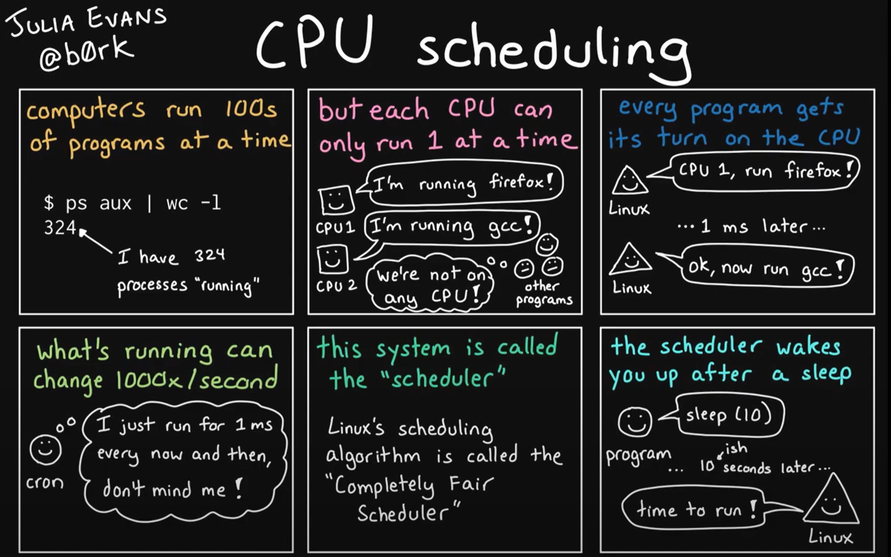  

- Встановимо ще один параметр параметр `cpu.cfs_quota_us`. Це загальний час в мікросекундах протягом якого всі завдання `cgroup` можуть виконуватись протягом одного періоду, який ми задали пунктом вище. Як тільки всі завдання визначені `cgroup` використали весь час визначений квотою, вони зупиняються і їм не дозволяється запускатись до настання наступного періоду. 

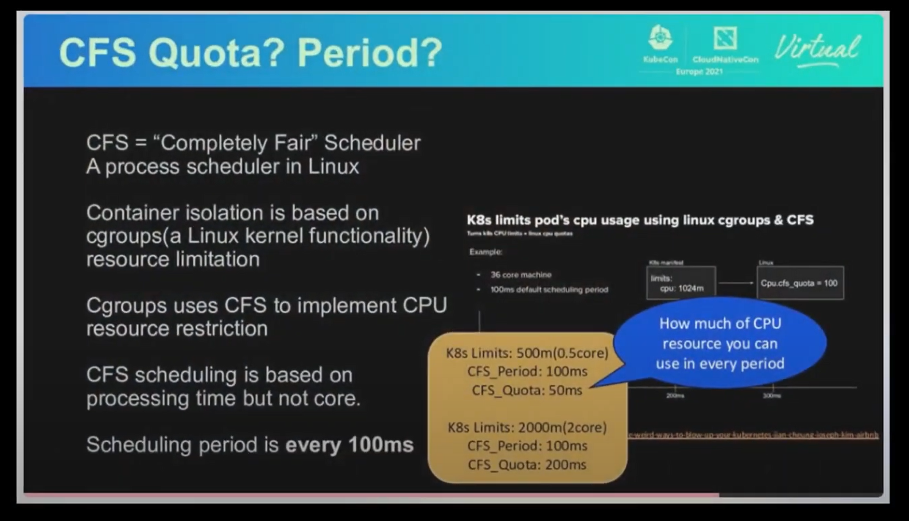  

- В іншому вікні термінала визначаємо ID процесу, що буде ізольовано та запускаємо цикл виводу відповіді від запиту на довільний сайт, на виході будемо отримувати код 200. Далі в першому терміналі будемо зменшувати квоту до 100мс, а потім до 10мс та наявно спостерігати як сповільнюється виконання нашого циклу. На такі явища в системі, кажуть що ядро системи тротлить виконання цього процесу.  
```bash
 ~ echo $$
7343
 ~ while true; do \
 curl -Ls -o /dev/null/ \
 -w '%{http_code}' 1.1.1.1; \
 sleep 0.3; done
200200200200200200200200200200200 
```

### Контрольні запитання:
1. Яка команда в Linux використовується для створення нового процесу в новому Namespaces?
Щоб створити новий процес у новому PID namespace та виконати оболонку Bash в цьому просторі імен, ви можете використовувати таку команду:
```bash
 unshare --fork --pid --mount-proc /bin/bash
```
Ця команда використовує параметри:
--fork: Створити новий процес.
--pid: Створити новий PID namespace.
--mount-proc: Замінити /proc в новому namespace, щоб мати власний корінь /proc.
Після виконання цієї команди ви увійдете в новий Bash-процес, який працюватиме в ізольованому просторі імен PID.

2. Яка команда в Linux використовується для створення нового Cgroup?  
Для створення нового Cgroup у підсистемі CPU можна використати такий вигляд команди:
```bash
 cgcreate -g cpu:/my_cgroup
```
Ця команда створить новий Cgroup з ім'ям /my_cgroup в підсистемі CPU. Після виконання цієї команди можна налаштовувати обмеження та параметри для цього Cgroup.
subsystem - це назва підсистеми (наприклад, cpu, memory), а path - це шлях до нового Cgroup.


## Container image з нуля

Знов про `namespace` - або простір імен, який реалізує ізоляцію процесів. Різним групам процесів доступні різні області видимості ресурсів, ці ресурси визначаються типами `namespaces`.
Один з таких типів, або один з `namespace` це `mount`    
- `namespace mount` дає можливість створювати список незалежних точок монтування файлових систем не торкаючись файлової системи хоста.

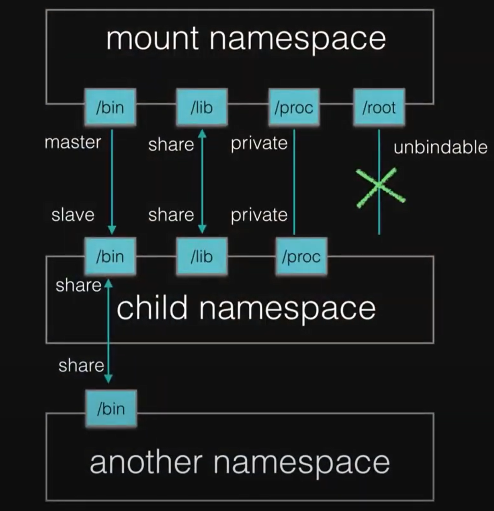  

- `namespace network` цей простір імен має незалежний мережевий стек: свою власну таблицю маршрутизації, набір IP-адрес, список сокетів, таблицю відстеження з'єднань, firewall тощо.  

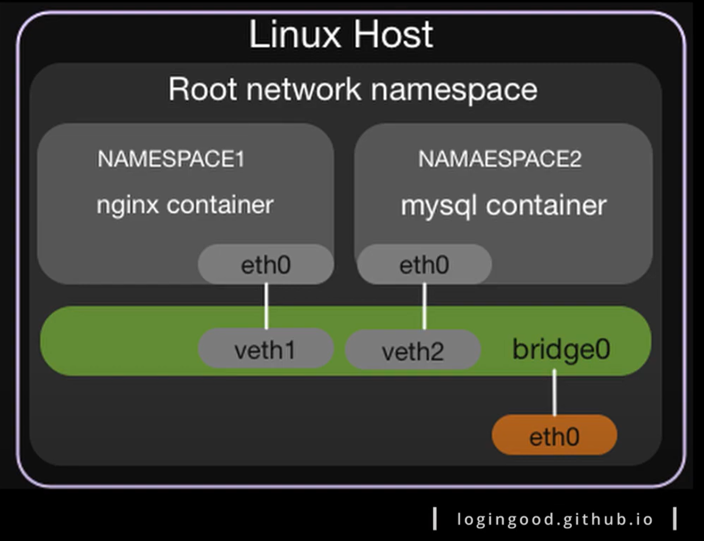 

### Приклад. Ізоляція системного процесу від усіх інших системних процесів. Забезпечимо видимість ізольованих процесів, мережевих інтерфейсів та файлових систем.  

1. За допомогою команди `unshare` запустимо процес `sh` в ізольованому середовищі та подивимось рівень ізоляції. Використаємо наступні параметри команди:
```bash
 -i, --ipc[=<file>]        unshare System V IPC namespace
 -m, --mount[=<file>]      unshare mounts namespace
 -n, --net[=<file>]        unshare network namespace
 -p, --pid[=<file>]        unshare pid namespace
 -u, --uts[=<file>]        unshare UTS namespace (hostname etc)
 -U, --user[=<file>]       unshare user namespace
 -f, --fork                fork before launching <program>
 --mount-proc[=<dir>]      mount proc filesystem first (implies --mount)
 ```
2. Після виконання команди бачимо що:
- новий процес запустився від імені користувача (nobody);  
- Видимість інших процесів повністю обмежена;  
- Процесу доступна вся файлова система;  
- Мережевий стек теж обмежено;  

```bash
  sudo \ 
> unshare -i -m -n -p -u -U --mount-proc -f sh
$ id
uid=65534(nobody) gid=65534(nogroup) groups=65534(nogroup)
$ ps xa
  PID TTY      STAT   TIME COMMAND
    1 pts/6    S      0:00 sh
    3 pts/6    R+     0:00 ps xa
$ ls -l /         
total 2068
drwxr-xr-x   3 nobody nogroup    4096 Mar 10  2023 Docker
lrwxrwxrwx   1 nobody nogroup       7 Jan  3  2023 bin -> usr/bin
drwxr-xr-x   2 nobody nogroup    4096 Apr 18  2022 boot

 ip a
1: lo: <LOOPBACK> mtu 65536 qdisc noop state DOWN group default qlen 1000
    link/loopback 00:00:00:00:00:00 brd 00:00:00:00:00:00

```
3. Створимо ізольовану файлову систему для нашого процесу  
- Готуємо директорію яку ми використаємо як кореневу директорію файлової системи; Назва може бути довільною, але використаємо відповідну Container image специфікації `rootfs`   
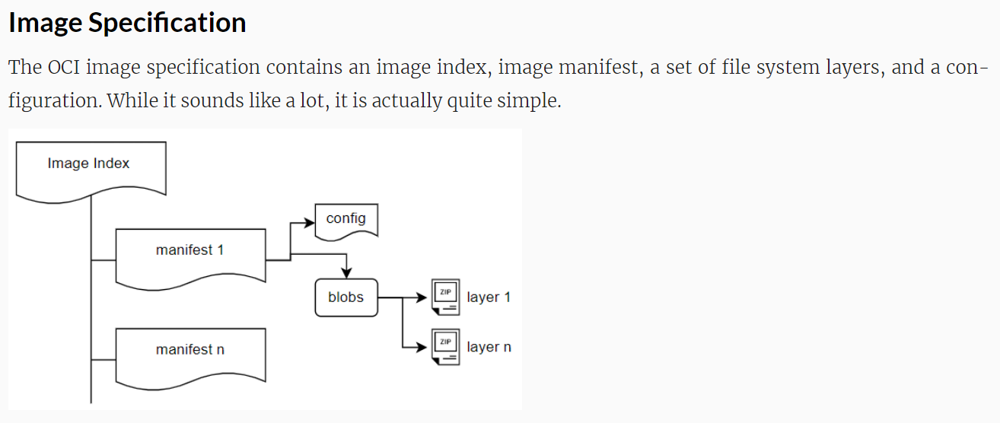  

```bash
 exit
 mkdir rootfs
```
- Перевіримо чи збереглось створене нами ізольоване середовище:  
```bash
 lsns
        NS TYPE   NPROCS   PID USER COMMAND
4026531834 time       27     1 root /init
4026531835 cgroup     27     1 root /init
4026531837 user       25     1 root /init
4026531840 net        25     1 root /init
4026532264 ipc        25     1 root /init
4026532275 mnt        25     1 root /init
4026532276 uts        25     1 root /init
4026532277 pid        26     1 root /init
4026533274 user        2  2733 root unshare -i -m -n -p -u -U --mount-proc 
4026533275 mnt         2  2733 root unshare -i -m -n -p -u -U --mount-proc 
4026533276 uts         2  2733 root unshare -i -m -n -p -u -U --mount-proc 
4026533277 ipc         2  2733 root unshare -i -m -n -p -u -U --mount-proc 
4026533278 pid         1  2734 root sh
4026533279 net         2  2733 root unshare -i -m -n -p -u -U --mount-proc 

```
- Враховуючи, що образ контейнера - це знімок системи та метаданих, по суті файловий архів, з якого можна за допомогою докера експортувати готову файлову систему контейнеру або нашому ізольованому процесу в щойно створену директорію.    
```bash
 docker

Usage:  docker [OPTIONS] COMMAND

Commands:
  export      Export a container's filesystem as a tar archive
  run         Run a command in a new container
```  
- Знайдемо на [Docker Hub](https://hub.docker.com/) найменший образ файлової системи Linux, це `busybox`, який поєднує коди багатьох поширених утиліт UNIX в одному невеликому бінарному файлі. Образ Busybox складається з шарів, кожен з яких містить частину файлової системи. Шари — це різні версії файлів та каталогів, які можуть бути використані для створення образів. Кожен шар містить лише змінені файли в порівнянні з попереднім шаром, що дозволяє зменшити розмір образу та оптимізувати його розгортання.   

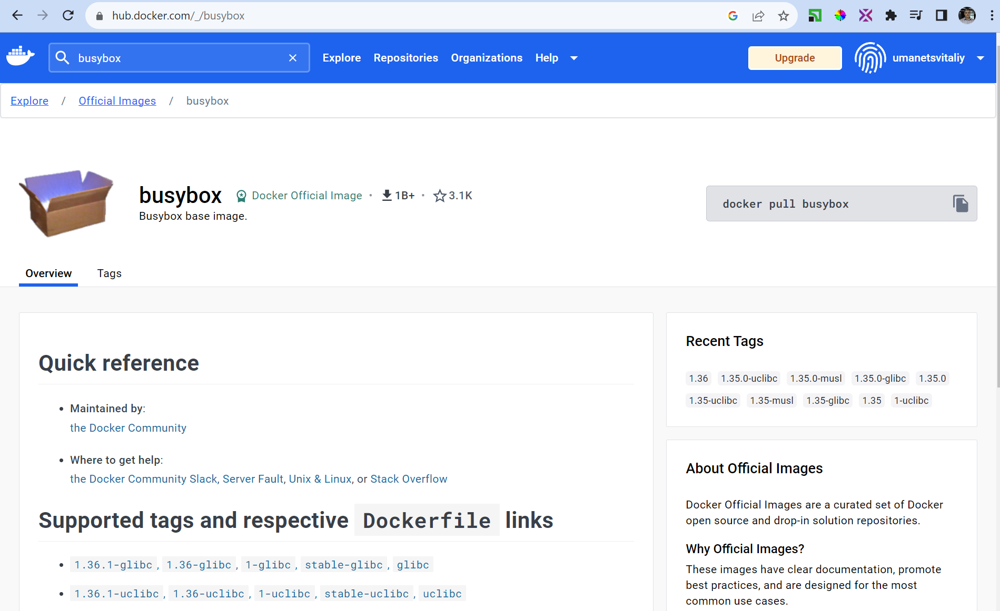

- Наступною командою завантажимо та запустимо контейнер з його образу `busybox`. Цього достатньо щоб отримати базову файлову систему цього образу контейнеру   
```bash
~ docker run busybox 
Unable to find image 'busybox:latest' locally
latest: Pulling from library/busybox
3f4d90098f5b: Pull complete 
Digest: sha256:3fbc632167424a6d997e74f52b878d7cc478225cffac6bc977eedfe51c7f4e79
Status: Downloaded newer image for busybox:latest

~ docker images
REPOSITORY          TAG       IMAGE ID       CREATED        SIZE
busybox             latest    a416a98b71e2   4 months ago   4.26MB

~ docker ps -a 
CONTAINER ID   IMAGE                      COMMAND                  CREATED         STATUS                     PORTS      NAMES
ff36312f618b   busybox                    "sh"                     2 minutes ago   Exited (0) 2 minutes ago              lucid_franklin
```
- Отже використаємо контейнер ID для команди експорту. Пам'ятаємо що образ це tar архів в бінарному вигляді, тому розархівуємо все що приходить в stdin та перенаправимо в цільову директорію `rootfs`        
```bash
 ~ docker export ff36312f618b
cowardly refusing to save to a terminal. Use the -o flag or redirect

 ~ docker export ff36312f618b | tar xf - -C rootfs
 ~ ls -l rootfs
total 52
drwxr-xr-x 2 root   root    12288 Jul 17 21:30 bin
drwxr-xr-x 4 root   root     4096 Nov 17 21:06 dev
drwxr-xr-x 3 root   root     4096 Nov 17 21:06 etc
drwxr-xr-x 2 nobody nogroup  4096 Jul 17 21:30 home
drwxr-xr-x 2 root   root     4096 Jul 17 21:30 lib
lrwxrwxrwx 1 root   root        3 Jul 17 21:30 lib64 -> lib
drwxr-xr-x 2 root   root     4096 Nov 17 21:06 proc
drwx------ 2 root   root     4096 Jul 17 21:30 root
drwxr-xr-x 2 root   root     4096 Nov 17 21:06 sys
drwxrwxrwt 2 root   root     4096 Jul 17 21:30 tmp
drwxr-xr-x 4 root   root     4096 Jul 17 21:30 usr
drwxr-xr-x 4 root   root     4096 Jul 17 21:30 var

```
- Ще раз виконаємо команду ізоляції середовища, але цього разу з вказівкою на корневу файлову систему, фактично додавши `chroot`. Слідом перевіримо ізоляцію процесу, мережі, та кореневої директорії    
```bash
unshare -i -m -n -p -u -U --mount-proc -R rootfs -f sh
/ $ ps xa
PID   USER     TIME  COMMAND
    1 nobody    0:00 sh
    3 nobody    0:00 ps xa
/ $ ip a
1: lo: <LOOPBACK> mtu 65536 qdisc noop qlen 1000
    link/loopback 00:00:00:00:00:00 brd 00:00:00:00:00:00
/ $ ls -l /
total 48
drwxr-xr-x    2 nobody   nobody       12288 Jul 17 18:30 bin
drwxr-xr-x    4 nobody   nobody        4096 Nov 17 19:06 dev
drwxr-xr-x    3 nobody   nobody        4096 Nov 17 19:06 etc
drwxr-xr-x    2 nobody   nobody        4096 Jul 17 18:30 home
drwxr-xr-x    2 nobody   nobody        4096 Jul 17 18:30 lib
lrwxrwxrwx    1 nobody   nobody           3 Jul 17 18:30 lib64 -> lib
dr-xr-xr-x  281 nobody   nobody           0 Nov 17 19:26 proc
drwx------    2 nobody   nobody        4096 Nov 17 19:29 root
drwxr-xr-x    2 nobody   nobody        4096 Nov 17 19:06 sys
drwxrwxrwt    2 nobody   nobody        4096 Jul 17 18:30 tmp
drwxr-xr-x    4 nobody   nobody        4096 Jul 17 18:30 usr
drwxr-xr-x    4 nobody   nobody        4096 Jul 17 18:30 var
/ $ 
```
4. Запуск контейнеру `runc`  
- Майже всі контейнер engine (Docker, Rocket, CRI-O) базуються на єдиному container runtime `runc` - менеджері контейнерів, що запускає контейнер у створеному просторі імен за допомогою
файлів конфігурації та кореневої файлової системи.  

- Низькорівнева команда, що створює та запускає контейнер. `runc` - command line client для запуску контейнерів, згідно до специфікації OCI:    

```bash
NAME:
$ runc

   runc - Open Container Initiative runtime

runc is a command line client for running applications packaged according to
the Open Container Initiative (OCI) format and is a compliant implementation of the
Open Container Initiative specification.

runc integrates well with existing process supervisors to provide a production
container runtime environment for applications. It can be used with your
existing process monitoring tools and the container will be spawned as a
direct child of the process supervisor.

Containers are configured using bundles. A bundle for a container is a directory
that includes a specification file named "config.json" and a root filesystem.
The root filesystem contains the contents of the container.

To start a new instance of a container:
    # runc run [ -b bundle ] <container-id>

COMMANDS:
   checkpoint  checkpoint a running container
   create      create a container
   delete      delete any resources held by the container often used with detached container
   events      display container events such as OOM notifications, cpu, memory, and IO usage statistics
   exec        execute new process inside the container
   kill        kill sends the specified signal (default: SIGTERM) to the container's init process
   list        lists containers started by runc with the given root
   pause       pause suspends all processes inside the container
   ps          ps displays the processes running inside a container
   restore     restore a container from a previous checkpoint
   resume      resumes all processes that have been previously paused
   run         create and run a container
   spec        create a new specification file

```

- Але команда `runc` не керує образами контейнерів, тому існує ще високорівневі команди container runtime, наприклад у Docker це `containerd` який призначений:  
  * завантажувати образи  
  * управляти сховищем та мережею  
  * контролювати роботу контейнерів  

- Скориставшись командою `spec` створивши в поточній директорії дефолтний файл специфікації. Це файл `config.json`, що містить базові метадані та інструкції як саме запускати процес у контейнері  
```bash
$ runc spec
$ ls -l 
total 4
-rw-rw-rw- 1 codespace codespace 2592 Nov 17 20:53 config.json
```
- Отже деякі параметри за замовчуванням:  
```json
{
	"ociVersion": "1.0.2-dev",
	"process": {
		"terminal": true,  // запускати в термінальному режимі (або можна в режимі демону)
		"user": {          // користувач root
			"uid": 0,
			"gid": 0
		},
		"args": [     // аргументи. За замовчуванням намагається запустити бінарний sh - файл з поточної директорії  
			"sh"
		],
		"env": [    // змінні оточення 
			"PATH=/usr/local/sbin:/usr/local/bin:/usr/sbin:/usr/bin:/sbin:/bin",
			"TERM=xterm"
		],
		"cwd": "/",
		"capabilities": {
			"bounding": [
				"CAP_AUDIT_WRITE",
				"CAP_KILL",
				"CAP_NET_BIND_SERVICE"
			],
			"effective": [
				"CAP_AUDIT_WRITE",
				"CAP_KILL",
				"CAP_NET_BIND_SERVICE"
			],
			"permitted": [
				"CAP_AUDIT_WRITE",
				"CAP_KILL",
				"CAP_NET_BIND_SERVICE"
			],
			"ambient": [
				"CAP_AUDIT_WRITE",
				"CAP_KILL",
				"CAP_NET_BIND_SERVICE"
			]
		},
		"rlimits": [
			{
				"type": "RLIMIT_NOFILE",
				"hard": 1024,
				"soft": 1024
			}
		],
		"noNewPrivileges": true
	},
	"root": {               // вказання кореневої директорії.
		"path": "rootfs",
		"readonly": true
	},

```
- Нарешті команда запуску створеного контейнеру в даному випадку зсередини директорії `demo`. В даному випадку назва директорії та контейнеру збігаються. 
```bash
$ sudo runc run demo
/ # ip a
1: lo: <LOOPBACK,UP,LOWER_UP> mtu 65536 qdisc noqueue qlen 1000
    link/loopback 00:00:00:00:00:00 brd 00:00:00:00:00:00
    inet 127.0.0.1/8 scope host lo
       valid_lft forever preferred_lft forever
    inet6 ::1/128 scope host 
       valid_lft forever preferred_lft forever
/ # ps xa
PID   USER     TIME  COMMAND
    1 root      0:00 sh
    7 root      0:00 ps xa
/ # ls -l /
total 40
drwxr-xr-x    2 1000     1000         12288 Jul 17 18:30 bin
drwxr-xr-x    5 root     root           360 Nov 17 21:27 dev
drwxr-xr-x    3 1000     1000          4096 Nov 17 21:18 etc
drwxr-xr-x    2 1000     1000          4096 Jul 17 18:30 home
drwxr-xr-x    2 1000     1000          4096 Jul 17 18:30 lib
lrwxrwxrwx    1 1000     1000             3 Jul 17 18:30 lib64 -> lib
dr-xr-xr-x  224 root     root             0 Nov 17 21:27 proc
drwx------    2 1000     1000          4096 Jul 17 18:30 root
dr-xr-xr-x   12 root     root             0 Nov 17 21:27 sys
drwxrwxrwx    2 1000     1000          4096 Jul 17 18:30 tmp
drwxr-xr-x    4 1000     1000          4096 Jul 17 18:30 usr
drwxr-xr-x    4 1000     1000          4096 Jul 17 18:30 var
/ # 
```
- Зробимо контейнер з імітацією роботи серверу за допомогою циклу `while`, відповіддю в форматі протоколу HTTP та вбудованої команди `netcat` що реалізує клієнт-серверні TCP та UDP з'єднання. Також замінимо термінальний режим на режим демону.  
```json
{
	"ociVersion": "1.0.2-dev",
	"process": {
		"terminal": false,
		"user": {
			"uid": 0,
			"gid": 0
		},
		"args": [
			"sh", "-c", "while true; do { echo -e 'HTTP/1.1 200 OK\n\n Version: 1.0.0'; } | nc -vlp 8080; done"
		],

```
- Запустимо контейнер ще раз. `netcat` повернув відповідь що готовий та слухає запити на порту 8080. Перевіряємо що запущені два процеси та завершуємо їх сигналом термінації  `kill`   

```bash
 $ sudo runc run demo
listening on [::]:8080 ...

$ sudo runc ps demo
UID          PID    PPID  C STIME TTY          TIME CMD
root       36023   36010  0 21:39 ?        00:00:00 sh -c while true; do { echo -e 'HTTP/1.1 200 OK   Version: 1.0.0'; } | nc -vlp 8080; done
root       36030   36023  0 21:39 ?        00:00:00 nc -vlp 8080
$ sudo runc kill demo KILL
$ sudo runc ps demo
ERRO[0000] container does not exist              

```
- Наступна модифікація коду буде стосуватись включення контейнеру до мережевого неймспейсу з довільною назвою (в нашому випадку `runc`) в наступному записі:  
```json
		"namespaces": [
			{
				"type": "network",
				"path": "/var/run/netns/runc"
			},

```
- Створюємо namespace мережевою командою `ip` та налаштовуємо мережу. Для цього нам потрібні будуть інтерфейс бріджа для з'єднання мереж у контейнері та хост мережі.        
```bash
$ sudo ip netns add runc
$ sudo ip netns ls
runc (id: 0)

$ sudo runc run demo
listening on [::]:8080 ...
# в іншому терміналі
$ sudo runc kill demo KILL 
$ sudo bash

 sudo apt-get update
 sudo apt-get install bridge-utils
 brctl addbr runc0

 ip a
6: runc0: <BROADCAST,MULTICAST> mtu 1500 qdisc noop state DOWN group default qlen 1000
    link/ether 46:e0:c7:b0:b6:90 brd ff:ff:ff:ff:ff:ff

# піднімемо інтерфейс 
 ip link set runc0 up
 ip a
6: runc0: <NO-CARRIER,BROADCAST,MULTICAST,UP> mtu 1500 qdisc noqueue state DOWN group default qlen 1000
    link/ether 46:e0:c7:b0:b6:90 brd ff:ff:ff:ff:ff:ff

# та налаштуємо адресу
 ip addr add 192.168.0.1/24 dev runc0
 ip a
6: runc0: <NO-CARRIER,BROADCAST,MULTICAST,UP> mtu 1500 qdisc noqueue state DOWN group default qlen 1000
    link/ether 46:e0:c7:b0:b6:90 brd ff:ff:ff:ff:ff:ff
    inet 192.168.0.1/24 scope global runc0
       valid_lft forever preferred_lft forever

# створюємо два віртуальних інтерфейси для бріджування хоста та гостя
 ip link add name veth-host type veth peer name veth-guest
 ip a
6: runc0: <NO-CARRIER,BROADCAST,MULTICAST,UP> mtu 1500 qdisc noqueue state DOWN group default qlen 1000
    link/ether 46:e0:c7:b0:b6:90 brd ff:ff:ff:ff:ff:ff
    inet 192.168.0.1/24 scope global runc0
       valid_lft forever preferred_lft forever
7: veth-guest@veth-host: <BROADCAST,MULTICAST,M-DOWN> mtu 1500 qdisc noop state DOWN group default qlen 1000
    link/ether 16:88:db:59:bf:9e brd ff:ff:ff:ff:ff:ff
8: veth-host@veth-guest: <BROADCAST,MULTICAST,M-DOWN> mtu 1500 qdisc noop state DOWN group default qlen 1000
    link/ether 26:61:13:a0:50:2e brd ff:ff:ff:ff:ff:ff

# підіймаємо щойно доданий інтерфейс  
 ip link set veth-host up

# додамо інтерфейс до бріджу  
 brctl addif runc0 veth-host
# та namespace runc, що ми вказували у файлі специфікації
 ip link set veth-guest netns runc

# за допомогою 'netns exec' виконуємо налаштування саме в namespace. Вкажемо ім'я та налаштуємо інтерфейс eth1
 ip netns exec runc ip link set veth-guest name eth1

# призначимо інтерфейсу в контейнері IP адресу 
 ip netns exec runc ip addr add 192.168.0.2/24 dev eth1
# піднімаємо link
 ip netns exec runc ip link set eth1 up
# додамо маршрут за замовчуванням через хост інтерфейс 
 ip netns exec runc ip route add default via 192.168.0.1
 exit
$ sudo runc run demo
listening on [::]:8080 ...

# відповідь серверу після звертання до серверу в окремому терміналі 
connect to [::ffff:192.168.0.2]:8080 from (null) ([::ffff:192.168.0.1]:53392)
GET / HTTP/1.1
Host: 192.168.0.2:8080
User-Agent: curl/7.68.0
Accept: */*

listening on [::]:8080 ...

```

```bash
$ curl 192.168.0.2:8080
 Version: 1.0.0
$ sudo runc kill demo KILL
```
- Таким же чином як і додавання до неймспейсу через файл конфігурації контейнер додається і до контрольних груп та відбувається управління ресурсами.

- Для контролю ефективності та безпеки образів, які використовують стандарт Open Container Initiative (OCI), можна використовувати утиліту [dive](https://github.com/wagoodman/dive#install).   
```bash
$ wget https://github.com/wagoodman/dive/releases/download/v0.10.0/dive_0.10.0_linux_amd64.deb
$ sudo apt install ./dive_0.10.0_linux_amd64.deb
$ rm dive_0.10.0_linux_amd64.deb
$ dive 1ef7cf7669b4

Image Source: docker://1ef7cf7669b4
Fetching image... (this can take a while for large images)
Handler not available locally. Trying to pull '1ef7cf7669b4'...
Using default tag: latest
Error response from daemon: pull access denied for 1ef7cf7669b4, repository does not exist or may require 'docker login': denied: requested access to the resource is denied
cannot fetch image
exit status 1

$ dive busybox
Image Source: docker://busybox
Fetching image... (this can take a while for large images)
Analyzing image...
Building cache...
```

### Практичне завдання 3 
1. Дії виконуються в [google cloud shell](https://shell.cloud.google.com/) 
2. Встановлюємо утиліту для запису дій в термінальній сесії. Та починаємо запис.  
```bash
mkdir demo && cd demo
sudo apt-get install asciinema
asciinema rec -i 1
```  
3. Створюємо файл специфікації для ініціалізації контейнеру `runc spec`

```bash
runc spec
ls -l
nano config.json
# "path": "/var/run/netns/runc"
sudo bash
brctl addbr runc0
ip link set runc0 up
ip addr add 192.168.0.1/24 dev runc0
ip a show runc0
ip link add name veth-host type veth peer name veth-guest
ip a show veth-host
ip link set veth-host up
brctl show runc0
brctl addif runc0 veth-host
brctl show runc0

ip netns add runc
ip netns ls

# та namespace runc, що ми вказували у файлі специфікації
 ip link set veth-guest netns runc

# за допомогою 'netns exec' виконуємо налаштування саме в namespace. Вкажемо ім'я та налаштуємо інтерфейс eth1
 ip netns exec runc ip link set veth-guest name eth1

# призначимо інтерфейсу в контейнері IP адресу 
 ip netns exec runc ip addr add 192.168.0.2/24 dev eth1
# піднімаємо link
 ip netns exec runc ip link set eth1 up
# додамо маршрут за замовчуванням через хост інтерфейс 
 ip netns exec runc ip route add default via 192.168.0.1
 exit
```
## Dockerfile та Kubernetes кластер

`OCI образ` - за відповідною специфікацією містить всю необхідну інформацію та метадані для запуску застосунку на цільовій платформі. Маємо наступні найкращі практики та поради що до створення образів контейнеру:  
- Використовуйте офіційні базові образи    
- Регулярно оновлюйте базові образи  
- Уникайте включення в образ файлів та пакетів, що не будуть використані для вирішення задачі
- Використовуйте кешування пакетів  
- Використовуйте аргументи збірки  
- Використовуйте мітки образів  
- Забезпечуйте безпеку образів  
- Документуйте образи

`Маніфест образу` - це текстовий файл, що містить метадані про вміст та залежності образу, архів файлової системи, інструкції як саме на в якому порядку розархівовувати та виконувати файли образу:  
- **перший шар:** копіюємо набір файлів  
- **другий шар:** розпаковуємо архіви у вказане місце  
- **третій шар:** змінюємо файлову систему   
Docker manifest - це концепція, яка використовується для представлення багато-архітектурних (multi-architecture) образів, які містять інформацію про різні версії образів для різних архітектур та ОС. Він забезпечує можливість об'єднувати образи для різних архітектур у єдиний об'єднаний образ, який можна використовувати на різних платформах.  

### Варіанти встановлення Kubernetes
1. На локальному хості 
Підходить для навчання, розробки та експериментів.
`Встановлення або Setup` - це процедура налаштування середовища для готовності запуску необхідних програм. В цьому випадку буде достатньо налаштувань `Single Node Cluster`, де роль майстра та робітника (worker) поєднані в одній ноді. Але обмежень щодо запуску `Multi Node Cluster` цей варіант не має, окрім потрібних для цього ресурсів робочої станції.  
`k3d` розроблений під Docker - гарний варіант для старту. Kubernetes надає нам можливість не залежати від інфраструктури та середовища виконання.  

2. Віддалені сервери (VDS, VPS, Bare metal, IaaS ресурси) розташовані за межами вашого віртуального оточення.   
Нарешті згодиться моя резервна Raspberry Pi4 для цього варіанту.   

3. Hosted service Kubernetes або Cloud Provider сервіс.  
Це керований провайдером сервіс де оплачується майже кожна дія або ресурс.   
Перевагами тут є:  
- готове на налаштоване для використання середовище   
- повна автоматизація запуску  
- супровід життєвого циклу кластера   
- латки безпеки та автоматичне оновлення образів
- надання SLA
- вертикальне масштабування 
- НА або режим високої доступності  
- резервування, автоматичне відновлення 
`GCP` - розповсюджена та потужна хмарна платформа з якої варто почати навчання 

4. Кастомний Kubernetes кластер на хмарному провайдері.  
Це такий собі гібрид  між попередніми двома варіантами де все що пов'язано з Kubernetes в зоні вашої відповідальності та контролюється вами особисто. Найкращий варіант для навчання. Створюємо декілька
віртуальних серверів і далі налаштовуємо, встановлюємо, конфігуруємо наш кластер самостійно. Тут є два шляхи легкий та [складний](https://github.com/kelseyhightower/kubernetes-the-hard-way) **Рекомендовано автором курсу до самостійного вивчення та проходження**

### Практична частина лекції "Як з порожнього образу створити те що нам потрібно"   
1. Почнемо з завантаження [google cloud shell](https://shell.cloud.google.com/) 
2. Опишемо інструкції збірки контейнеру в `Dockerfile`:  
```Dockerfile
# вказуємо образ з якого буде експортована файлова система в автоматичному режимі
    FROM busybox 
# інструкція виконання команди приймає параметри для виконання в контейнері за замовчуванням для старту контейнера
    CMD while true; do { echo -e 'HTTP/1.1 200 OK\n\n Version: 1.0.0'; } | nc -vlp 8080; done
# наступна команда фактично не публікує порт, вона функціонує як тип документації для розробників та користувачів
    EXPOSE 8080
```
3. Зберемо образ з вказанням поточної директорії. Демон докера зробить пошук вказаного образу локально і якщо не знайде то закачає з віддаленого реєстру 
```bash
$ docker build .
[+] Building 1.3s (5/5) FINISHED                                                                                                                docker:default
 => [internal] load .dockerignore                                                                                                                         0.1s
 => => transferring context: 2B                                                                                                                           0.0s
 => [internal] load build definition from Dockerfile                                                                                                      0.1s
 => => transferring dockerfile: 742B                                                                                                                      0.0s
 => [internal] load metadata for docker.io/library/busybox:latest                                                                                         1.0s
 => [1/1] FROM docker.io/library/busybox@sha256:3fbc632167424a6d997e74f52b878d7cc478225cffac6bc977eedfe51c7f4e79                                          0.3s
 => => resolve docker.io/library/busybox@sha256:3fbc632167424a6d997e74f52b878d7cc478225cffac6bc977eedfe51c7f4e79                                          0.0s
 => => sha256:a416a98b71e224a31ee99cff8e16063554498227d2b696152a9c3e0aa65e5824 1.46kB / 1.46kB                                                            0.0s
 => => sha256:3f4d90098f5b5a6f6a76e9d217da85aa39b2081e30fa1f7d287138d6e7bf0ad7 2.22MB / 2.22MB                                                            0.1s
 => => sha256:3fbc632167424a6d997e74f52b878d7cc478225cffac6bc977eedfe51c7f4e79 2.29kB / 2.29kB                                                            0.0s
 => => sha256:023917ec6a886d0e8e15f28fb543515a5fcd8d938edb091e8147db4efed388ee 528B / 528B                                                                0.0s
 => => extracting sha256:3f4d90098f5b5a6f6a76e9d217da85aa39b2081e30fa1f7d287138d6e7bf0ad7                                                                 0.1s
 => exporting to image                                                                                                                                    0.0s
 => => exporting layers                                                                                                                                   0.0s
 => => writing image sha256:c613587b7e6b6f6ec82910313483164bfef8e07af13c5a6493aa4cbf80889be1                                                              0.0s
```

4. Запустимо зібраний контейнер з вказанням опції port mapping-у (aka port forwarding) та в іншому терміналі перевіримо його роботу:  
```bash
$ docker run -p 8080:8080 c613587b7e6b6f6ec82910313483164bfef8e07af13c5a6493aa4cbf80889be1
listening on [::]:8080 ...
connect to [::ffff:172.17.0.2]:8080 from [::ffff:172.17.0.1]:54252 ([::ffff:172.17.0.1]:54252)
GET / HTTP/1.1
Host: localhost:8080
User-Agent: curl/7.74.0
Accept: */*

listening on [::]:8080 ...
```

```bash
$ curl localhost:8080
 Version: 1.0.0

$ docker images
REPOSITORY   TAG       IMAGE ID       CREATED        SIZE
<none>       <none>    c613587b7e6b   4 months ago   4.26MB

$ docker ps
CONTAINER ID   IMAGE          COMMAND                  CREATED          STATUS          PORTS                    NAMES
f0004947a98f   c613587b7e6b   "/bin/sh -c 'while t…"   11 minutes ago   Up 11 minutes   0.0.0.0:8080->8080/tcp   musing_villani
```
5. Зробимо `tag`, або присвоїмо ім'я образу контейнеру:  
- Але в даному випадку ми змінимо реєстр на [gcr.io](https://cloud.google.com/artifact-registry/), шо є альтернативою [Docker Hub](https://hub.docker.com/) 
- Доступ до цього реєстру надається платформою Google Cloud за замовчуванням та має стандартний формат імені в цьому випадку явно указуємо назву реєстру перед ім'ям проекту та назвою продукту з його версією  
- При спробі пушити контейнер в реєстр отримали помилку аутентифікації. 
- Виправляємо її стандартною командою платформи яка генерує унікальне посилання та очікує код авторизації  
- Додамо конфігурацію в докер та налаштуємо доступ до gcr.io

```bash
  $ docker tag c613587b7e6b gcr.io/devops-55250/demo:v1.0.0
  $ docker images
REPOSITORY                  TAG       IMAGE ID       CREATED        SIZE
gcr.io/devops-55250/demo   v1.0.0    c613587b7e6b   4 months ago   4.26MB

  $ docker push gcr.io/devops-55250/demo:v1.0.0
The push refers to repository [gcr.io/devops-55250/demo]
3d24ee258efc: Layer already exists 
v1.0.0: digest: sha256:5d7d48c7e01ae5e628eb5286622b0ce5b1cc412ab5767e848c3886473d44ef44 size: 528

  $ gcloud auth login

You are already authenticated with gcloud when running
inside the Cloud Shell and so do not need to run this
command. Do you wish to proceed anyway?

Do you want to continue (Y/n)?  Y

Go to the following link in your browser:

Enter authorization code: ********************************

  $ gcloud config set project devops-55250
  
Adding credentials for all GCR repositories.
WARNING: A long list of credential helpers may cause delays running 'docker build'. We recommend passing the registry name to configure only the registry you are using.
gcloud credential helpers already registered correctly.
```

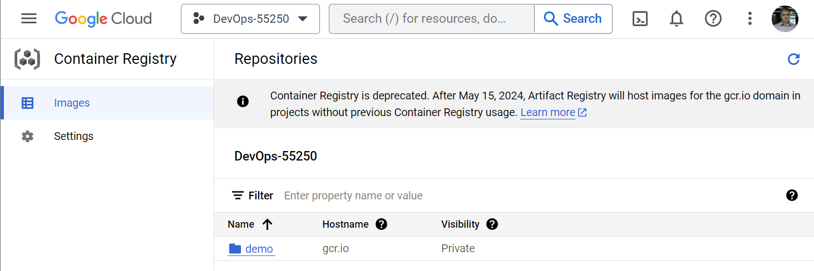  

6. Запуск контейнеру за допомогою Kubernetes. 
- Використаємо для цього `minikube` який розгортаємо прямо в IDE.  
```bash
$ minikube start
* minikube v1.31.2 on Debian 11.8 (amd64)
  - MINIKUBE_FORCE_SYSTEMD=true
  - MINIKUBE_HOME=/google/minikube
  - MINIKUBE_WANTUPDATENOTIFICATION=false
* Done! kubectl is now configured to use "minikube" cluster and "default" namespace by default

# наступна команда підтвердить нам що ми працюємо саме на кластері minikube
$ kubectl config current-context
minikube

# Зробимо псевдонім до команди kubectl
$ alias k=kubectl

# Команда повертає версію локального клієнту та віддаленого серверу
$ k version
Client Version: v1.28.2
Kustomize Version: v5.0.4-0.20230601165947-6ce0bf390ce3
Server Version: v1.27.4

# Наступна команда поверне поточний статус всього що є в кластері на даний момент  
$ k get all -A
NAMESPACE     NAME                                   READY   STATUS    RESTARTS        AGE    # Сервісні поди, або 
kube-system   pod/coredns-5d78c9869d-rgzjc           1/1     Running   0               8m51s
kube-system   pod/etcd-minikube                      1/1     Running   0               9m3s
kube-system   pod/kube-apiserver-minikube            1/1     Running   0               9m3s
kube-system   pod/kube-controller-manager-minikube   1/1     Running   0               9m3s
kube-system   pod/kube-proxy-hsr82                   1/1     Running   0               8m51s
kube-system   pod/kube-scheduler-minikube            1/1     Running   0               9m3s
kube-system   pod/storage-provisioner                1/1     Running   1 (8m21s ago)   9m2s

NAMESPACE     NAME                 TYPE        CLUSTER-IP   EXTERNAL-IP   PORT(S)                  AGE
default       service/kubernetes   ClusterIP   10.96.0.1    <none>        443/TCP                  9m5s  # Сервіс доступу для Kubernetes API
kube-system   service/kube-dns     ClusterIP   10.96.0.10   <none>        53/UDP,53/TCP,9153/TCP   9m4s  # Система DNS

NAMESPACE     NAME                        DESIRED   CURRENT   READY   UP-TO-DATE   AVAILABLE   NODE SELECTOR            AGE
kube-system   daemonset.apps/kube-proxy   1         1         1       1            1           kubernetes.io/os=linux   9m4s # Налаштування мережевого стеку

NAMESPACE     NAME                      READY   UP-TO-DATE   AVAILABLE   AGE
kube-system   deployment.apps/coredns   1/1     1            1           9m4s

NAMESPACE     NAME                                 DESIRED   CURRENT   READY   AGE
kube-system   replicaset.apps/coredns-5d78c9869d   1         1         1       8m52s
```

- Розгорнемо в цьому середовищі раніше створений контейнер, вказавши ім'я та параметр образу (тег що був доданий при завантажені образу в реєстр)
Deployment в термінології Kubernetes - це декларативний підхід в розгортанні контейнерів. Тоб-то ми описуємо бажаний стан, а Kubernetes виконує всі необхідні дії для розгортання самостійно, а після розгортання підтримує все в належному стані.   

```bash
$ k create deploy demo --image gcr.io/devops-55250/demo:v1.0.0
deployment.apps/demo created
# Запросимо розширену інформацію  
$ k get deploy -o wide
NAME   READY   UP-TO-DATE   AVAILABLE   AGE    CONTAINERS   IMAGES                            SELECTOR
demo   0/1     1            0           5m1s   demo         gcr.io/devops-55250/demo:v1.0.0   app=demo
# Перевіримо pod - мінімальну одиницю ресурсу в Kubernetes (один чи група контейнерів)
$ k get po
NAME                    READY   STATUS             RESTARTS   AGE
demo-6695d747b4-qglx5   0/1     ImagePullBackOff   0          5m33s

# Вивчаємо причину по якій контейнер не запущено 
$ k describe po demo-6695d747b4-cdjzw

Events:
  Type     Reason     Age                    From               Message
  ----     ------     ----                   ----               -------
  Warning  Failed     26m (x4 over 27m)      kubelet            Failed to pull image "gcr.io/devops-55250/demo:v1.0.0": rpc error: code = Unknown desc = Error response from daemon: unauthorized: You do not have the needed permissions to perform this operation, and you may have invalid credentials. To authenticate your request, follow the steps in: https://cloud.google.com/container-registry/docs/advanced-authentication

# Видаляємо поди та образи контейнера та всі раніше розгорнуті образи
$ kubectl delete pod demo-6695d747b4-qglx5
$ docker rmi -f gcr.io/devops-55250/demo:v1.0.0
$ kubectl delete deployment demo
```

- Долаємо проблему з авторизацією завдяки [Andrii Holovin](https://devopskubernetesgroup.slack.com/team/U06528X9SEM) та наступним документам:  
    * [Automated Google Cloud Platform Authentication](https://minikube.sigs.k8s.io/docs/handbook/addons/gcp-auth/)   
    * [gcloud CLI Integration](https://google.aip.dev/auth/4113)  

```bash
$ minikube addons enable gcp-auth
* gcp-auth is an addon maintained by Google. For any concerns contact minikube on GitHub.
You can view the list of minikube maintainers at: https://github.com/kubernetes/minikube/blob/master/OWNERS
! It seems that you are running in GCE, which means authentication should work without the GCP Auth addon. If you would still like to authenticate using a credentials file, use the --force flag.

$ gcloud auth application-default login

You are running on a Google Compute Engine virtual machine.
The service credentials associated with this virtual machine
will automatically be used by Application Default
Credentials, so it is not necessary to use this command.

If you decide to proceed anyway, your user credentials may be visible
to others with access to this virtual machine. Are you sure you want
to authenticate with your personal account?

Do you want to continue (Y/n)?  Y

Go to the following link in your browser:

Enter authorization code: ***************************

Credentials saved to file: [/tmp/tmp.RtmW5Lcmty/application_default_credentials.json]

These credentials will be used by any library that requests Application Default Credentials (ADC).
API [cloudresourcemanager.googleapis.com] not enabled on project [devops-55250]. Would you like to enable and retry (this will take a few minutes)? (y/N)?  y

Enabling service [cloudresourcemanager.googleapis.com] on project [devops-55250]...
Operation "operations/acat.p2-877078405124-47649cf6-9914-4cbf-a00b-4d3c0ddb9a3a" finished successfully.

Quota project "devops-55250" was added to ADC which can be used by Google client libraries for billing and quota. Note that some services may still bill the project owning the resource.

$ export GOOGLE_APPLICATION_CREDENTIALS=/tmp/tmp.RtmW5Lcmty/application_default_credentials.json
$ minikube addons enable gcp-auth
* gcp-auth is an addon maintained by Google. For any concerns contact minikube on GitHub.
You can view the list of minikube maintainers at: https://github.com/kubernetes/minikube/blob/master/OWNERS
  - Using image registry.k8s.io/ingress-nginx/kube-webhook-certgen:v20230407
  - Using image gcr.io/k8s-minikube/gcp-auth-webhook:v0.1.0
* Verifying gcp-auth addon...
* Your GCP credentials will now be mounted into every pod created in the minikube cluster.
* If you don't want your credentials mounted into a specific pod, add a label with the `gcp-auth-skip-secret` key to your pod configuration.
* If you want existing pods to be mounted with credentials, either recreate them or rerun addons enable with --refresh.
* The 'gcp-auth' addon is enabled
```

- Після виправлення помилок перевіримо стан роботи контейнеру, лог виводу на консоль та виконаємо команду запуску оболонки в контейнері в інтерактивному режимі.  
```bash
$ k get po
NAME                    READY   STATUS    RESTARTS   AGE
demo-6695d747b4-wkqpm   1/1     Running   0          14m

$ k logs deploy/demo
listening on [::]:8080 ...

$ k exec -it deploy/demo -- sh
/ # 
```
- З середини контейнеру перевіряємо процеси, інтерфейси та файлову систему  
```bash
/ # ps xa
PID   USER     TIME  COMMAND
    1 root      0:00 /bin/sh -c while true; do { echo -e 'HTTP/1.1 200 OK\n\n Version: 1.0.0'; } | nc -vlp 8080; done
    8 root      0:00 nc -vlp 8080
    9 root      0:00 sh
   16 root      0:00 ps xa
/ # ip a
1: lo: <LOOPBACK,UP,LOWER_UP> mtu 65536 qdisc noqueue qlen 1000
    link/loopback 00:00:00:00:00:00 brd 00:00:00:00:00:00
    inet 127.0.0.1/8 scope host lo
       valid_lft forever preferred_lft forever
2: eth0@if18: <BROADCAST,MULTICAST,UP,LOWER_UP,M-DOWN> mtu 1500 qdisc noqueue 
    link/ether 5e:c3:4c:00:44:dc brd ff:ff:ff:ff:ff:ff
    inet 10.244.0.15/16 brd 10.244.255.255 scope global eth0
       valid_lft forever preferred_lft forever
/ # ls -l /
total 44
drwxr-xr-x    2 root     root         12288 Jul 17 18:30 bin
drwxr-xr-x    5 root     root           360 Nov 18 22:00 dev
drwxr-xr-x    1 root     root          4096 Nov 18 22:00 etc
-r--r--r--    1 root     root           333 Nov 18 21:41 google-app-creds.json
drwxr-xr-x    2 nobody   nobody        4096 Jul 17 18:30 home
drwxr-xr-x    2 root     root          4096 Jul 17 18:30 lib
lrwxrwxrwx    1 root     root             3 Jul 17 18:30 lib64 -> lib
dr-xr-xr-x  264 root     root             0 Nov 18 22:00 proc
drwx------    1 root     root          4096 Nov 18 22:22 root
dr-xr-xr-x   13 root     root             0 Nov 18 22:00 sys
drwxrwxrwt    2 root     root          4096 Jul 17 18:30 tmp
drwxr-xr-x    4 root     root          4096 Jul 17 18:30 usr
drwxr-xr-x    1 root     root          4096 Nov 18 22:00 var
/ # exit
```
7. Налаштуємо мережевий сервіс для нашого контейнеру. 
- Вкажемо зовнішній порт вказуємо 80, а порт що слухає контейнер 8080   
```bash
$ k expose deploy/demo --port 80 --target-port 8080
service/demo exposed
```

- Переглянемо сервіси та endpoints. Сервіси в даному випадку це абстракція, а endpoints це налаштовані інтерфейси в container namespace  
```bash
$ k get svc
NAME         TYPE        CLUSTER-IP      EXTERNAL-IP   PORT(S)   AGE
demo         ClusterIP   10.102.71.154   <none>        80/TCP    2m54s
kubernetes   ClusterIP   10.96.0.1       <none>        443/TCP   4h7m

$ k get ep
NAME         ENDPOINTS           AGE
demo         10.244.0.15:8080    5m57s
kubernetes   192.168.49.2:8443   4h10m
```
- Скористуємось аналогом `port mapping` Docker-а, в Kubernetes це `port forward` який приймає локальний та віддалений порт та робить з'єднання. Відправимо процес в бекграунд та перевіряємо як воно працює:   
```bash
$ k port-forward svc/demo 8080:80&
[1] 169213
$ Forwarding from 127.0.0.1:8080 -> 8080

$ curl localhost:8080
Handling connection for 8080
 Version: 1.0.0

$ k logs deploy/demo
listening on [::]:8080 ...
GET / HTTP/1.1
connect to [::ffff:127.0.0.1]:8080 from localhost:46958 ([::ffff:127.0.0.1]:46958)
Host: localhost:8080
User-Agent: curl/7.74.0
Accept: */*

listening on [::]:8080 ...
```

## Coding Session Makefile+Dockerfile  
Підготуємо файли Dockerfile для контейнер іміджу та Makefile для бінарного файлу та подальшої автоматизації циклу CI/CD  
1. Обираємо середовище для Coding Session [google cloud shell](https://shell.cloud.google.com/)  
2. Клонуємо репозиторій з попередніх лекцій `git clone https://github.com/vit-um/kbot.git` 

### Утиліта make
Утиліта [Make](https://devdocs.io/gnu_make/) це інструмент що керує генерацією бінарних та інших файлів програми з вихідного коду.  
Тут буде розглянуто простий Makefile який описує як зібрати код програми kbot 
1. Додамо Makefile до директорії проекту:  
```bash
$ cd kbot
$ touch Makefile
```
2. Додамо функцію перевірки вхідного коду та продемонструємо як нею користуватись з Makefile  
```bash
$ gofmt -s -w ./
$ make format
gofmt -s -w ./
```
3. Далі зробимо таргет build за викликом якого має компілюватись наша програма в автоматичному режимі. 
- Оптимізуємо команду ключем `-v` що додає додаткову інформацію при збиранні пакету  
- Вкажемо назву вихідного файлу `-o kbot`  
- Версію винесемо в змінну середовища `${VERSION}`, та будемо її брати автоматично з `git describe`  
```bash
$ git describe --tags --abbrev=0 main
fatal: No names found, cannot describe anything.

$ git log --oneline
5af34b7 (HEAD -> main, origin/main, origin/HEAD) demo
6cf7d4b kbot func GetTime work
3ac6538 telegtam bot with menu
e7f3d9a Update README.md
217ed1a Update README.md
a5f1286 kbot v1.0.2 ended
7bfa7ea kbot v1.0.0
2d32492 Create README.md

$ git tag v1.1.0 6cf7d4b 

$ git push origin --tags
Total 0 (delta 0), reused 0 (delta 0), pack-reused 0
To https://github.com/vit-um/kbot.git
 * [new tag]         v1.0.0 -> v1.0.0
 * [new tag]         v1.1.0 -> v1.1.0

$ git tag -d v1.0.0
Deleted tag 'v1.0.0' (was 6cf7d4b)

$ git push origin --delete v1.0.0
To https://github.com/vit-um/kbot.git
 - [deleted]         v1.0.0

$ git describe --tags --abbrev=0
v1.1.0

$ git rev-parse --short HEAD
dd3db29

```
- скорочений хеш коміту візьмемо з команди `git rev-parse --short HEAD` та скомпонуємо (compose) команду для отримання версії.
Зауважте тут команда у круглих дужках з передуючим знаком змінною та вказанням shell для виконання дії. 

```Makefile
VERSION=$(shell git describe --tags --abbrev=0)-$(shell git rev-parse --short HEAD)

format: 
	gofmt -s -w ./

build:
	go build -v -o kbot -ldflags "-X="github.com/vit-um/kbot/cmd.appVersion=${VERSION}
```
- Перевіримо роботу створеного тегу:
```bash
$ make build
go build -v -o kbot -ldflags "-X="github.com/vit-um/kbot/cmd.appVersion=v1.1.0-dd3db29
github.com/vit-um/kbot

```
4. Правила всередині Makefile можна об'єднувати та виставляти пріоритети виконання.  
Наприклад ось так можна виконати форматування перед кроком збірки проекту командою `make build`:   
```Makefile
format: 
	gofmt -s -w ./

build: format
	go build -v -o kbot -ldflags "-X="github.com/vit-um/kbot/cmd.appVersion=${VERSION}
```
5. Налаштування команди build для підтримки різних платформ.  
Архітектуру платформи можна визначати автоматично командою `dpkg --print-architecture` або `uname -m`

```Makefile
TARGETOS=linux

build: format
	CGO_ENABLED=0 GOOS=${TARGETOS} GOARCH=${shell dpkg --print-architecture} go build -v -o kbot -ldflags "-X="github.com/vit-um/kbot/cmd.appVersion=${VERSION}
```
6. Додамо це пару команд для Makefile  
- `lint:` - виводить помилки стилю, та не переформатую код на відмінність від gofmt
- `test:` - команда що автоматизує виконання тестування пакетів
- `clean:` - видалення бінарних файлів, що не мають попасти в історію комітів. 

### Dockerfile - автоматизуємо білд та пуш іміджу  
1. Оберемо базовий імідж як офіційний Golang для білдера 
```Dockerfile
FROM golang:1.21 as builder
```
2. Зазначимо робочий каталог та скопіюємо вихідний код до білд контексту  
```Dockerfile
WORKDIR /go/src/app
COPY . .
```
3. Виконаємо команду для встановлення залежностей та запустимо наш Makefile для збірки бінарного файлу
```Dockerfile
# RUN go get винесено в Makefile
RUN make build
```
4. На другому етапі зробимо копію артефакту з білдера та завантажимо з офіційного alpine кореневий сертифікат для підтримки https.
`ENTRYPOINT ["./kbot"]` - визначимо як запуск бінарного файлу `kbot` без параметрів 
Мультістейдж (Multistage) формат Docker-файлу - це підхід до створення Docker-іміджів, який дозволяє ефективно використовувати різні етапи збірки для розробки, тестування та релізу кінцевого продукту. Це дозволяє зменшити розмір кінцевого Docker-іміджу та покращити його ефективність.  
Основна ідея мультістейдж формату полягає в тому, що ви можете визначити кілька етапів у власному Docker-файлі, кожен із яких використовує різні базові іміджі та виконує певні операції. Потім з кожного етапу вибирається тільки те, що потрібно для наступного етапу, і тільки кінцевий етап утворює кінцевий Docker-імідж.  
```Dockerfile
FROM scratch
WORKDIR /
COPY --from=builder /go/src/app/kbot .
COPY --from=alpine:latest /etc/ssl/certs/ca-certificates.crt /etc/ssl/certs/
ENTRYPOINT ["./kbot"]
```
5. Зберемо контейнер та запустимо його командою `run` без опцій та з ними.  
```bash
$ docker build .
[+] Building 50.0s (13/13) FINISHED                                                                       docker:default
 => [internal] load .dockerignore                                                                                   0.0s
 => => transferring context: 2B                                                                                     0.0s
 => [internal] load build definition from Dockerfile                                                                0.0s
 => => transferring dockerfile: 316B                                                                                0.0s
 => [internal] load metadata for docker.io/library/alpine:latest                                                    1.0s
 => [internal] load metadata for docker.io/library/golang:1.21                                                      2.0s
 => FROM docker.io/library/alpine:latest@sha256:eece025e432126ce23f223450a0326fbebde39cdf496a85d8c016293fc851978    0.7s
 => [builder 1/4] FROM docker.io/library/golang:1.21@sha256:57bf74a970b68b10fe005f17f550554406d9b696d10b29f1a4bdc  20.3s
 => [internal] load build context                                                                                   5.6s
 => => transferring context: 435.91MB                                                                               5.6s
 => [builder 2/4] WORKDIR /go/src/app                                                                               5.2s
 => [builder 3/4] COPY . .                                                                                          2.4s
 => [builder 4/4] RUN make build                                                                                   19.7s
 => [stage-1 1/3] COPY --from=builder /go/src/app/kbot .                                                            0.0s
 => [stage-1 2/3] COPY --from=alpine:latest /etc/ssl/certs/ca-certificates.crt /etc/ssl/certs/                      0.0s 
 => exporting to image                                                                                              0.1s 
 => => exporting layers                                                                                             0.1s 
 => => writing image sha256:b86359f1da0eac697d879b85d27cfad25cd12ad49b1900a3741db8eb51a407be                        0.0s

$ docker run b86359f1da0eac697d879b85d27cfad25cd12ad49b1900a3741db8eb51a407be
Usage:
  kbot [command]

$ docker run b86359f1da0eac697d879b85d27cfad25cd12ad49b1900a3741db8eb51a407be version
v1.1.0-dd3db29

$ docker run b86359f1da0eac697d879b85d27cfad25cd12ad49b1900a3741db8eb51a407be go 
kbot v1.1.0-dd3db29 started2023/11/19 14:32:17 Please check TELE_TOKEN env variable. telegram: Not Found (404)
```
### Інтеграція
Додамо правила що до збірки іміджу до `Makefile`     
1. Призначимо ще одну змінну `APP` для зберігання та автоматичного призначення повної назви контейнер іміджу на базі назви гіт-репозиторію
```bash
$ git remote -v
origin  https://github.com/vit-um/kbot.git (fetch)
origin  https://github.com/vit-um/kbot.git (push)

$ git remote get-url origin
https://github.com/vit-um/kbot.git

$ basename $(git remote get-url origin)
kbot.git

$ make image
=> => writing image sha256:b86359f1da0eac697d879b85d27cfad25cd12ad49b1900a3741db8eb51a407be                        0.0s 
=> => naming to docker.io/umanetsvitaliy/kbot.git:v1.1.0-dd3db29-amd64                                             0.0s

$ make push
docker push vit-um/kbot.git:v1.1.0-dd3db29-amd64
The push refers to repository [docker.io/vit-um/kbot.git]
21f9a51db407: Preparing 
0d6750ac1fa3: Preparing 
denied: requested access to the resource is denied
make: *** [Makefile:26: push] Error 1

$ docker login -u umanetsvitaliy
Login Succeeded
```
2. Автоматизуємо в `Makefile` команди збірки та публікації іміджу контейнера   
```Makefile
APP=$(shell basename $(shell git remote get-url origin))
REGESTRY=umanetsvitaliy
VERSION=$(shell git describe --tags --abbrev=0)-$(shell git rev-parse --short HEAD)
TARGETOS=linux
TARGETARCH=amd64

format: 
	gofmt -s -w ./

get:
	go get

lint:
	golint

test: 
	go test -v

build: format get
	CGO_ENABLED=0 GOOS=${TARGETOS} GOARCH=${shell dpkg --print-architecture} go build -v -o kbot -ldflags "-X="github.com/vit-um/kbot/cmd.appVersion=${VERSION}

image:
	docker build . -t ${REGESTRY}/${APP}:${VERSION}-${TARGETARCH}

push:
	docker push ${REGESTRY}/${APP}:${VERSION}-${TARGETARCH}

clean: 
	rm -rf kbot
```

3. Запустимо створені команди та протестуємо імідж з вказанням повного тегу.  
```bash
$ make push
docker push umanetsvitaliy/kbot.git:v1.1.0-dd3db29-amd64
The push refers to repository [docker.io/umanetsvitaliy/kbot.git]
21f9a51db407: Pushed 
0d6750ac1fa3: Pushed 
v1.1.0-dd3db29-amd64: digest: sha256:18df2f1d8383e9a913158bea0e52505da102fb883322616299fc23751c5e1309 size: 737

$ docker run umanetsvitaliy/kbot.git:v1.1.0-dd3db29-amd64
Usage:
  kbot [command]

```

## Практичне завдання 4. Застосування утиліти `Dive` в процесі CI/CD тестування

Потрібно записати демонстрацію процесу використання утиліти з наступним параметром:  
  `dive --ci --lowestEfficiency=0.9 <image_name>`
для подальшого її використання в процесах автоматизованого тестування образу.

### Сценарій
```bash
asciinema rec -i 1 
make image
dive {sha256}
dive --ci --lowestEfficiency=0.99 {sha256}
# Result:FAIL [Total:3] [Passed:1] [Failed:1] [Warn:0] [Skipped:1]
wget https://raw.githubusercontent.com/wagoodman/dive/main/.data/.dive-ci
dive --ci {sha256}
# Result:PASS [Total:3] [Passed:3] [Failed:0] [Warn:0] [Skipped:0]  {0.99  300kb 0.03}
nano .dive-ci 
dive --ci {sha256}
# Result:FAIL [Total:3] [Passed:0] [Failed:3] [Warn:0] [Skipped:0]
rm .dive-ci
docker images 
docker rmi
nano Makefile 
make dive
# Result:FAIL [Total:3] [Passed:1] [Failed:1] [Warn:0] [Skipped:1]
nano Dockerfile
make dive
# Result:PASS [Total:3] [Passed:2] [Failed:0] [Warn:0] [Skipped:1]
```
### Запис 
  
Також запис консолі певний час буде зберігатись [за цим посиланням](https://asciinema.org/a/622097)

## Практичне завдання 5. Підготовка Makefile та Dockerfile для тестування коду продукту на різних платформах та архітектурах.

Змінні для визначення можливих архітектур на ОС беремо з [документації компілятора](https://go.dev/doc/install/source#environment).
