## Метрики, логи та трейси

`Monitoring і observability` — збірні терміни, що включають логування, метрики, графічне представлення, інформування та алертинг, трейсинг.

**Фреймворк [CALMS:](https://www.atlassian.com/devops/frameworks/calms-framework)**  
`C` — Culture (культура) — зміна культури організації, щоб вона була спрямована на розвиток та інновації;  
`A` — Automation (автоматизація) — використання інструментів автоматизації для забезпечення швидкості та ефективності виконання завдань;  
`L` — Lean (оптимізація) — оптимізація процесів та використання ресурсів для досягнення максимальної ефективності;  
`M` — Measurement (вимірювання) — вимірювання результатів та ефективності впровадження хмарних технологій;  
`S` — Sharing (спільне використання) — спільне використання ресурсів та даних між різними департаментами та організаціями для забезпечення більшої ефективності та економічної вигоди.  

`Measure all the things` — вимірюй усе. Результатом імплементації DevOps має стати процес постійного вдосконалення Continuous Improvement. 

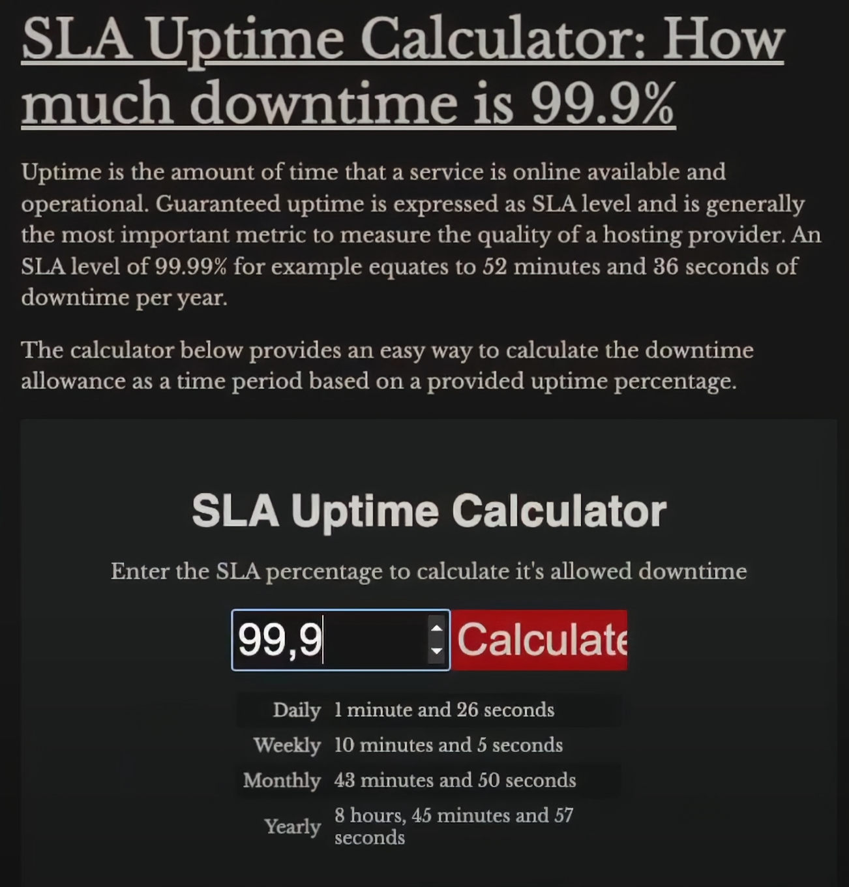  

Наші досягнення мають бути вимірюваними, а не покладатися на заяви і сприйняття. [What Gets Measured — Gets Done](https://www.linkedin.com/pulse/what-gets-measured-managed-gearset/?trk=organization_guest_main-feed-card_feed-article-content) —  Що вимірюється, те й робиться (Tom Peters).

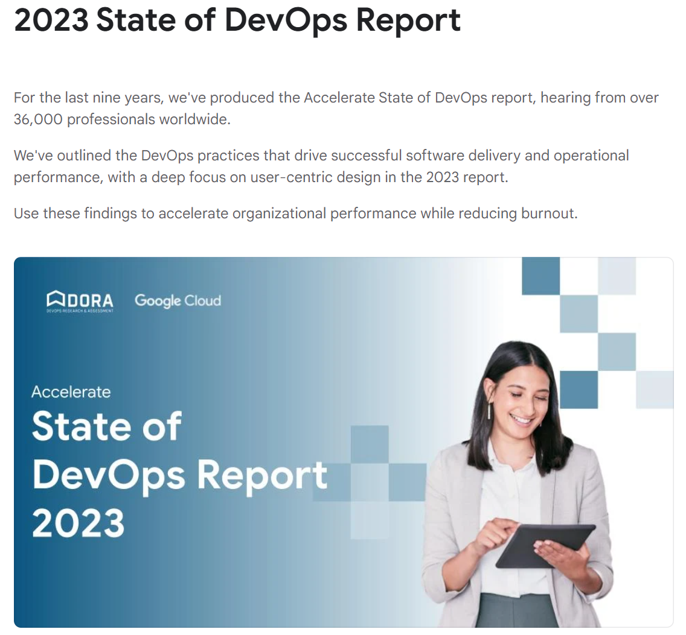  

[Щорічний звіт State of DevOps](https://cloud.google.com/devops/state-of-devops) фокусується на 4 ключових показниках — два для швидкості та два для стабільності:  
  - `Lead time` (час виконання змін) — скільки часу минає від коміту до деплою на прод;  
  - `Change Frequency` (частота змін) — як часто ви деплоїте в прод;
  - `Change Failure Rate` (частота відмов при змінах) — як часто зміни (сам код, процес деплою) призводять до появи помилки на проді;  
  - `MTTR` (середній час відновлення) — скільки часу вам потрібно для відновлення працездатності в разі інциденту.  

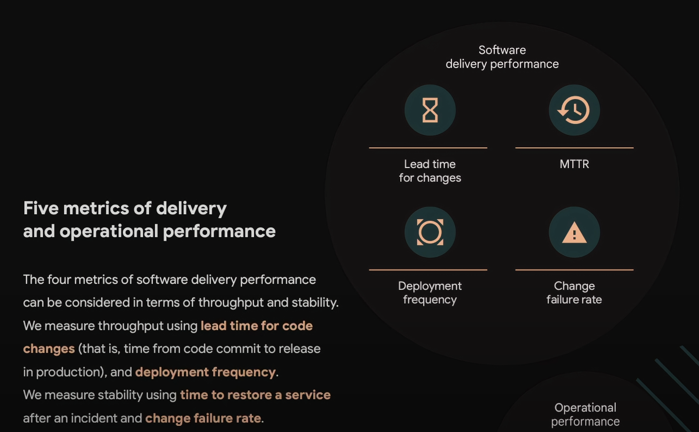 

Ключові досягнення DevOps мають бути видимими і прозорими як для колег вашої команди, сусідніх команд, так і для організації в цілому. Таким чином досягається максимальна ефективність від
витрачених ресурсів.

`Моніторинг` — це інструментарій або технічне рішення, яке дає змогу командам спостерігати і розуміти стан своїх систем. Моніторинг заснований на зборі заздалегідь визначених наборів метрик і журналів.

`Observability` — це інструментарій або технічне рішення, яке дозволяє командам активно налагоджувати свою систему, заснований на вивченні властивостей і закономірностей, не визначених заздалегідь. 

У нас вже є розгорнутий застосунок, реалізований процес CI/CD. 0т же маємо звідки збирати дані для моніторингу та аналітики. Окрему увагу в цьому курсі буде приділено самому застосунку та його компонентам. Тоб-то інструментування застосунку - реалізації збору та виводу метрик у коді самого проекту, а також обв'язки проекту інструментами моніторингу. Це будуть технічні метрики, але в подальшому можна буде отримати і метрики для бізнесу.

Observability - це міра того, наскільки добре можна визначити внутрішній стан системи на основі її зовнішніх результатів. Це важливий аспект управління та моніторингу систем, оскільки він дозволяє інженерам та аналітикам зрозуміти, як система працює, і виявити потенційні проблеми.


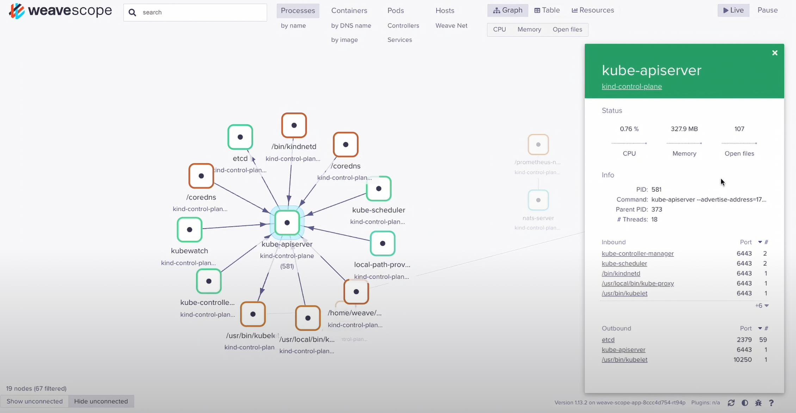  

Технічні метрики визначені заздалегідь, а в складних непередбачених випадках нам для налагодження можуть стати в пригоді інструменти, що вирішують проблему 'unknown unknowns' (невідомі невідомості).

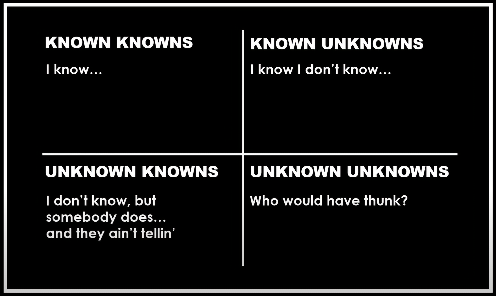  

Цей метод використовується в NASA базуючись на техніці вікна Johari. Є ризики про які ми знаємо, коли ми знаємо що чогось не знаємо і є ризики що відбуваються за таких обставин, що ми навіть не припускаємо чого ми не знаємо. І для цього нам теж потрібен інструмент, який може проводити перевірку наскрізь між усіма компонентами системи. Наприклад трейсінг системи. 

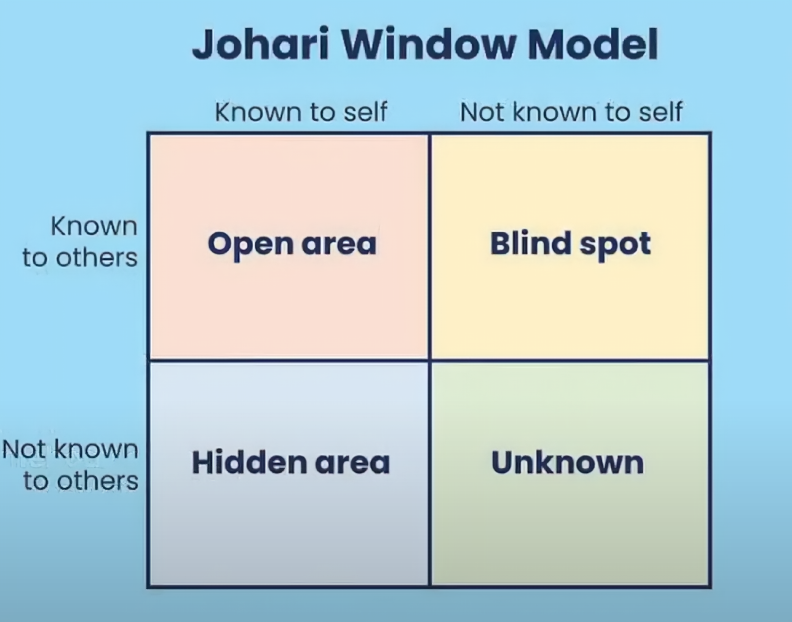  

Хмарні провайдери надають готові рішення моніторингу, з коробки, це хороший стартовий варіант.

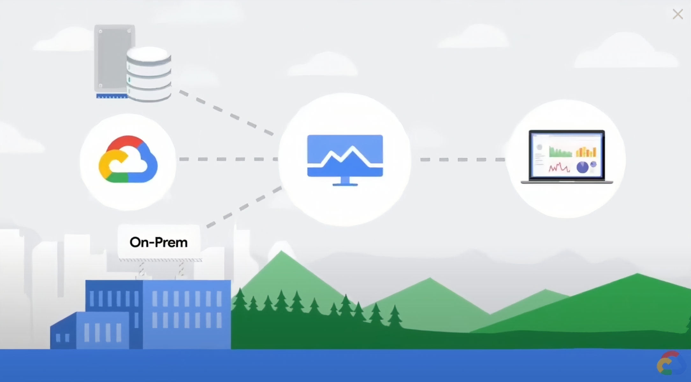  

У книзі `Site Reliability Engineering` виокремлює два методи моніторингу:  
- **Black-Box** — синтетичний зовнішній тест сервісу за процедурою користувацької поведінки.Періодично надсилаються призначені для користувача запити від зовнішньої системи в цільову систему і реєструється відповідь. У результаті отримуємо симптоматичний стан сервісу — працює зараз сервіс чи ні. Якщо ні — у Black-Box ми про причини не знаємо.  
- **White-Box** — це внутрішньосистемний моніторинг, за трьома основними компонентами: метрики, логи і трейси. У системах типу Kubernetes є ще поняття events або події, додатковий компонент внутрішньосистемного моніторингу.

`Метрики` — це ключ-значення. Найчастіше числові метрики використовуються через необхідність виконувати математичні обчислення для формування статистики та візуалізації.

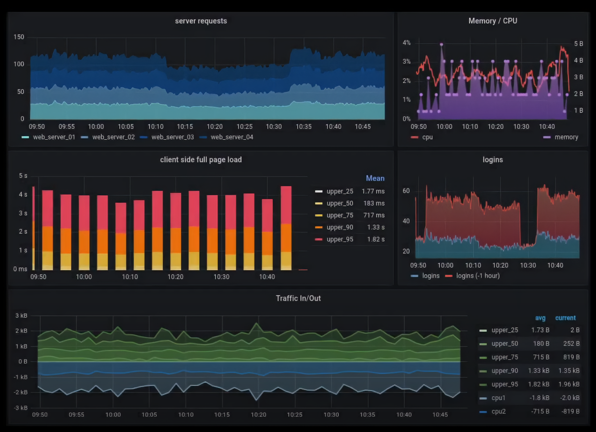

`Логи` — неструктуровані та структуровані текстові дані. Зазвичай діляться за важливістю і форматом. Інкрементально записуються у файл. Для приведення до єдиного формату і можливості однакового аналізу використовують парсери, фільтри, агрегатори. На базі логів можуть створюватися log-base метрики. Для збереження як структурованих, так і неструктурованих даних, повнотекстового пошуку та аналізу, логи часто експортуються в спеціалізовані бази даних або системи, наприклад, ElasticSearch.

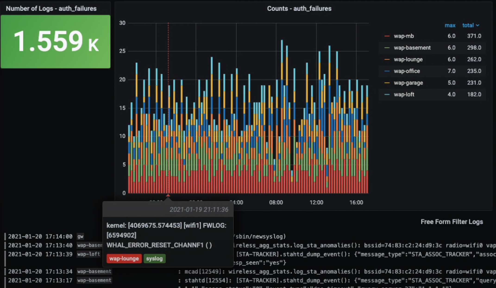  

`Трейси` — шляхи проходження запиту від входу в систему до кінцевого сервісу. Реєструється шлях через усі задіяні компоненти та функції застосунку, сервіси або мікросервіси. У результаті будується граф із відрізків (span) із трасувальною інформацією по кожному з відрізків шляху. За даними з трейса можна провести профілювання як на міжсервісний взаємодії, так і на рівні функцій у застосунку.

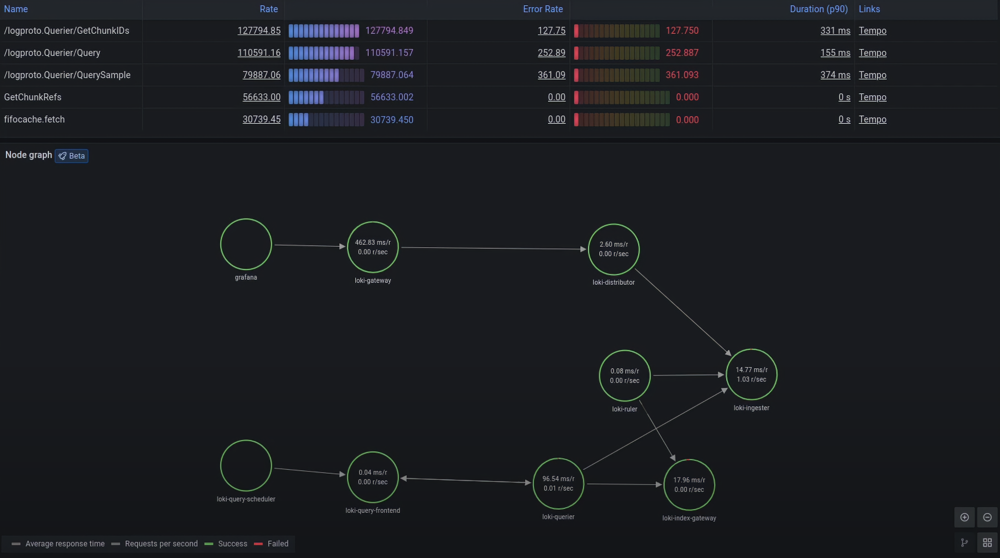

Існує ціла низка стандартів і вимог до промислових систем моніторингу. У великих
компаніях нерідко використовують рекомендації з управління інцидентами. У такому разі
система моніторингу певним чином інтегрується в загальну багаторівневу систему
повідомлення ескалації тощо.

Приклад такого стандарту `OpenTelemetry` є відкритим стандартом для збору обробки
та передачі телеметрії в розподілених системах. Він є наступником проектів `OpenCensus` та `OpenTracing` і дозволяє розробникам і операторам збирати телеметрію та аналізувати її в розподілених середовищах, що складаються з багатьох мікросервісів.

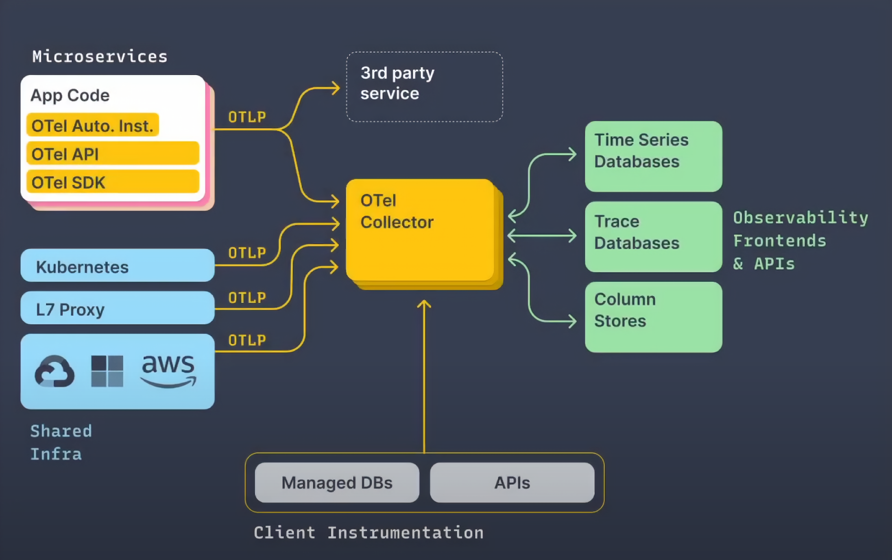

`OpenTelemetry` складається з двох основних компонентів:
- `Інструментація` дозволяє розробникам інтегрувати збір телеметрії в свої додатки безпосередньо в коді за допомогою API. 
- `Колектори` дозволяють збирати телеметрію з різних джерел та передавати її до різних приймачів для аналізу і візуалізації

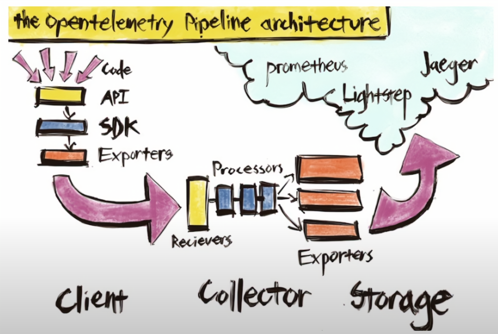

OpenTelemetry інтегрується з багатьма сторонніми інструментами для аналізу та візуалізація такими як Prometheus, Grafana, Jaeger, Zipkin та інші. Тобто ми отримали універсальний метод для DevOps/SRE практик - єдиний стандарт на вході та практично необмежений формат на виході. 

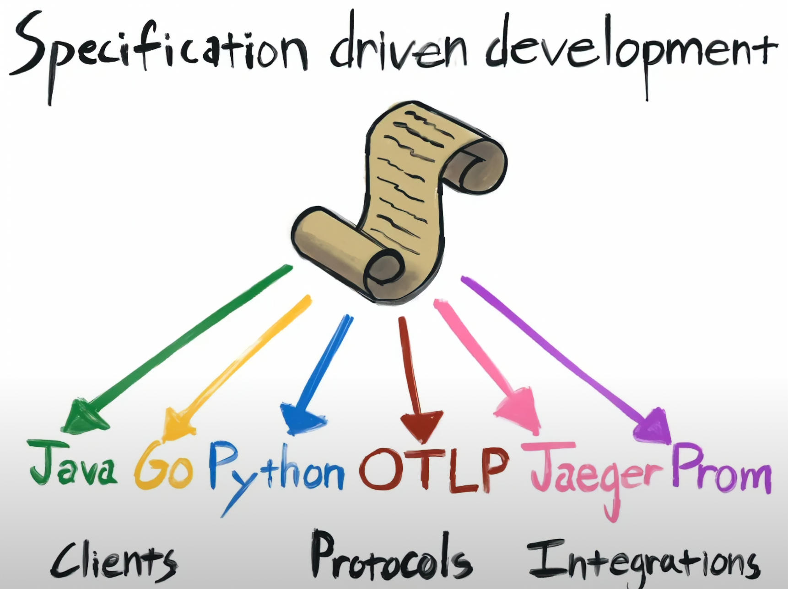 

І на завершення: **Хто ж повинен моніторити моніторинг?**

Як і будь-яка інша система вашої інфраструктури, моніторинг — такий самий вимірюваний компонент. Тому плануючи моніторингову систему, візьміть за правило: одна система в периметрі, друга за периметром інфраструктури. Це може бути сторонній зовнішній сервіс, який, зі свого боку, також моніториться. Він може використовуватися для Black-box тестів і заодно збирати метрики з внутрішнього моніторингу. 

Крім доступності вкрай важливо аналізувати метрики самої моніторингової системи. Як технічні, так і функціональні: 
- наскільки зручно 
- як швидко локалізується проблема
- скільки помилкових спрацювання системи 
- скільки з них було проігноровано 
- скільки інцидентів пройшли непоміченими 
- скільки актуально було відкрито 

У разі відмови у вас завжди є redundancy або надмірність.

Вимірюємо все, що можемо, і ділимося всім, що вимірюємо. 

### Корисні посилання 

[Why Everyone Working in DevOps Should Read The Toyota Way](https://zwischenzugs.com/2019/11/06/why-everyone-working-in-devops-should-read-the-toyota-way/) 
[News, insights & events in the world of Salesforce DevOps](https://gearset.com/blog/)  
[2022 State of DevOps Report](https://cloud.google.com/devops/state-of-devops)  
[What is Five 9s Availability?](https://www.nobl9.com/resources/do-you-really-need-five-nines)  
[Incident Management](https://www.atlassian.com/incident-management/kpis/common-metrics)  
[An Introduction to Metrics, Monitoring, and Alerting](https://www.digitalocean.com/community/tutorials/an-introduction-to-metrics-monitoring-and-alerting)  

## Інструменти моніторингу

Три групи інструментів моніторингу: 
1. Популярні публічні сервіси. 
2. Інструменти, що надаються хмарним провайдером із коробки. 
3. Популярний стек систем моніторингу, які ми самостійно розгортаємо в нашій
інфраструктурі.

CNCF landscape пропонує категорію систем [Observability and Analysis](https://landscape.cncf.io/guide#observability-and-analysis).

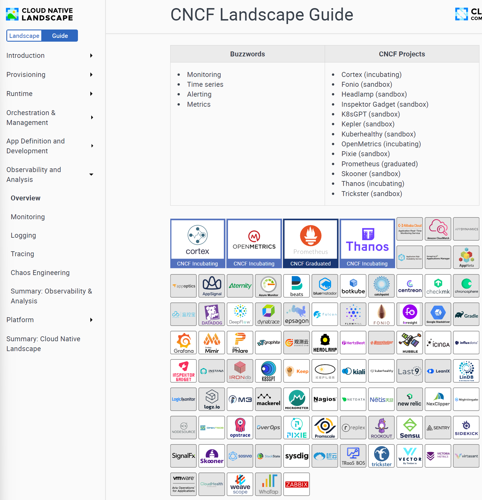

Сюди входять групи:  
- Моніторинг (70 проєктів),  
- Логування (21 проєкт), 
- Трасування (19 проєктів), 
- Хаос Інжиніринг (9 проєктів),
- Безперервна Оптимізація Observability & Analysis (61 проєктів)

### SaaS Monitoring

SaaS (Software as a Service) моніторинг — це послуги, які надають засоби моніторингу в якості хмарного сервісу. Приклади: Datadog, New Relic, AppDynamics. 

[15 best cloud monitoring tools & services in 2023](https://middleware.io/blog/cloud-monitoring-tools/)  

Прикладом з end-to end комплексним підходом із розгортання моніторингу є  [DataDog](https://www.datadoghq.com/). Для більшості подібних flow можна описати так:
- Різного типу джерела можуть бути використані для експорту даних на платформу. 
- Зазвичай для цього використовуються вбудовані функції систем або додаткові агенти в цільовій інфраструктурі. 
- Дані збираються та експортуються на моніторингову платформу де агрегуються, аналізуються та відображаються у вже заготовлених дашбордах.
- Шаблонами покривається широкий спектр завдань: від простих хостів, інцидент-менеджменту хмарних ресурсів, CI/CD конвеєрів, мережі, сканерів вразливостей, до аналітики за допомогою штучного інтелекту. 
- За необхідності, всі налаштування можна кастомізувати під свої потреби. 

У міру освоєння моніторингової платформи, зазвичай проводять оптимізацію, оскільки від цього безпосередньо залежать витрати, а ці сервіси досить дорогі. У більшості платформ є тріал період і безкоштовні опції для обмеженої кількості метрик і хостів

### Cloud Providers Solutions
Наступною групою є системи хмарного провайдера (Наприклад Cloud Monitoring на GCP). Тут схема схожа - використовуються агенти експортери, але вже все в периметрі провайдера.

Більшість хмарних провайдерів пропонують свої рішення для моніторингу. Наприклад:  
- Amazon CloudWatch (AWS),  
- Google Stack driver (GCP),  
- Microsoft Azure Monitor (Azure).  

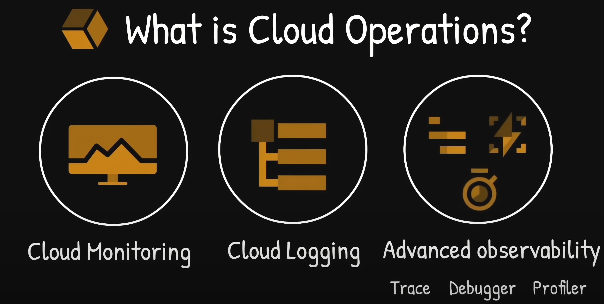  

Додатковим плюсом є факт що структура знаходиться в зоні відповідальності одного провайдера яким надається сервіс під SLA. 

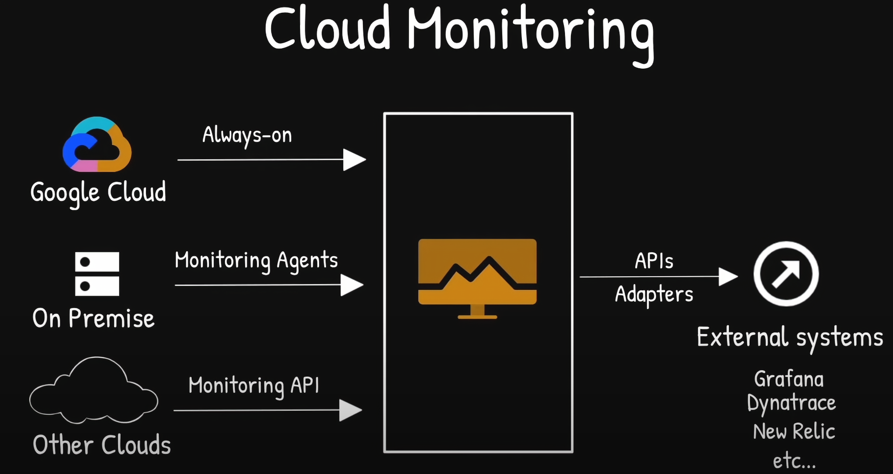 

Найчастіше, моніторинг вже входить у вартість використання хмари. Тобто, ми уникаємо додаткових костів, так само як і передачу досить великого обсягу даних, наприклад логів, за периметр своєї інфраструктури. 

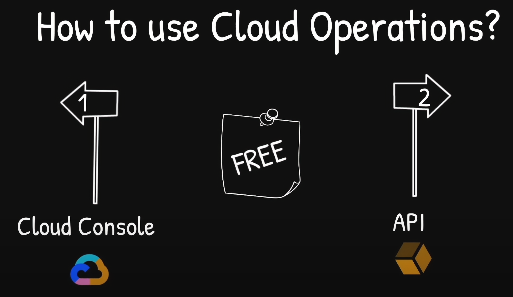

У деяких проєктах ми можемо бути обмежені в цьому за вимогами безпеки. В той час як провайдер нічим не обмежений технічно і може надати набагато більше інформації, аж до debug рівня 

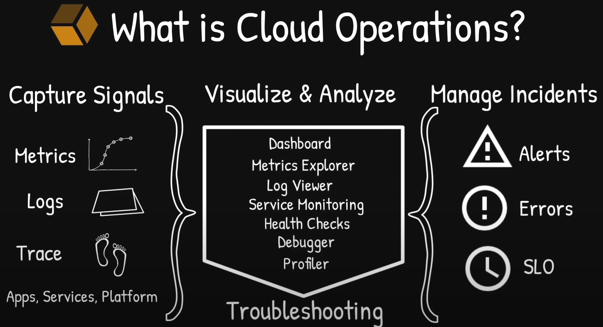 

Хочу нагадати що всі варіанти не є взаємовиключними. Тобто, ми можемо застосовувати їх у будь-якій комбінації. І один із варіантів - розгорнути моніторингові компоненти всередині інфраструктури нашого хмарного проєкту або приватного дата центру. 

Усі стартові та експлуатаційні витрати ми несемо самостійно. Так само, ми відповідаємо за вибір продукту.Це можуть бути як опенсорс, так і ентерпрайзіс рішення, безкоштовні та платні, з підтримкою і без такої.

### Self-hosted моніторинг 
Це рішення, які встановлюються та керуються на власному обладнанні або в хмарі. Приклади: Prometheus, Grafana, Jaeger, Elasticsearch.

Схема моніторингу включає інструменти для збору, обробки, зберігання та відображення даних. 


### З чого починати?

Зазвичай починають із системи збору та агрегування логів. 

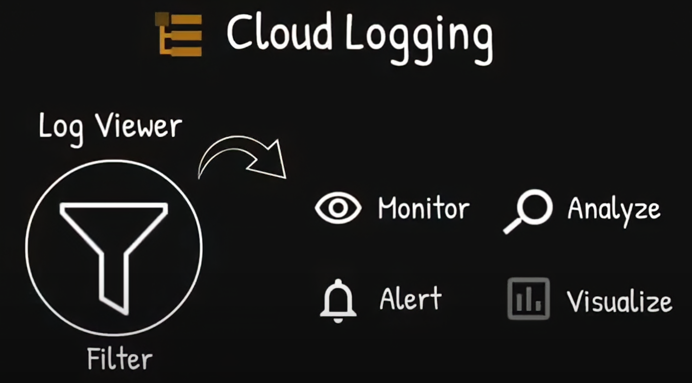  

Далі розширюються системою збору та візуалізації метрик. 

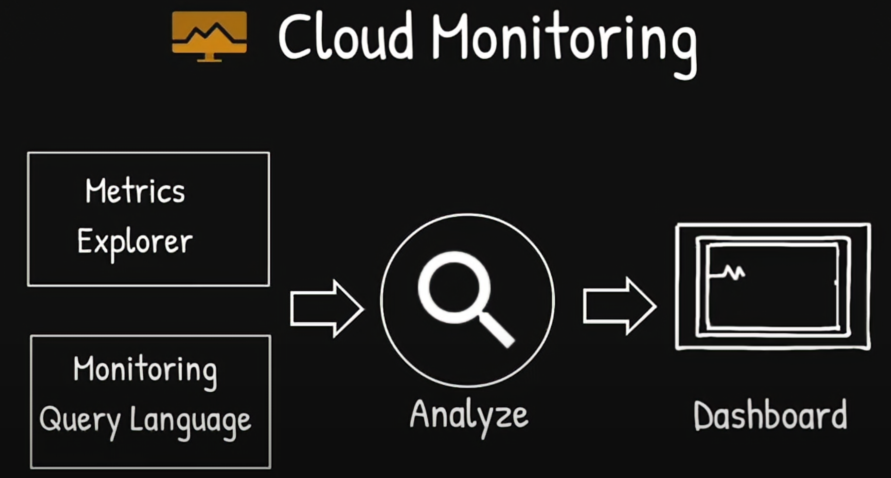  

За необхідності налаштовують систему трасування, проводять інтеграцію з іншими системами, зокрема й зовнішніми. 

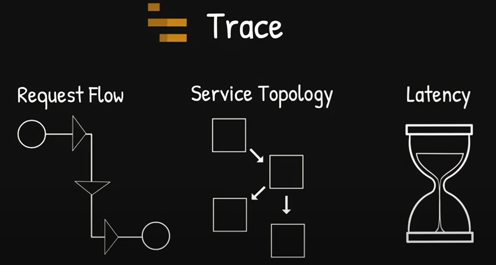  

У результаті отримуємо комплексну моніторингову систему. Встановимо та налаштуємо подібну систему на практиці. 

### Стек моніторингу

Стек може включати такі компоненти:  
- **Логи**  
`Grafana Loki` — це горизонтально масштабована, високопродуктивна система зберігання логів, що працює з Grafana для візуалізації даних.

- **Метрики**  
`Prometheus` — відкрита система моніторингу та оповіщень, яка збирає метрики від різних джерел і зберігає їх для аналізу та візуалізації.

- **Трейси**  
`Jaeger` — система розподіленого трейсінгу, що дозволяє збирати та аналізувати дані про взаємодію компонентів розподіленої системи. 

- **Візуалізація**  
`Grafana` — інструмент для візуалізації метрик, логів та трейсів з різних джерел, що дозволяє створювати налаштовувані інформаційні панелі.

- **Інструментація**  
`OpenTelemetry` — відкритий проєкт для стандартизації збору метрик, логів та трейсів у розподілених системах. Він включає бібліотеки, агенти та інструменти для інструменталізації додатків.

Універсальний агент `Fluentbit` — легкий і високопродуктивний агент для збору, обробки та пересилання логів, метрик та інших даних з різних джерел до різних систем зберігання.

Інструментація — процес додавання коду до додатку для збору даних про його роботу. OpenTelemetry — відкритий стандарт для інструменталізації додатків.


Розглянемо стек моніторингу, інструменти відповідно до їх призначення та варіанти інтеграції компонентів. 
- В ролі застосунку може бути любий компонент інфраструктури починаючи з серверів контролю версій, баз даних та контрплеін Kubernetes та Flux завершуючи мікросервісами продукту. 
- Логування швидше за все в самому додатку вже реалізоване. Можливо без рівнів логування та відповідної фільтрації. Але воно є. І воно виводиться на стандартний вивід  
- Метрики - їх або немає зовсім, або додані стандартною бібліотекою. Тобто їх багато і вони не дуже ефективно використовуються   
- Трейсінг - зазвичай відсутній зв замовчуванням. 

Це не тривіальне завдання та вимагає розуміння як застосовувати цей інструмент. 
- Логи виводимо на стандартний вивід, 
- Метрики на ендпоінт /metrics, 
- Трейсінг або вбудований або зовнішній системний. 

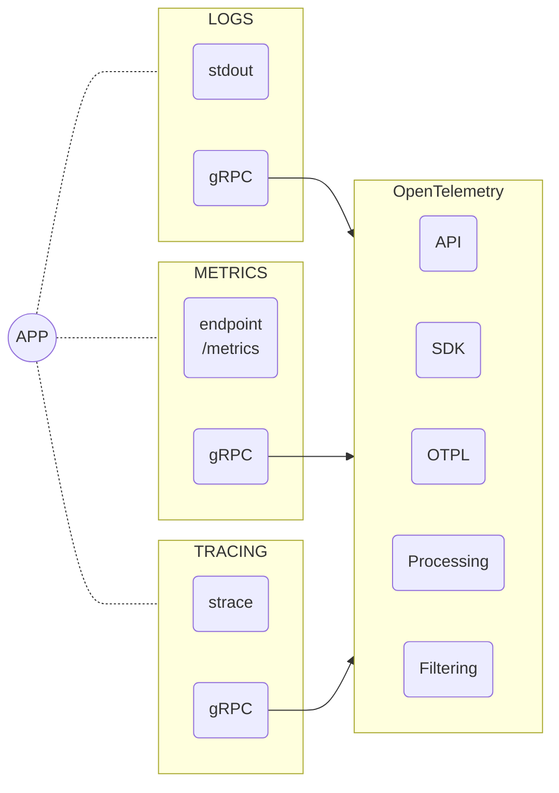
```mermaid
flowchart LR
A((APP))
    subgraph LOGS
        direction LR
        B(stdout)
        C(gRPC)
    end
    subgraph METRICS
        direction LR
        D("endpoint 
        /metrics")
        E(gRPC)    
    end
    subgraph TRACING
        direction LR
        F(strace)
        G(gRPC)
    end
    subgraph OpenTelemetry
        direction LR
        H(API)
        K(SDK)
        L(OTPL)
        M(Processing)
        N(Filtering)
    end
C & E & G --> OpenTelemetry
A -..- LOGS & METRICS & TRACING 
```

У всіх трьох випадках може застосовуватися [grpc](https://habr.com/ru/companies/otus/articles/780720/) в залежності від клієнтської бібліотеки та інструментування
application.

`Як prometheus тільки для логів` - такий слоган проекту `Loki` від `Grafana Labs`.

[Loki](https://grafana.com/docs/loki/latest/) - це система для збору та агрегації логів, яка може бути використана як альтернатива `ELK/Elastic` Stack. Loki був розроблений для Kubernetes, але може бути використаний в будь-якому іншому середовищі. 

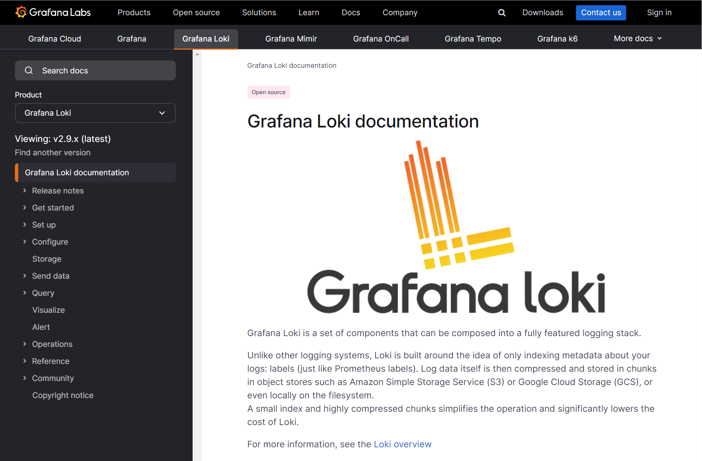  

`Prometheus` зазвичай асоціюється з метриками та моніторингом інфраструктури. Але збір метрик саме для аплікейшену може бути дуже корисним для виявлення проблем та їх вирішення. 

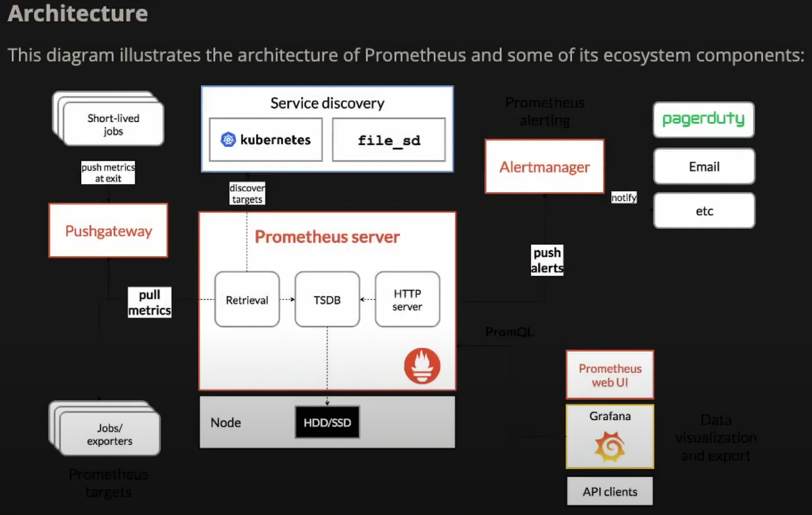 

Prometheus безумовно лідер в своєму класі, але він не є ідеальним та простим у використанні. 

[Jaeger](https://www.jaegertracing.io/docs/1.53/architecture/) або Zipkin - це системи трейсінгу, які дозволяють відстежувати виклики між сервісами та визначати проблеми в роботі мікросервісів. Надає можливість отримати глибоке розуміння того, як працює ваш додаток та як він взаємодіє з іншими сервісами 

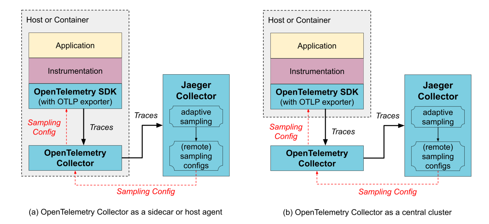   

[Grafana](https://grafana.com/docs/grafana/latest/fundamentals/intro-to-prometheus/) - це інструмент для візуалізації даних з різних джерел таких як Prometheus, Elasticsearch, InfluxDB, Loki та інших. Він дозволяє створювати інформативні дашборди та алерти для всього інфраструктурного стеку.

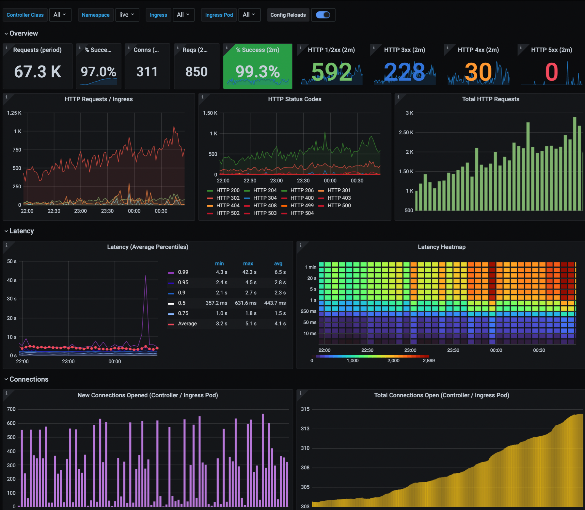 

[OpenTelemetry](https://opentelemetry.io/) - це набір інструментів бібліотек та протоколів для стандартизації збору метрик, трейсингу та логування. Є стандартизованим підходом для інтеграції всієї системи.

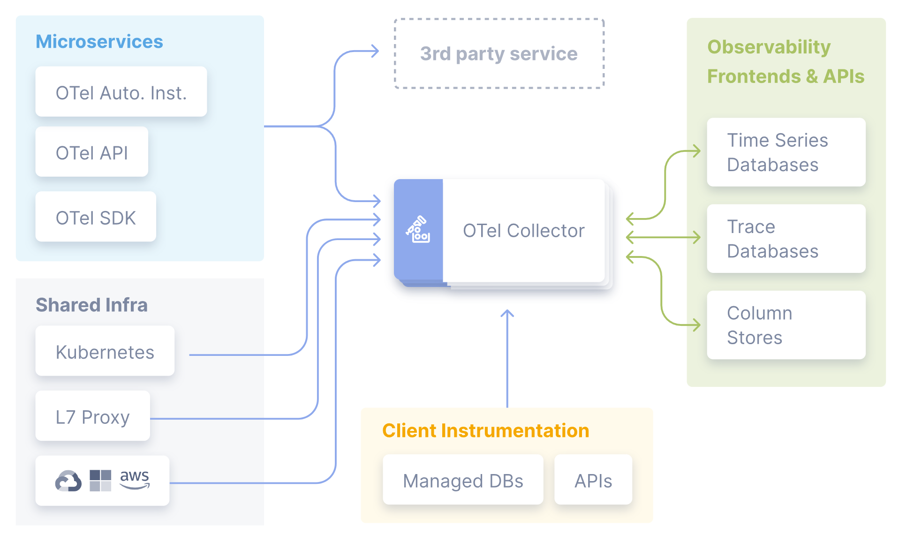

Молодий проект, в активній фазі розробки. Але вже зараз він дозволяє використовувати однаковий підхід для всіх трьох типів інструментів.  

[OpenTelemetry](https://opentelemetry.io/docs/demo/architecture/) включає:  
- колектори 
- експортери 

Реалізує grpc та http інтерфейси, API, SDK та протокол
OTLP (Open Telemetry Protocol). 

Processing та Filtering реалізують проміжну обробку отриманих даних на колекторі перед тим як вони будуть відправлені на експортери.

`Експортер` реалізує вихідний інтерфейс що дозволяють інтегрувати з безліччю систем, що надає цьому рішенню велику гнучкість та універсальність.

[Fluentbit](https://fluentbit.io/) - універсальний, гнучкий,дуже легкий та швидкий колектор логів та метрик, який може бути використаний для збору даних з різних джерел та експортувати їх до різних систем. Якщо ви ще думаєте з чого почати моніторинг - почніть з цього універсального агента він прекрасно працює з Kubernetes, розуміє метадані та може бути використаним для збору даних з усього кластеру.

Схема готова перейдемо до реалізації та знайомство з інструментами на практиці

### Корисні посилання 

[CNCF Cloud Native Interactive Landscape](https://landscape.cncf.io/)  
[15 best cloud monitoring tools & services in 2023](https://middleware.io/blog/cloud-monitoring-tools/)  
[10 Cloud Monitoring Tools You Should Know](https://bluexp.netapp.com/blog/blg-10-cloud-monitoring-tools-you-should-know)   
[10 Best Cloud Monitoring Tools in 2023](https://betterstack.com/community/comparisons/cloud-monitoring-tools/) 

## Observability та Application performance

Розробник інтуїтивно додає виведення логів для налагодження програми в процесі написання коду. Добре якщо це не просто якісь текстові рядки, а обрана бібліотека логування, продуманий заздалегідь формат і розподіл логів за категоріями важливості `info`, `warning`, `error`, `debug`. 

У будь-якому разі, застосунок на інфраструктуру потрапляє вже з мінімальною системою логування. А це одинадцятий фактор із методології [12 factor application](https://12factor.net/) 12-факторного застосунку - це рекомендації для написання сучасних та Software as a Service System. 

А ось із метриками куди складніше. У блозі IBM cloud є чудова стаття [7 Missing Factors from 12-Factor Applications](https://www.ibm.com/blog/7-missing-factors-from-12-factor-applications/) - сім відсутніх факторів
із методики 12-факторного застосунку. Наприклад, фактори:
- безпечний, 
- вимірюваний, 
- перевіряємий,
- Observable - тринадцятий фактор.

### Observability 
IBM вказує на те, що: Застосунки повинні забезпечувати видимість поточного стану і метрик. Управління розподіленими системами може бути складним завданням, оскільки кілька мікросервісів працюють разом для створення сервісу.

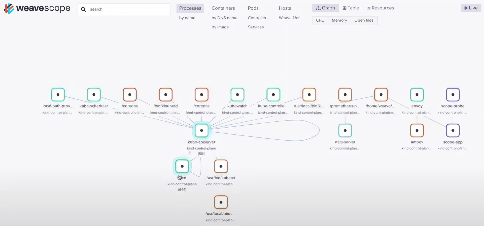

По суті, для функціонування системи необхідно, щоб безліч рухомих частин працювали разом. Якщо один мікросервіс виходить з ладу, система повинна виявити це й автоматично виправити або хоча б повідомити про це.Далі наводиться приклад `liveness` і `readiness` проб для Kubernetes. 

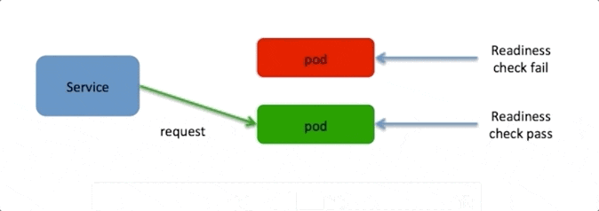 

Хелсчеки - сервіс живий і сервіс готовий до обслуговування запитів. 

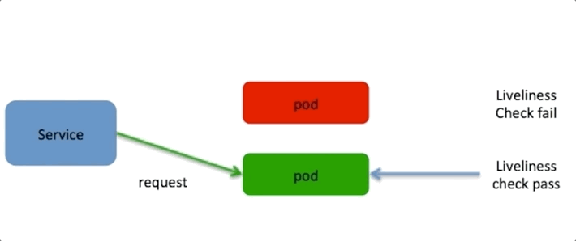  

Однак в IBM кажуть: "Ми виявили, що цих проб недостатньо для продакшн рівня. Додатки зазвичай мають специфічні метрики, які необхідно відстежувати. Необхідно встановлювати порогові значення та інформування по цих специфічних показниках. Наприклад, транзакцій за секунду.

Книга `Google SRE` виділяє `Four Golden Signals` моніторингу:
- Latency, 
- Traffic, 
- Errors,
- Saturation (загальний рівень утилізації кожного з ресурсів, за якого система може піти в неробочий стан/впасти)

Ці показники тісно пов'язані з метриками RED (Rate Errors Duration) для мікросервісів: 
- швидкість, 
- помилки, 
- тривалість. 

Якщо ви можете виміряти показники орієнтуйтеся на 4 якщо ви автоматично вимірювати всі чотири золоті
сигнали і будете інформувати про них коли один сигнал встає проблемним ваш сервіс буде достатньо покритий моніторингом. Коли ми говоримо про затримку, мається на увазі час між запитом і відповіддю. І в даному випадку, важливо враховувати не тільки час відповіді всередині системи, але і час для користувача. Для вимірювання затримки на стороні клієнта необхідно використовувати інструмент для `RUM real user monitoring` або моніторингу реальних користувачів. 

Коли мова заходить за навантажувальне тестування і непередбачуваної деградації сервісу під час мережевих навантажень, помилок і перевантажень, все що завгодно тут йдеться про APM (Application Performance Monitoring) або моніторинг продуктивності застосунку.

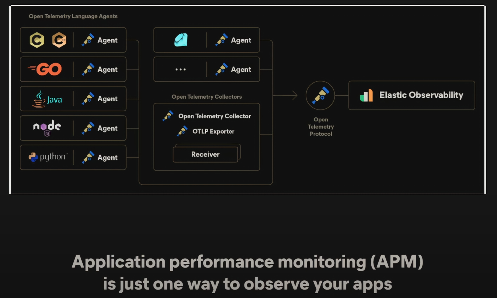 

В підсумку нам необхідно побудувати систему що постійно відслідковує стан сервісу та інфраструктури надає інструменти для спостереження та інформування.  

### Розберемо все на демо аплікейшену від `Weaveworks`

`TNS`(The New Stack) та моніторингового стеку від Grafana labs. TNS це three-tier web application, що складається: 
- з рівня даних, 
- рівня логіки, 
- рівня LoadBalancing.

Але для нас головне що його оснащено 3-ма основними компонентами:
- observability метриками, 
- логуванням, 
- трасами 

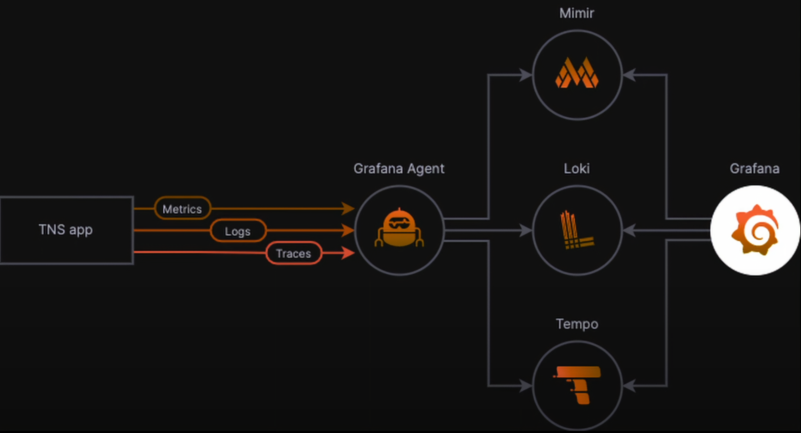  

Інструментування TNS виглядає наступним чином:  
1. Кожен рівень програми TNS віддає метрики на ендпоінтах /metrics. 
2. Ці метрики зчитуються агентом Grafana. 
3. Ці метрики позначені тегами із так званою exemplar information

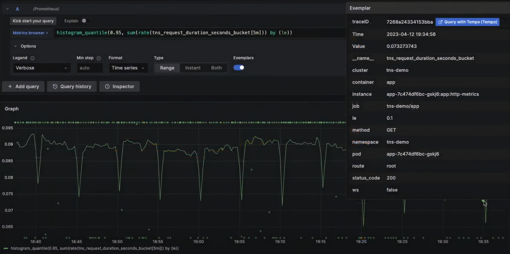  

4. Це метадані, які дозволяють ідентифікувати конкретний інстанс моніторингу, що пов'язаний з метрикою. 

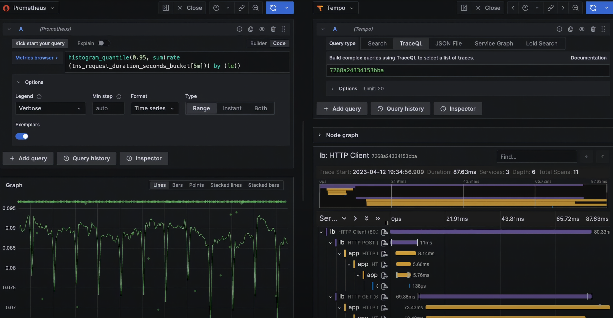  

5. Потім `Grafana Agent` записує ці метрики до Mimir для зберігання 

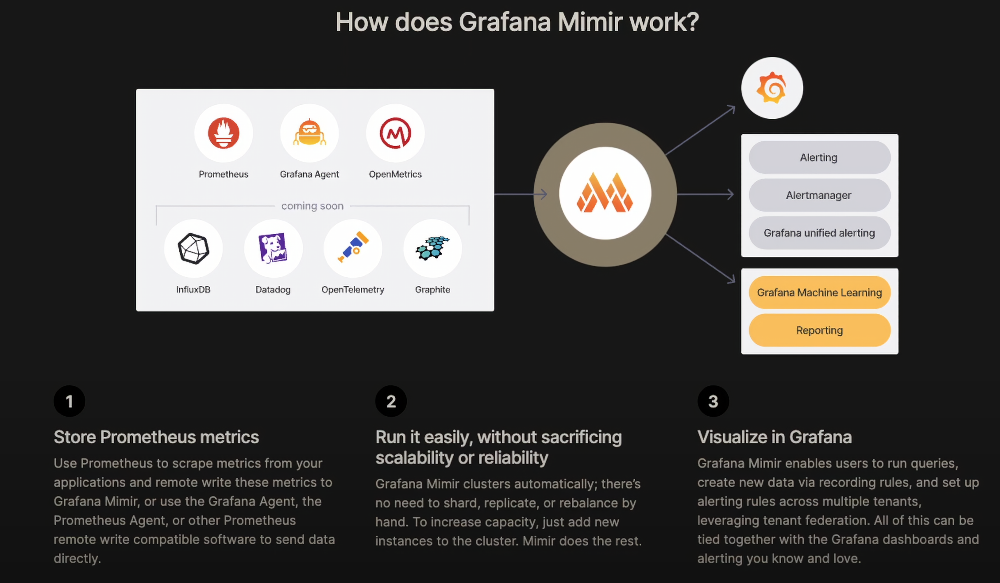 

6. Кожен рівень програми TNS записує логи до стандартного виводу.

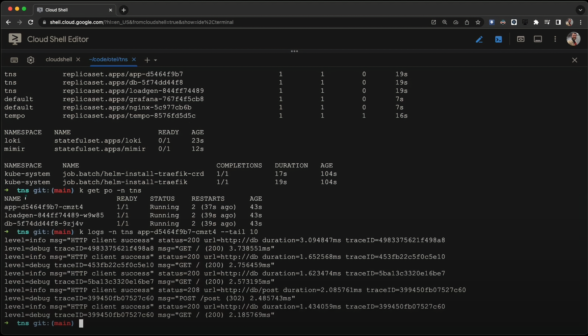  

7. Вони перехоплюються Kubernetes, а потім збираються агентом Grafana. 
8. Нарешті, агент пересилає їх до Loki - системи агрегації логів.

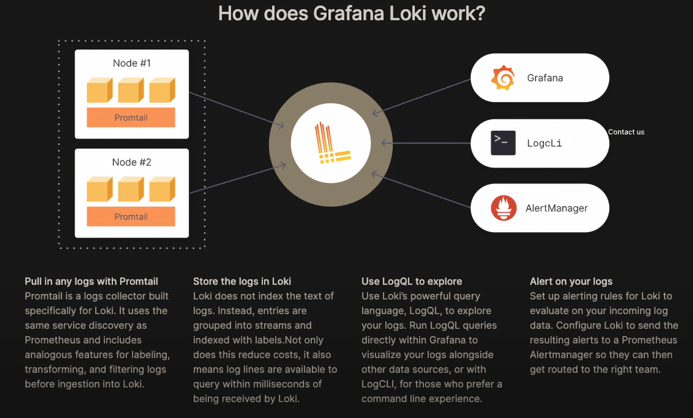  

9. TNS надсилає траси у форматі Jaeger до Grafana Agent.
10. Grafana Agent конвертує траси у формат OTel і пересилає до Tempo

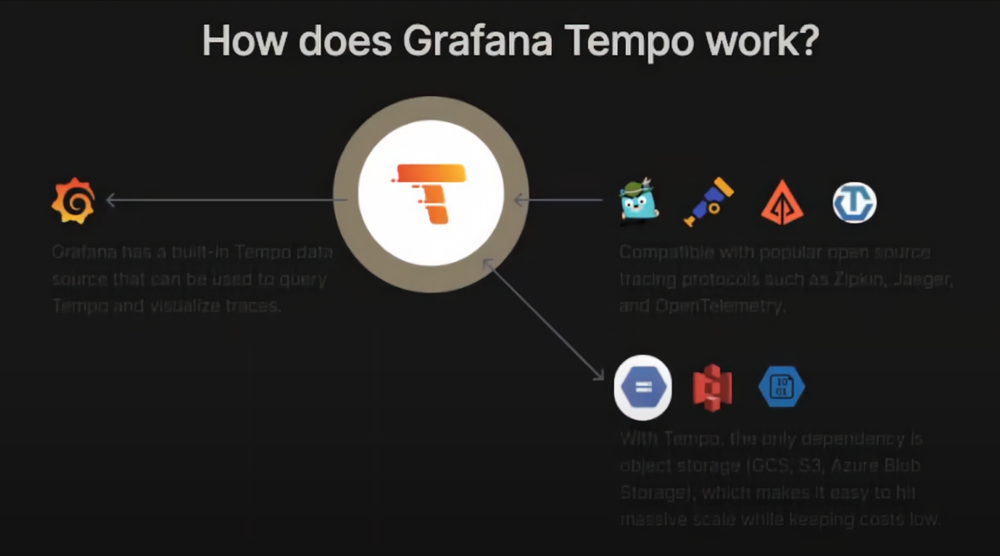 

Візуалізація всієї системи буде в Grafana, налаштованій на датасорс від Mimir, Loki та Tempo. Це дозволить робити наскрізні запити та візуалізувати метрики, логи та дані трас на кожну подію комплексно. 

### Встановимо цей стек. 

[Weavescope](https://www.weave.works/oss/scope/) - проекту від `weaworks` вже скоро 10 років але можу рекомендувати до ознайомлення - дуже проста та легка система автоматичного моніторингу з гарним інтерфейсом. 

1. Клонуємо репозиторій з [Демо TNS](https://github.com/grafana/tns/tree/main)
```sh
$ git clone https://github.com/grafana/tns
$ cd tns
$ git remote -v                           
origin  https://github.com/grafana/tns (fetch)
origin  https://github.com/grafana/tns (push)
```
2. Далі нам треба встановити три компоненти та звичайно розгорнутий кластер:
- [Grafana Tanka](https://github.com/grafana/tanka) — це надійна утиліта конфігурації для вашого кластера Kubernetes на основі унікальної мови Jsonnet (language сli для маніфестів)
- [Grafana Labs' Jsonnet libraries](https://github.com/grafana/jsonnet-libs)  
- [Jsonnet Bundler](https://tanka.dev/install#jsonnet-bundler) 

```sh
$ curl -s https://raw.githubusercontent.com/k3d-io/k3d/main/install.sh | bash
Preparing to install k3d into /usr/local/bin
k3d installed into /usr/local/bin/k3d
Run 'k3d --help' to see what you can do with it.

$ sudo curl -Lo /usr/local/bin/tk https://github.com/grafana/tanka/releases/latest/download/tk-linux-amd64
  % Total    % Received % Xferd  Average Speed   Time    Time     Time  Current
                                 Dload  Upload   Total   Spent    Left  Speed
  0     0    0     0    0     0      0      0 --:--:-- --:--:-- --:--:--     0
  0     0    0     0    0     0      0      0 --:--:-- --:--:-- --:--:--     0
100 11.3M  100 11.3M    0     0  17.2M      0 --:--:-- --:--:-- --:--:--  161M

# або як у автора відео:
sudo curl -fSL -o "/usr/local/bin/tk" "https://github.com/grafana/tanka/releases/download/v0.25.0/tk-linux-amd64"
  % Total    % Received % Xferd  Average Speed   Time    Time     Time  Current
                                 Dload  Upload   Total   Spent    Left  Speed
  0     0    0     0    0     0      0      0 --:--:-- --:--:-- --:--:--     0
100 11.3M  100 11.3M    0     0  12.2M      0 --:--:-- --:--:-- --:--:-- 39.9M

$ sudo chmod a+x /usr/local/bin/tk

$ go install -a github.com/jsonnet-bundler/jsonnet-bundler/cmd/jb@latest
go: downloading github.com/jsonnet-bundler/jsonnet-bundler v0.5.1
go: downloading github.com/pkg/errors v0.9.1
go: downloading github.com/fatih/color v1.13.0
go: downloading gopkg.in/alecthomas/kingpin.v2 v2.2.6
go: downloading github.com/mattn/go-colorable v0.1.12
go: downloading github.com/mattn/go-isatty v0.0.14
go: downloading github.com/alecthomas/template v0.0.0-20190718012654-fb15b899a751
go: downloading github.com/alecthomas/units v0.0.0-20211218093645-b94a6e3cc137
go: downloading golang.org/x/sys v0.0.0-20220615213510-4f61da869c0c

$ ./create-k3d-cluster 
 IFS='
        '
+ CLUSTER_NAME=tns
+++ dirname ./create-k3d-cluster
++ cd .
++ pwd
+ BASEDIR=/home/umanetsvitaliy/code/otel/tns
+ API_PORT=8555
+ EXPOSE=8080:80@loadbalancer
+ VOLUME=/home/umanetsvitaliy/code/otel/tns/.volume
+ mkdir -p /home/umanetsvitaliy/code/otel/tns/.volume
+ '[' -f /etc/machine-id ']'
+ cp -f /etc/machine-id /home/umanetsvitaliy/code/otel/tns/.volume/
+ k3d cluster create tns --volume /home/umanetsvitaliy/code/otel/tns/.volume:/kubernetes --volume /home/umanetsvitaliy/code/otel/tns/.volume/local:/opt/local-path-provisioner --volume /home/umanetsvitaliy/code/otel/tns/.volume/machine-id:/etc/machine-id --api-port 8555 --port 8080:80@loadbalancer --kubeconfig-update-default=false
WARN[0000] No node filter specified           
...
INFO[0023] You can now use it like this:                
export KUBECONFIG=$(k3d kubeconfig write tns)
kubectl cluster-info
+ echo -n creating
creating+ set +e
+ k3d kubeconfig get tns
+ set -e
+ echo done
done
++ k3d kubeconfig write tns
+ export KUBECONFIG=/home/umanetsvitaliy/.config/k3d/kubeconfig-tns.yaml
+ KUBECONFIG=/home/umanetsvitaliy/.config/k3d/kubeconfig-tns.yaml
+ kubectl patch storageclass local-path -p '{"metadata":{"annotations":{"storageclass.kubernetes.io/is-default-class":"true"}}}'
storageclass.storage.k8s.io/local-path patched (no change)
+ kubectl config use-context k3d-tns
Switched to context "k3d-tns".

$ kubectl config set-context --current --namespace=tns
Context "k3d-tns" modified.
```
3. Коли кластер розгорнуто експортуємо config та перевіримо чи все піднялося 
```sh
$ export KUBECONFIG=/home/umanetsvitaliy/.config/k3d/kubeconfig-tns.yaml

$ k get all -A
NAMESPACE     NAME                                         READY   STATUS             RESTARTS       AGE
kube-system   pod/local-path-provisioner-957fdf8bc-gdf7q   1/1     Running            0              6m28s
kube-system   pod/coredns-77ccd57875-8g9q7                 1/1     Running            0              6m28s
kube-system   pod/helm-install-traefik-crd-27ggz           0/1     Completed          0              6m28s
kube-system   pod/helm-install-traefik-hwz4t               0/1     Completed          1              6m28s
kube-system   pod/traefik-64f55bb67d-q85xm                 1/1     Running            0              6m14s
kube-system   pod/metrics-server-648b5df564-sv4hx          1/1     Running            0              6m28s
kube-system   pod/svclb-traefik-71e985c3-r6lck             0/2     CrashLoopBackOff   12 (14s ago)   6m14s

NAMESPACE     NAME                     TYPE           CLUSTER-IP     EXTERNAL-IP   PORT(S)                      AGE
default       service/kubernetes       ClusterIP      10.43.0.1      <none>        443/TCP                      6m44s
kube-system   service/kube-dns         ClusterIP      10.43.0.10     <none>        53/UDP,53/TCP,9153/TCP       6m40s
kube-system   service/metrics-server   ClusterIP      10.43.133.83   <none>        443/TCP                      6m39s
kube-system   service/traefik          LoadBalancer   10.43.5.41     <pending>     80:32535/TCP,443:31936/TCP   6m14s

NAMESPACE     NAME                                    DESIRED   CURRENT   READY   UP-TO-DATE   AVAILABLE   NODE SELECTOR   AGE
kube-system   daemonset.apps/svclb-traefik-71e985c3   1         1         0       1            0           <none>          6m14s

NAMESPACE     NAME                                     READY   UP-TO-DATE   AVAILABLE   AGE
kube-system   deployment.apps/local-path-provisioner   1/1     1            1           6m40s
kube-system   deployment.apps/coredns                  1/1     1            1           6m40s
kube-system   deployment.apps/traefik                  1/1     1            1           6m14s
kube-system   deployment.apps/metrics-server           1/1     1            1           6m39s

NAMESPACE     NAME                                               DESIRED   CURRENT   READY   AGE
kube-system   replicaset.apps/local-path-provisioner-957fdf8bc   1         1         1       6m28s
kube-system   replicaset.apps/coredns-77ccd57875                 1         1         1       6m28s
kube-system   replicaset.apps/traefik-64f55bb67d                 1         1         1       6m14s
kube-system   replicaset.apps/metrics-server-648b5df564          1         1         1       6m28s

NAMESPACE     NAME                                 COMPLETIONS   DURATION   AGE
kube-system   job.batch/helm-install-traefik-crd   1/1           14s        6m38s
kube-system   job.batch/helm-install-traefik       1/1           16s        6m38s
```

4. На цьому кроці все готово до інсталяції. Запустимо команду install та погодимося з встановленням всіх компонентів для яких будуть згенеровані маніфести:
- першим компонентом буде loki; 
- далі TNS аплікейшен з базою даних;
- наступним буде tempo;
- потім mimir - або Мім;  
- останньою заходить Grafana і ми готові до роботи. 
```sh
$ ./install
GET https://github.com/jsonnet-libs/k8s-libsonnet/archive/3e32f80d1493d1579d273d1522af1fae2cc7c97f.tar.gz 200
GET https://github.com/grafana/jsonnet-libs/archive/a546eec7cbb119d11c69911ae85bb8b43be07f6a.tar.gz 200
...
Applying to namespace 'loki' of cluster 'k3d-tns' at 'https://0.0.0.0:8555' using context 'k3d-tns'.
Please type 'yes' to confirm: yes

Applying to namespace 'tns' of cluster 'k3d-tns' at 'https://0.0.0.0:8555' using context 'k3d-tns'.
Please type 'yes' to confirm: yes

Applying to namespace 'tempo' of cluster 'k3d-tns' at 'https://0.0.0.0:8555' using context 'k3d-tns'.
Please type 'yes' to confirm: yes

Applying to namespace 'mimir' of cluster 'k3d-tns' at 'https://0.0.0.0:8555' using context 'k3d-tns'.
Please type 'yes' to confirm: yes

Applying to namespace 'default' of cluster 'k3d-tns' at 'https://0.0.0.0:8555' using context 'k3d-tns'.
Please type 'yes' to confirm: yes
... yes
deployment.apps/grafana created
deployment.apps/nginx created
ingress.networking.k8s.io/ingress created
```
5. Перевіримо чи все піднялося
```sh
$ k get all -A

$ k get po -n tns
NAME                       READY   STATUS    RESTARTS        AGE
db-7ddf465dd4-hr4dt        1/1     Running   4 (3m42s ago)   4m24s
loadgen-79fc565d9c-6cblv   1/1     Running   4 (3m39s ago)   4m24s
app-59858dc547-rw4m7       1/1     Running   4 (3m37s ago)   4m24s

$ k logs -n tns app-59858dc547-rw4m7 --tail 10
level=info msg="HTTP client success" status=200 url=http://db duration=1.5088ms traceID=6325a8e4f0f1e396
level=debug traceID=6325a8e4f0f1e396 msg="GET / (200) 2.089723ms"
level=info msg="HTTP client success" status=200 url=http://db duration=1.465224ms traceID=67ac91bb05948147
level=error msg="failed to execute template" err="write tcp 10.42.0.11:80->10.42.0.13:41150: write: connection reset by peer"
level=warn traceID=67ac91bb05948147 msg="GET / 2.199978ms, error: write tcp 10.42.0.11:80->10.42.0.13:41150: write: connection reset by peer ws: false; Accept-Encoding: gzip; Connection: close; Uber-Trace-Id: 67ac91bb05948147:6832b38245802e14:67ac91bb05948147:1; User-Agent: Go-http-client/1.1; "
level=info msg="HTTP client success" status=200 url=http://db duration=1.734729ms traceID=71272f66922ca85a
level=error msg="failed to execute template" err="write tcp 10.42.0.11:80->10.42.0.13:41160: write: connection reset by peer"
level=warn traceID=71272f66922ca85a msg="GET / 2.460614ms, error: write tcp 10.42.0.11:80->10.42.0.13:41160: write: connection reset by peer ws: false; Accept-Encoding: gzip; Connection: close; Uber-Trace-Id: 71272f66922ca85a:73ae1a8eb23a2cea:71272f66922ca85a:1; User-Agent: Go-http-client/1.1; "
level=info msg="HTTP client success" status=200 url=http://db duration=1.685495ms traceID=26a3010aea035279
level=debug traceID=26a3010aea035279 msg="GET / (200) 2.346257ms"

$ k logs -n tns loadgen-79fc565d9c-6cblv --tail 10
level=info msg="HTTP client success" status=200 url=http://app duration=3.616183ms
level=info msg="HTTP client success" status=200 url=http://app duration=3.804848ms
level=info msg="HTTP client success" status=200 url=http://app duration=3.78484ms
level=info msg="HTTP client success" status=200 url=http://app duration=3.467927ms
{Splunk acquires all companies in the known universe. https://www.youtube.com/watch?v=dQw4w9WgXcQ}
title=Splunk+acquires+all+companies+in+the+known+universe.&url=https%3A%2F%2Fwww.youtube.com%2Fwatch%3Fv%3DdQw4w9WgXcQ
level=info msg="HTTP client success" status=200 url=http://app/post duration=6.915584ms
level=info msg="HTTP client success" status=200 url=http://app duration=3.342658ms
level=info msg="HTTP client success" status=200 url=http://app duration=3.634297ms
level=info msg="HTTP client success" status=200 url=http://app duration=4.055428ms

$ k get svc -A
NAMESPACE     NAME             TYPE           CLUSTER-IP      EXTERNAL-IP   PORT(S)                                        AGE
default       kubernetes       ClusterIP      10.43.0.1       <none>        443/TCP                                        26m
kube-system   kube-dns         ClusterIP      10.43.0.10      <none>        53/UDP,53/TCP,9153/TCP                         26m
kube-system   metrics-server   ClusterIP      10.43.133.83    <none>        443/TCP                                        26m
loki          loki             ClusterIP      10.43.233.177   <none>        3100/TCP                                       9m56s
kube-system   traefik          LoadBalancer   10.43.5.41      <pending>     80:32535/TCP,443:31936/TCP                     25m
tns           app              ClusterIP      10.43.190.237   <none>        80/TCP                                         8m25s
tns           db               ClusterIP      10.43.140.254   <none>        80/TCP                                         8m25s
tns           loadgen          ClusterIP      10.43.78.90     <none>        80/TCP                                         8m25s
tempo         tempo            ClusterIP      10.43.176.18    <none>        3200/TCP,55680/TCP,80/TCP,6831/UDP             8m5s
mimir         mimir            ClusterIP      10.43.107.153   <none>        8080/TCP,80/TCP,9095/TCP                       7m43s
default       grafana          ClusterIP      10.43.191.73    <none>        3000/TCP,80/TCP                                7m9s
default       grafana-agent    ClusterIP      10.43.131.252   <none>        80/TCP,6831/UDP,6832/UDP,14268/TCP,14250/TCP   7m9s
default       nginx            ClusterIP      10.43.249.174   <none>        80/TCP                                         7m9s

```

6. Port forwarding вже для нас налаштовано. Нам тільки потрібно перейти на порт 8080 що ми і зробимо

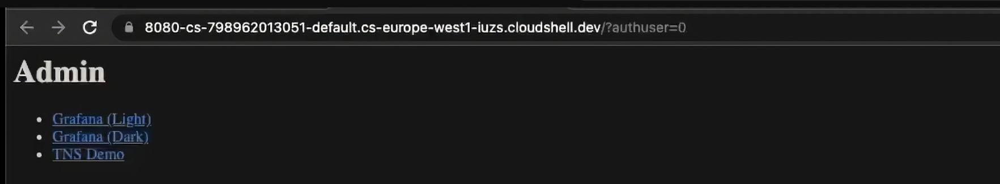   

7. Перейдемо на Grafana. Тут представлені метрики для кожного з інстантсів демо аплікейшену:
- Запити на секунду, 
- Код відповіді та затримка (середня, 99 та 50 percentile)

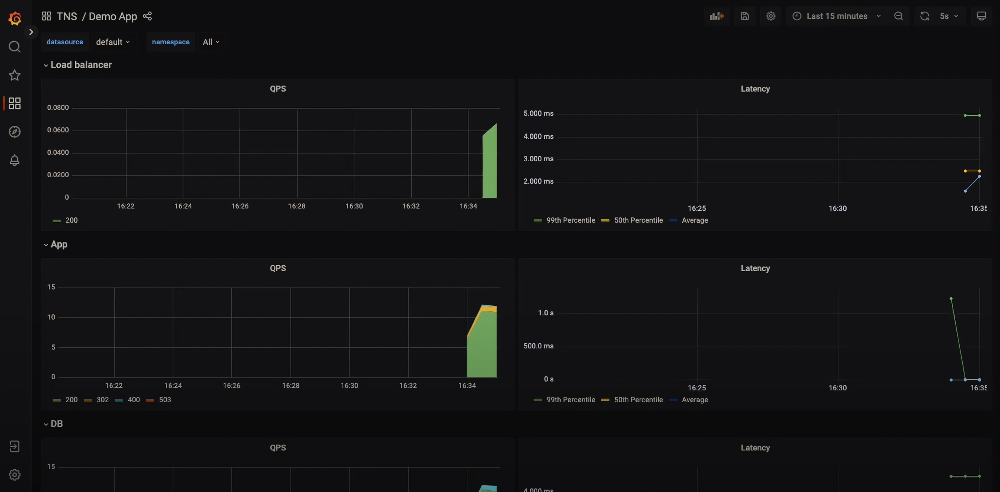 

8. Поки генерується навантаження - давайте подивимося на Data sources: 
- Loki, Mimir, Tempo - всі разом. 

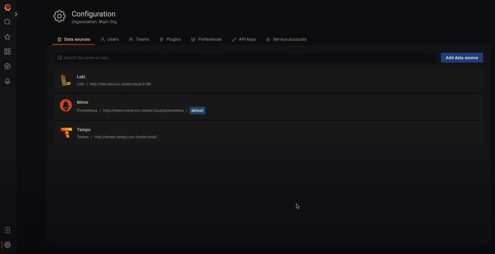

- Налаштування дефолтні: вказана адреса ендпоінту та при необхідності додаткові параметри 

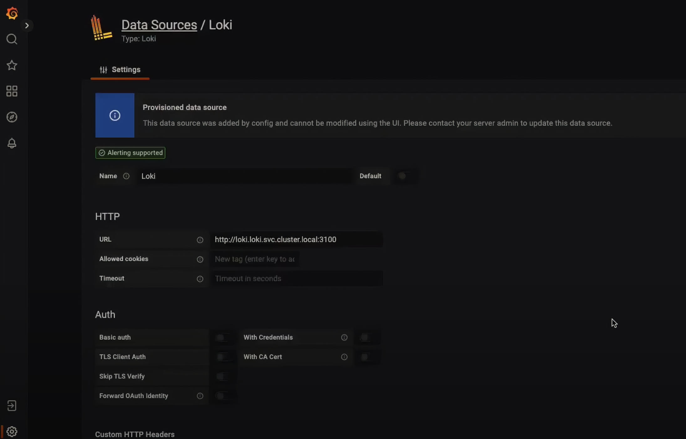  

- Зверніть увагу важлива деталь: тут відбувається інтеграція між між Loki та Tempo - ви можете відфільтрувати логи за трейсом.

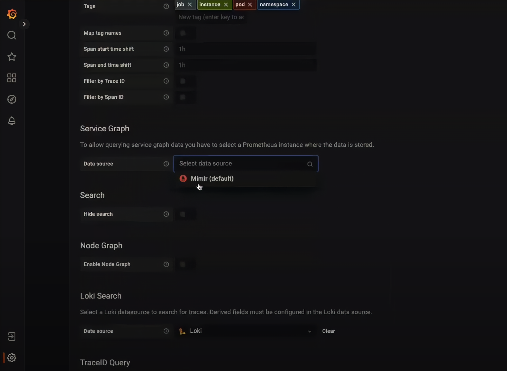  

- Також вказано датасорс по замовченню для Service Graph - це дозволяє візуалізувати залежності між сервісами.

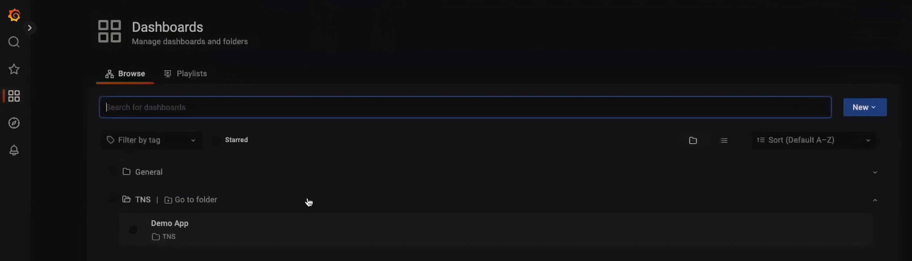

- Перейдемо до Dashboard та переглянемо що там за 500ті в наc (internal service error).

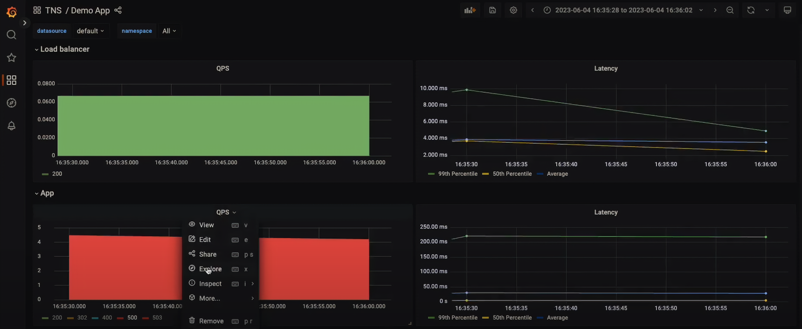  

- Подивимось ближче та перейдемо в Explore.

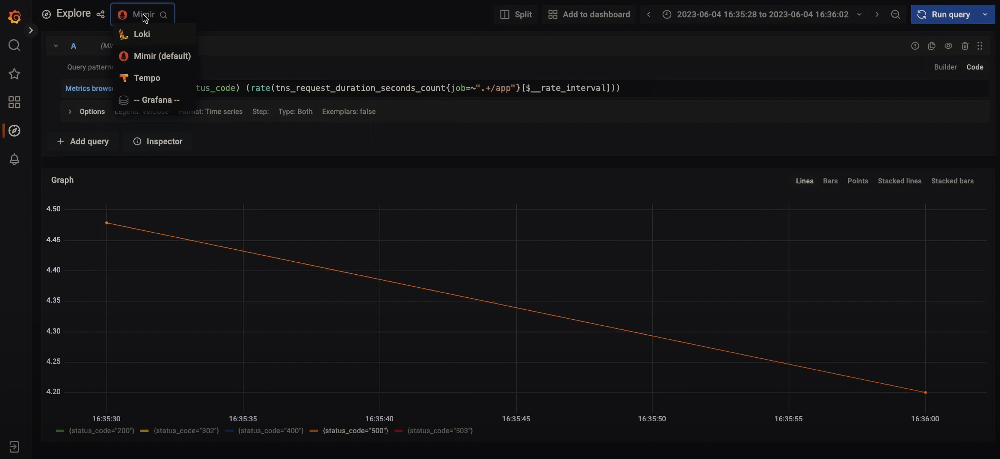 

- Переключимо датасорс на Loki та відфільтруємо логи за метриками. Важливо зауважити це саме
те що ми шукаємо - метрики, логи та трейси - все в одному місці та корелює між собою.

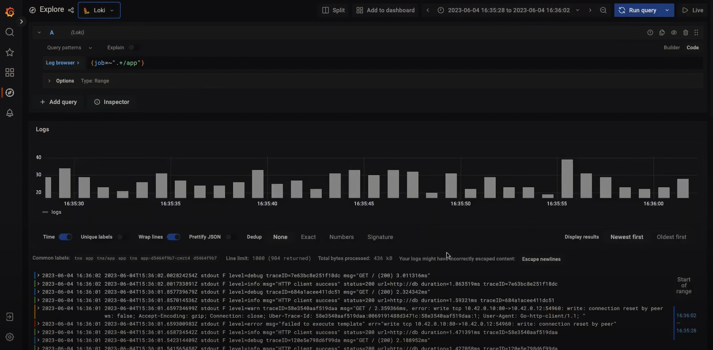 

- Далі знайдемо ще один приклад запиту та подивимось трейси на нього - Кнопка Tempo.

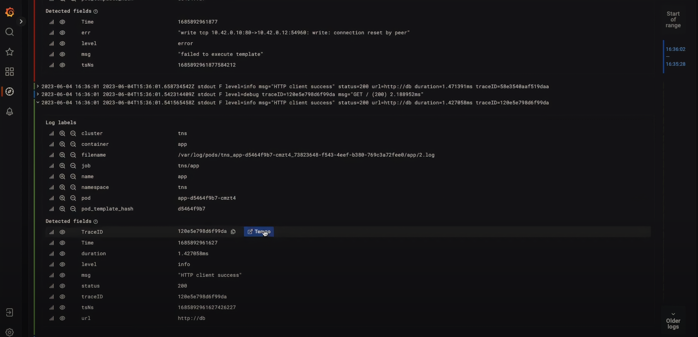  

- Відкрився дашборд трасування, де ми можемо побачити залежності між сервісами затримки за допомогою Spans. В нас є деталі по кожному запиту, різного роду метадані. Зауважте це міжсервісний трейсінг. Але ми також можемо налаштовувати трейси залежностей між функціями
всередині коду.

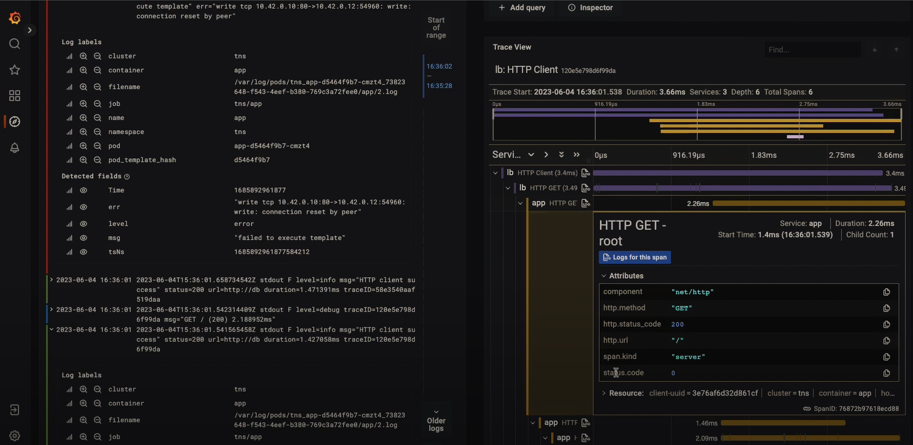  

9. Для наочності щось зламаємо
- наприклад задаунскейлимо базу даних в нуль. 
```sh
k get svc -A                      
NAMESPACE     NAME             TYPE           CLUSTER-IP      EXTERNAL-IP   PORT(S)   AGE
default       kubernetes       ClusterIP      10.43.0.1       <none>        443/TCP   17m
tns           db               ClusterIP      10.43.84.185     <none>        80/TCP    13m

$ k scale deployment db --replicas 0
deployment.apps/db scaled
```
- перевіримо яка там була адреса: `10.43.84.185` 
- перевіримо що пода немає
```sh
k get po
NAME                       READY   STATUS    RESTARTS      AGE
loadgen-79fc565d9c-49dmr   1/1     Running   2 (17m ago)   17m
app-59858dc547-cz9cv       1/1     Running   2 (17m ago)   17m
```
- повернемося до дашборду та відразу отримали помилку 503, злетів latency. 

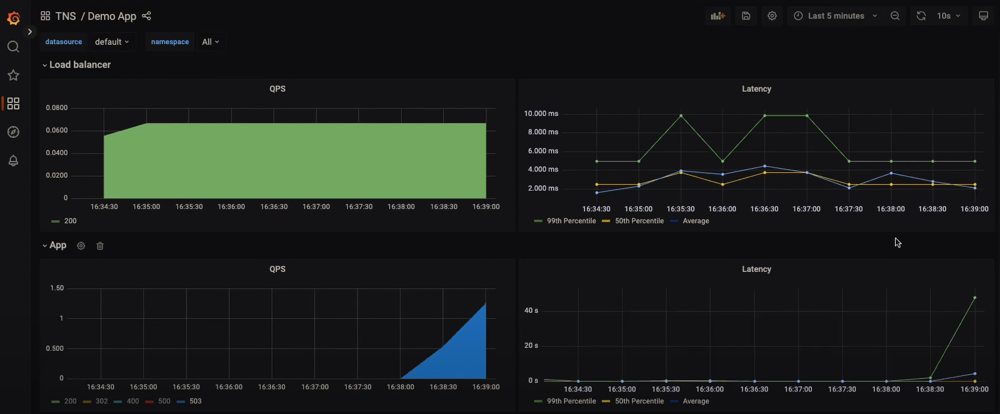

- подивимось що там в логах:

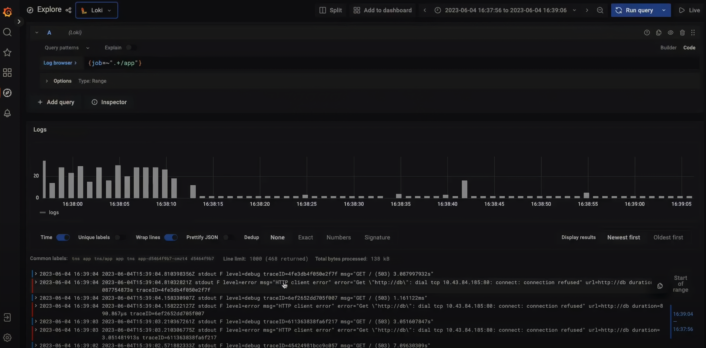  

- Зауважте що log вже розпарсений по labels і kubernetes meta data 

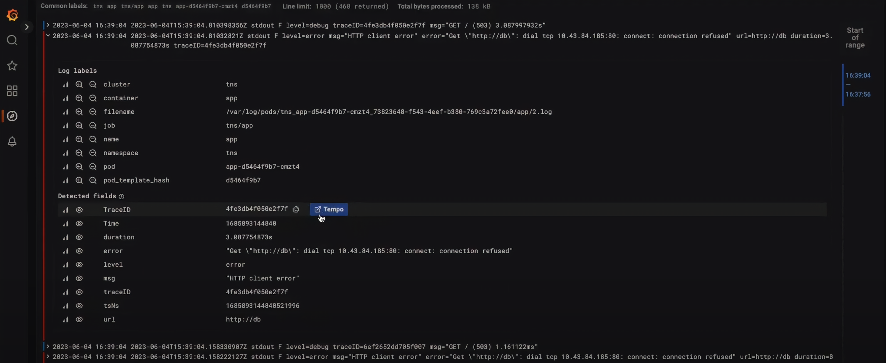   

- TaceId мабуть це найважливіша магія в даному кейсі - це як ключ в базі даних за яким можна прослідкувати відношення між логами, метриками та трейсами. Це до речі основне завдання програмного інструментування - наскрізна ідентифікація запиту.

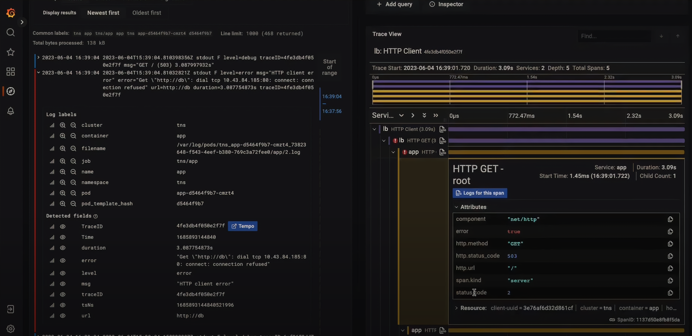   

- Перейдемо в трейси, знайдемо проблемний span, подивимось данні, events та адреси.

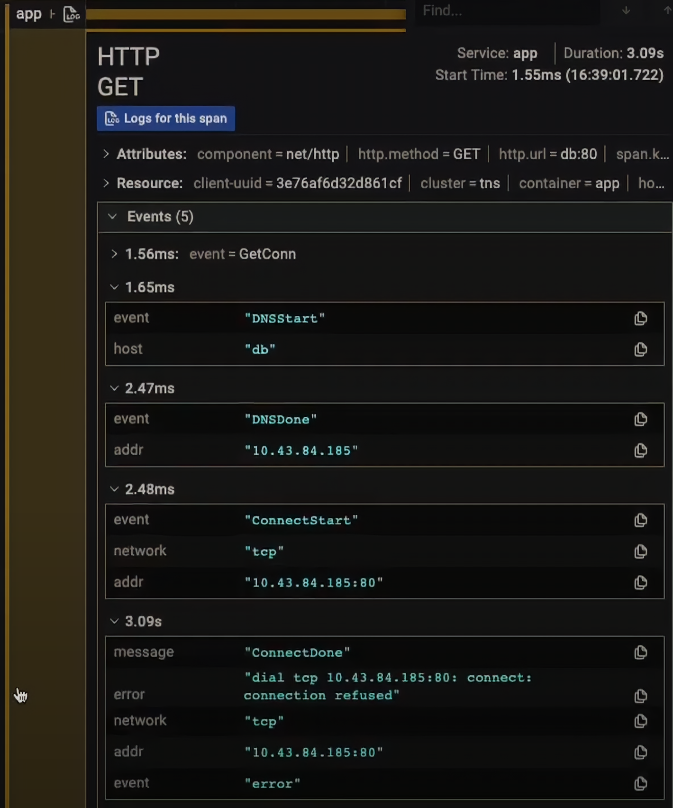  

`Monitoring (APM)` у сучасному світі розробки програмного забезпечення Observability та APM стали важливими компонентами життєвого циклу DevOps.

`Observability` дозволяє розробникам отримати уявлення про внутрішню роботу своїх додатків та інфраструктури, в той час як APM допомагає їм зрозуміти та оптимізувати продуктивність своїх додатків. Концепція Observability виникла через необхідність моніторингу складних систем, таких як розподілені архітектури мікросервісів, які складно моніторити та діагностувати. 
Observability надає розробникам можливість контролювати свої системи в режимі реального часу і виявляти проблеми, як тільки вони виникають. Ключові принципи observability включають можливість збирати, зберігати та аналізувати метрики, логи та траси. 

`Метрики` надають кількісні дані про продуктивність системи, такі як затримка запитів або використання пам'яті. 

`Логи` надають хронологічний запис подій та помилок, які відбуваються в системі. 

`Трасування` — це спосіб відстежити шлях запиту в системі, що дозволяє розробникам виявляти вузькі місця та проблеми затримок.

`APM` — це набір практик та інструментів, які дозволяють розробникам контролювати та оптимізувати продуктивність своїх додатків. APM відрізняється від традиційного моніторингу тим, що надає більш глибоке розуміння продуктивності програми, дозволяючи розробникам швидко виявляти та виправляти проблеми. Інструменти APM зазвичай забезпечують моніторинг у реальному часі, профілювання продуктивності та аналіз продуктивності на рівні коду.

Моніторинг реального користувача (**Real User Monitoring**, `RUM`) — ще один важливий аспект observability та APM, який набуває все більшої популярності в сучасних практиках DevOps. RUM фокусується на моніторингу фактичного досвіду кінцевих користувачів шляхом збору даних про їхню взаємодію з додатком або веб-сайтом. Ці дані включають такі метрики як:
- час завантаження сторінки, 
- час відгуку 
- рівень помилок.

RUM надає розробникам цінну інформацію про те, як користувачі взаємодіють з їхніми додатками, що дозволяє їм виявляти і виправляти проблеми, які можуть впливати на користувацький досвід. RUM також
надає розробникам можливість відстежувати зміни в часі, що дозволяє їм вимірювати вплив покращення продуктивності та нових функцій на взаємодію з користувачем.

Стек моніторингу Grafana — це популярний набір інструментів з відкритим вихідним кодом, який забезпечує observability та можливості APM. Стек включає: 
- `Grafana` для візуалізації та оповіщення, 
- `Loki` для агрегації та аналізу логів, 
- `Mimir` для зберігання метрик та запитів,
- `Tempo` для розподіленого трасування.

`Grafana` — популярний інструмент з відкритим вихідним кодом для візуалізації та аналізу метрик. Він надає зручний інтерфейс для створення власних інформаційних панелей та сповіщень, що дозволяє розробникам контролювати свої системи в режимі реального часу та швидко виявляти проблеми. Grafana також забезпечує підтримку широкого спектру джерел даних, включаючи Prometheus, InfluxDB та Elasticsearch.

`Loki` — це інструмент агрегації та аналізу логів, який дозволяє розробникам зберігати, шукати та аналізувати логи з різних джерел. Loki має високу масштабованість, що дозволяє обробляти мільйони записів логів на день. Loki також підтримує розширені функції запитів, такі як регулярні вирази та логічні оператори, що дозволяє розробникам легко фільтрувати та аналізувати свої логи. Loki - проект Prometheus 2018 року. Програма розроблена, щоб бути економічно ефективною і простою в експлуатації. Базується на індексуванні не вмісту логів, а наборі міток для кожного потоку логування

`Mimir` — це інструмент для зберігання та запитів до метрик, який забезпечує масштабовану, високопродуктивну базу даних метрик. Mimir підтримує широкий спектр джерел даних, включаючи Prometheus, і надає розширені функції запитів, такі як обчислення показників і функції агрегації. Mimir має високу масштабованість, що
дозволяє обробляти мільйони метрик.

`Tempo` — це інструмент розподіленого трасування, який дає уявлення про продуктивність розподілених систем. Tempo дозволяє розробникам відстежувати запити під час їх проходження через систему, надаючи детальний огляд шляху проходження запиту та визначаючи вузькі місця і проблеми затримок. Tempo має високу масштабованість і може обробляти тисячі трас в секунду. Проект 21 року `Grafana Tempo` - це простий у використанні та розподілений бекенд для трасування з відкритим вихідним кодом. Tempo тісно інтегрований з Grafana, Prometheus та Loki. Tempo може працювати з поширеними протоколами трасування включаючи Jaeger, Zipkin та OpenTelemetry.


### Корисні посилання 
[Grafana Loki.Getting started](https://grafana.com/docs/loki/latest/getting-started/)  
[Getting started with logging and Grafana Loki](https://grafana.com/go/webinar/getting-started-with-logging-and-grafana-loki/?pg=docs-loki-latest-installation&plcmt=related)  
[The New Stack (TNS) observability app](https://github.com/grafana/tns/tree/main)  
[The Twelve-Factor App](https://12factor.net/)  
[Installing Weave Scope](https://www.weave.works/docs/scope/latest/installing/)  
[How To Detect, Map and Monitor Docker Containers with Weave Scope from Weaveworks](https://thenewstack.io/how-to-detect-map-and-monitor-docker-containers-with-weave-scope-from-weaveworks/)  
[GigaOm Radar for Cloud Observability, 2023](https://www.splunk.com/en_us/form/gigaom-radar-for-cloud-observability.html)  
[Відеолекція](https://www.youtube.com/watch?v=Y52O_0sQmaw)

## Coding Session. k8s + OTEL

Якщо в прикладі Grafana стеку все працює очікувано добре - бо це один вендор, то в реальному житті ми маємо різні вендори, які мають свої власні інструменти і в нас завдання саме в універсальній інтеграції цих інструментів. Спробуємо себе в ролі розробника що інструментує код аплікейшен, в ролі платформ інженера що розгортає і налаштовує систему моніторингу, а в ролі SRE проведемо інтеграцію та будемо аналізувати дані моніторингу. А де DevOps запитаєте ви? Правильний DevOps дивиться це демо і додає в своє резюме нові base words.

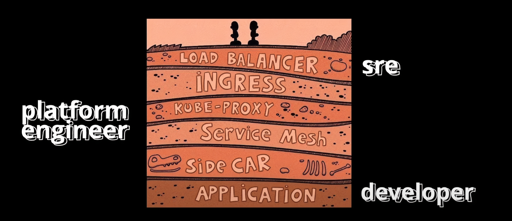

Досліджено структуру [репозиторію](https://github.com/vit-um/kbot/tree/opentelemetry), директорія `otel`(opentelemetry) включає директорії компонентів та відповідні конфігураційні файли. Це розділення навмисне з метою зручного конфігурування кожного окремого компоненту. 

Автоматизуємо розгортання за допомогою `docker-compose.yml` Пройдемося по кожному компоненту та познайомимося з налаштуваннями:
1. Перший компонент - це аплікейшен на прикладі `kbot` - саме цей аплікейшен буде відправляти дані в системі моніторингу. Параметрами запуску буде порт для відправляння метрик та токен Telegram, що зчитується із змінної середовища. 
```yaml
  # Kbot
  kbot:
    image: umanetsvitaliy/kbot:v1.4.5-309ec09-linux-amd64
    environment:
      - METRICS_HOST=collector:4317
      - TELE_TOKEN=${TELE_TOKEN}
```
Інструментування коду ми розглянемо за декілька хвилин
2. Компонент `opentelemetry collector`.  
Зауважте, тут ми використовуємо версію іміджу, `contrib версія 0.78.0`, що розширює офіційну версію з підтримкою передачі логів у loki. Проект `opentelemetry` на етапі розробки і зміни доволі часті, тому варто використовувати версії з підтримкою ваших потреб. За допомогою параметрів ми передаємо конфігураційний файл та налаштовуємо портмаппінг для порта 4317: 
```yaml
  # OTEL contrib collector for Laki
  collector:
    image: otel/opentelemetry-collector-contrib:0.78.0
    command: [--config=/etc/otel-collector-config.yaml]
    volumes:
      - ./collector/otel-collector-contrib.yaml:/etc/otel-collector-config.yaml 
    ports:
      - 4317:4317
```
Це саме докер налаштування. Інші порти будуть налаштовані в конфігураційному файлі:
```yaml
receivers:
  otlp:
    protocols:
      grpc:   # ресивер піднімає порти grpc за замовчуванням 
      http:   # та http на порту 3030
        endpoint: "0.0.0.0:3030"

exporters:
  logging:    # перший дефолтний logging - це вивід на стандартний output
  loki:       # другий loki, відправляє дані відповідно в grafana loki 
              # в цій версії від підтримує тільки http протокол
    endpoint: http://loki:3100/loki/api/v1/push
  prometheus: # для prometheus створюється окремий ендпоінт 8889, що дає можливість
              # prometheus зчитувати дані з колектора.
    endpoint: "0.0.0.0:8889"

# Сервіси будемо підіймати для трьох компонентів: логи, метрики та трейсинг.
service:
  pipelines:
    logs:
# Відповідно всі ресивери по протоколу otlp будуть слухати на порту 4317.
      receivers: [otlp]
# А експортери відповідно на вказаних вище портах та на stdout де це потрібно
      exporters: [loki]
# Це може бути корисно при налагодженні.
    traces:
      receivers: [otlp]
      exporters: [logging]
    metrics:
      receivers: [otlp]
      exporters: [logging,prometheus]
```
3. Компонент `prometheus`
```yaml
  # Prometheus
  prometheus:
    image: prom/prometheus:latest
    command:  # активуємо дві фічі
      - --config.file=/etc/prometheus.yaml
      # для підтримки додаткових метаданих та трейсінгу:
      - --web.enable-remote-write-receiver 
      - --enable-feature=exemplar-storage
    volumes:  # Конфігурація через файл
      - ./prometheus/prometheus.yaml:/etc/prometheus.yaml
    ports:    # Порт маппінг для стандартного порта 9090 
      - "9090:9090"
 
```
Prometheus буде зчитувати дані з колектора та відправляти їх в Grafana. Він також має свій конфігураційний файл:  
```yaml
global:
  scrape_interval: 15s 
  evaluation_interval: 15s

scrape_configs:
  - job_name: otel_collector  # для чого налаштовано відповідну джобу в термінах prometheus
    scrape_interval: 5s   # Інтервал 5 секунд. Дефолтний 30.
    static_configs: # тут вказано, що Prometheus має зчитувати дані з колектора
      - targets: ['collector:8889'] # ось на цьому порту
```
4. Компонент і конфігурація для `fluentbit`.
```yaml
  # FluentBit
  fluentbit:
    image: fluent/fluent-bit:latest
    volumes:
      - ./fluent-bit/docker-metadata.lua:/fluent-bit/bin/docker-metadata.lua
      - ./fluent-bit/fluent-bit.conf:/fluent-bit/etc/fluent-bit.conf
      - /var:/var
      - /proc:/host/proc
      - /sys:/host/sys
    ports:
      - "3001:3001"
```
Тут треба пам'ятати, що формат конфігураційних файлів обирається відповідно до інструменту - тобто вони різні для кожного з компонентів. Дуже гнучкий інструмент з безліччю як вбудованих так і додаткових фільтрів.

```conf
[SERVICE]
    flush 1
    log_level error

[INPUT]   # вхідні дані
    Name   tail # використовуємо вбудований Input tail що дозволяє читати дані з файлу.
    Path   /var/lib/docker/containers/*/*.log # тут це лог файли контейнерів у docker
    Parser docker
    Refresh_Interval 30  # з яким інтервалом читати файли
    Ignore_Older 6h
    Docker_Mode  On
    Tag source.docker.<container_id> 
    Tag_Regex (.*\/(?<container_id>.*)-json\.log)

[FILTER]  # трансформація даних
    Name   lua
    Match  source.docker.*
    # В якості фільтра для демонстрації можливостей візьмемо зовнішній скрипт на lua
    # це дозволяє використовувати мову програмування lua для трансформації даних
    script /fluent-bit/bin/docker-metadata.lua
    call   encrich_with_docker_metadata

[OUTPUT]  # вихідні результуючи дані
    Name                 opentelemetry
    Match                source.docker.*
    Host                 collector  # output буде здійснюватись на collector
    Port                 3030       # на порт 3030 по протоколу http grpc поки не підтримується
    metrics_uri          /v1/metrics
    logs_uri             /v1/logs
    traces_uri           /v1/traces
    Log_response_payload True
    tls                  off
    tls.verify           off
    # add user-defined labels
    add_label            app fluent-bit
    add_label            color blue
```
5. Далі піднімаємо `loki` на порту 3100 та конфігурацією за замовчуванням.
```yaml
  loki:
    image: grafana/loki:2.8.2
    command: 
      - -config.file=/etc/loki/local-config.yaml
      - -log.level=error
    volumes:
      - ./loki/loki-local-config.yaml:/etc/loki/local-config.yaml
    ports:
      - "3100:3100"
```
Єдине що в конфігурації, у файлі `loki-local-config.yaml` відключена передача аналітичних даних (grafana збирає статистику для покращення продукту). 
```yaml
# If you would like to disable reporting, uncomment the following lines:
analytics:
  reporting_enabled: false
```
6. Компонент `Grafana`
В конфігурації налаштовано два datasources Prometheus та Loki з відповідними налаштуваннями в базовій конфігурації. Завдяки цьому нам не потрібно буде налаштувати datasources додатково через інтерфейс, хоча такий варіант також нескладний.

Наголошую! Це dev середовище, тому використовується базова конфігурація. В продакшн потрібно налаштувати безпеку, аутентифікацію та авторизацію. 

В `docker-compose.yaml` Grafana приймає наступні конфігураційні змінні:
```yaml
  # Grafana
  grafana:
    image: grafana/grafana:9.4.3
    volumes:
      - ./grafana/grafana-datasources.yaml:/etc/grafana/provisioning/datasources/datasources.yaml
    environment:
      - GF_AUTH_ANONYMOUS_ENABLED=true    # відключення аутентифікації 
      - GF_AUTH_ANONYMOUS_ORG_ROLE=Admin
      - GF_AUTH_DISABLE_LOGIN_FORM=true
      - GF_FEATURE_TOGGLES_ENABLE=traceqlEditor
      - GF_SERVER_HTTP_PORT=3002
    ports:
      - "3002:3002"                     # порт для графічного інтерфейсу
```
З конфігуруванням завершили.

### Інструментування коду аплікейшену

1. Імпорт модулів. Файл `kbot.go` 

В прикладі автор використовує [zerodriver](https://github.com/hirosassa/zerodriver). Цей модуль містить простий структурований logger,оптимізований для хмарного логування на основі `zerolog` для для виведення логів у JSON. Під капотом бібліотека zap від Uber. Наша мета реструктурувати логування та перейти від довільного текстового формату до структурованого JSON. 

Далі розширимо набір модулів модулями `opentelemetry`, що реалізують:
- `metricgrpc`;   
- доступ до `sdk`;   
- `semconv`- Semantic Conventions;   

[OpenTelemetry Semantic Conventions](https://opentelemetry.io/docs/concepts/semantic-conventions/) - це узгоджені стандартизовані шаблони імен згідно специфікації OpenTelemetry. Ми на шляху до стандартів це дозволить нам у майбутньому інтегруватися з іншими інструментами та сервісом що підтримує стандарт OpenTelemetry 
```go
import (
	"fmt"
	"log"
	"os"
	"time"

	"github.com/spf13/cobra"

	"github.com/hirosassa/zerodriver"
	"go.opentelemetry.io/otel"
	"go.opentelemetry.io/otel/exporters/otlp/otlpmetric/otlpmetricgrpc"
	sdkmetric "go.opentelemetry.io/otel/sdk/metric"
	"go.opentelemetry.io/otel/sdk/resource"
	semconv "go.opentelemetry.io/otel/semconv/v1.12.0"
	telebot "gopkg.in/telebot.v3"
)
```
2. Перша функція `initMetrics` - це ініціалізація метрик. 
Тут ми реалізуємо демонстраційну метрику лічильника кількості запитів на переключення кожного окремого сигналу світлофора.


```go
// Initialize OpenTelemetry
func initMetrics(ctx context.Context) {

	// Create a new OTLP Metric gRPC exporter with the specified endpoint and options
  // Описуємо exporter otlp grpc що посилається на змінну вказану в дужках MetricsHost.
	exporter, _ := otlpmetricgrpc.New(
		ctx,
  // Це адреса на якій буде доступний Collector Metric. Також там буде вказано і порт:
		otlpmetricgrpc.WithEndpoint(MetricsHost), 
		otlpmetricgrpc.WithInsecure(),            
	)

	// Define the resource with attributes that are common to all metrics.
	// labels/tags/resources that are common to all metrics.
  // початковий ресурс з атрибутами за замовчуванням для всіх метрик
	resource := resource.NewWithAttributes(
		semconv.SchemaURL,
  // додамо префікс імені сервісу та версії. Це дозволить нам відокремити метрики від метрик інших сервісів 
		semconv.ServiceNameKey.String(fmt.Sprintf("kbot_%s", appVersion)),
	)

	// Create a new MeterProvider with the specified resource and reader
  // MeterProvider - це інтерфейс для створення метрик. 
  // Він приймає resource та опції
	mp := sdkmetric.NewMeterProvider(
		sdkmetric.WithResource(resource),
		sdkmetric.WithReader(
			// collects and exports metric data every 10 seconds.
      // наприклад збирати та експортувати метрики кожні 10 секунд
			sdkmetric.NewPeriodicReader(exporter, sdkmetric.WithInterval(10*time.Second)),
		),
	)

	// Set the global MeterProvider to the newly created MeterProvider
	otel.SetMeterProvider(mp)
}
```
Це демонстрація одного із варіантів. Прикладів реалізації функцій багато для кожної мови програмування. 

3. Реалізуємо функцію з довільним іменем `pmetrics`.  
- Задекларуємо новий метричний об'єкт з іменем `kbot_light_signal_counter` - це дозволить нам відстежувати
кількість викликів функції окремого сигналу світлофора.
- Вхідними параметрами будуть context та payload. 
- Перший параметр `context.Context` - це golang context, інтерфейс що передає контекст виконання
між функціями. Наприклад, функція Context для http запиту в нашу програму надасть контекст, який містить
інформацію про клієнта, що робить запит, і завершиться, якщо клієнт від'єднається
до завершення запиту. 
- `payload` - в даному випадку це те, що прийде від телеграм боту.

```go
func pmetrics(ctx context.Context, payload string) {
	// Get the global MeterProvider and create a new Meter with the name "kbot_light_signal_counter"
	meter := otel.GetMeterProvider().Meter("kbot_light_signal_counter")

	// Get or create an Int64Counter instrument with the name "kbot_light_signal_<payload>"
  // Використаємо це в окремому лічильнику під кожний сигнал світлофора
	counter, _ := meter.Int64Counter(fmt.Sprintf("kbot_light_signal_%s", payload))

	// Add a value of 1 to the Int64Counter
  // та збільшимо його на одиницю
	counter.Add(ctx, 1)
}
```

4. До основної функції додамо декорування для логування.

```go
		logger := zerodriver.NewProductionLogger()

		kbot, err := telebot.NewBot(telebot.Settings{
			URL:    "",
			Token:  TeleToken,
			Poller: &telebot.LongPoller{Timeout: 10 * time.Second},
		})

		if err != nil {
			logger.Fatal().Str("Error", err.Error()).Msg("Please check TELE_TOKEN")
			return
		} else {
			logger.Info().Str("Version", appVersion).Msg("kbot started")
		}
```
Далі будемо вже використовувати саме цей logger і в результаті отримаємо структурований JSON лог. Зверніть увагу, ми вже можемо вказувати log level. В даному випадку це Info та Fatal.

5. Додамо в `handler` виклик функцій pmetrics та payload  

```go
// На кожну подію telebot.OnText буде викликатися функція збору метрик.
		kbot.Handle(telebot.OnText, func(m telebot.Context) error {
			logger.Info().Str("Payload", m.Text()).Msg(m.Message().Payload)

			payload := m.Message().Payload
			pmetrics(context.Background(), payload)
```

6. На завершення додамо ініціалізацію контексту та метрик до початкової функції init. 
```go
func init() {
	ctx := context.Background()
	initMetrics(ctx)
	rootCmd.AddCommand(kbotCmd)
}
```
### Перейдемо до терміналу та розгорнемо стек. 
1. За наступною командою Docker compose піднімає всі компоненти та виводить логи в термінал:
```sh
✗ export TELE_TOKEN=<TOKEN>
✗ docker-compose -f otel/docker-compose.yaml up 
[+] Running 6/6
 ✔ Container otel-kbot-1        Started                   0.0s 
 ✔ Container otel-fluentbit-1   Started                   0.5s 
 ✔ Container otel-loki-1        Started                   0.5s 
 ✔ Container otel-collector-1   Started                   0.4s 
 ✔ Container otel-prometheus-1  Started                   0.5s 
 ✔ Container otel-grafana-1     Started                   0.5s

# Якщо попередня команда була запущена у режимі демону, з опцією -d, но наступна команда дозволить продивлятись журнал 
✗ docker compose logs
```

- Якщо все пройшло успішно - можна перевірити роботу бота. Як тільки ми стартуємо бот та натискаємо в ньому будь яку кнопку в логах відразу можна побачити записи на кшталт: `{"severity":"INFO","Payload":"Hello","time":"2024-01-20T21:57:42.583215037Z"}` з датою та часом події. 

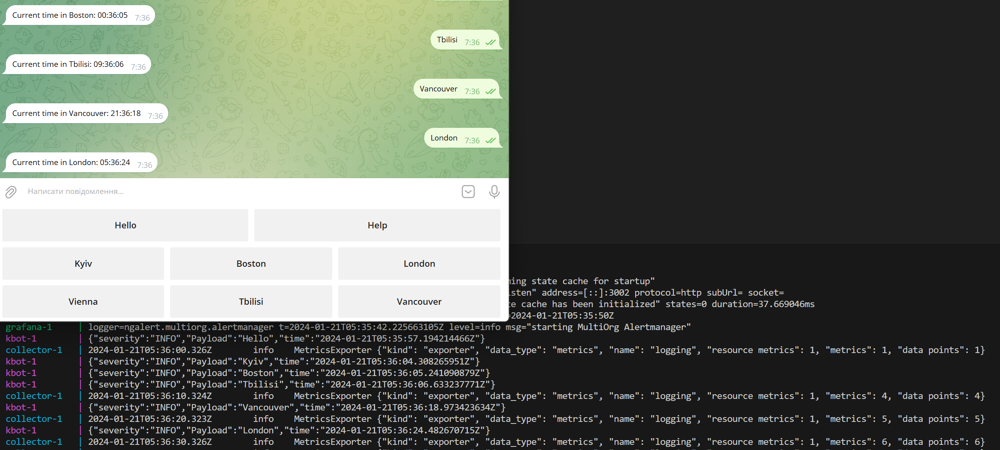  

- Бачимо відпрацював `MetricsExporter` та `collector-1` вже відправив метрики. Значення метрики збільшується після кожної команди боту, от же все працює.

2. Прийдемо до інтерфейсу Grafana на порт 3002

- Відразу перевіримо створені datasources: Loki та Prometheus, вони на місці:

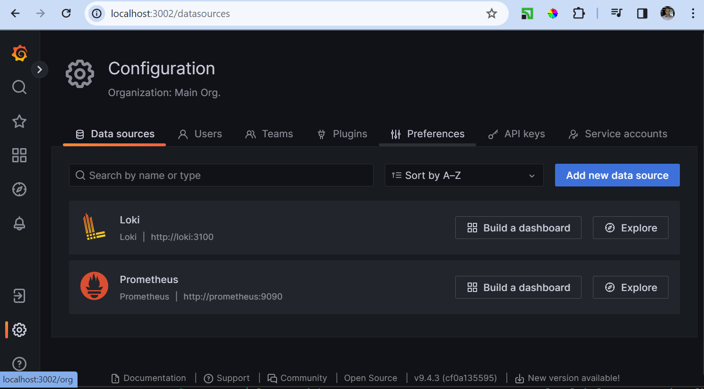

- Перейдемо в режим Explorer, відфільтруємо метрики за префіксом `kbot_` та побачимо, що ми отримуємо всі  метрики від бота для кожної команди бота.  

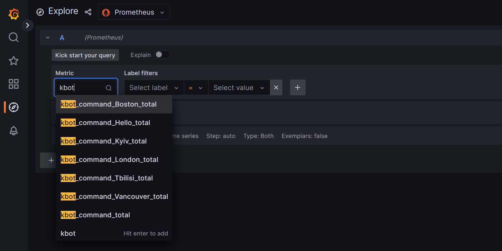 

- В лейбах ми можемо знайти інформацію про сервіс, версію, інстанс та джобу колектора.
```json
kbot_command_Hello_total{exported_job="kbot_v1.5.0-8d0aaa8", instance="collector:8889", job="otel_collector"}
```
- Версія саме та що на сервісі бота. 
```
Hi! I'm Kbot v1.5.0-8d0aaa8! And I know what time it is!
```
- Дамо боту ще одну команду "Hello" та подивимось як зміниться кількість. Все очікувано - кількість метрик збільшилась.

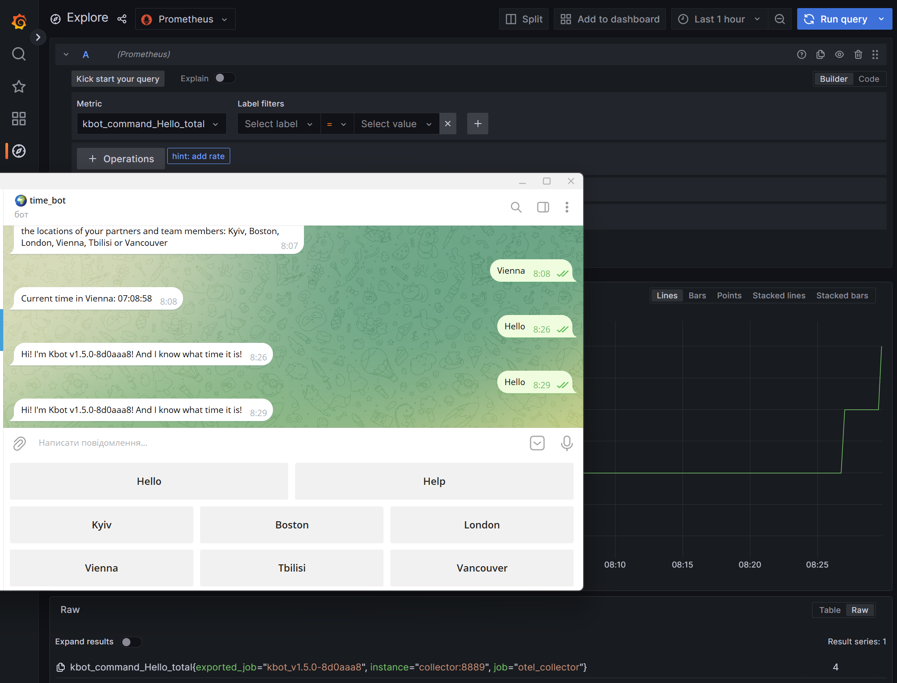  


3. Подивимось що в нас з логами - переключимося на Loki датасорс.

- `Fluentbit` знає свою справу та шле логи в Loki. Зауважте логи поки не розпарсені але це вирішується прямо в інтерфейсі Grafana. - дуже зручно. 

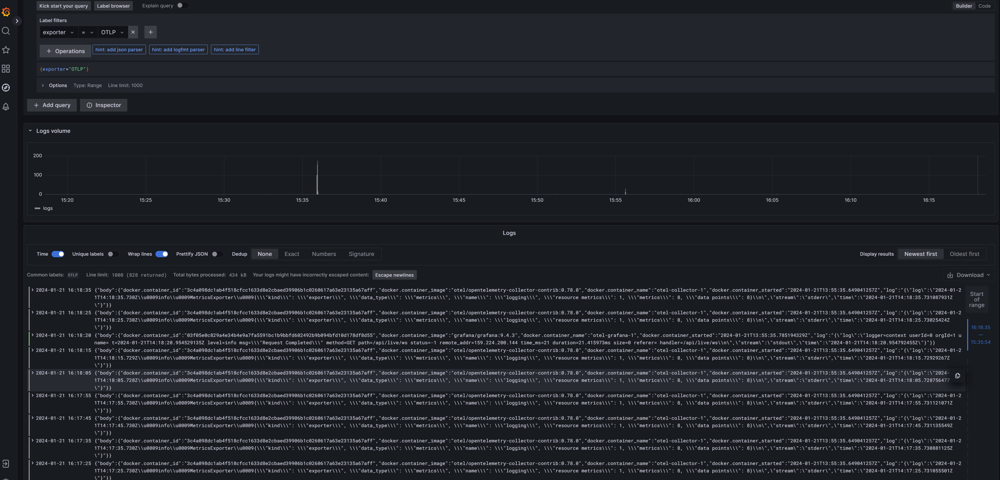  

- Натискаємо hint `add json-parser`, оновимо запит і як бачите першій рівень логу вже розпарсений:
    - контейнер, 
    - імідж, 
    - лог, 
    - explorer,
    - timestamp 
Це вже щось.

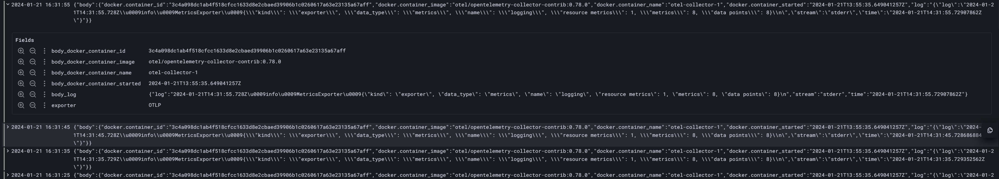  

- Додамо фільтр `hint: add line filter`, та відфільтруємо логи за сервісом `kbot`.

- Це працює, а потім додамо в ланцюжок ще один фільтр, та відфільтруємо за payload `Hello`.

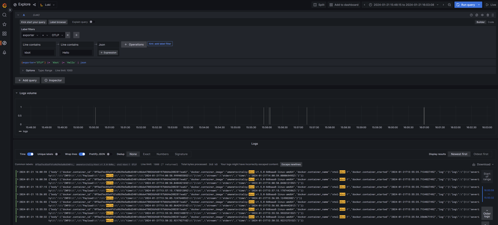  

- Ще один тест з телеграму і відразу отримуємо ще один запис в логах від нашого боту.

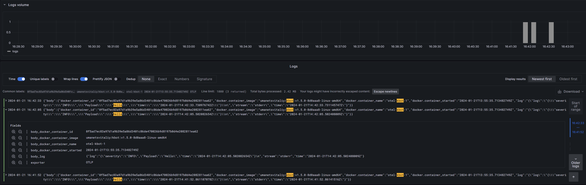   

- Створимо в інтерфейсі Grafana простий Dashboard

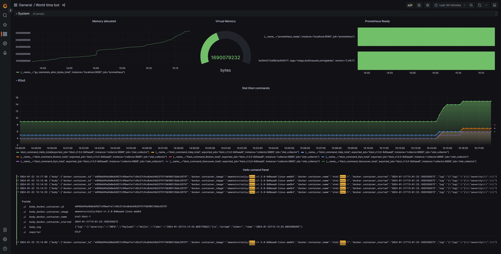 

Гадаю ми маємо уявлення як це працює і готові рухатися далі. Хочу додати, що в продакшн середовищах сервіси експортують метрики за допомогою бібліотек та логують все що тільки можна уявити. В результаті в систему прилітають мільйони об'єктів. Це спричиняє доволі сильне навантаження на системи стореджів, мережу та інші компоненти. Відпрацювання запитів та репортів може тягнутися годинами. А якщо Ви не можете отримати інформацію вчасно вона втрачає свою цінність, тому використовують техніки для зменшення навантаження, наприклад, семпли для метрик агрегації для логів:

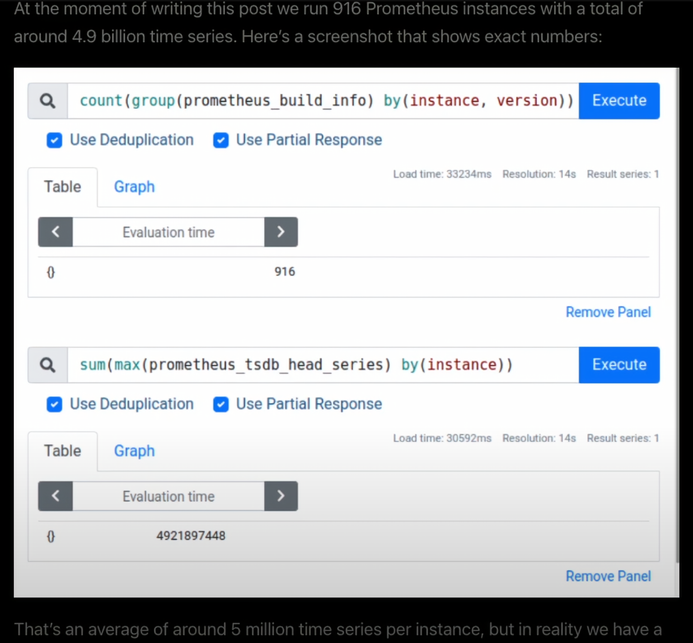  

Це дозволяє зберігати історію на довший час та зменшує навантаження на систему, адже суть моніторингу та observability в доступності та своєчасності інформації.


### Схема та процес розгортання OpenTelemetry Collector, Prometheus, Fluent Bit, Loki та Grafana за допомогою Docker Compose:
1. `OpenTelemetry Collector` — це vendor-agnostic агент, який може збирати дані з різних джерел і надсилати їх у різні місця призначення. В цьому прикладі OpenTelemetry Collector налаштовано на отримання даних з протоколу OpenTelemetry (OTLP) та їх експорт до експортера Prometheus.

2. `Prometheus` — це система моніторингу з відкритим вихідним кодом, яка збирає метрики з налаштованих targets і зберігає їх у time-series базі даних. В цьому прикладі Prometheus налаштовано на отримання метрик з OpenTelemetry Collector через HTTP endpoint.

3. `FluentBit` — це легкий і масштабований collector і exporter логів. FluentBit налаштовано на читання логів з контейнерів, запущених на хості Docker, і пересилання їх до Loki.

4. `Loki` — це горизонтально масштабована, високодоступна система агрегації логів. Тут Loki налаштовано на отримання логів від FluentBit і зберігання їх у форматі з можливістю пошуку через
інтерфейс Grafana.

5. `Grafana` — популярна платформа з відкритим вихідним кодом для візуалізації та аналізу метрик і логів. Grafana налаштована на відображення метрик і логів з Prometheus і Loki відповідно.

Файл `Docker Compose` визначає сервіси та їх налаштування. Кожному сервісу надається унікальне ім'я, зображення та відкриті порти. Для кожного сервісу налаштовані окремі конфігураційні файли, що
дозволяє здійснювати управління. 

### Щоб експортувати метрики з Golang-додатку до OpenTelemetry Collector, ви можете використовувати **OpenTelemetry Go SDK**:
- `go.opentelemetry.io/otel`: Це основний модуль Go для OpenTelemetry API та SDK. Він надає набір Go-пакетів для оснащення вашого додатку метриками, трасами та логами OpenTelemetry. Модуль містить пакети для створення метрик і трас, а також для експорту даних до різних бекендів.
- `go.opentelemetry.io/otel/exporters/otlp/otlpmetric/otlpmetricgrpc`: Це пакет Go, який надає експортер для надсилання метрик OpenTelemetry до OpenTelemetry Collector через gRPC. Пакет використовує формат OTLP (OpenTelemetry Protocol) для надсилання даних метрик до Колектора.
- `go.opentelemetry.io/otel/sdk/metric`: Це пакет Go, який надає SDK для метрик OpenTelemetry. SDK дозволяє створювати та керувати метриками та експортерами OpenTelemetry. Пакет містить типи та інтерфейси для створення та реєстрації метрик, а також для експорту даних метрик до різних бекендів.
- `go.opentelemetry.io/otel/sdk/resource`: Це пакет Go, який надає SDK для ресурсів OpenTelemetry. Ресурси — це атрибути, які пов'язані з телеметричними даними вашого додатку, такі як метрики, траси та журнали. Пакет дозволяє створювати та керувати ресурсами, які використовуються OpenTelemetry SDK.
- `go.opentelemetry.io/otel/semconv/v1.12.0`: Це пакет Go, який надає OpenTelemetry Semantic Conventions. Використовуючи Семантичні Conventions, ви можете гарантувати, що ваші телеметричні дані є узгодженими та сумісними з іншими програмами та системами, які використовують OpenTelemetry.

У продакшн середовищах з високим навантаженням метрики та системи моніторингу відіграють вирішальну роль у забезпеченні стабільності та продуктивності системи. Високонавантажені середовища можуть генерувати величезні обсяги даних, а моніторинг та аналіз цих даних може допомогти швидко виявити та вирішити проблеми.

### Ось кілька найкращих практик щодо метрик та систем моніторингу у виробничих середовищах з високим навантаженням:
**1. Використовуйте масштабований бекенд метрик:** бекенд метрик повинен мати можливість обробляти великі обсяги даних і масштабуватися по горизонталі за потреби. Використання хмарного бекенду метрик, такого як Amazon CloudWatch або Google Cloud Monitoring, може допомогти з масштабуванням.

**2. Використовуйте вибірки для зменшення обсягу даних:** вибірка може допомогти зменшити обсяг даних, які потрібно обробляти та зберігати. Наприклад, ви можете вибрати лише певний відсоток запитів або подій, щоб зберегти обсяг даних керованим.

**3. Використовуйте розподілене трасування:** розподілене трасування може допомогти виявити першопричину проблем з продуктивністю, відстежуючи запити в різних службах і системах. Це може допомогти точно визначити, де виникають вузькі місця і яка служба або система викликає проблему.

**4. Використовуйте сповіщення в режимі реального часу:** сповіщення в режимі реального часу можуть допомогти виявити і вирішити проблеми до того, як вони стануть критичними. Наприклад, сповіщення можуть спрацьовувати, коли досягається певний поріг для певного показника, наприклад, використання процесора або частота помилок.

**5. Використовуйте виявлення аномалій:** виявлення аномалій може допомогти виявити незвичайні шаблони або поведінку в даних, які можуть свідчити про проблему. Наприклад, можна виявити раптові сплески трафіку або помилки та попередити про них.

**6. Використовуйте дашборди для наочності:** дашборди можуть забезпечити огляд продуктивності та стану системи на високому рівні. Вони можуть відображати показники і події в режимі реального часу, дозволяючи операторам швидко виявляти і діагностувати проблеми.

**7. Використовуйте автоматизацію для усунення несправностей:** автоматизація може використовуватися для автоматичного реагування на проблеми або аномалії, виявлені в системі. Наприклад, якщо використання процесора перевищує певний поріг, автоматична реакція може запустити додаткові екземпляри сервісу, щоб впоратися з
навантаженням.

*Дотримуючись цих найкращих практик, метрики та системи моніторингу можуть допомогти забезпечити стабільність та продуктивність прод середовища з високим навантаженням. Вони також допомагають швидко виявляти та вирішувати проблеми, зменшуючи вплив на користувачів та бізнес.*

### Корисні посилання 

[Репозиторій:](https://github.com/den-vasyliev/kbot/blob/opentelemetry/otel/docker-compose.yaml)  
[OpenTelemetry Metrics API for Go](https://uptrace.dev/opentelemetry/go-metrics.html)  
[Building an Observability Pipeline with OpenTelemetry and Fluent Bit](https://calyptia.com/2023/04/05/building-an-observability-pipeline-with-opentelemetry-and-fluent-bit/) 
[Collector](https://opentelemetry.io/docs/concepts/data-collection/)  
[The complete guide to OpenTelemetry in Golang](https://www.komu.engineer/blogs/11/opentelemetry-and-go)  
[OpenTelemetry](https://docs.fluentbit.io/manual/pipeline/outputs/opentelemetry)  
[OpenTelemetry: Current State](https://logz.io/learn/opentelemetry-guide/#current)  
[How to instrument your code using OpenTelemetry](https://isitobservable.io/open-telemetry/traces/how-to-instrument-your-code-using-opentelemetry)  
[Load testing Grafana k6: Peak, spike, and soak tests](https://grafana.com/blog/2023/02/14/load-testing-grafana-k6-peak-spike-and-soak-tests/)  

### Контрольні запитання

1. Який підхід до моніторингу фокусується на виявленні та виправленні проблем після їх виникнення?

Реактивний моніторинг - це підхід до моніторингу, який фокусується на виявленні та виправленні проблем після їх виникнення. Реактивний моніторинг зазвичай використовує сповіщення, щоб повідомляти інженерів про потенційні проблеми. Коли інженери отримують сповіщення, вони проводять розслідування, щоб визначити причину проблеми та вжити заходів щодо її виправлення.

Проактивний моніторинг - це підхід до моніторингу, який фокусується на виявленні проблем до того, як вони стануть серйозними. Проактивний моніторинг зазвичай використовує такі методи, як аналіз тенденцій, профілювання та моделювання, щоб прогнозувати потенційні проблеми.

Predictive моніторинг - це підхід до моніторингу, який фокусується на прогнозуванні проблем до того, як вони виникнуть. Predictive моніторинг використовує такі методи, як машинне навчання та штучний інтелект, щоб аналізувати дані та виявляти потенційні проблеми.

2. Яка основна мета індикаторів рівня послуг (SLI)?

Основна мета індикаторів рівня послуг (SLI) - Поставити цілі для сервіс продуктивність (performance)


3. Що з наведеного нижче є прикладом методу white-box monitoring?

Application Code Profiling є прикладом методу white-box monitoring.

White-box monitoring означає, що ми маємо доступ до внутрішніх деталей системи або додатку. Application Code Profiling включає в себе вивчення внутрішніх аспектів додатку, таких як витрати часу на виконання кожної функції чи методу, ідентифікацію "гарячих" місць у коді та виявлення можливих покращень.

Host System metrics та Application logs - це, відповідно, приклади інших типів моніторингу (host-based та logging), які можуть бути використані для оцінки зовнішнього стану системи чи додатку.

4. Що таке "Span" в контексті OpenTelemetry?

У контексті OpenTelemetry "Span" - це окрема одиниця роботи в розподіленій трасі (trace).

Trace - це послідовність запитів, які обробляються різними компонентами системи. Span - це окремий запит, який виконується в рамках однієї траси.

Span має такі атрибути:

Trace ID: унікальний ідентифікатор, який пов'язує Span з іншими Span-ами в рамках однієї траси.
Span ID: унікальний ідентифікатор, який ідентифікує конкретний Span.
Start Time: час початку виконання Span-а.
End Time: час закінчення виконання Span-а.
Name: назва Span-а.
Attributes: додаткові атрибути, які можуть бути використані для опису Span-а.
Span-и можуть бути вкладені один в одного. Наприклад, якщо програма виконує HTTP-запит, то цей запит буде представлений одним Span-ом. Якщо програма виконує кілька HTTP-запитів в рамках одного HTTP-запиту, то ці HTTP-запити будуть представлені вкладеними Span-ами.

Span-и використовуються для відстеження взаємодії між компонентами розподіленої системи. Вони можуть бути використані для виявлення проблем із продуктивністю, доступністю або безпекою системи.


