## Історія розвитку Kubernetes
- **Початок:** `Квітень 2015 року` — вийшла публікація від Google [Large-scale cluster management with Borg](./img/Large-scale-cluster.pdf) (Керування великомасштабним кластером у Google з використанням Borg).  

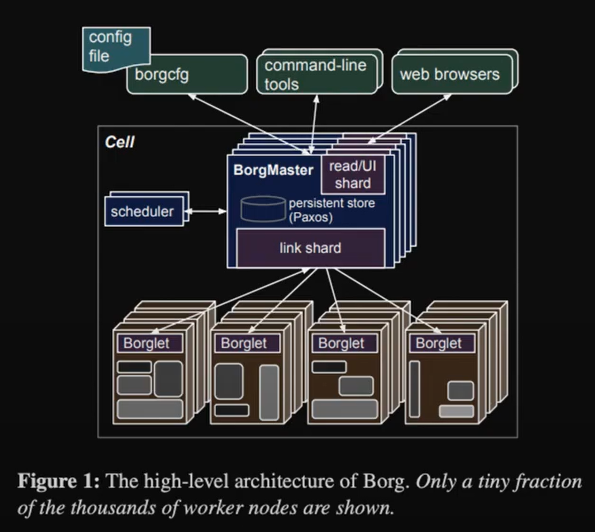
- `2003-2004` — Google представила систему Borg System - великомасштабна внутрішня система управління кластерами Google.  
- `2013` — Google анонсували публікацію системи `Omega:` flexible, scalable schedulers for large compute clusters - Для вирішення проблем зростаючого масштабу і необхідності швидкого реагування на мінливі вимоги.  

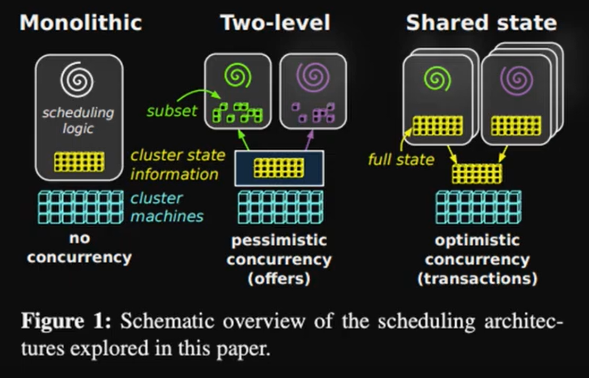 
- `2014` — в офіційному блозі Google з'являється замітка про `Kubernetes`. Менеджер контейнерів з відкритим вихідним кодом. 7 червня було зроблено перший коміт в офіційний репозиторій Kubernetes на github, а протягом місяця приєдналися до Kubernetes спільноти: `Microsoft`, `RedHat`, `IBM`, `Docker`.  
- `21 липня 2015` — перший реліз [Kubernetes](https://github.com/kubernetes/kubernetes). Google та Linux Foundation кооперуються у форматі CNCF. Долучається Huawei, стартує перша, всесвітньо відома, конференція Kubecon 2015 у Сан-Франциско.  

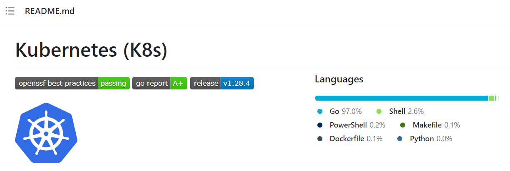 
- `2016` — Kubernetes стає мейнстримом, стартує європейська конференція Kubecon, виходить перша версія пакетного менеджера Helm(де-факто стандарт поширення додатків під Kubernetes). Microsoft Windows server отримує підтримку в Kubernetes. `Pokémon GO` — це мобільний застосунок-гра в доповненій реальності, що базуються на GKE (Google Kubernetes Engine).

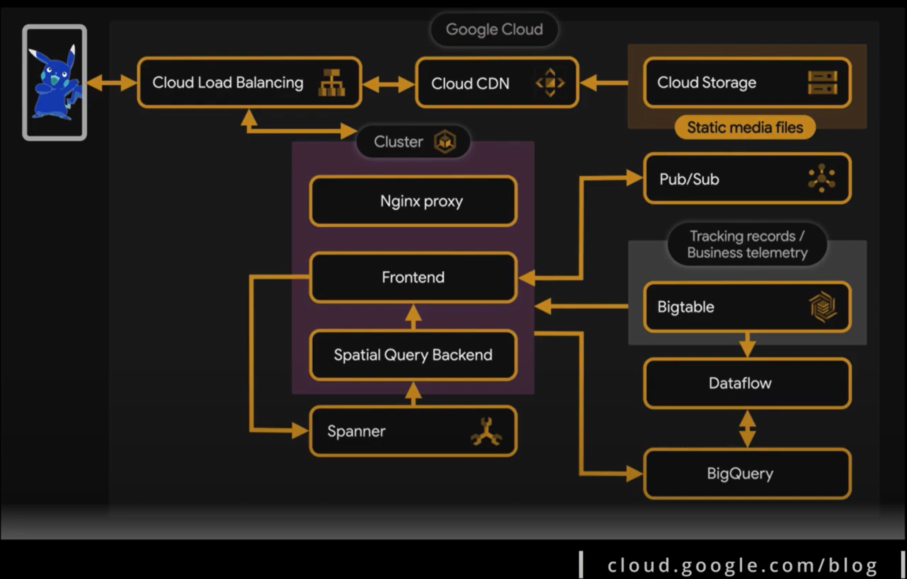 
- `2017` — зародження [Service Mesh Istio](https://istio.io/latest/about/service-mesh/) — відкрита технологія, що забезпечує безшовне з'єднання, управління і захист мереж різних мікросервісів. Цим започатковано цілу екосистему, що охоплює аспекти Kubernetes networking, безпеки та управління трафіком у кластері. `Docker` включає Kubernetes як офіційний альтернативний оркестратор свого Docker Swarm. `Azure і AWS` запускають свій хмарний менеджмент сервіс для Kubernetes. Анонсовано [Kubeflow](https://www.kubeflow.org/) — стек машинного навчання під Kubernetes.

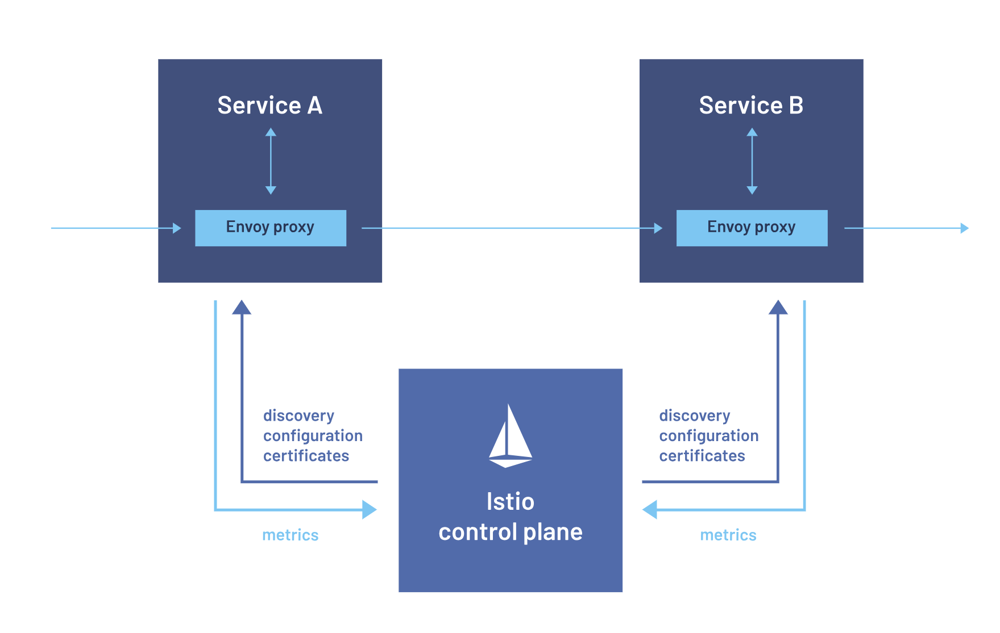 


## З чого почати вивчення Kubernetes
1. План вивчення з нуля можна скласти на базі матеріалу [Certified Kubernetes Administrator (CKA)](https://training.linuxfoundation.org/certification/certified-kubernetes-administrator-cka/)  

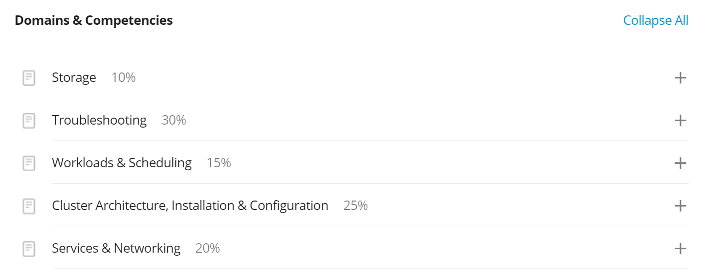  

2. Linux Foundation пропонує Learning Path з 30 великих тем, починаючи з основ операційної системи Linux, Хмарних обчислень, Kubernetes, і Gitops  

3. Максимальний фокус адміністратора Kubernetes на [Core Concepts](https://kubernetes.io/uk/docs/concepts/)

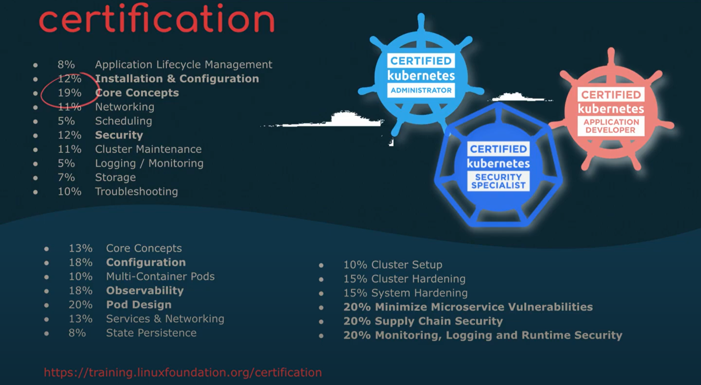 

4. `Networking` або мережевий рівень — мережева підсистема Linux, на базі якої реалізовано Kubernetes networking, напевно, один з найскладніших аспектів як для вивчення, розуміння і правильного налаштування.   

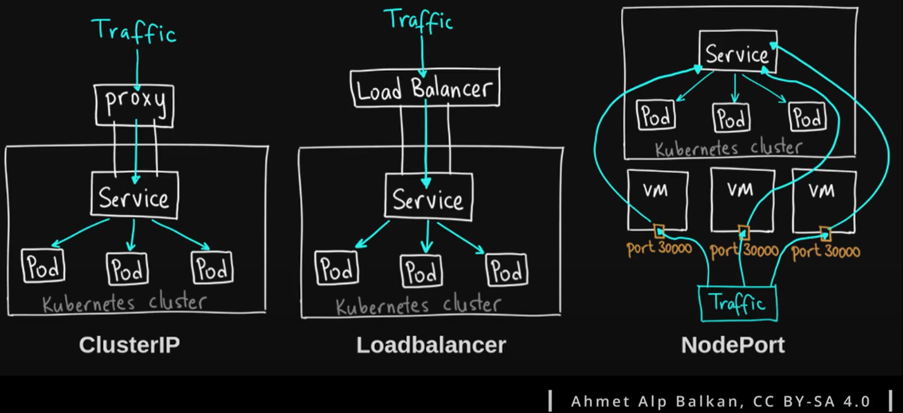

5. `Для DevOps` важливо розібратися в ключових моментах мережевої взаємодії рівня L3-L4 через CNI (container Network interface),iptables/ipvs і eBPF.  
 - `Kubernetes Ingress` — забезпечує керування балансуванням трафіку для групи сервісів та термінування SSL і віртуальний хостинг на основі імен. Він служить як механізм для визначення правил маршрутизації HTTP і HTTPS трафіку до сервісів в Kubernetes кластері. Ingress може використовуватися для маршрутизації трафіку до різних служб за визначеними правилами, керуванням балансуванням трафіку, термінацією SSL, та іншими мережевими функціями.   
 - `Kubernetes Service` — це абстракції над мережевою підсистемою. Призначений для TCP/UDP трафіку.
 - `API Gateways і Service Mesh` - Маршрутизація в Kubernetes або механізм керування зовнішнім доступом до мікросервісів.

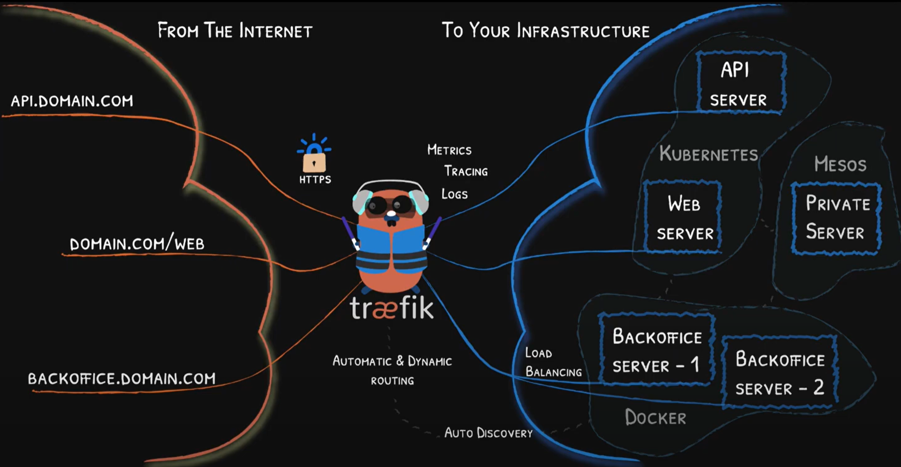 

6. `Для розробників` — акцент на дизайн пода (pod), найменшої одиниці управління в Kubernetes. У поді живе контейнер. І дизайн життєвого циклу контейнера, одне з основних завдань для ефективності використання Kubernetes як оркестратора. `Конфігурація і Observability` — розуміння як налаштовувати систему, а також мати можливість відстежувати, як ця система працює після запуску. Потрібно зібрати метрики та логи для повного розуміння стану. Чи все працює як задумано.  

7. `Для фахівця безпеки` — запобігання потенційним вразливостям, моніторинг і аналіз поточного стану системи, виявлення аномалій. Розуміння повного циклу функціонування системи. Має вміти установку та налаштування безпеки кластеру.

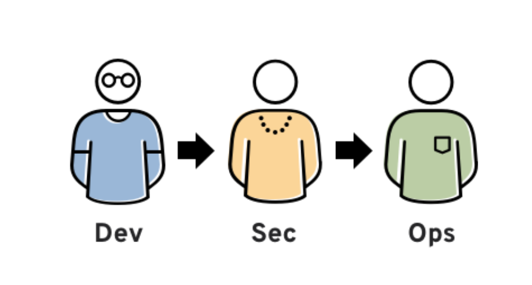 

## Kubernetes та DevOps
`Kubernetes Provider Agnostic` — тоб-то система незалежна від провайдера, системи або середовища розгортання, включаючи архітектуру фізичних серверів. Kubernetes нативно підтримує різні архітектури процесорів, такі як x86, x64, arm/arm64, s390x, RISC-V і MIPS та інше. Тоб-то навіть Raspberry Pi підходить.

Великий попит на специфічне обладнання як `GPU (Graphics Processing Unit)` і `TPU (Tensor Processing Units)` — це дає змогу гнучко й ефективно планувати бюджет.

Проєкт інтернету речей — [Akri](https://github.com/project-akri/akri) - це фреймворк для під'єднання таких пристроїв, як камери, датчики, мікрокомп'ютери та інших leaf devices.  

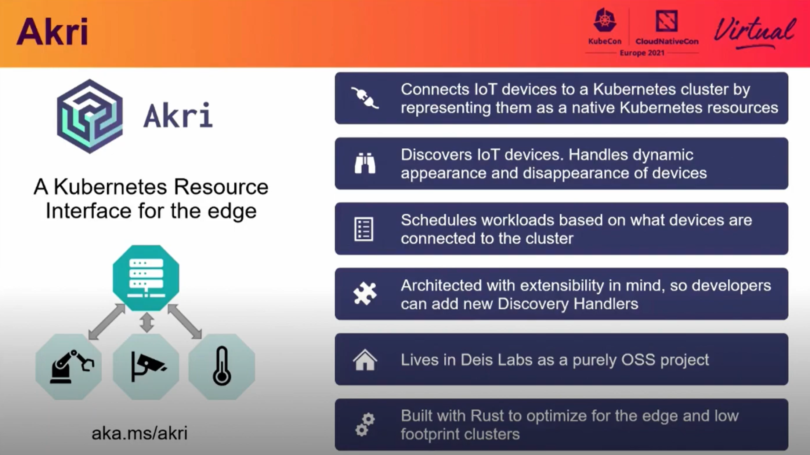

`Публічні та приватні хмари` — найпоширеніші середовища для Kubernetes на сьогодні. Широкий вибір систем та інструментів на базі
Kubernetes можна знайти у [ландшафті CNCF](https://landscape.cncf.io/). Усі основні хмарні провайдери надають менеджмент сервіс Kubernetes на своїх платформах.  

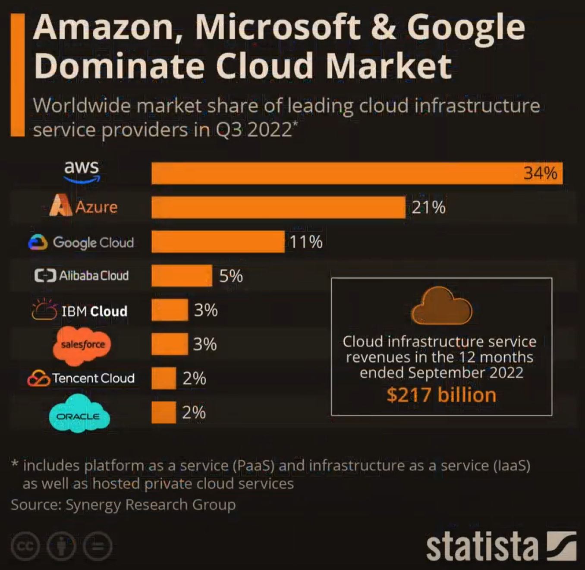

`Easy Deployment`  — визначає відносно простий процес [розгортання сервісу](https://kubernetes.io/docs/concepts/workloads/controllers/deployment/#creating-a-deployment) на інфраструктурі. Aвтоматизація для нової версії сервісу, з Kubernetes виглядає набагато надійнішим, швидким простішим процесом. Усе завдяки продуманій системі життєвих циклів Kubernetes, вбудованому лоад-балансеру, контролю ресурсів і моніторингу.  

`Continuous Deployment` — це етапи оновлення, видалення і масштабування (в базовій інсталяції Kubernetes). Допоміжні функції роблять це виведення безпечнішим, автоматизованим і контрольованим для команди розробки. Процес автоматичної доставки змін до середовища.

`Namespaces` в термінології Kubernetes — можна уявити собі як кластер у кластері. Йдеться про використання під задачі абстрактних кластерів з ізольованими ресурсними пулами. Основна функція namespaces в Kubernetes - це розділення кластера на логічні ізольовані середовища.

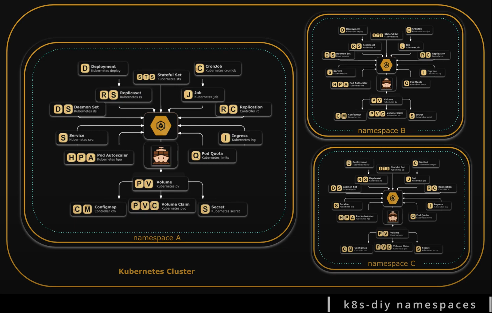 

`Kubernetes Multi Tenancy` — окремі команди можуть запускати в окремому оточенні свої сервіси незалежно від інших команд, а так само від системних сервісів. Організаціям може бути надано виділені ресурси одного кластера та інфраструктури. 

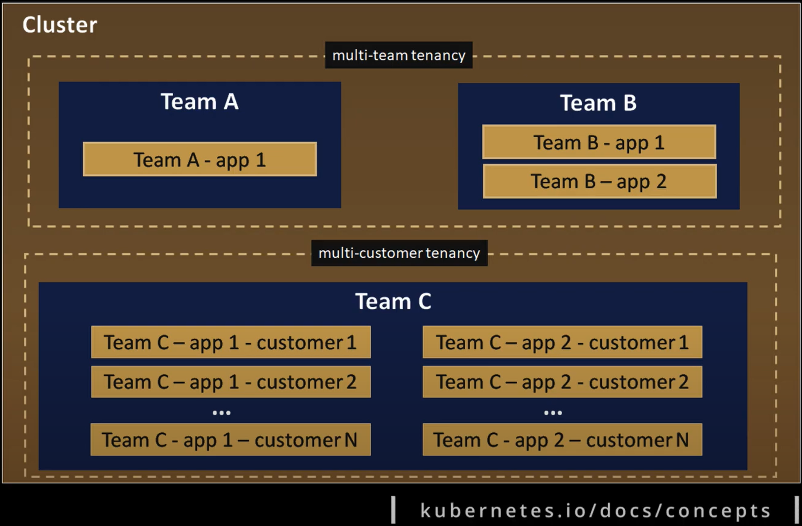 
Для `DevOps` буде корисним розгортання середовищ розробки: `dev`, `qa`, `staging` і `prod`. Створивши відповідний набір namespaces, ми одразу отримуємо:
- середовище для розробників на `dev`. 
- для тестування продукту QA командою, відповідно `qa`.  
- `staging` для предрелізної перевірки замовником продукту.  


`Rolling Updates, Rollback` та `Canary Deployment` — використовуються для безшовного оновлення версій, без переривання трафіку, так званий `Zero Downtime деплоймент`. Оновлення виглядає наступним чином: 
- Кubernetes за замовчуванням піднімає нову репліку пода (контейнер) з новою версією, але не включає цю репліку в балансування. 
- Проходження контейнером стартових етапів запуску та тестування 
- Kubernetes за допомогою спеціальних проб перевіряє, чи відповідає сервіс або іншими словами чи виконується контейнер (liveness probe) 
- Чи готовий контейнер обслуговувати запити та обробляти трафік (readiness probe). 
- Перемикається трафік на контейнер в разі вдалих всіх попередніх кроків 


`Canary` та `Blue/Green` деплоймент — це вже технології та варіанти як само буде перемикатись трафік на контейнер з оновленою версією.
- `Blue/Green` метод  полягає в перемиканні всіх 100% трафіку з поточної версії на нову. Але бувають випадки, коли всі проби успішні, але на вищому рівні сервіс не працює — виявлено баг, наприклад, у бізнес-логіці. У цьому випадку це може вплинути на всі 100% користувачів. В такому випадку ми можемо скористатись напівавтоматичним відкатом `Rollback Feature` (Kubernetes веде історію апдейтів і нумерує ревізії, тому достатньо буде вказати номеру релізу)

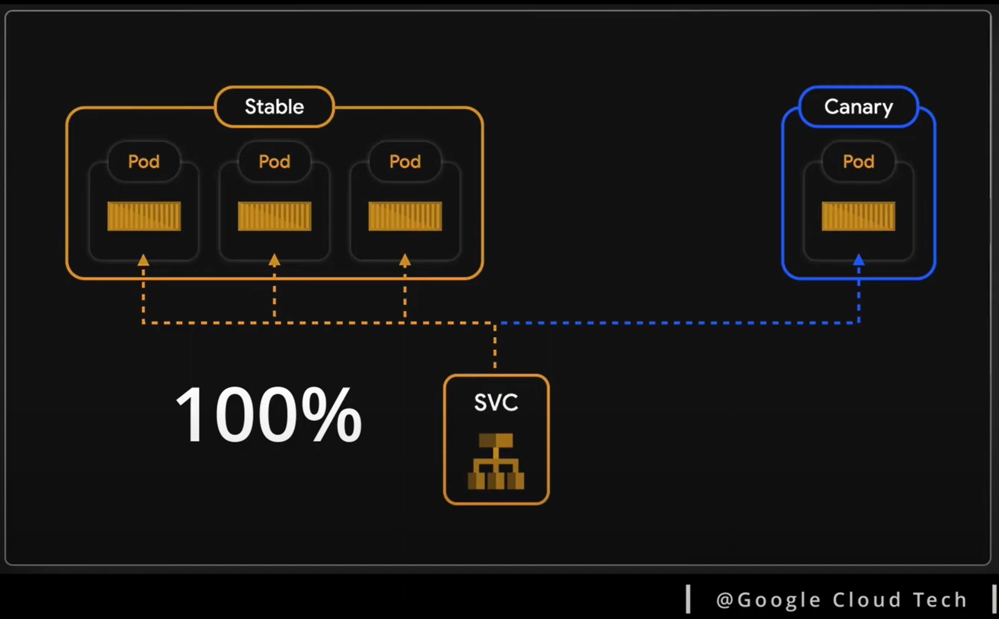

- `Canary Deployment` передбачає, що при розгортанні нової версії сервісу переключаються заданий відсоток продакшн трафіку. Це дає можливість наприклад 5% трафіку надати на тестування фокус групі, не впливаючи на 95% комерційного трафіку. Далі поступово додають 10-30-50% і так до повного переключення на нову версію.  

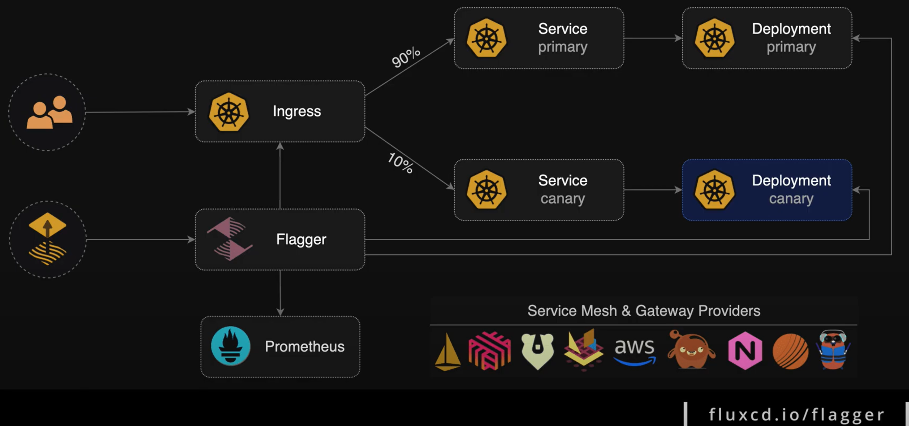

`Scalable Infrastructure і Security Compliance` — це ключові критерії для ухвалення рішення щодо застосування Kubernetes у великих та серйозних проєктах. Фахівець DevOps має вміти аргументовано підтвердити відповідність впровадження на Kubernetes цим критеріям: 
- система і продукт повинні легко масштабуватися без змін і доповнень в архітектурному рішенні. Горизонтально (кількість нод у кластері) та вертикально (якість нод у кластері).
- система має задовольняти міжнародним стандартам інформаційної безпеки.  

На рівні застосунку система квот, лімітів і метрик дає нам змогу гнучко обслуговувати як зміну навантаження на ресурси, автоматично збільшуючи чи зменшуючи кількість реплік. Таким чином, гнучко керувати бюджетом на інфраструктуру. 

`DevSecOps` — окремий напрямок, що відповідає за `безпеку та Security Hardening` де існує своя низка сертифікацій,
відповідностей і рекомендацій, який покликаний розширити наявний відділ ІТ безпеки в специфіці Kubernetes і всього Supply Chain продукту.Основне для DevOps — це дотримуватися `Continuous Security` для всього `SDLC`. 

`Tech & Business Metrics`. `Logging & Monitoring`. — процеси, що дають змогу визначити, чи все працює як очікується. Різні компоненти можуть бути в робочому стані, помилок не видно, трафік начебто біжить, але ще важливо зрозуміти, що система працює в цілому і сервіс для кінцевого користувача надається. 

Для цього на базі логів і технічних метрик будуються [бізнес-метрики](https://www.datadoghq.com/) — верхньорівневі агреговані, іноді непрямі показники, що використовуються для відстеження KPI та бізнес-оцінки (кількість реєстрацій користувачів у нормі, час на транзакцію в межах допустимого тощо). Навіть звичайний текстовий лог від мікросервісу може бути перетворений на метрику для підтвердження, що повний комплекс системи працює очікувано та передбачувано. Команди `logs і top` служать для отримання оперативної інформації про об'єкти Kubernetes. Вбудований метрикс сервер збирає метрики з системних компонентів, а також запущених сервісів. Але повноцінне логування і вимірювання все ж лягають на обв'язку моніторинговими інструментами сервісу.

## Архітектура та компоненти Kubernetes

`Kubernetes кластер` — об’єднання декількох елементів або серверів, що являє собою самостійну одиницю.   
`Node` — це сервери. У минулому їх ще називали міньйони. Але сьогодні це точно ноди або вузли кластера. Ноди за своєю роллю можуть бути майстром або воркером.   
`Master` — керуючі ноди або контролери або 'Control Plane', на яких запущені сервіси, що здійснюють контроль та управління всією системою.  
`Worker` — робочі сервери або звичайні обчислювальні ресурси що виконують основну роботу в системі. Запущені контейнери використовують саме ресурси (RAM, CPU, SSD, GPU, TPU) вокерів. Kubernetes може бути запущений на одній ноді і навіть одним процесом і поєднувати ролі мастера і воркер ноди в межах однієї машини.  
`Pod` — мінімальна одиниця управління в Kubernetes наділена, або набір із контейнерів і файлової системи, що працюють в одному мережевому середовищі. 
Поди в кластері характеризуються наступним:  
- Усі контейнери в Pod завжди розміщуються на одній ноді;
- Кожен контейнер у Pod працює у своїй власній контрольній групі, але вони розділяють один неймспейс;
- Процеси, запущені в одному Pod, використовують одну й ту саму IP-адресу і пул портів;
- Файловий простір доступний і розділяється між усіма процесами в поді.   

Щоб зрозуміти що контейнери можуть бути складовою одного пода, потрібно поставити запитання, а чи будуть ці контейнери коректно працювати на двох різних фізичних серверах? Якщо "Ні" - то "Так".  

### Компоненти Kubernetes (Components)
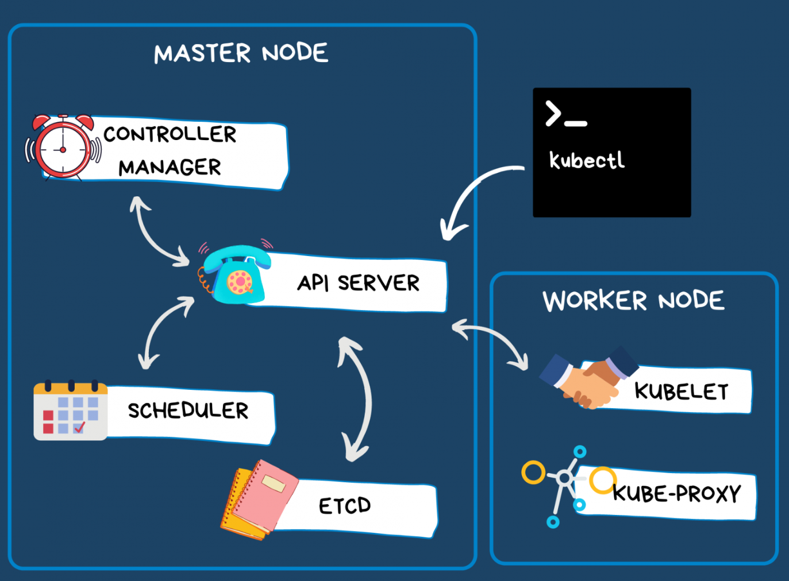
  
`Kubernetes Control Plane` — це чотири основні компоненти, [чотири бінарні файли](https://gochronicles.com/kubernetes-architecture/):
1. `API-server` (з ним взаємодіє kubectl через REST API, або через HTTP API для міжкомпонентних комунікацій на фреймворку gRPC чи інші бібліотеки Kubernetes. Клонується при навантажені);  
2. Планувальник `scheduler` (Новий под знаходиться в статусі `Pending` доки `scheduler` йому не видасть нову nod-у для роботи, а перед цим зробить підбір за ресурсам, щоб їх вистачало саме для цього pod-a);  
3. `Controller manager` або Менеджер контролерів це код що відстежує event loop kubernetes кластеру на наявність нового API виклику для job-и, в разі виявлення він зчитує конфігурацію та створює об'єкт запускаючи контейнер. У контейнері виконується робота та повертається результат. Це опис на прикладі job-controller, який керує створенням контейнеру для виконання окремого завдання. (Компонент який все виправляє.Контролер робить все щоб забезпечити перехід поточного стану кластера `current state` в бажаний стан `desired state`. Кожен контролер спостерігає за своїм об'єктом: вузлом, задачею, реплікою...);   
4. `Etcd` строго консистентне (узгоджене та розподілене) сховище ключ-значення або база даних за замовчуванням, або особистий журнал Kubernetes. Все що трапляється, будь яка подія має бути записана в цю базу. Тут може бути обрана будь яка інша зовнішня база даних SQL, або вбудована база SQLite. При побудові High Availability систем БД виносять за периметр кластера на окремі сервери.  

`Worker components` — відповідають за безперервне функціонування обчислювальної або робочої ноди та включають в себе:  
1. `kubelet` — агент API-серверу, відповідальний за роботу ноди. Стартує першим при розгортанні ноди та виконує наступні задачі:
    - Завантаження контейнерів, які описані у специфікації подів, з контейнерного реєстру 
    - Взаємодія з master-нодами, які відправляють задачі у формі специфікацій (podspec) або маніфестів (які роботи треба виконати та які поди під них потрібно створити)  
    - Взаємодія з container runtime на ноді. 
    - Виконання перевірок (probes) стану вузла. 
    - Монтування стореджів. 
2. `kube-proxy` — відповідає за роботу з мережею, працює на кожному вузлі та реалізує концепцію `Kubernetes CNI`. Він же працює як балансувальник навантаження, розподіляючи його між подами. Слідкує за виконанням мережевих стандартів та правил. Зазвичай використовую мережеві функціі ОС;  
3. `container runtime` — середовище виконання контейнера готується шляхом завантаження потрібних образів контейнерів та передається керування ними на kubelet. Іншою мовою це програмне забезпечення відповідальне за запуск контейнерів (containerd, CRI-O). 

**Додаткові компоненти (не обов'язкові):**
- `DNS`- система реєстрації імен всіх сервісів у кластері. `coredns` додаток до інших DNS сервісів всередині кластеру. Контейнери що запускаються автоматично включають цей сервіс у свій резолв-список. Список що використовується для розіменування імен або навпаки їх визначення за IP адресою.     
- Моніторинг ресурсів
- Логування процесів

**Альтернативні варіанти:** 
Ми можемо наприклад `kube-proxy` замінити на компонент [Cilium eBPF](https://cilium.io/) який дозволяє динамічно вставляти логіку контролю безпеки в ядро Linux. Оскільки eBPF працює всередині ядра, політики безпеки можна оновлювати без будь яких змін у коді програм або конфігурацій контейнера. 

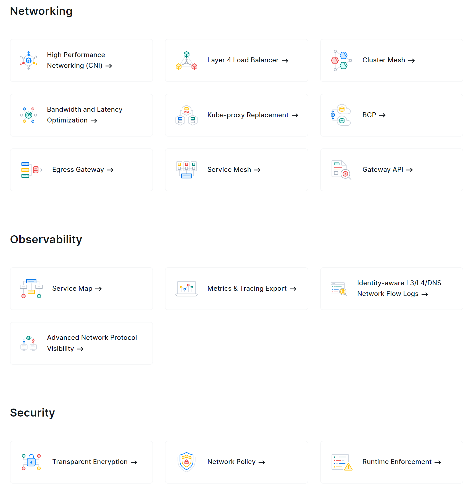 

### Практичне завдання
1. `minikube` Це локальна система Kubernetes, яка дозволяє розгортати кластер Kubernetes на одному комп'ютері. Minikube є зручним варіантом для розробки та тестування на локальному комп'ютері. Однак, виникли сумніви щодо обмеження можливостей масштабування.

2. `kind` (Kubernetes IN Docker). Це інструмент, який дозволяє створювати локальні Kubernetes кластери в Docker контейнерах. AsciiArtify припускають можливість використання kind для локального тестування.

3. `k3d` Це інструмент для створення локальних Kubernetes кластерів в Docker контейнерах з використанням Rancher Kubernetes Engine (RKE). K3d дозволяє швидко створювати та тестувати кластери Kubernetes у Docker-контейнерах. AsciiArtify також вирішили використовувати k3d для підготовки PoC.

Виконання завдання за [цим посиланням](https://github.com/vit-um/DevOps/tree/main/Task6_AsciiArtify).

## Розгортання кластеру Kubernetes

### Варіанти розгортання кластеру
1. Розгортання на публічних хмарних сервісах
До хмарних сервісів відносять: `GCP`, `Amazon Web Services` або `Microsoft Azure`.

**Переваги:**  
- дозволяє легко налаштувати та масштабувати кластер
- не потребує великих витрат на обладнання, його обслуговування та підтримку
- забезпечується висока доступність (HA) 
- в складі таких послуг є резервне копіювання даних та автоматичне перезавантаження в разі відмови.  

**Недоліки:**  
- при масштабуванні цей варіант може бути достатньо витратним

2. Розгортання на власному кластері  

**Переваги:** 
- Цей варіант дозволяє повністю контролювати кластер та забезпечити високий рівень безпеки.
- Власний кластер може бути менш витратним, коли кількість вузлів зростає.  

**Недоліки:**  
- Розгортання та налаштування власного кластера вимагає більшої кількості ресурсів та часу.

3. Розгортання кластеру на локальному комп'ютері або одному вузлі  
Переважно використовується для розробок або підготовчих процесів та реалізується за допомогою таких інструментів як:  
- `Docker Desktop` має інтегрований інтерфейс користувача, який дозволяє легко керувати кластером, перевіряти стан вузлів та розгортати додатки в Kubernetes; 
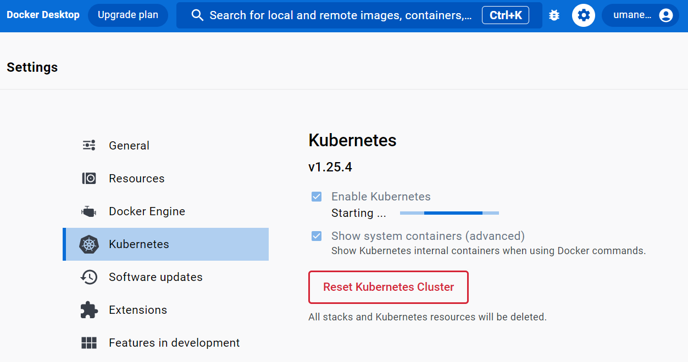

- `kind` має досить погано масштабується та має відносно слабку підтримку спільнотою та документацію
- `k3d` більш поширений, має плагін для VSCode, добре документований. Добре інтегрується з іншими інструментами, такими як Helm, kubectl.
- `Minikube` підтримує різні гіпервізори (VirtualBox, KVM, Hyper-V) та драйвери (Docker, Podman), що дозволяє вам вибрати оптимальне середовище для вашої системи.

### Основами системи оркестрації Kubernetes кластера
Детальний опис кожного етапу позначеного на малюку можна знайти [в цих навчальних матеріалах](https://kubernetes.io/uk/docs/tutorials/kubernetes-basics/).  

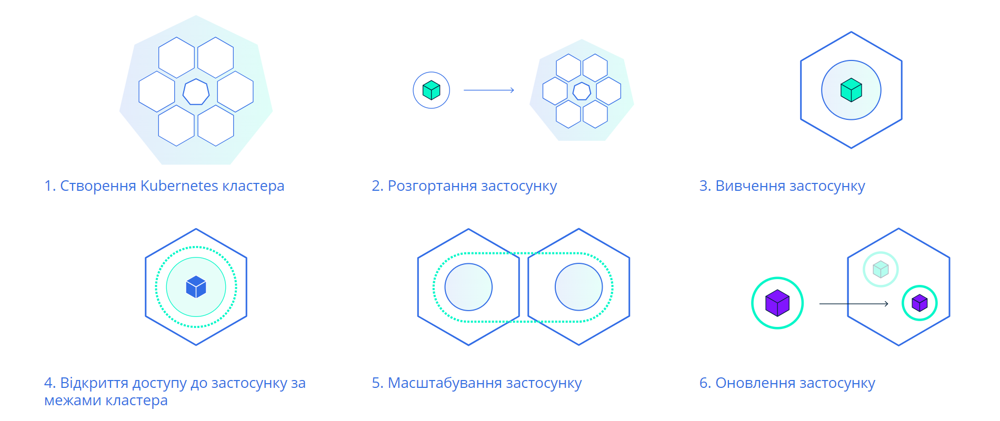 


`Pod` є неподільною одиницею платформи Kubernetes. Коли ви створюєте Deployment у Kubernetes, цей Deployment створює Pod'и вже з контейнерами всередині, на відміну від створення контейнерів окремо. Кожен Pod прив'язаний до вузла, до якого його було розподілено, і лишається на ньому до припинення роботи (згідно з політикою перезапуску) або видалення. У разі відмови вузла ідентичні Pod'и розподіляються по інших доступних вузлах кластера. Pod'и Kubernetes "смертні" і мають власний [життєвий цикл](https://kubernetes.io/docs/concepts/workloads/pods/pod-lifecycle/).

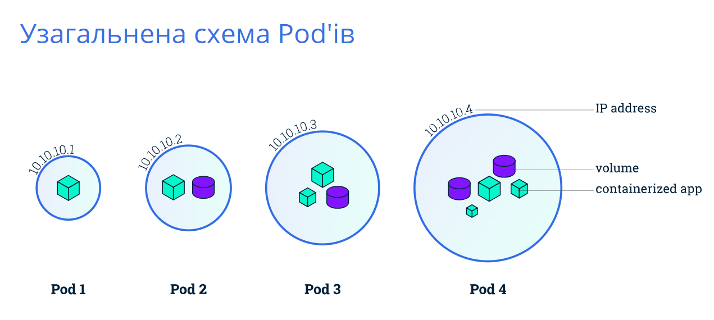

`Вузол` - це робоча машина в Kubernetes, віртуальна або фізична, в залежності від кластера. Функціонування кожного вузла контролюється master'ом. Вузол може мати декілька Pod'ів. Kubernetes master автоматично розподіляє Pod'и по вузлах кластера з урахуванням ресурсів, наявних на кожному вузлі.

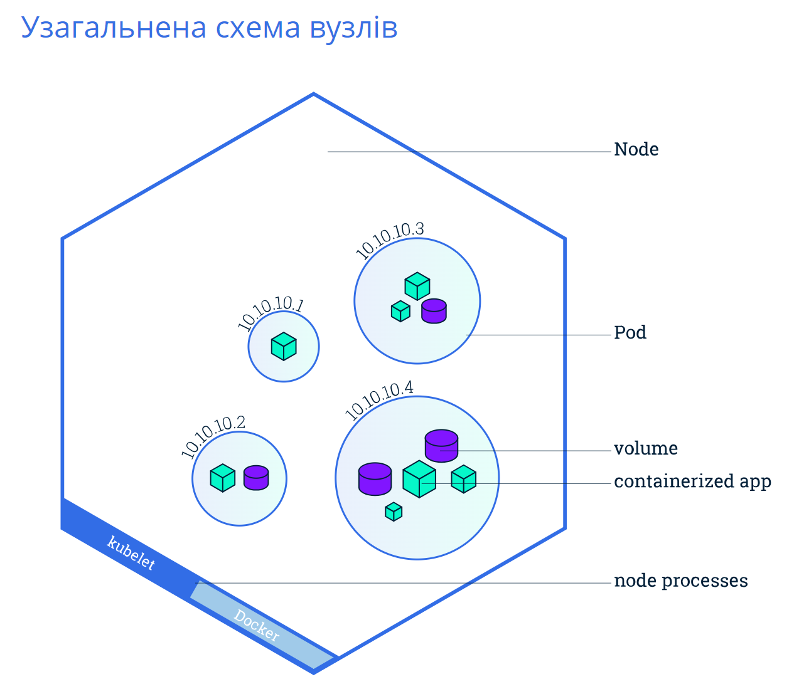 

**Діагностика за допомогою kubectl**
- `kubectl get [services, pods]` - відобразити список ресурсів
- `kubectl describe` - показати детальну інформацію про ресурс
- `kubectl logs [Pod name]` - вивести логи контейнера, розміщеного в Pod'і
- `kubectl exec` - виконати команду в контейнері, розміщеному в Pod'і

**Загальна інформація про Kubernetes Cервіси**
Service у Kubernetes - це абстракція, що визначає логічний набір Pod'ів і політику доступу до них. Services уможливлюють слабку зв'язаність між залежними Pod'ами. Для визначення Service використовують YAML-файл (рекомендовано) або JSON, як для решти об'єктів Kubernetes. Набір Pod'ів, призначених для Service, визначається через LabelSelector
Відкрити Service можна по-різному, вказавши потрібний type у ServiceSpec:  
- `ClusterIP` (типове налаштування) - відкриває доступ до Service у кластері за внутрішнім IP. Цей тип робить Service доступним лише у межах кластера.
- `NodePort` - відкриває доступ до Service на однаковому порту кожного обраного вузла в кластері, використовуючи NAT. Робить Service доступним поза межами кластера, використовуючи <NodeIP>:<NodePort>. Є надмножиною відносно ClusterIP.  
- `LoadBalancer` - створює зовнішній балансувальник навантаження у хмарі (за умови хмарної інфраструктури) і призначає Service статичну зовнішню IP-адресу. Є надмножиною відносно `NodePort`.
- `ExternalName` - відкриває доступ до Service, використовуючи довільне ім'я, повертає запис `CNAME`. Проксі не використовується. Цей тип потребує версії kube-dns 1.7 і вище.  

**`Service`** маршрутизує трафік між Pod'ами, що входять до його складу. Service - це абстракція, завдяки якій Pod'и в Kubernetes "вмирають" і відтворюються, не впливаючи на роботу вашого застосунку. Services співвідносяться з набором Pod'ів за допомогою міток і Селекторів -- примітивів групування, що роблять можливими логічні операції з об'єктами у Kubernetes.  

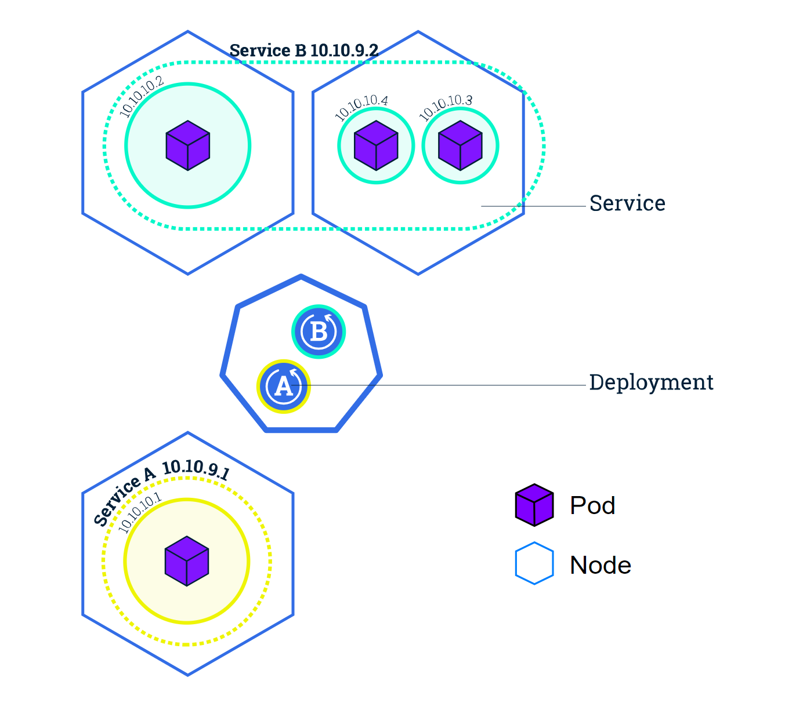  

**`Мітки`** являють собою пари ключ/значення, що прикріплені до об'єктів і можуть використовуватися для різних цілей:
- Позначення об'єктів для дев, тест і прод оточень  
- Прикріплення тегу версії  
- Класифікування об'єктів за допомогою тегів  
Мітки можна прикріпити до об'єктів під час створення або пізніше. Їх можна змінити у будь-який час.
**`ReplicaSet`** здатна динамічно повернути кластер до бажаного стану шляхом створення нових Pod'ів, забезпечуючи безперебійність роботи вашого застосунку. 

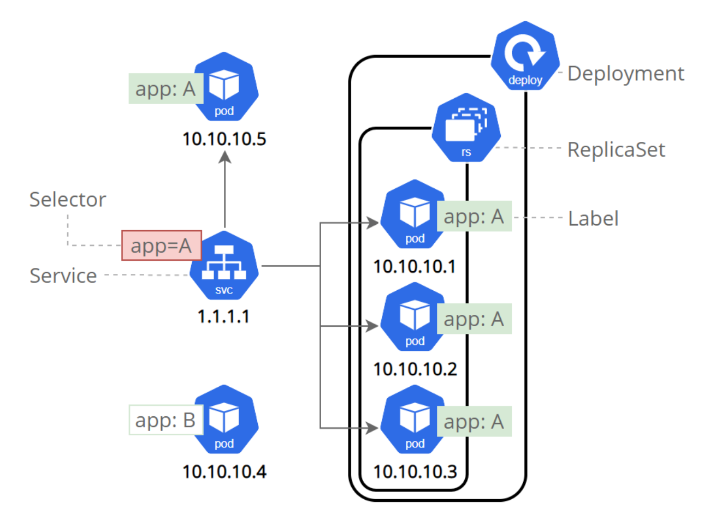 

**`Масштабування застосунку`** досягається шляхом зміни кількості реплік у Deployment'і.  
Масштабування Deployment'а забезпечує створення нових Pod'ів і їх розподілення по вузлах з доступними ресурсами. Масштабування збільшить кількість Pod'ів відповідно до нового бажаного стану. Масштабування до нуля також можливе - це призведе до видалення всіх Pod'ів у визначеному Deployment'і.

Запустивши застосунок на декількох Pod'ах, необхідно розподілити між ними трафік. Services мають інтегрований балансувальник навантаження, що розподіляє мережевий трафік між усіма Pod'ами відкритого Deployment'а. Services безперервно моніторять запущені Pod'и за допомогою кінцевих точок, для того щоб забезпечити надходження трафіка лише на доступні Pod'и.

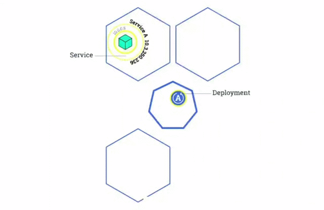  


**`rolling update`** - послідовне оновлення.  
Користувачі очікують від застосунків високої доступності у будь-який час, а розробники - оновлення цих застосунків декілька разів на день. У Kubernetes це стає можливим завдяки послідовному оновленню. `Послідовні оновлення` дозволяють оновити Deployment без простою, шляхом послідовної заміни одних Pod'ів іншими. Нові Pod'и розподіляються по вузлах з доступними ресурсами.  

У Kubernetes оновлення версіонуються, тому кожне оновлення Deployment'а можна відкотити до попередньої (стабільної) версії.  

**Послідовне оновлення дозволяє:** 
- Просувати застосунок з одного оточення в інше (шляхом оновлення образу контейнера)  
- Відкочуватися до попередніх версій  
- Здійснювати безперервну інтеграцію та розгортання застосунків без простою  

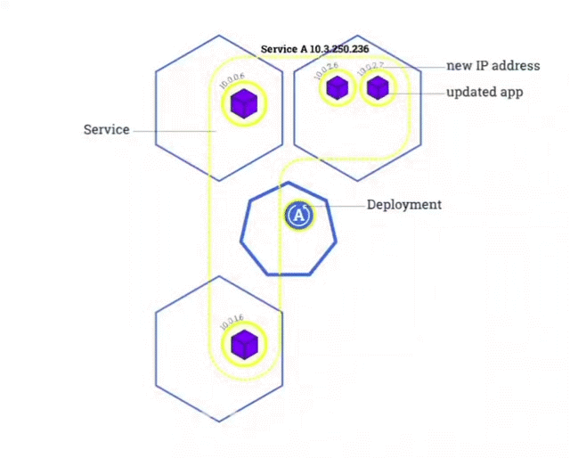  

**`Kubeconfig`** - конфігураційний файл для налаштування кластеру Kubernetes (адресу API-сервера, сертифікати та ключі доступу). Використовується для налаштування з'єднання з кластером Kubernetes та автентифікації користувача або сервісного облікового запису. Має наступну структуру:   
- `clusters` —  інформація про кластер, до якого ви хочете підключитися. Він містить ім'я кластера, URL-адресу API-сервера тощо;
- `users` — інформація про користувача або сервісний обліковий запис, який використовується для автентифікації (ім'я користувача та пароль або сертифікат, приватний ключ тощо);  
- `contexts` — інформація про контексти, які визначають, який кластер і користувач або сервісний обліковий запис повинні використовуватися для взаємодії з кластером Kubernetes. Контекст визначається іменем, ім'ям користувача та ім'ям кластера.  
- `current-context` — цей параметр вказує, який контекст повинен використовуватися за замовчуванням при взаємодії з кластером
Kubernetes.  

**`Kubectl`** — інструмент командного рядка для керування Kubernetes кластером. Має вбудовану функцію автодоповнення для використання потрібно налаштувати Bash чи Zsh. Ви можете створити Deployment і керувати ним за допомогою командного рядка Kubernetes - kubectl

**`kubeadm`** - інструмент для створення кластера Kubernetes. kubeadm (Kubernetes Bootstrapping Tool) — це інструмент для автоматизованого розгортання кластера Kubernetes. Він дозволяє швидко та легко налаштувати майстер-вузол та додати робочі вузли до кластера.Інструмент надає автоматизований підхід до налаштування кластера, що полегшує розгортання та управління Kubernetes.

### Знайомство з легким дистрибутивом Kubernetes `k3s`  
"Single binary Kubernetes" вказує на те, що весь Kubernetes може бути зібраний в один виконуваний файл (бінарний файл). В інших словах, це означає, що усі компоненти Kubernetes, такі як kube-apiserver, kube-controller-manager, kube-scheduler, kubelet та інші, упаковані в один виконуваний файл. 

Цей підхід полегшує розгортання та використання Kubernetes, оскільки вам не потрібно встановлювати та налаштовувати кожен компонент окремо. Вам просто потрібно завантажити цей виконуваний файл і запустити його на відповідному хості чи середовищі. 

[k3s](https://docs.k3s.io/) був розроблений компанією `Rancher Labs`. Згідно з умовами ліцензії `Apache 2.0`, ви можете вільно використовувати, змінювати та розповсюджувати k3s, якщо ви дотримуєтеся умов ліцензії. Це означає, що ви можете використовувати k3s для комерційних або некомерційних цілей, а також розгортати його в своїх проектах.

Всі компоненти запаковано в єдиний бінарний файл, який важить всього 40Мб та займає в пам'яті всього 300Мб:  
Один бінарний файл в залежності від опцій запуску може виконувати різні ролі серверу або агенту 

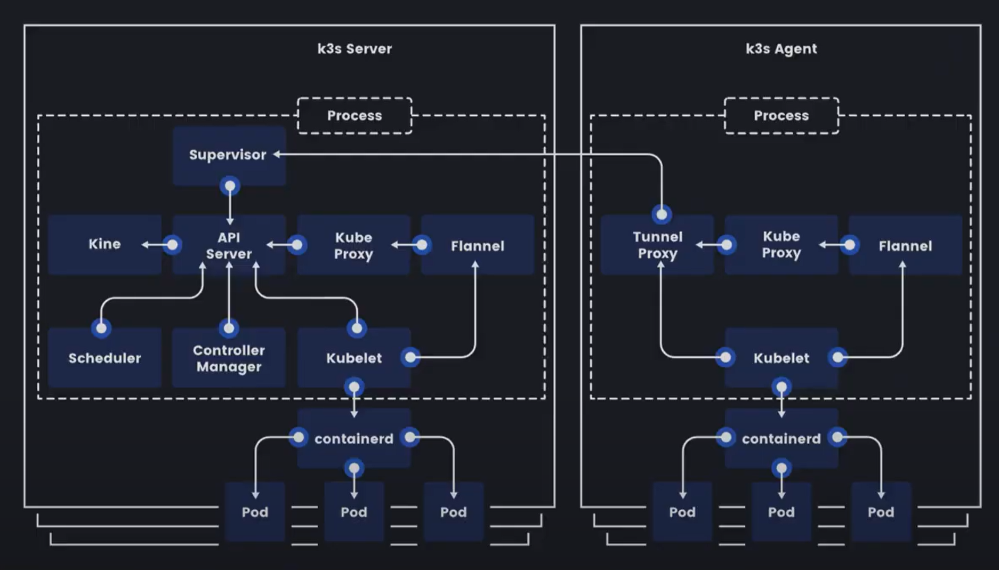  

На сервері цікава реалізація роботи з базою, для цього використовується [Kine](https://github.com/k3s-io/kine) це так званий etcd посередник, який переводить etcd API в команди `SQLite`, `Postgres` або `MySQL`. За замовчуванням використовується [SQLite](https://sqlite.org/index.html) написана на мові `С` та є найбільш поширеною СУБД у світі. Вбудована у всі мобільні телефони та більшість комп'ютерів. 

[Flannel](https://github.com/flannel-io/flannel) — це простий спосіб налаштувати мережеву структуру Level3, розроблену для Kubernetes та він використовується в k3s.

До `k3s` за замовчуванням включені: 
- Traffic ingress, 
- Helm Controller, 
- Service Load Balancer,
- Local Storage Provider 

### Практична робота з розгортання кластеру Kubernetes
Розгорнемо Kubernetes кластер на Code spaces де фактично нам надається одна ВМ, але ми застосуємо інструмент `k3s` для Multi-node кластеру. В результаті ми отримаємо кластер на одну майстер-ноду, три ноди воркерів і все це на одному віртуальному хості.   

1. Заходимо на [github codespaces](https://github.com/codespaces) та створюємо новий codespaces. 
2. Оберемо заздалегідь створений репозиторій [demo](https://github.com/vit-um/demo) 
3. В лівому меню оберемо панель розширень та встановимо `k3d`, `minikube` та все що запропонує система. 

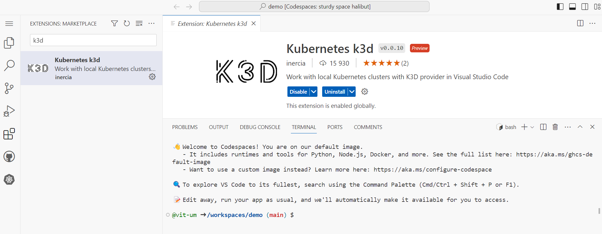 
4. В лівому меню обираємо іконку Kubernetes та створюємо кластер k3d 

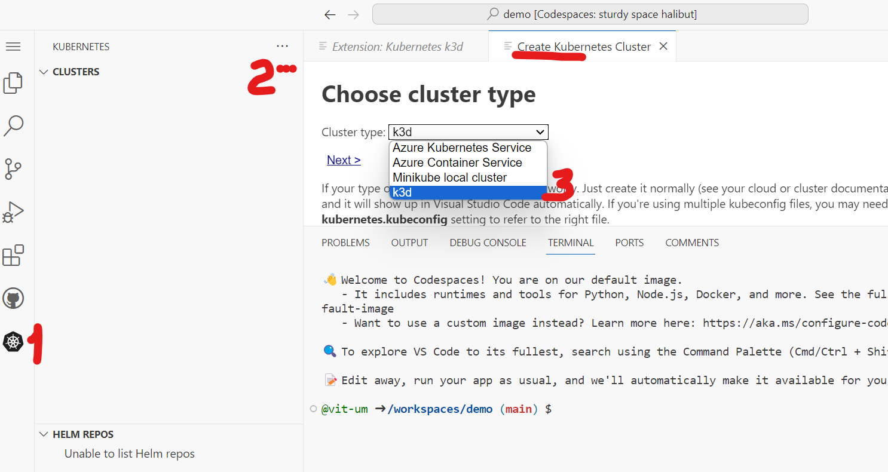  
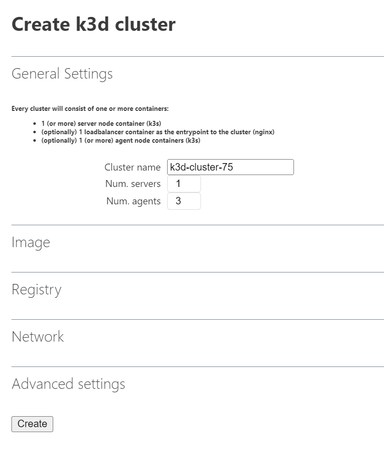  
В секції кластерів з'явився наш новостворений кластер.

5. Для початку роботи з кластером нам потрібні:
- мережевий доступ до API-серверу  
- утиліта `kubectl`  
- конфігураційний файл з параметрами доступу на аутентифікацією  

Кожен дистрибутив за замовчуванням включає в пакеті `kubectl` та після інсталяції генерує конфігураційний файл в домашньому каталозі. Відкриємо конфігураційний файл командою `code ~/.kube/config` в терміналі.  

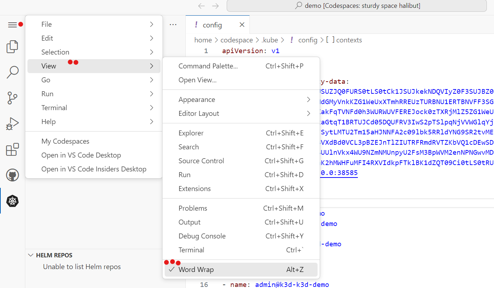

Конфігураційний файл Kubernetes використовується для організації інформації про:
- кластери  
- користувачів  
- простори імен  
- механізми аутентифікації 

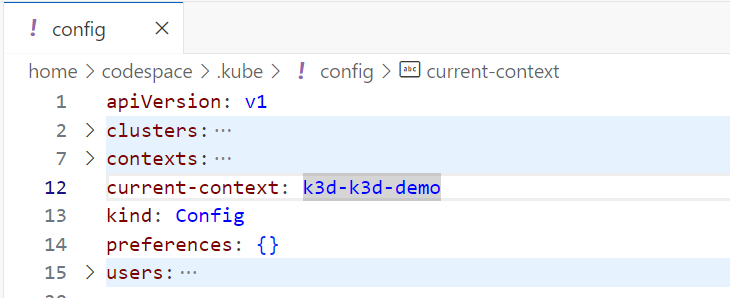

`kubectl` використовує файл конфігурації для пошуку інформації необхідної для вибору кластера та для комунікацією з API-сервером 

`context:` - розділ в конфігураційному файлі що використовується для групування параметрів доступу під зручною назвою. Кожен контекст має три параметри (кластер, простір імен, користувач): 
```yaml
contexts:
- context:
    cluster: k3d-k3d-demo
    namespace: kube-system
    user: admin@k3d-k3d-demo
  name: k3s
current-context: k3s
kind: Config
preferences: {}
```
Коли буде багато кластерів в системі, цей файл робить дуже зручним переключення контексту.

6. Управління кластером та переключення контексту:  
- команда отримання поточного контексту: 
```bash
$ kubectl config current-context
k3d-k3d-demo
```
- налаштування контексту для дефолтного контексту
```bash
$ kubectl config set-context --current --namespace kube-system
Context "k3d-k3d-demo" modified.
```
- переключення на контекст 
```bash
$ kubectl config use-context k3s
Switched to context "k3s".
```

7. Псевдонім для kubectl та авто доповнення 
```bash
$ alias k=kubectl
$ k completion -h
  # Installing bash completion on Linux
  ## If bash-completion is not installed on Linux, install the 'bash-completion' package
  ## via your distribution's package manager.
  ## Load the kubectl completion code for bash into the current shell
  source <(kubectl completion bash)
  ## Write bash completion code to a file and source it from .bash_profile
  kubectl completion bash > ~/.kube/completion.bash.inc
  printf "
  # kubectl shell completion
  source '$HOME/.kube/completion.bash.inc'
  " >> $HOME/.bash_profile
  source $HOME/.bash_profile

$ source <(kubectl completion bash)
```
Тепер за допомогою подвійної табуляції ми отримаємо перелік команд та їхніх опцій 
```bash
 $ kubectl 
annotate       (Update the annotations on a resource)
api-resources  (Print the supported API resources on the server)
api-versions   (Print the supported API versions on the server, in the form of "group/version")
apply          (Apply a configuration to a resource by file name or stdin)
attach         (Attach to a running container)
auth           (Inspect authorization)
autoscale      (Auto-scale a deployment, replica set, stateful set, or replication controller)
certificate    (Modify certificate resources)
cluster-info   (Display cluster information)
completion     (Output shell completion code for the specified shell (bash, zsh, fish, or powershell))
config         (Modify kubeconfig files)
cordon         (Mark node as unschedulable)
cp             (Copy files and directories to and from containers)
create         (Create a resource from a file or from stdin)
debug          (Create debugging sessions for troubleshooting workloads and nodes)
delete         (Delete resources by file names, stdin, resources and names, or by resources and label selector)
describe       (Show details of a specific resource or group of resources)
diff           (Diff the live version against a would-be applied version)
drain          (Drain node in preparation for maintenance)
edit           (Edit a resource on the server)
events         (List events)
exec           (Execute a command in a container)
explain        (Get documentation for a resource)
expose         (Take a replication controller, service, deployment or pod and expose it as a new Kubernetes service)
get            (Display one or many resources)
help           (Help about any command)
kustomize      (Build a kustomization target from a directory or URL)
label          (Update the labels on a resource)
logs           (Print the logs for a container in a pod)
options        (Print the list of flags inherited by all commands)
patch          (Update fields of a resource)
plugin         (Provides utilities for interacting with plugins)
port-forward   (Forward one or more local ports to a pod)
proxy          (Run a proxy to the Kubernetes API server)
replace        (Replace a resource by file name or stdin)
rollout        (Manage the rollout of a resource)
run            (Run a particular image on the cluster)
scale          (Set a new size for a deployment, replica set, or replication controller)
set            (Set specific features on objects)
taint          (Update the taints on one or more nodes)
top            (Display resource (CPU/memory) usage)
uncordon       (Mark node as schedulable)
version        (Print the client and server version information)
wait           (Experimental: Wait for a specific condition on one or many resources)
```
Шоб авто доповнення працювало з аліасом виконаємо наступну команду:  
```bash
$ source <(kubectl completion bash|sed s/kubectl/k/g)
```

8. Перевірити чи все гаразд з налаштуванням доступу до кластеру можна командою:  
```bash
$ k version
Client Version: v1.28.3
Kustomize Version: v5.0.4-0.20230601165947-6ce0bf390ce3
Server Version: v1.27.4+k3s1
``` 
Команда поверне статус локального клієнта та віддаленого серверу. 

9. Команда що поверне статус контролер менеджера та планувальника  
```bash
$ k get componentstatuses 
Warning: v1 ComponentStatus is deprecated in v1.19+
NAME                 STATUS    MESSAGE   ERROR
controller-manager   Healthy   ok        
etcd-0               Healthy             
scheduler            Healthy   ok        
```
10. Наступна команда виведе інформацію про всі ноди або поди в кластері. Або ж всі активні об'єкти кластеру
```bash
$ k get nodes
NAME                    STATUS   ROLES                  AGE   VERSION
k3d-k3d-demo-server-0   Ready    control-plane,master   62m   v1.27.4+k3s1
k3d-k3d-demo-agent-2    Ready    <none>                 61m   v1.27.4+k3s1
k3d-k3d-demo-agent-1    Ready    <none>                 61m   v1.27.4+k3s1
k3d-k3d-demo-agent-0    Ready    <none>                 61m   v1.27.4+k3s1

$ k get pod
NAME                                     READY   STATUS      RESTARTS   AGE
coredns-77ccd57875-rv8l5                 1/1     Running     0          67m
local-path-provisioner-957fdf8bc-2zzk5   1/1     Running     0          67m
helm-install-traefik-crd-6wpnt           0/1     Completed   0          67m
helm-install-traefik-r4vhg               0/1     Completed   0          67m
svclb-traefik-5cef1c57-sqlbk             2/2     Running     0          67m
svclb-traefik-5cef1c57-5c8ss             2/2     Running     0          67m
svclb-traefik-5cef1c57-hnjxh             2/2     Running     0          67m
svclb-traefik-5cef1c57-jmtw8             2/2     Running     0          67m
metrics-server-648b5df564-8zjqs          1/1     Running     0          67m
traefik-64f55bb67d-zkgkb                 1/1     Running     0          67m

$ k get all -A
NAMESPACE     NAME                                         READY   STATUS      RESTARTS   AGE
kube-system   pod/coredns-77ccd57875-rv8l5                 1/1     Running     0          69m
kube-system   pod/local-path-provisioner-957fdf8bc-2zzk5   1/1     Running     0          69m
kube-system   pod/helm-install-traefik-crd-6wpnt           0/1     Completed   0          69m
kube-system   pod/helm-install-traefik-r4vhg               0/1     Completed   0          69m
kube-system   pod/svclb-traefik-5cef1c57-sqlbk             2/2     Running     0          69m
kube-system   pod/svclb-traefik-5cef1c57-5c8ss             2/2     Running     0          69m
kube-system   pod/svclb-traefik-5cef1c57-hnjxh             2/2     Running     0          69m
kube-system   pod/svclb-traefik-5cef1c57-jmtw8             2/2     Running     0          69m
kube-system   pod/metrics-server-648b5df564-8zjqs          1/1     Running     0          69m
kube-system   pod/traefik-64f55bb67d-zkgkb                 1/1     Running     0          69m

NAMESPACE     NAME                     TYPE           CLUSTER-IP      EXTERNAL-IP                                   PORT(S)                      AGE
default       service/kubernetes       ClusterIP      10.43.0.1       <none>                                        443/TCP                      70m
kube-system   service/kube-dns         ClusterIP      10.43.0.10      <none>                                        53/UDP,53/TCP,9153/TCP       70m
kube-system   service/metrics-server   ClusterIP      10.43.123.171   <none>                                        443/TCP                      70m
kube-system   service/traefik          LoadBalancer   10.43.102.234   172.19.0.2,172.19.0.3,172.19.0.4,172.19.0.5   80:31307/TCP,443:31129/TCP   69m

NAMESPACE     NAME                                    DESIRED   CURRENT   READY   UP-TO-DATE   AVAILABLE   NODE SELECTOR   AGE
kube-system   daemonset.apps/svclb-traefik-5cef1c57   4         4         4       4            4           <none>          69m

NAMESPACE     NAME                                     READY   UP-TO-DATE   AVAILABLE   AGE
kube-system   deployment.apps/coredns                  1/1     1            1           70m
kube-system   deployment.apps/local-path-provisioner   1/1     1            1           70m
kube-system   deployment.apps/metrics-server           1/1     1            1           70m
kube-system   deployment.apps/traefik                  1/1     1            1           69m

NAMESPACE     NAME                                               DESIRED   CURRENT   READY   AGE
kube-system   replicaset.apps/coredns-77ccd57875                 1         1         1       69m
kube-system   replicaset.apps/local-path-provisioner-957fdf8bc   1         1         1       69m
kube-system   replicaset.apps/metrics-server-648b5df564          1         1         1       69m
kube-system   replicaset.apps/traefik-64f55bb67d                 1         1         1       69m

NAMESPACE     NAME                                 COMPLETIONS   DURATION   AGE
kube-system   job.batch/helm-install-traefik-crd   1/1           26s        70m
kube-system   job.batch/helm-install-traefik       1/1           28s        70m
``` 

## Coding Session. ArgoCD
В цьому розділі буде розглянуто набір інструментів для розгортання застосунків будь якої складності. Почнемо з підготовленого [репозиторію](https://github.com/vit-um) та напишемо трохи коду для автоматизації всього процесу `CI` від білда до артефакту. Після цього у нас виникають ще варіанти інструментів для етапу `CD`  

Delivery ми організуємо за моделлю `pull` або втягування змін з репозиторію. Виберемо підхід "one application - one cluster", тоб-то для кожного додатку буде взятий один окремий кластер. З цією метою використаємо "single host kubernetes cluster" А в якості системи Delivery та Deploy на тестове оточення виберемо [ArgoCD](https://argo-cd.readthedocs.io/en/stable/).  

  

`ArgoCD` реалізує підхід GitOps використовуючи репозиторій Git як джерело істини для визначення бажаного стану програми. Маніфести Kubernetes можна вказувати кількома способами:  
- [kustomize](https://kustomize.io/) applications  
- [helm](https://helm.sh/) charts
- [jsonnet](https://jsonnet.org/) files
- Plain directory of YAML/json manifests  

Навчальний матеріал для поглиблення знань про [ArgoCD](https://youtu.be/MeU5_k9ssrs). На відміну такого інструменту CD як [Jenkins](https://www.jenkins.io/) ArgoCD є частиною Kubernetes кластеру та перехоплює на себе частину функціоналу Jenkins в загальному потоці Continuos Delivery, перетворюючи його фактично на `Continuous Deployment` (автоматичне розгортання).  

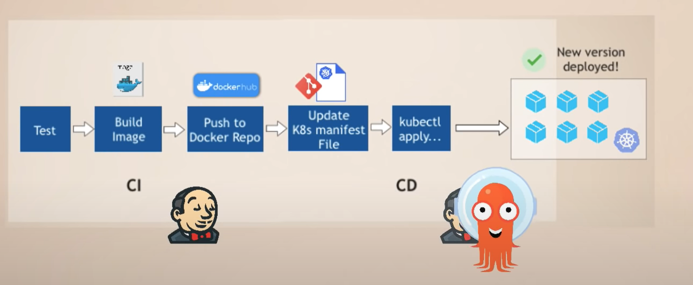

`Continuous Deployment:` Це розширення Continuous Delivery, при якому автоматизація розгортання йде ще далі. Під час Continuous Deployment будь-який успішний білд автоматично розгортається в продуктивному середовищі без необхідності людського втручання. Це означає, що нова версія програмного забезпечення автоматично стає доступною користувачам.

Гарною практикою для ArgoCD є рознесення на різні репозиторії вихідного кода розробки та файлів конфігурації для Kubernetes: 

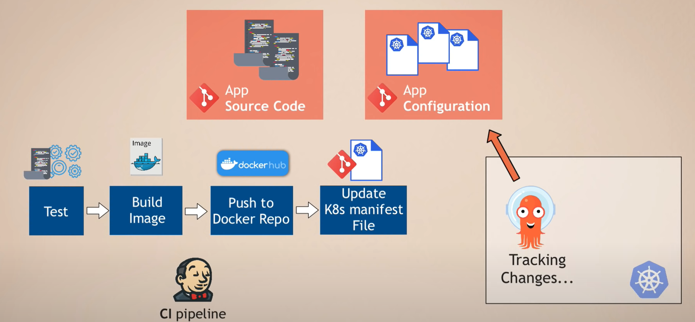 

В разі внесення якихось змін в репозиторії з конфігураційними файлами ініційованими або DevOps інженером або в наслідок автоматичних процесів на етапі розробки ПЗ а ArgoCD виявить їх та за заданим алгоритмом синхронізує з продуктовою версією застосунків.

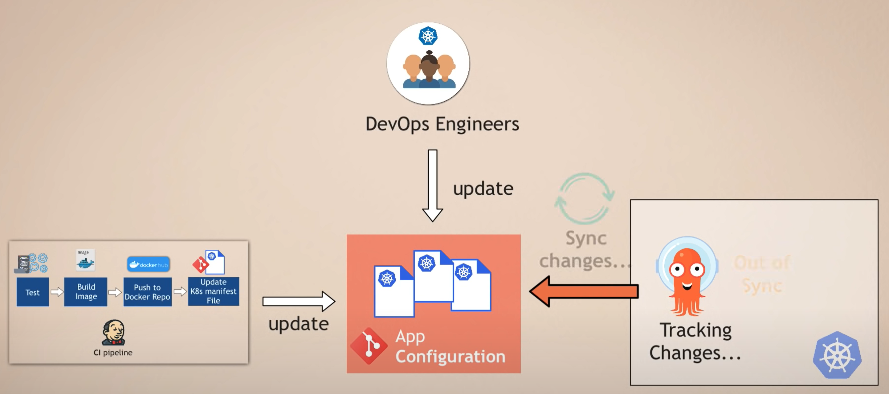 

Таким чином ми маємо умовне розщеплення процесів CI та CD

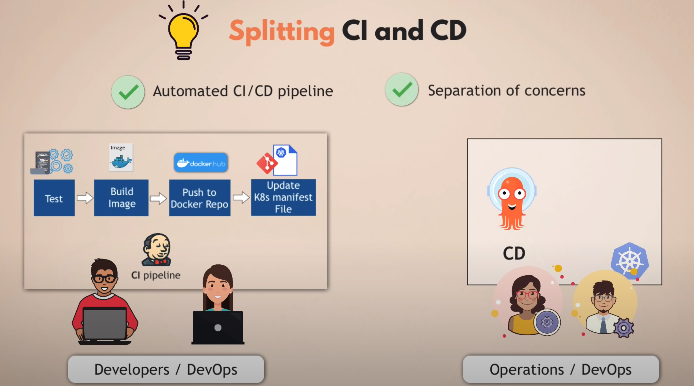 

В разі якщо хтось внесе зміни в конфігурацію Kubernetes напряму, то ArgoCD виявить це порушення, зробить оповіщення та відкотить зміни до версії конфігурації, що є в репозиторії. 

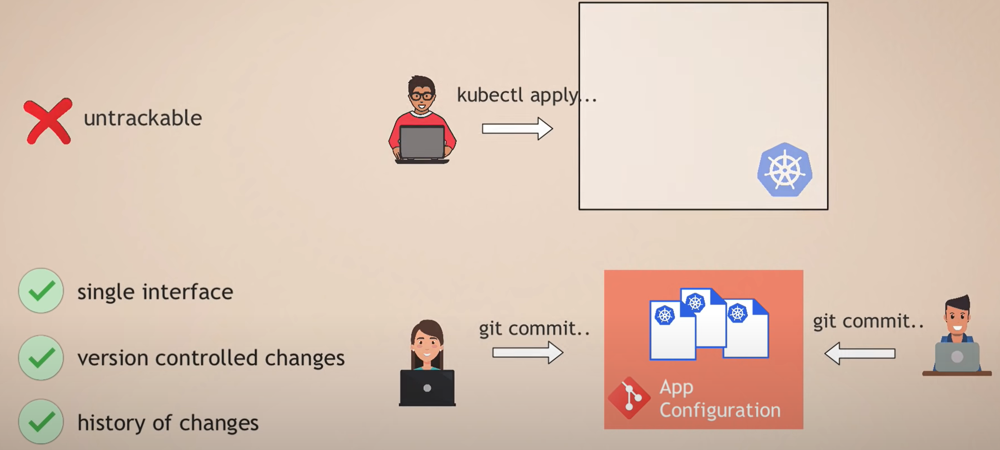  

`ArgoCD`- це контролер Kubernetes який безперервно відстежує запущені додатки та порівнює поточний стан з бажаним. Деплоймент поточній стан якого відрізняється від цільового вважається `out of sync` ArgoCD інформує та візуалізує відмінності надаючи можливості для автоматичної або ручної синхронізації бажаного стану. 


1. Підготуємо в окремий локальний кластер для встановлення ArgoCD. Налаштуємо його:  
```bash
$ k3d cluster create argo
... 
INFO[0029] Cluster 'argo' created successfully!         
INFO[0029] You can now use it like this: kubectl cluster-info

$ kubectl cluster-info
Kubernetes control plane is running at https://0.0.0.0:43297
CoreDNS is running at https://0.0.0.0:43297/api/v1/namespaces/kube-system/services/kube-dns:dns/proxy
Metrics-server is running at https://0.0.0.0:43297/api/v1/namespaces/kube-system/services/https:metrics-server:https/proxy

$ k version
$ k get all -A
```
2. Інсталяція 
ArgoCD можна встановити за допомогою `Helm`, але зараз використаємо скрипт з офіційного репозиторію [ArgoCD](https://argo-cd.readthedocs.io/en/stable/#quick-start) Спочатку створимо неймспейс в якому буде встановлено систему, потім скористаємось скриптом (маніфестом) для інсталяції та перевіримо стан системи після встановлення:     
```bash
$ kubectl create namespace argocd
namespace/argocd created

$ k get ns
NAME              STATUS   AGE
kube-system       Active   80m
default           Active   80m
kube-public       Active   80m
kube-node-lease   Active   80m
argocd            Active   28s

$ kubectl apply -n argocd -f https://raw.githubusercontent.com/argoproj/argo-cd/stable/manifests/install.yaml

$ k get all -n argocd

# перевіримо статус контейнерів: 
$ k get pod -n argocd -w
NAME                                                READY   STATUS    RESTARTS   AGE
argocd-redis-b5d6bf5f5-sqlgw                        1/1     Running   0          3m41s
argocd-notifications-controller-589b479947-fm4kp    1/1     Running   0          3m41s
argocd-applicationset-controller-6f9d6cfd58-9rvjf   1/1     Running   0          3m41s
argocd-dex-server-6df5d4f8c4-nd829                  1/1     Running   0          3m41s
argocd-application-controller-0                     1/1     Running   0          3m40s
argocd-server-7459448d56-xnrvf                      1/1     Running   0          3m40s
argocd-repo-server-7b75b45897-qsw9z                 1/1     Running   0          3m41s
```
3. Отримаємо доступ до інтерфейсу ArgoCD GUI 
[Отримати доступ](https://argo-cd.readthedocs.io/en/stable/getting_started/#3-access-the-argo-cd-api-server) можна в два шляхи:  
- Service Type Load Balancer  
- Ingress  
- Port Forwarding 

Скористаємось `Port Forwarding` за допомогою локального порта 8080. В команді ми посилаємось на сервіс `svc/argocd-server` який знаходиться в namespace `-n argocd`. Kubectl автоматично знайде endpoint сервісу та встановить переадресацію портів з локального порту 8080 на віддалений 443 
```bash
$ kubectl port-forward svc/argocd-server -n argocd 8080:443&
[1] 23820
Forwarding from 127.0.0.1:8080 -> 8080
Forwarding from [::1]:8080 -> 8080
Handling connection for 8080
```
ArgoCD за замовчуванням працює з https тому при спробі відкрити [127.0.0.1:8080](https://127.0.0.1:8080/) ми отримаємо помилку сертифікати. Отже в продуктивній системі потрібно встановлювати сертифікати та налаштовувати ці моменти. 

4. Отримання паролю 
Використаємо команду для отримання паролю, вкажемо файл сікрету `argocd-initial-admin-secret` а також формат  виводу `jsonpath="{.data.password}"`. Це поверне нам base64 закодований пароль, після чого використаємо команду `base64 -d` для повернення паролю в простий текст. Отриманий пароль та логін `admin` вводимо в Web-інтерфейс ArgoCD   
```bash
$ k -n argocd get secret argocd-initial-admin-secret -o jsonpath="{.data.password}"
cFZIWTM3eFpJR3hDeUxLNQ==#                                                                                                        
$ k -n argocd get secret argocd-initial-admin-secret -o jsonpath="{.data.password}"|base64 -d;echo
pVHY37xZIGxCyLK5
```
5. Створимо додаток за допомогою графічного інтерфейсу. 
Тепер налаштовані в ArgoCD додатки будуть автоматично встановлюватись на оновлятись в Kubernetes. 
- Натискаємо `+ NEW APP` 
- Вводимо ім'я додатку `demo`
- Проект до якого належить додаток оберемо `за замовчуванням`
- Тип синхронізації залишаємо `Manual`
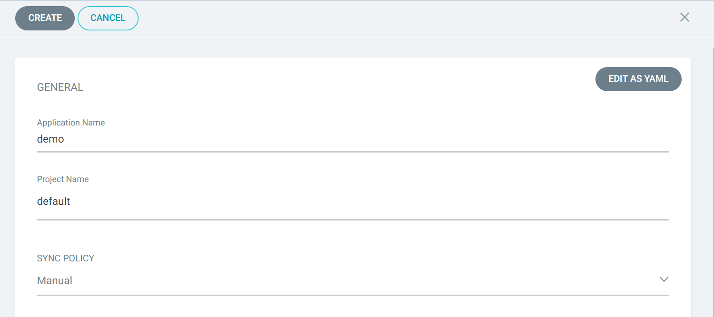  
- У розділі `SOURCE` тип джерела залишаємо за замовчуванням `GIT`
- Введемо `url` репозиторію, який містить маніфести для розгортання https://github.com/vit-um/go-demo-app (це буде helm charts, або пакет маніфестів який являє собою групу об'єктів для Kubernetes та нашого додатку)
- У полі `Path` введемо шлях до каталогу `helm`  
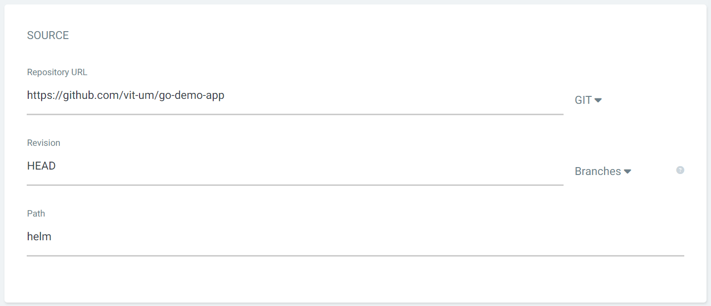  
- В розділі `DESTINATION` вкажемо `url` локального кластеру та `Namespace` demo після чого ArgoCD автоматично визначить параметри додатку використавши маніфести, які знаходяться в репозиторії. В разі бажання змінити значення вручну можна змінити іх значення в розділі `PARAMETERS`.  
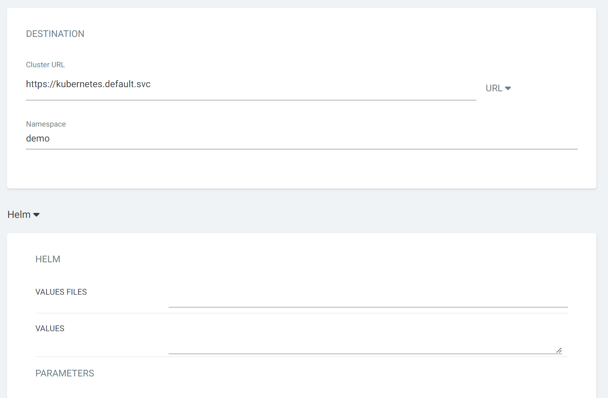  
- У розділі політика синхронізація вкажемо як додаток буде синхронізуватись з репозиторієм. Тут важливо вказати ArgoCD щоб створив новий namespace так як в helm цю функцію за замовчуванням прибрали. Ставимо галку напроти `AUTO-CREATE NAMESPACE`   
- Створюємо додаток кнопкою `CREATE`  
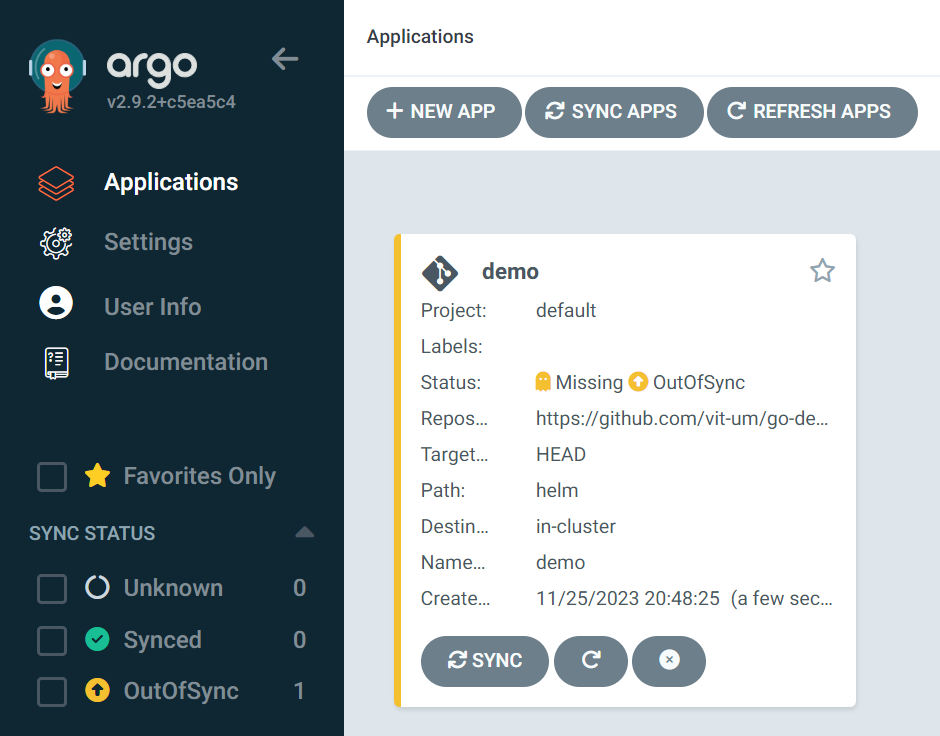  

6. Переглянемо деталі розгорнутого застосунку натиснувши на нього в списку.  
Графічний інтерфейс надає ієрархічне уявлення про компоненти програми, їх розгортання та поточний стан у кластері. 

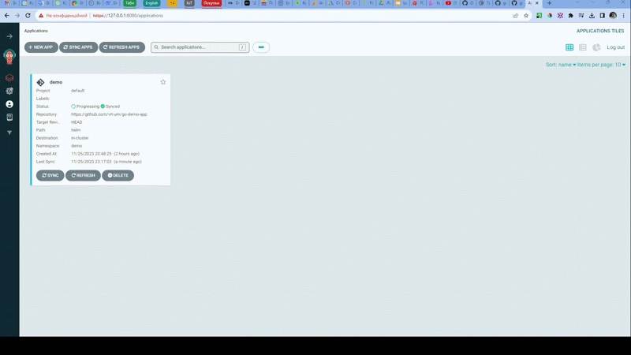  

7. Синхронізація застосунку 
- Для цього у вікні відомостей про програму натискаємо кнопку `SYNC` 
- Праворуч вискакує вікно в якому потрібно обрати компоненти та режими синхронізації та натиснути кнопку `SYNCHRONIZE`  
- Після завершення процесу можемо перевірити правильність розгортання програми, перевіривши її статус у кластері:  

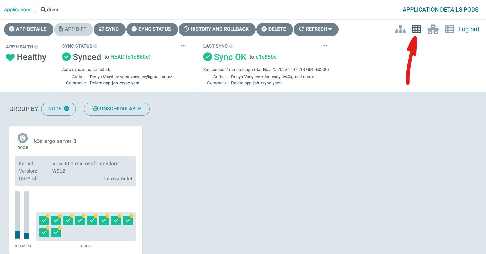  

8. Прослідкуємо за реакцією ArgoCD на зміни в репозиторію.
- Змінимо в файлі репозиторію https://github.com/vit-um/go-demo-app/blob/master/helm/values.yaml тип шлюзу з `NodePort` на `LoadBalancer` (останній рядок файлу)  

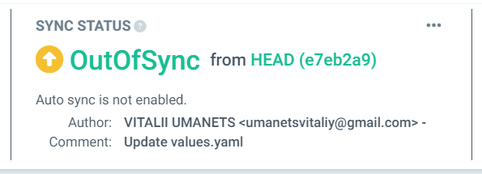

```bath
$ k get svc -n demo
NAME               TYPE        CLUSTER-IP      EXTERNAL-IP   PORT(S)                                                 AGE
demo-nats          ClusterIP   None            <none>        4222/TCP,6222/TCP,8222/TCP,7777/TCP,7422/TCP,7522/TCP   31m
demo-front         ClusterIP   10.43.247.92    <none>        80/TCP                                                  31m
cache              ClusterIP   10.43.234.48    <none>        6379/TCP                                                31m
ambassador         NodePort    10.43.190.212   <none>        80:30092/TCP                                            31m
```
- Викликаний процес синхронізації отримає останню версію репозиторію гіт та порівняє її з поточним станом. Таким чином бачимо що тип сервісу для ambassador змінився з NodePort на LoadBalancer та відповідно був оновлений маніфест Kubernetes
```bath
$ NAME               TYPE           CLUSTER-IP      EXTERNAL-IP   PORT(S)             AGE
ambassador         LoadBalancer   10.43.190.212   <pending>     80:30092/TCP          35m
```

9. Перевіряємо роботу застосунку.
- повернемо на всяк випадок репозиторій у первинний стан
- Переадресуємо порти наступною командою:
```bash
$ k port-forward -n demo svc/ambassador 8081:80
Forwarding from 127.0.0.1:8081 -> 80
Forwarding from [::1]:8081 -> 80
Handling connection for 8081
Handling connection for 8081
```
- в іншому вікні терміналу зробимо запит на вказаний порт та отримаємо відповідь у вигляді версії додатку:  
```bash
$ curl localhost:8081
k8sdiy-api:599e1af#       
```
- Завантажимо довільну картинку та завантажимо її в наш застосунок  
```bash
wget -O /tmp/g.png https://img2.gratispng.com/20180406/xhq/kisspng-computer-icons-house-window-blinds-shades-brookl-adress-5ac7dd63724750.6622363615230477794681.jpg

curl -F 'image=@g.png' localhost:8081/img/
```
- Отримаємо результат прямо в консолі:  

  
