## GIT: контроль змін
Система контролю версій GIT -  це `розподілена` система керування версіями, яка дозволяє кільком розробникам працювати над одним проєктом одночасно. Була розроблена Лінусом Торвальдсом у 2005 році.

Після встановлення Git SCM (Source code manager) тоб-то локального термінального клієнта GITa існують два обов'язкові кроки його налаштування:    
```bash
git config --global user.name "Vitalii Umanets"
git config --global user.email "vit@i.ua"
```
В уже налаштованому гіті перевірити значення ключа можна командами
```bash
git config --global user.email 
git config --global -l
```
Файл конфігурації буде зберігатись в вашій домашній директорії, тому за потреби щось змінити можемо це зробити прямим редагуванням цього файлу.
Тека гіта на локальному сховищі має наступну структуру:  
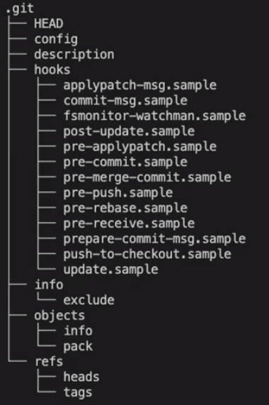  
Щоб редагувати файли конфігурації гід відразу в VSCode потрібно в налаштуваннях `Ctr + Shift + P` прибрати виключення для відображення файлів git, ось так:
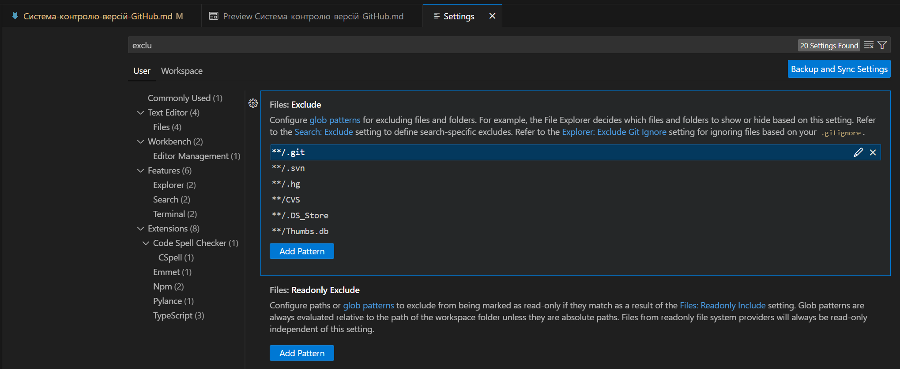
- Гіт надає запуску скриптів при виконанні певних подій, такі дії називається Хуками. 
Приклади вже робочих скриптів знаходяться в теці `.git/hooks`  Якщо потрібно буде скористатись одним з таких скрипів, то достатньо буде його перейменувати, прибравши суфікс `sample`  
Git - це контентно-адресована система: сховище - ключ - значення

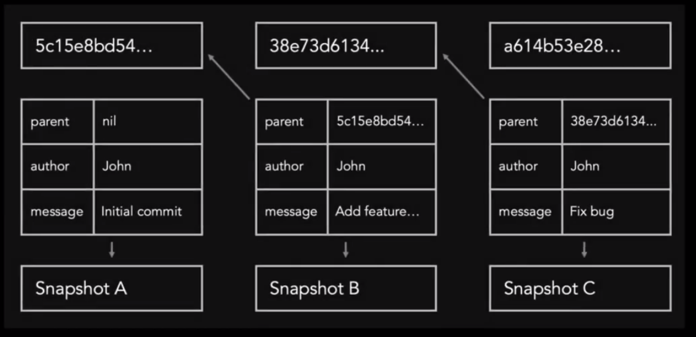

Три основні складові:
- Сам об'єкт коміта, або blob  (binary Large Object), 
- дерево, 
- сам commit

## Практичне завдання до лекції  

```bash
mkdir new-project  
cd new-project  
git init  
cat "init" > README.md  
git add README.md  
git commit -m "init"
# наступна команда використовується для перейменування поточної гілки в Git.
git branch -M main 
# Створюємо нову гілку та переходимо до неї:
git checkout -b development
nano README.md
git add .
git commit -m "Add instruction to README.md"
# Повертаємось на основну гілку 
git checkout main
# Об'єднуємо зміни з гілки "development" у гілку "main" в репозиторії Git
git merge development
# Підключаємо віддалений репозиторій: 
git remote add origin https://github.com/vit-um/new-project.git
# Заливаємо в нього дані
git push
```

## Git зсередини

1. Команда hash-object
Ця команда створює новий blob об'єкт з вмістом "Hello, World!" та повертає його хеш-ідентифікатор  
```bash
 echo "Hello, World!" | git hash-object -w --stdin 
 8ab686eafeb1f44702738c8b0f24f2567c36da6d
```
[Алгоритм хешування](https://emn178.github.io/online-tools/sha1.html) генерує 160 бітове значення, або дайжест повідомлення, яке зазвичай відображається як шістнадцяткове число в 40 символів.

Опція -w каже команді не просто повернути хеш, але й зробити запис в базі гіт. Відкриємо каталог object та знайдемо об'єкт що ми щойно створили:  
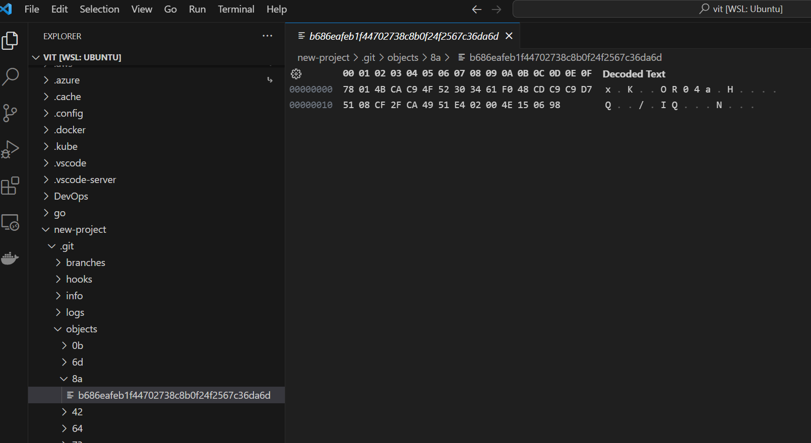  
Перші два символи хешу означають каталог де буде зберігатись об'єкт, а решта 38 його ім'я.

2. Існує зворотня команда `git cat-file`, що поверне контент збереженого в базі об'єкту:  
```bash
git cat-file -p 8ab686eafeb1f44702738c8b0f24f2567c36da6d
Hello, World!

# Збережемо значення хеш створеного об'єкту в змінну `h0`

h0=8ab686eafeb1f44702738c8b0f24f2567c36da6d

echo $h0
8ab686eafeb1f44702738c8b0f24f2567c36da6d
```

Так само ми можемо створити файл та внести його до бази даних гіт:
```bash
touch file
echo "version 1" > file

git hash-object -w file
83baae61804e65cc73a7201a7252750c76066a30

git cat-file -p 83baae61804e65cc73a7201a7252750c76066a30
version 1

h1=83baae61804e65cc73a7201a7252750c76066a30
```

А тепер змінимо вміст файлу та збережемо відразу в змінну `h2` значення хешу: 
```bash
echo "version 2" > file

h2=$(git hash-object -w file)

echo $h2
1f7a7a472abf3dd9643fd615f6da379c4acb3e3a
```
Тепер обидві версії файлів знаходяться в нашій базі і ми можемо звертатись до кожного з них окремо. 

3. Перевірка статусу файлів в системі. Команда `git fsck`  
```bash
$ git fsck
Checking object directories: 100% (256/256), done.
dangling blob 83baae61804e65cc73a7201a7252750c76066a30
dangling blob 8ab686eafeb1f44702738c8b0f24f2567c36da6d
dangling blob 1f7a7a472abf3dd9643fd615f6da379c4acb3e3a

$ git cat-file -p $h0
Hello, World!

$ git cat-file -p $h1
version 1
$ git cat-file -p $h2
version 2

$ git status
On branch main
Your branch is up to date with 'origin/master'.
Untracked files:
  (use "git add <file>..." to include in what will be committed)
        file
nothing added to commit but untracked files present (use "git add" to track)

```
От же ми бачимо 3 блоби, тоб-то три великих бінарні об'єкти, а назву файлу взагалі втратили. Для зберігання імен файлів в гіт існують *дерева*, вони зберігають як імена так і групи файлів. За командою `git status` система знаходить файл та визначає його як той, що не відслідковується. Символ `U` 

4. Щоб почати відслідковувати файл його потрібно додати до індексу наступною командою:  
```bash
git update-index --add --cacheinfo 100644 $h1 file

# 100644 - режим дозволу
# $h1 - об'єкт 
# file - назва файлу 

# наступна команда додасть всі зміни щи ми робили у файлі до індексу: 
git update-index --add file


```
Індекс Git - це структура даних, що містить інформацію про файли в робочій директорії та їх стан
Зверніть увагу як змінився статус файлу, символ `M` - модифікований 

5. Команда для відслідковування змін `git diff`:  

```bash
$ git diff
diff --git a/file b/file
index 83baae6..1f7a7a4 100644
--- a/file
+++ b/file
@@ -1 +1 @@
-version 1
+version 2
```

6. Переглянемо список файлів, що знаходяться в індексі командою `ls-files`  

```bash
$ git ls-files
file

$ git ls-files -s
100644 83baae61804e65cc73a7201a7252750c76066a30 0       file

$ git cat-file -p 83baae61804e65cc73a7201a7252750c76066a30
version 1

$ git fsck
Checking object directories: 100% (256/256), done.
dangling blob 8ab686eafeb1f44702738c8b0f24f2567c36da6d
dangling blob 1f7a7a472abf3dd9643fd615f6da379c4acb3e3a
```
Як бачимо команда перевірки статусу файлів в системі вже повернула два файли, котрі не були додані до індексу.

7. Команда видалення файлу з індексу (пропускаємо цей крок для досягнення мети послідовності інших команд)
```bash
$ git update-index --remove file
$ git fsck
Checking object directories: 100% (256/256), done.
dangling blob 83baae61804e65cc73a7201a7252750c76066a30
dangling blob 8ab686eafeb1f44702738c8b0f24f2567c36da6d

$ git status
On branch main
Your branch is up to date with 'origin/master'.

Changes to be committed:
  (use "git restore --staged <file>..." to unstage)
        new file:   file
```
Що цікаво команда не повертає файл в попередній статус, він позначається літерою `A`, тоб-то added (додано до індексу)

8. Команда `write-tree` створює новий об'єкт зі списком файлів та директорій що знаходяться в індексі гіт та повертає його хеш ідентифікатор:  
```bash
$ git write-tree
9ed102af7f5da20bd741ade156b15d4f3d958ea9

$ git cat-file -p 9ed102af7f5da20bd741ade156b15d4f3d958ea9
100644 blob 83baae61804e65cc73a7201a7252750c76066a30    file

$ git cat-file -p 83baae61804e65cc73a7201a7252750c76066a30
version 1

$ git cat-file -t 9ed102af7f5da20bd741ade156b15d4f3d958ea9
tree

$ t1=9ed102af7f5da20bd741ade156b15d4f3d958ea9

# додамо всі зміни до індексу
$ git update-index --add file
# збережемо хеш нового дерева
$ t2=$(git write-tree)
$ git status
On branch main
Your branch is up to date with 'origin/master'.

Changes to be committed:
  (use "git restore --staged <file>..." to unstage)
        new file:   file
$ git cat-file -p $t2
100644 blob 1f7a7a472abf3dd9643fd615f6da379c4acb3e3a    file

$ git cat-file -p 1f7a7a472abf3dd9643fd615f6da379c4acb3e3a
version 2

$ mkdir dir
$ cd dir
$ touch file &&  echo "version 3" > file
$ cd ..
$ h3=$(git hash-object -w dir/file)
# додамо до індексу створений файл та теку
$ git update-index --add dir/file
$ git status
On branch main
Your branch is up to date with 'origin/master'.

Changes to be committed:
  (use "git restore --staged <file>..." to unstage)
        new file:   dir/file
        new file:   file

# створимо третє дерево з вмістом цього індексу
$ t3=$(git write-tree)
$ echo $t3
89e3af87d252bc035416091fdebca3d885752bec
```
Дерева дуже схожі на спрощену файлову систему UNIX. Дерево зберігає структуру файлів та вирішує проблему з їх іменами.

9. Скористаємось командою `git show` аналогом команди `git cat-file`  
```bash
$ git show $t3
tree 89e3af87d252bc035416091fdebca3d885752bec

dir/
file
```
10. Зберігаємо зміни командою `commit`:  
```bash
$ echo -n 'init commit'|git commit-tree $t1
c52754ee946a625d7f14d0d702db1ca299c717ef
# Поглянемо як виглядає щойно створений об'єкт коміту
$ git show c52754ee946a625d7f14d0d702db1ca299c717ef
commit c52754ee946a625d7f14d0d702db1ca299c717ef
Author: Vitalii <vit@i.ua>
Date:   Fri Nov 10 22:36:24 2023 +0200

    init commit

diff --git a/file b/file
new file mode 100644
index 0000000..83baae6
--- /dev/null
+++ b/file
@@ -0,0 +1 @@
+version 1
# Збережемо хеш коміту в змінній c1
$ c1=c52754ee946a625d7f14d0d702db1ca299c717ef
# Зробимо наступні в змінні наступні коміти, зміни файлу та додавання директорії послідовно  
c2=$(echo -n 'update file to v2'|git commit-tree $t2 -p $c1)
c3=$(echo -n 'add file and dir'|git commit-tree $t3 -p $c2)
 
```
11. От же на попередньому кроці ми зв'язали послідовно всі коміти та отримали історію комітів, яка доступна для перегляду командою `git log`  
```bash
$ echo $c3
75eac3b85d65319af02f595a5c3ce1bc23149b49
$ echo $c2
30e1dcc0fc7312160648bd66416ddf9c30876360
$ echo $c1
c52754ee946a625d7f14d0d702db1ca299c717ef

$ git log --stat $c3
commit 75eac3b85d65319af02f595a5c3ce1bc23149b49
Author: Vitalii <vit@i.ua>
Date:   Fri Nov 10 22:55:42 2023 +0200

    add file and dir

 dir/file | 1 +
 1 file changed, 1 insertion(+)

commit 30e1dcc0fc7312160648bd66416ddf9c30876360
Author: Vitalii <vit@i.ua>
Date:   Fri Nov 10 22:54:54 2023 +0200

    update file to v2

 file | 2 +-
 1 file changed, 1 insertion(+), 1 deletion(-)

commit c52754ee946a625d7f14d0d702db1ca299c717ef
Author: Vitalii <vit@i.ua>
Date:   Fri Nov 10 22:36:24 2023 +0200

    init commit

 file | 1 +
 1 file changed, 1 insertion(+)

```

12. Розгалуження та теги
- Додамо значення першого коміту до файлу `.git/refs/heads/main`, або створимо першу й основну гілку розгалуження git, яка вказує на дерево першого коміту    

```bash
$ echo $c1 > .git/refs/heads/main
$ git show c52754ee946a625d7f14d0d702db1ca299c717ef
commit c52754ee946a625d7f14d0d702db1ca299c717ef (HEAD -> main)
Author: Vitalii <vit@i.ua>
Date:   Fri Nov 10 22:36:24 2023 +0200

    init commit

diff --git a/file b/file
new file mode 100644
index 0000000..83baae6
--- /dev/null
+++ b/file
@@ -0,0 +1 @@
+version 1
```
13. Звісно редагувати та додавати файли не потрібно, для цього є системна команда додавання коміту в гілку. Додамо послідовно історію комітів та подивимось як міняється вивід логів:  
```bash
$ git update-ref refs/heads/main $c1
$ git log
$ git update-ref refs/heads/main $c2
$ git log
$ git update-ref refs/heads/main $c3
$ git log
# Додамо розгалуження на інші гілки
$ echo $c2 > .git/refs/heads/fix
$ echo $c3 > .git/refs/heads/feature
# Зробимо тег для першого коміта
$ git update-ref refs/tags/v1.0.0 $c1
$ git show c52754ee946a625d7f14d0d702db1ca299c717ef
commit c52754ee946a625d7f14d0d702db1ca299c717ef (tag: v1.0.0)
Author: Vitalii <vit@i.ua>
Date:   Fri Nov 10 22:36:24 2023 +0200
# Альтернативною командою для створення тегів 
$ git tag v2.0.0 $c2
# До тегу можна додавати анотацію для детального пояснення його призначення. 
$ git tag v3.0.0 -m "add dir and file" $c3 
# Попрацюємо з гілками:
$ git switch 'feature'
$ git commit -am 'update version to 3'
$ git switch 'main'
$ git merge 'feature'


```
Візуально в VSCode історію комітів можна відслідковувати за допомогою додатка `git-graph` 
Тегі використовуються для знімків поточного стану системи для історії. 

### Контрольні запитання:
- У чому різниця між `Git pull` і `Git fetch`?  
Оби дві команди використовуються для оновлення локальної копії репозиторію з віддаленого репозиторію.   
`git pull:`   
Використовується для отримання змін з віддаленого репозиторію та об'єднання їх з поточним робочим каталогом.
Автоматично виконує команду `git fetch`, а потім об'єднує зміни з поточним гілковим станом (`git merge` або `git rebase`, в залежності від конфігурації).  
`git fetch:`  
Отримує дані з віддаленого репозиторію, але не зливає їх із поточним робочим каталогом або гілкою.
Завантажені зміни можна переглянути, а потім вручну вирішити, як їх об'єднати.  
- Що таке `Git submodule`?   
Git Submodule дозволяє включати та управляти іншими репозиторіями в структурі вашого основного проекту, що може бути корисним, наприклад, коли вам потрібно використовувати зовнішню бібліотеку чи компонент.
- Для чого потрібен `Git cherry-pick`?  
`git cherry-pick` - це команда в Git, яка дозволяє застосовувати коміти з одного гілкового стовпчика до іншого. В основному, ця команда використовується для витягування конкретних комітів із однієї гілки та застосування їх до іншої гілки. Це може бути корисно в різних сценаріях розробки.  
- Що таке `Git stash`?  
`git stash` - команда дозволяє тимчасово приховати зміни в робочому каталозі, щоб ви могли переключитися на іншу гілку або виконати інші операції без необхідності фіксації змін.  
- У чому різниця між `Git reset` і `Git revert`?  
`git reset` використовується для скасування комітів і перенесення гілки на певний коміт або на коміт перед ним. При цьому вся історія комітів після вказаного коміту буде втрачена.  
`git revert` використовується для створення нового коміту, який відміняє ефекти попередніх комітів. Замість того, щоб видалити коміти з історії, вона створює новий коміт, який вносить зміни, які скасовують зміни в попередніх комітах.  
- Для чого використовується `Git reflog`?  
Використовується для перегляду історії руху по гілках та посиланнях (refs) у вашому репозиторії. Назва "reflog" є скороченням від "reference log" або "ref log".  
- У чому різниця між Git merge та Git rebase?  
Різниця між ними полягає в тому, як вони модифікують історію комітів. git merge створює додатковий коміт злиття, в той час як git rebase переносить існуючі коміти на новий кріплений гілковий стовпчик. Git merge об'єднує зміни з однієї гілки в іншу, в той час як Git rebase переписує історію комітів Git, щоб застосувати зміни до іншої бази    

### Завдання на увагу до деталей:  

```bash
$ mkdir new && cd new
$ git init
Initialized empty Git repository in /home/vit/new/.git/
$ touch challenge.txt
$ echo "This is my Git challenge file" > challenge.txt
$ git hash-object -w challenge.txt > hash.txt
$ git cat-file -p $(cat hash.txt) >> hash.txt
$ git update-index --add challenge.txt
$ git ls-files -s >> hash.txt
$ cat hash.txt
```

## Git для DevOps
● git init - ініціалізує Git-репозиторій в каталозі проекту.  
● git add - додає змінені або нові файли до Git-індексу.  
● git commit - зберігає зміни в репозиторії з коментарем, що пояснює зміни.  
● git push - завантажує локальні зміни до віддаленого репозиторію.  
● git pull - отримує зміни з віддаленого репозиторію та зливає їх з локальними змінами.  
● git branch - показує список гілок репозиторію та дозволяє створювати нові гілки.  
● git merge - зливає зміни з однієї гілки в іншу.  
● git checkout - переключається між гілками або комітами.  
● git clone - копіює віддалений репозиторій на локальний комп'ютер.  
● git stash - зберігає незакомічені зміни на час виконання інших операцій.  

## GitHub: репозиторії
Існує два варіанти початку роботи з репозиторієм:
- `git init` на локальному комп'ютері
- через інтерфейс `GitHub` і це вже буде віддалений репозиторій, який можна буде клонувати на локальній комп'ютер
1. Заходимо на [github](https://github.com/), вкладка `repositories` та створюємо новий репозиторій кнопкою `New`:  
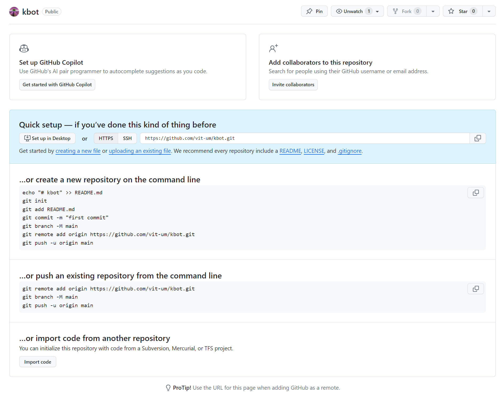  
2. Використаємо середовище розробки у Web, для чого натисніть в англійській розкладці на `.` на клавіатурі. Ця дія відкриє поточний репозиторій в інтегрованому середовищу розробки VSCode  
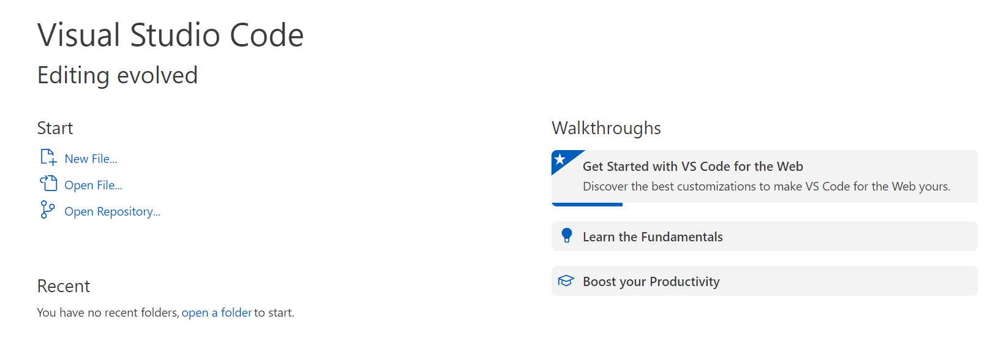  
- або так, якщо попередньо виконані налаштування:  
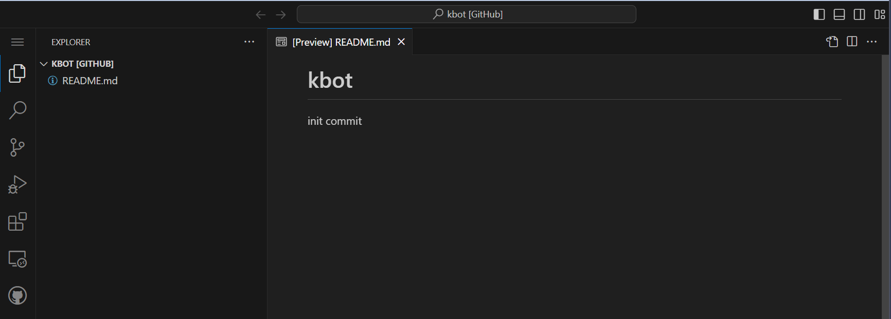  
3. Налаштуємо Codespace, це середовище розробки, що розміщується в хмарі. Для чого натискаємо сполучення клавіш `Ctr+Shift+P` та обираємо `Create new Codespace`. Далі нам будуть доступні різні типи ВМ, оберемо найменш потужну:  
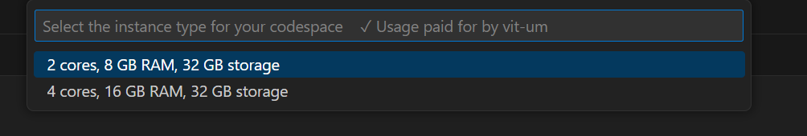   
- після автоматичного налаштування віртуальної машини, ми маємо [майже все необхідне](https://github.com/devcontainers/images/tree/main/src/universal) для подальшої розробки:  
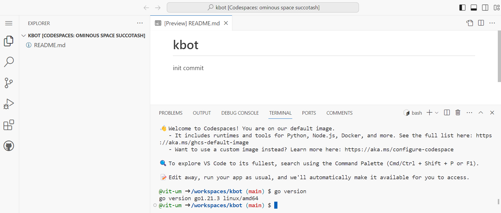

### Практичне завдання
1. Ініціалізація модуля GO над яким ми будемо працювати надалі:
```bash
$ go mod init github.com/vit-um/kbot
go: creating new go.mod: module github.com/vit-um/kbot
```
2. Встановлюємо кодогенератор [cobra-cli](https://github.com/spf13/cobra)  
```bash
$ go install github.com/spf13/cobra-cli@latest
```
3. Згенеруємо файл нашої основної програми `main.go` та початковий код програми `root.go`  
```bash
$ cobra-cli init
Your Cobra application is ready at
/workspaces/kbot
```
4. Для прикладу згенеруємо код команди `version`  
```bash
$ cobra-cli add version
version created at /workspaces/kbot
``` 
- ми отримали новий файл `version.go`  
- Компілюємо та відразу запускаємо код командою `go run main.go version`
- Команда повертає текстову строку з коду програми `version called` 

5. Додамо команду, що буде містити основний код програми в файлі `kbot.go`:  
```bash
$ cobra-cli add kbot
kbot created at /workspaces/kbot
```

6. Змінимо код `version.go` додавши в нього вивід змінної замість тексту:  
```go
var appVersion="Version"

	Run: func(cmd *cobra.Command, args []string) {
		fmt.Println(appVersion)
	},

```
7. Компілюємо програму з опцією `-ldflag` - це лінкер, що динамічно збирає всі компоненти програми перед білдом з опціями, що задані прямо з командного рядка:  
 - "-X=" опція присвоєння значення змінним в модулі  
```bash
$ go build -ldflags "-X="github.com/vit-um/kbot/cmd.appVersion=v1.0.0
$ ./kbot
$ ./kbot version
v1.0.0
```
8. Пушимо наш код у віддалений репозитарій  

### Запитання в тесті до яких довелось шукати відповідь   
1. У чому різниця між репозиторієм GitHub і GitHub gist?  
Основна різниця полягає в тому, що GitHub - це повноцінна платформа розробки з можливістю управління проектами та співпраці над великими кодовими базами, тоді як GitHub Gist - це легка служба для обміну короткими фрагментами коду або тексту.  
2. У чому різниця між "watch" та "star" на GitHub?  
"Star" використовується для вираження зацікавленості, а "Watch" - для слідкування за активністю та отримання сповіщень про події в репозиторії.  
3. Що таке правило branch protection на GitHub?  
Правило захисту гілок (Branch Protection) на GitHub - це механізм, який надає можливість обмежити та контролювати доступ до конкретних гілок у вашому репозиторії. Це корисний інструмент для забезпечення безпеки та стабільності кодової бази, а також для введення вимог щодо код-рев'ю та автоматизації тестування.  
Основні функції правил захисту гілок включають:  
- Захист від прямих комітів (force push) у визначені гілки, що може допомогти уникнути випадкового чи невідомого перезаписування історії.
- Вимоги щодо обов'язкового код-рев'ю перед об'єднанням змін в захищену гілку. 
- Обов'язкове проходження тестів (Налаштування вимог щодо автоматизованих тестів перед об'єднанням).
- Заборона видалення гілок без відповідних прав доступу
- Відомості про код-рев'ю: Відображення інформації про код-рев'ю та стан тестування прямо на сторінці GitHub.  

*Щоб налаштувати правило захисту гілок на GitHub, ви зазвичай переходите в налаштування репозиторію, обираєте вкладку "Settings", а потім переходите до розділу "Branches" або "Branch protection rules".*

## Coding Session Telebot - фреймворк для написання власних ботів для телеграм бота
1. Продовжуємо використання репозиторію, наповненому в попередній практичній роботі.  
- Програми на `GO` складаються з пакетів.
- Зазвичай пакети залежать від інших зовнішніх або вбудованих в стандартну бібліотеку пакетів.  

2. Щоб використовувати пакет потрібно спочатку його імпортувати. Це робиться за допомогою конструкції, що називається декларацією імпорту, що складається з ідентифікатору `telebot` який буде далі використовуватись в коді, та шляху до пакету що імпортується `gopkg.in/telebot.v3`:
```go
import (
	"fmt"

	"github.com/spf13/cobra"
	telebot "gopkg.in/telebot.v3"
)
```
- В даному випадку сервіс [gopkg.in](https://labix.org/gopkg.in) надає версіоновані url-адреси, які містять відповідні метадані для переправлення інструменту `GO` на чітко визначені репозиторії **github**

3. Задекларуємо змінну `TeleToken`, значення якої буде отримуватись автоматично із змінної середовища під час старту програми за допомогою функції `os.Getenv`:    
```go
var (
	// TeleToken bot
	TeleToken = os.Getenv("TELE_TOKEN")
)
```

4. Додамо код функції `Run` в блоці хендлера `kbot cmd`, це буде форматований вивід версії нашої програми при запуску та блок ініціалізації `kbot`, що являє собою створення нового боту з параметрами: 
```go
	Run: func(cmd *cobra.Command, args []string) {
		fmt.Printf("kbot %s started", appVersion)
		kbot, err := telebot.NewBot(telebot.Settings{
			URL:	"",
			Token:	TeleToken,
			Poller: &telebot.LongPoller{Timeout: 10 * time.Second},
		})
	},
```

5. Додамо в цей же блок обробник помилок, швидше за все це буде помилка відсутності токена у змінних середовища, отже так її ї опишемо:   
```go
		if err !=nil {
			log.Fatalf("Please check TELE_TOKEN env variable. %s", err)
			return
		}
```

6. Код хендлера буде обробляти подію `telebot.OnText`, тоб-то коли ми будемо отримувати нові повідомлення в Телеграмі буде виконуватись функція, що містить параметр `telebot.Context` для подальшої його обробки. В кінці блоку додамо `kbot.Start()` для запуску хендлера та його код. 
```go
		kbot.Handle(telebot.OnText, func(m telebot.Context) error {
			log.Print(m.Message(),Payload, m.Text())
			return err
		})
		
		kbot.Start()
```

7. Компілюємо код. А перед тим зробимо форматування та вирівнювання коду, а також завантажимо пакети та залежності командою `go get`:  
```bash
$ gofmt -s -w ./
$ go get
go: downloading gopkg.in/telebot.v3 v3.1.4
go: added gopkg.in/telebot.v3 v3.1.4
$ go build -ldflags "-X="github.com/vit-um/kbot/cmd.appVersion=v1.0.1
# github.com/vit-um/kbot/cmd
cmd/kbot.go:33:39: undefined: telebot.settings
cmd/kbot.go:40:8: undefined: log.FatalI
cmd/kbot.go:45:27: undefined: Payload

# виправляємо помилки в коді та повторюємо команди
$ gofmt -s -w ./                                                     
$ go build -ldflags "-X="github.com/vit-um/kbot/cmd.appVersion=v1.0.1
$ ./kbot
A longer description that spans multiple lines and likely contains
examples and usage of using your application. For example:

Cobra is a CLI library for Go that empowers applications.
This application is a tool to generate the needed files
to quickly create a Cobra application.

Usage:
  kbot [command]

Available Commands:
  completion  Generate the autocompletion script for the specified shell
  help        Help about any command
  kbot        A brief description of your command
  version     A brief description of your command

```

8. Виходить що для запуску основного функціоналу програми потрібно два рази набирати її назву, не кошерно... Змінимо назву команди за допомогою введення аліасу:  
```go
var kbotCmd = &cobra.Command{
	Use:     "kbot",
	Aliases: []string{"go"},
	Short:   "A brief description of your command",
	Long: `A longer description that spans multiple lines and likely contains examples
and usage of using your command. For example:

Cobra is a CLI library for Go that empowers applications.
This application is a tool to generate the needed files
to quickly create a Cobra application.`,
```

9. Компілюємо код та запускаємо ще раз:  
```bash
$ go build -ldflags "-X="github.com/vit-um/kbot/cmd.appVersion=v1.0.1
$ ./kbot go
kbot v1.0.1 started2023/11/12 15:16:38 Please check TELE_TOKEN env variable. telegram: Not Found (404)

```

10. Підготуємо бота. Відкриємо телеграм, знайдемо `BotFather` та створимо нового бота командою `/newbot`:   

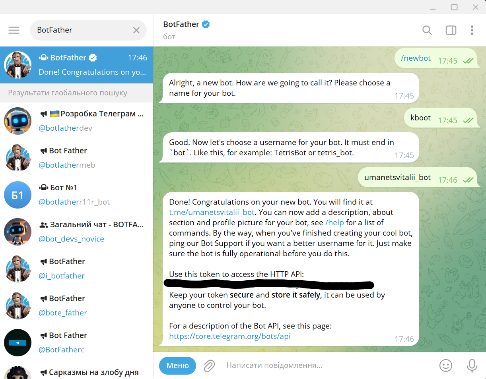  

11. В терміналі призначимо змінні середовища безпечно за допомогою наступної команди, що не залишає слідів в логах:  
```bash
$ read -s TELE_TOKEN
# Ctr+V and Enter
$ echo $TELE_TOKEN
0123456789:ARFGGy73tDv2iDL3tLy5_2p3ySKMI8d7M3k
$ export TELE_TOKEN
$ ./kbot go
kbot v1.0.1 started
# Запустимо бота в телеграмі та отримаємо в консолі наступний відгук 
2023/11/12 16:04:40 /start
# Надішлемо повідомлення з боту
2023/11/12 16:06:33 Hello
```

12. Додамо трохи коду до хендлеру щоб забезпечити двосторонній зв'язок. 
```go
		kbot.Handle(telebot.OnText, func(m telebot.Context) error {
			log.Print(m.Message().Payload, m.Text())
			payload := m.Message().Payload

			switch payload {
			case "hello":
				err = m.Send(fmt.Sprintf("Hello I'm Kbot %s!", appVersion))
			}
			
			return err
		})
```

13. Зберемо наступну версію коду та перевіримо як це працює:  
```bash
$ go build -ldflags "-X="github.com/vit-um/kbot/cmd.appVersion=v1.0.2
$ ./kbot go
kbot v1.0.2 started2023/11/12 16:14:12 /start
2023/11/12 16:14:25 hello
2023/11/12 16:14:46 hello/start hello
```

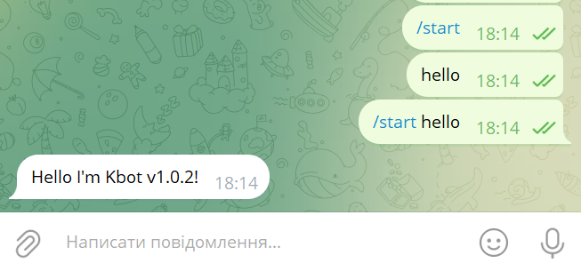  

### Посилання на бібліотеки:
[Cobra is a library for creating powerful modern CLI applications](github.com/spf13/cobra)  
[Native GPIO-Gophers for your Pi](github.com/stianeikeland/go-rpio)  
[Telebot is a bot framework for Telegram Bot API](github.com/tucnak/telebot)  
[Telegram Bot API](https://core.telegram.org/bots/api)  

### Запитання в тесті до яких довелось шукати відповідь   
1. Для чого потрібен Git bisect?  
`Git bisect` - це інструмент у Git, який допомагає ефективно та автоматично визначити коміт, який призвів до появи багу або вади в коді. Це робиться за допомогою бінарного пошуку, шляхом автоматичного виключення підсумкових комітів.
**Основний процес виглядає так:**
- Ви позначаєте коміт, в якому присутня вада, як поганий (bad).  
- Ви позначаєте коміт, в якому вади немає, як хороший (good).  
- Git автоматично обирає серединний коміт між хорошим і поганим станом.
- Ви вказуєте Git, чи є обраний коміт хорошим чи поганим.
- Процес повторюється, поки не буде знайдений той самий коміт, що інтродуктивний ваду.
*Git bisect дозволяє швидко та ефективно локалізувати проблемний коміт серед великої кількості комітів у історії проекту.*
2. Що таке GitHub flow?  
`GitHub Flow` - це легкий і гнучкий процес розробки програмного забезпечення, який використовується зокрема на платформі GitHub. Цей підхід спроектований для спрощення робочого процесу та забезпечення ефективного взаємодії між розробниками.
**Основні принципи GitHub Flow включають наступне:**
- `Branch:` Розробка ведеться в окремих гілках (branches). Кожна нова функція чи виправлення багу розробляється в своїй власній гілці.
- `Pull Request (PR):` Після завершення роботи над функцією чи виправленням багу, розробник відкриває Pull Request, щоб обговорити, рецензувати та об'єднати зміни з основною гілкою.
- `Discuss and Review:` У відкритому Pull Request відбувається обговорення внесених змін. Інші розробники можуть рецензувати код, коментувати та вносити пропозиції.
- `Merge:` Після успішної рецензії та вирішення всіх коментарів зміни можуть бути об'єднані (merged) в основну гілку.
- `Deploy:` Після об'єднання змін у основну гілку, код може бути автоматично розгорнутий (deployed) на тестовий чи продуктивний сервер.
- `Release:` Якщо об'єднання змін проходить успішно і код готовий до релізу, то можна створити новий реліз.
*Цей процес покликаний працювати швидко і ефективно, дозволяючи розробникам швидко вносити зміни, обговорювати їх та впроваджувати в продукт. GitHub Flow є доброю практикою для роботи у великих або невеликих командах, орієнтованих на часті випуски та невеликі ітерації.*

